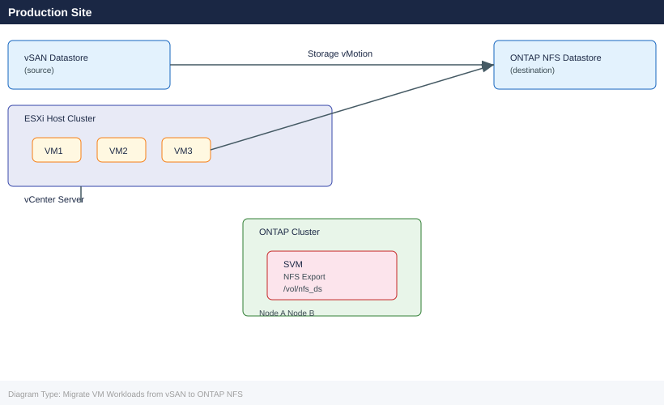
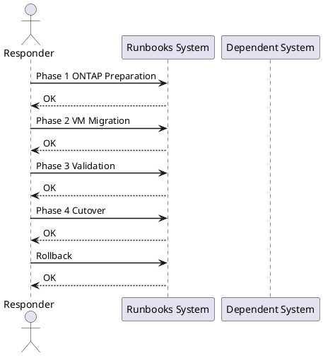

---
tags:
  - vmware
  - vsan
  - netapp
  - ontap
  - nfs
  - storage-migration
  - runbook
---

# Migrate VM Workloads from vSAN to ONTAP NFS

<div class="kb-summary">
Cross-product runbook for migrating virtual machine workloads from VMware vSAN to a NetApp ONTAP NFS datastore using Storage vMotion. Covers SVM provisioning, NFS export policy, datastore mount, per-VM and per-datastore migration, validation, cutover, and rollback.
</div>





## Before You Begin

**Prerequisites:**

| Component | Requirement |
|---|---|
| VMware vCenter | 7.0 U3+ or 8.x; Storage vMotion licence active |
| ONTAP Cluster | ONTAP 9.10+ with at least one data aggregate with free capacity |
| ESXi Hosts | All cluster hosts must have NFS kernel module enabled and network path to ONTAP |
| NSX / Networking | NFS VLAN/port group present on all ESXi hosts; MTU 9000 recommended on NFS segment |
| PowerCLI | PowerCLI 13+ installed on jump host for bulk migration scripts |
| Permissions | ONTAP cluster-admin, vCenter administrator role |

**Preflight checks:**

```bash
# Verify vSAN health before starting
esxcli vsan health cluster list --cluster-name <cluster>

# Confirm vCenter version
Get-PowerCLIVersion   # PowerCLI
Connect-VIServer -Server vcenter.corp.local
(Get-View ServiceInstance).Content.About.Version

# Ping ONTAP mgmt from jump host
ping <ontap-mgmt-ip>
ssh admin@<ontap-mgmt-ip> "cluster show"
```

---

## Phase 1: ONTAP Preparation

### 1.1 Create a Storage Virtual Machine (SVM)

```bash
# Connect to ONTAP CLI
ssh admin@<ontap-mgmt-ip>

# Create SVM for NFS
vserver create -vserver svm_vmware -rootvolume svm_vmware_root \
  -rootvolume-security-style unix -language C.UTF-8 \
  -snapshot-policy default

# Assign aggregate to SVM
vserver modify -vserver svm_vmware \
  -aggr-list aggr1_node01,aggr1_node02

# Create NFS LIF (one per node for multipath)
network interface create -vserver svm_vmware \
  -lif nfs_lif_01 -role data -data-protocol nfs \
  -home-node <node01> -home-port e0c \
  -address <nfs-lif-ip-1> -netmask <mask>

network interface create -vserver svm_vmware \
  -lif nfs_lif_02 -role data -data-protocol nfs \
  -home-node <node02> -home-port e0c \
  -address <nfs-lif-ip-2> -netmask <mask>

# Enable NFS on SVM
vserver nfs create -vserver svm_vmware \
  -v3 enabled -v4.1 enabled -tcp enabled
```

### 1.2 Create NFS Export Policy

```bash
# Create export policy for ESXi hosts
vserver export-policy create -vserver svm_vmware \
  -policyname esxi_nfs_policy

# Add rules — one per ESXi host subnet or per-host
vserver export-policy rule create -vserver svm_vmware \
  -policyname esxi_nfs_policy -clientmatch <esxi-subnet/mask> \
  -rorule sys -rwrule sys -superuser sys \
  -protocol nfs3,nfs4

# Verify
vserver export-policy rule show -policyname esxi_nfs_policy
```

### 1.3 Create the NFS Datastore Volume

```bash
# Create volume sized for migration target
volume create -vserver svm_vmware \
  -volume vol_nfs_ds01 -aggregate aggr1_node01 \
  -size 10T -space-guarantee none \
  -snapshot-policy default \
  -export-policy esxi_nfs_policy \
  -junction-path /vol_nfs_ds01

# Enable deduplication and compression
volume efficiency on -vserver svm_vmware -volume vol_nfs_ds01
volume efficiency modify -vserver svm_vmware -volume vol_nfs_ds01 \
  -policy auto -compression true -inline-compression true

# Confirm volume is online and exported
volume show -vserver svm_vmware -volume vol_nfs_ds01 -fields state,junction-path
```

### 1.4 Mount NFS Datastore on ESXi Hosts via vCenter

```powershell
# PowerCLI — add NFS datastore to all hosts in cluster
Connect-VIServer -Server vcenter.corp.local -Credential (Get-Credential)

$cluster = Get-Cluster "Production-Cluster"
$hosts   = Get-VMHost -Location $cluster

foreach ($vmhost in $hosts) {
    New-Datastore -VMHost $vmhost `
      -Name "ONTAP-NFS-DS01" `
      -NfsHost "<nfs-lif-ip-1>" `
      -Path "/vol_nfs_ds01" `
      -Nfs
    Write-Host "Mounted on $($vmhost.Name)"
}

# Verify all hosts see the datastore
Get-Datastore "ONTAP-NFS-DS01" | Get-VMHost
```

---

## Phase 2: VM Migration

### 2.1 Storage vMotion — Per VM (Live, Online)

```powershell
# Migrate a single running VM to ONTAP NFS datastore
$vm        = Get-VM "app-server-01"
$targetDS  = Get-Datastore "ONTAP-NFS-DS01"

Move-VM -VM $vm -Datastore $targetDS -DiskStorageFormat Thin

# Watch task progress
Get-Task | Where-Object { $_.Name -eq "RelocateVM_Task" } | Select-Object Name,State,PercentComplete
```

```bash
# ESXi CLI alternative — svmotion (run from jump host with PowerCLI or via vmkfstools)
# Using vmware-cmd (deprecated but useful for scripting):
vmware-cmd /vmfs/volumes/<vsan-uuid>/<vm>/<vm>.vmx migrate \
  "[ONTAP-NFS-DS01]" thin

# Via esxcli (for cold migration when VM is off):
vmkfstools -i /vmfs/volumes/<vsan-uuid>/<vm>/<vm>.vmdk \
           /vmfs/volumes/<ontap-ds-uuid>/<vm>/<vm>.vmdk -d thin
```

### 2.2 Bulk Storage vMotion — Entire Datastore

```powershell
# Migrate all VMs from a vSAN datastore to ONTAP
$sourceDS  = Get-Datastore "vsanDatastore"
$targetDS  = Get-Datastore "ONTAP-NFS-DS01"
$vms       = Get-VM -Datastore $sourceDS

foreach ($vm in $vms) {
    Write-Host "Migrating $($vm.Name) ..."
    Move-VM -VM $vm -Datastore $targetDS -DiskStorageFormat Thin -RunAsync
    Start-Sleep -Seconds 10   # stagger to avoid saturating network
}

# Monitor all in-progress tasks
do {
    $tasks = Get-Task | Where-Object { $_.Name -eq "RelocateVM_Task" -and $_.State -eq "Running" }
    Write-Host "Running migrations: $($tasks.Count)"
    Start-Sleep -Seconds 30
} while ($tasks.Count -gt 0)
```

### 2.3 Cold Migration Option (VM Powered Off)

```powershell
# For VMs that cannot tolerate vMotion overhead
$vm = Get-VM "legacy-app-01"
Stop-VM -VM $vm -Confirm:$false

Move-VM -VM $vm -Datastore (Get-Datastore "ONTAP-NFS-DS01") `
  -DiskStorageFormat Thin

Start-VM -VM $vm
```

---

## Phase 3: Validation

### 3.1 Verify I/O Latency on ONTAP

```bash
# Check NFS volume latency and IOPS (ONTAP CLI)
statistics show -object nfsv3 -instance svm_vmware -counter avg_latency,total_ops
# Or use qos statistics workload performance show for per-volume breakdown

# Volume utilisation
volume show -vserver svm_vmware -volume vol_nfs_ds01 \
  -fields used,available,percent-used

# Check NFS connections from ESXi hosts
nfs connections show -vserver svm_vmware
```

### 3.2 Verify Datastore Usage in vCenter

```powershell
# PowerCLI — check datastore capacity and provisioned space
Get-Datastore "ONTAP-NFS-DS01" | Select-Object Name,FreeSpaceGB,CapacityGB,@{N="UsedGB";E={[math]::Round($_.CapacityGB - $_.FreeSpaceGB,2)}}

# Confirm all VMs are now on the ONTAP datastore
Get-VM | Where-Object { (Get-HardDisk -VM $_).Filename -like "*vsanDatastore*" }
# Above should return empty when migration is complete
```

### 3.3 Application-Level Validation

```bash
# On each migrated VM — confirm disk I/O is healthy
iostat -x 5 3          # Linux
# Windows: Get-Counter "\PhysicalDisk(*)\Avg. Disk sec/Transfer"

# Run a quick fio test inside a migrated VM
fio --name=post-migration-check --rw=randrw --bs=4k \
  --ioengine=libaio --iodepth=16 --size=512m \
  --runtime=60 --filename=/var/tmp/fio.tmp --output-format=normal
```

---

## Phase 4: Cutover

### 4.1 Run vSAN Health Check Before Decommission

```bash
# From any ESXi host in the cluster
esxcli vsan health cluster list

# Verify no objects remain on vSAN
esxcli vsan storage list | grep -i "object"

# ONTAP — confirm no remaining mounts from vSAN-side
# (There should be none at this point)
```

### 4.2 Remove vSAN Datastore from Cluster

```powershell
# Confirm no VMs are still on vSAN
$vsanDS = Get-Datastore "vsanDatastore"
$vmsOnVsan = Get-VM -Datastore $vsanDS
if ($vmsOnVsan.Count -gt 0) {
    Write-Warning "STOP: $($vmsOnVsan.Count) VMs still on vSAN: $($vmsOnVsan.Name -join ', ')"
} else {
    Write-Host "Safe to remove vSAN datastore — no VMs present."
    # Unmount via vCenter UI: Storage > vsanDatastore > Unmount
    # Or via PowerCLI:
    Remove-Datastore -Datastore $vsanDS -VMHost (Get-VMHost) -Confirm:$false
}
```

### 4.3 Disable vSAN on Cluster (Optional)

```powershell
# Only if fully decommissioning vSAN
$cluster = Get-Cluster "Production-Cluster"
$spec = New-Object VMware.Vim.ClusterConfigSpecEx
$spec.vsanConfig = New-Object VMware.Vim.VsanClusterConfigInfo
$spec.vsanConfig.Enabled = $false
($cluster | Get-View).ReconfigureComputeResource_Task($spec, $true)
```

---

## Rollback

If migration fails mid-way or post-migration validation fails:

**1. Stop any in-progress svmotion tasks:**

```powershell
# Cancel running Storage vMotion tasks
Get-Task | Where-Object { $_.Name -eq "RelocateVM_Task" -and $_.State -eq "Running" } |
  ForEach-Object { $_.Cancel() }
```

**2. Move VMs back to vSAN:**

```powershell
$targetDS = Get-Datastore "vsanDatastore"
$vmsOnOntap = Get-VM -Datastore (Get-Datastore "ONTAP-NFS-DS01")

foreach ($vm in $vmsOnOntap) {
    Move-VM -VM $vm -Datastore $targetDS -DiskStorageFormat EagerZeroedThick -RunAsync
}
```

**3. Verify vSAN is still healthy before relying on it:**

```bash
esxcli vsan health cluster list
esxcli vsan storage list
```

**4. If ONTAP volume is corrupt, restore from snapshot:**

```bash
# List available snapshots
snapshot show -vserver svm_vmware -volume vol_nfs_ds01

# Restore from snapshot (unmount datastore first)
volume snapshot restore -vserver svm_vmware \
  -volume vol_nfs_ds01 -snapshot <snapshot-name>
```

---

## See Also

- [ONTAP Operations](/storage/netapp/ontap/operations/)
- [ONTAP Architecture](/storage/netapp/ontap/architecture/)
- [vSAN Operations](/virtualization/vmware/vsan/operations/)
- [vSAN Architecture](/virtualization/vmware/vsan/architecture/)
- [SnapMirror Operations](/storage/netapp/snapmirror/operations/)
- [Storage Runbooks Index](/storage/runbooks/)
