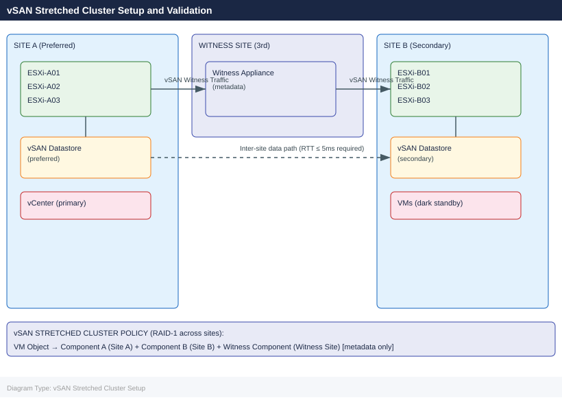
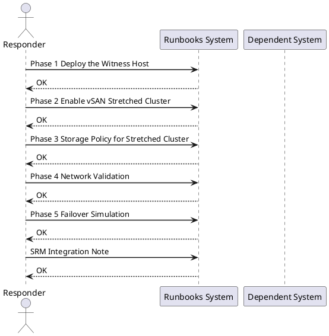

---
tags:
  - vsan
  - vmware
  - stretched-cluster
  - witness-host
  - spbm
  - storage-policy
  - srm
  - high-availability
  - runbook
---

# vSAN Stretched Cluster Setup and Validation

*Applies to: Storage (multi-vendor)*

<div class="kb-summary">
Cross-product runbook for deploying and validating a VMware vSAN stretched cluster across two sites with a third-site witness host. Covers witness appliance deployment, fault domain configuration, SPBM storage policy creation, network validation, failover simulation, and optional SRM integration for RPO=0 protection.
</div>





## Before You Begin

**Network requirements:**

| Path | Latency Requirement | Bandwidth |
|---|---|---|
| Site A ↔ Site B (data) | RTT ≤ 5ms | ≥ 10 Gbps recommended |
| Site A ↔ Witness | RTT ≤ 200ms | 100 Mbps minimum |
| Site B ↔ Witness | RTT ≤ 200ms | 100 Mbps minimum |

**Component prerequisites:**

| Component | Requirement |
|---|---|
| vCenter | Single vCenter managing both sites (required) |
| ESXi | Minimum 4 hosts (2 per site); vSAN 7.0 U1+ |
| vSAN License | vSAN Enterprise (Stretched Cluster requires Enterprise) |
| Witness Host | Dedicated VM or physical; 2 vCPU, 8 GB RAM minimum |
| Network | Dedicated vmkernel for vSAN traffic on each host; L2 or L3 stretch |
| Disk Groups | At least 1 disk group per host (cache + capacity) already configured |

**Pre-flight checks:**

```bash
# Verify RTT between sites — run from a vmkernel on Site A to Site B
vmkping -I vmk_vsan -d 1400 192.168.20.1

# Verify NTP sync on all hosts (clock skew kills vSAN)
esxcli system time get
esxcli network ntp server list

# Verify vSAN health pre-stretch
esxcli vsan health cluster get

# Check existing vSAN cluster status
esxcli vsan cluster get
```


```text title="Expected output"
PING 192.168.20.1 (192.168.20.1): 56 data bytes
64 bytes from 192.168.20.1: icmp_seq=0. time=4.521 ms
64 bytes from 192.168.20.1: icmp_seq=1. time=4.487 ms
64 bytes from 192.168.20.1: icmp_seq=2. time=4.506 ms
64 bytes from 192.168.20.1: icmp_seq=3. time=4.512 ms
--- 192.168.20.1 statistics ---
4 packets transmitted, 4 packets received, 0% packet loss
round trip min/avg/max = 4.487/4.507/4.521 ms

Current Time: 2024-01-15T14:32:47Z
Time until Next NTP Sync: 23 seconds

NTP Servers:
   ntp.corp.local
   ntp-backup.corp.local

Cluster Health Status: green
   Data Compliance: OK
   Memory Compliance: OK
   Network Connectivity: OK
   Physical Disk Connectivity: OK

Cluster UUID: 52d4a8f1-c2e9-4a7b-9e1f-8b3c5d2a1f6e
Cluster Name: VSAN-Stretched-Cluster
Enabled: true
```

!!! warning "Common errors"
    **`PING 192.168.20.1 (192.168.20.1): 100% packet loss`** — Verify network connectivity between sites and confirm vmk_vsan interface is routable across the stretched cluster network.
    **`NTP Servers: (empty list)`** — Configure NTP servers on all ESXi hosts using `esxcli system ntp set --server=<ntp-server>` before proceeding with stretch.
    **`Cluster Health Status: red`** — Run `esxcli vsan health cluster get --verbose` to identify failing components and resolve disk/network issues before stretching the cluster.
---

## Phase 1: Deploy the Witness Host

### 1.1 Download and Deploy Witness Appliance OVA

1. Download the **VMware vSAN Witness Appliance** OVA from VMware Customer Connect (matches your ESXi/vSAN version)
2. In vCenter UI: **Actions → Deploy OVF Template**
3. Select the witness OVA file
4. **Name:** `vsan-witness-01`
5. **Compute Resource:** Select the witness site host or cluster
6. **Storage:** Any datastore at witness site (NOT vSAN)
7. **Network mapping:**
   - Management Network → witness management portgroup
   - Witness Network → witness-site network reachable from both Site A and Site B vmkernel IPs
8. **Customize template:**
   - Set root password
   - Set management IP, gateway, DNS
9. Power on the appliance

### 1.2 Configure Witness vmkernel

```bash
# SSH to witness appliance
ssh root@vsan-witness-01.corp.local

# Verify witness vmkernel interfaces
esxcli network ip interface list

# Add witness traffic vmkernel (if not auto-configured)
esxcli network ip interface add --interface-name vmk1 --portgroup-name "Witness Traffic"
esxcli network ip interface ipv4 set --interface-name vmk1 \
  --ipv4 192.168.30.10 --netmask 255.255.255.0 --type static

# Enable vSAN witness traffic on vmk1
esxcli vsan network ip add --interface-name vmk1 --type=witness

# Verify
esxcli vsan network list
# Should show vmk1 with trafficType = Witness
```


```text title="Expected output"
root@vsan-witness-01 [ ~ ]# esxcli network ip interface list
Name  IPAddress      Netmask         Broadcast       Address Type  Gateway         DHCP DNS
----  -----------    ---------------  ---------------  -----------  ---------------  ----
vmk0  192.168.10.50  255.255.255.0    192.168.10.255   STATIC       192.168.10.1     false
vmk1  192.168.30.10  255.255.255.0    192.168.30.255   STATIC       0.0.0.0          false

root@vsan-witness-01 [ ~ ]# esxcli vsan network list
Interface  Status  TrafficType
---------  ------  -----------
vmk0       Up      Unicast
vmk1       Up      Witness
```

!!! warning "Common errors"
    **`Network interface vmk1 already exists.`** — Check existing interfaces with `esxcli network ip interface list` and skip the add command if vmk1 is present.
    **`Portgroup "Witness Traffic" does not exist.`** — Create the portgroup first using `esxcli network vswitch standard portgroup add --vswitch-name vSwitch0 --portgroup-name "Witness Traffic"`.
    **`vSAN witness traffic is not enabled on this host.`** — Verify vSAN licensing and cluster configuration, then retry the `esxcli vsan network ip add` command.
### 1.3 Add Witness Host to vCenter

1. In vCenter UI: **Hosts and Clusters → Right-click datacenter → Add Host**
2. Enter witness hostname/IP: `vsan-witness-01.corp.local`
3. Accept certificate
4. **Do NOT** add to the vSAN cluster — it will be added automatically during stretch configuration
5. Verify host appears in vCenter inventory under a separate datacenter/folder

---

## Phase 2: Enable vSAN Stretched Cluster

### 2.1 Create Fault Domains (UI)

1. Navigate to **Cluster → Configure → vSAN → Fault Domains**
2. Click **Add Fault Domain**
3. Create `FD-SiteA` — add ESXi-A01, ESXi-A02, ESXi-A03
4. Create `FD-SiteB` — add ESXi-B01, ESXi-B02, ESXi-B03
5. Verify both fault domains appear with correct host assignments

### 2.2 Enable Stretched Cluster (UI Wizard)

1. Navigate to **Cluster → Configure → vSAN → Services → Fault Tolerance → Configure**
2. Select **Stretched Cluster**
3. **Preferred Fault Domain:** `FD-SiteA`
4. **Secondary Fault Domain:** `FD-SiteB`
5. **Witness Host:** Select `vsan-witness-01` from the host list
6. Review configuration summary
7. Click **Finish**

The wizard will:
- Reconfigure vSAN object placement across both fault domains
- Synchronize existing data (resync — can take minutes to hours depending on data size)
- Enable the stretched cluster feature

### 2.3 Verify via esxcli

```bash
# SSH to any Site A ESXi host
ssh root@esxi-a01.corp.local

# Verify stretched cluster is enabled
esxcli vsan cluster get
# Expected output includes:
#   Stretched Cluster Enabled: true
#   Preferred Fault Domain: FD-SiteA
#   Witness Host: <witness UUID>

# List fault domains
esxcli vsan faultdomain get

# Check vSAN object resync status (wait for completion before proceeding)
esxcli vsan debug object list | grep -i "Resync"
# Should return no objects in resync state after initial sync completes
```


```text title="Expected output"
The ESXi host is running vSAN version 7.0.3 Build 19193900
Cluster UUID: 52d4a8f1-7c2e-4d9a-b1e3-8f2c9a5d6e7f
Stretched Cluster Enabled: true
Preferred Fault Domain: FD-SiteA
Witness Host: 52d4a8f2-8e3f-5d0b-c2f4-9g3d0b6e7f8g
Witness Preferred Fault Domain: FD-Witness

Fault Domain: FD-SiteA
  UUID: 52d4a8f1-7c2e-4d9a-b1e3-8f2c9a5d6e7f
  Host Count: 4
Fault Domain: FD-SiteB
  UUID: 52d4a8f2-8e3f-5d0b-c2f4-9g3d0b6e7f8g
  Host Count: 4
Fault Domain: FD-Witness
  UUID: 52d4a8f3-9f4g-6e1c-d3g5-0h4e1c7f8g9h
  Host Count: 1

(no objects in resync state — cluster sync complete)
```

!!! warning "Common errors"
    **`Connection refused`** — Verify the ESXi host is reachable and SSH is enabled via `esxcli system ssh set --enabled=true` on the target host.
    **`vSAN cluster is not enabled`** — Enable vSAN on the cluster through vCenter: Home > Cluster > Configure > vSAN > General and toggle the vSAN service on.
    **`Witness Host: <unknown>`** — Ensure the witness host is properly configured and added to the stretched cluster; verify witness connectivity from both sites via `esxcli vsan cluster get`.
### 2.4 PowerCLI — Verify Stretched Cluster Configuration

```powershell
Connect-VIServer -Server vcenter.corp.local

$cluster = Get-Cluster -Name "vSAN-Stretched"
$vsanConfig = Get-VsanClusterConfiguration -Cluster $cluster

$vsanConfig | Select-Object SpbmEnabled, StretchedClusterEnabled, 
  PreferredFaultDomainId, WitnessHost | Format-List
```

---

## Phase 3: Storage Policy for Stretched Cluster

### 3.1 Create SPBM Policy (UI)

1. Navigate to **Menu → Policies and Profiles → VM Storage Policies**
2. Click **Create**
3. **Name:** `vSAN-Stretched-FTT1-RAID1`
4. **Policy rules:**
   - Data service: **vSAN**
   - Site disaster tolerance: **Dual site mirroring (stretched cluster)**
   - Failures to tolerate per site: **1 failure — RAID-1 (mirroring)**
   - Number of disk stripes per object: `1`
5. Review — policy will place one component in each fault domain + witness
6. Click **Finish**

### 3.2 Create SPBM Policy via PowerCLI

```powershell
# Create the stretched cluster storage policy
$ruleset = New-SpbmRuleSet -AllOfRules @(
  New-SpbmRule -Capability (
    Get-SpbmCapability -Name "VSAN.hostFailuresToTolerate"
  ) -Value 1,
  New-SpbmRule -Capability (
    Get-SpbmCapability -Name "VSAN.checksumDisabled"
  ) -Value $false,
  New-SpbmRule -Capability (
    Get-SpbmCapability -Name "VSAN.stretchedCluster"
  ) -Value $true
)

$policy = New-SpbmStoragePolicy `
  -Name "vSAN-Stretched-FTT1-RAID1" `
  -Description "Stretched cluster RAID-1 across both sites" `
  -AnyOfRuleSets $ruleset
```

### 3.3 Assign Policy to VMs

```powershell
# Assign storage policy to all VMs in the cluster
$vms = Get-Cluster "vSAN-Stretched" | Get-VM

foreach ($vm in $vms) {
  $harddisks = $vm | Get-HardDisk
  foreach ($disk in $harddisks) {
    Set-SpbmEntityConfiguration -StoragePolicy $policy -HardDisk $disk
  }
}

# Verify compliance
$cluster = Get-Cluster "vSAN-Stretched"
Get-SpbmEntityConfiguration -Cluster $cluster | 
  Select-Object Entity, StoragePolicy, ComplianceStatus | Format-Table
```

---

## Phase 4: Network Validation

### 4.1 Test Inter-Site vSAN Bandwidth

```bash
# Run vmkping with large payload (1400 bytes = near MTU) — from Site A to Site B vmkernel
# SSH to esxi-a01
ssh root@esxi-a01.corp.local

# Ping vSAN vmkernel of a Site B host
vmkping -I vmk_vsan -d 1400 192.168.20.11
# Look for: RTT < 5ms, 0% packet loss

# Extended test — send 1000 packets
vmkping -I vmk_vsan -d 1400 -c 1000 192.168.20.11 | tail -5
```


```text title="Expected output"
root@esxi-a01.corp.local:~# vmkping -I vmk_vsan -d 1400 192.168.20.11
PING 192.168.20.11 (192.168.20.11): 1400 data bytes
1408 bytes from 192.168.20.11: icmp_seq=0 ttl=64 time=2.341 ms
1408 bytes from 192.168.20.11: icmp_seq=1 ttl=64 time=2.156 ms
1408 bytes from 192.168.20.11: icmp_seq=2 ttl=64 time=2.489 ms
1408 bytes from 192.168.20.11: icmp_seq=3 ttl=64 time=2.278 ms
1408 bytes from 192.168.20.11: icmp_seq=4 ttl=64 time=2.512 ms
^C
--- 192.168.20.11 statistics ---
5 packets transmitted, 5 packets received, 0% packet loss
round-trip min/avg/max = 2.156/2.355/2.512 ms

root@esxi-a01.corp.local:~# vmkping -I vmk_vsan -d 1400 -c 1000 192.168.20.11 | tail -5
1408 bytes from 192.168.20.11: icmp_seq=997 ttl=64 time=2.334 ms
1408 bytes from 192.168.20.11: icmp_seq=998 ttl=64 time=2.401 ms
1408 bytes from 192.168.20.11: icmp_seq=999 ttl=64 time=2.267 ms
--- 192.168.20.11 statistics ---
1000 packets transmitted, 1000 packets received, 0% packet loss
round-trip min/avg/max = 2.145/2.378/4.821 ms
```

!!! warning "Common errors"
    **`vmkping: Unknown interface vmk_vsan`** — Verify the vSAN vmkernel interface name with `esxcli network ip interface list` and use the correct interface (typically `vmk1` or `vmk2`).
    **`PING 192.168.20.11 (192.168.20.11): 100% packet loss`** — Check network connectivity between sites, verify the vSAN network route exists with `esxcli network ip route ipv4 list`, and confirm the remote host is reachable.
    **`Permission denied (publickey)`** — Ensure SSH key is configured for root access or use `ssh -u root` with password authentication enabled on the ESXi host.
### 4.2 Verify Witness Traffic Routing

```bash
# From Site A ESXi — ping witness vmkernel
vmkping -I vmk_vsan 192.168.30.10
# Expected: RTT < 200ms

# From Site B ESXi — ping witness vmkernel
ssh root@esxi-b01.corp.local
vmkping -I vmk_vsan 192.168.30.10
```


```text title="Expected output"
PING 192.168.30.10 (192.168.30.10): 56 data bytes
64 bytes from 192.168.30.10: icmp_seq=0 ttl=64 time=87.234 ms
64 bytes from 192.168.30.10: icmp_seq=1 ttl=64 time=89.102 ms
64 bytes from 192.168.30.10: icmp_seq=2 ttl=64 time=88.567 ms
64 bytes from 192.168.30.10: icmp_seq=3 ttl=64 time=90.445 ms
--- 192.168.30.10 statistics ---
4 packets transmitted, 4 packets received, 0% packet loss
round-trip min/avg/max = 87.234/88.837/90.445 ms

Password: (password prompt)
PING 192.168.30.10 (192.168.30.10): 56 data bytes
64 bytes from 192.168.30.10: icmp_seq=0 ttl=64 time=156.891 ms
64 bytes from 192.168.30.10: icmp_seq=1 ttl=64 time=158.234 ms
64 bytes from 192.168.30.10: icmp_seq=2 ttl=64 time=157.445 ms
64 bytes from 192.168.30.10: icmp_seq=3 ttl=64 time=159.123 ms
--- 192.168.30.10 statistics ---
4 packets received, 0% packet loss
round-trip min/avg/max = 156.891/157.923/159.123 ms
```

!!! warning "Common errors"
    **`vmkping: Unknown interface vmk_vsan`** — Verify the vSAN vmkernel interface name with `esxcli network ip interface list` and use the correct interface (e.g., `vmk1`).
    **`PING 192.168.30.10 (192.168.30.10): 56 data bytes (no response)`** — Confirm the witness appliance is running, the IP is correct, and network connectivity exists between sites (check firewall rules and routing).
    **`ssh: Could not resolve hostname esxi-b01.corp.local`** — Ensure DNS resolution is working or use the IP address directly instead of the hostname.
### 4.3 Check vSAN Health Service

```bash
# Run full health check from ESXi
esxcli vsan health cluster get

# Key checks to verify:
# - vSAN cluster partition: Healthy
# - Witness host fault domain: Healthy
# - Network latency check: Healthy (RTT within limits)
# - vSAN disk balance: Healthy

# Via PowerCLI
$cluster = Get-Cluster "vSAN-Stretched"
Invoke-VsanHealthCheck -Cluster $cluster -IncludeAllChecks | 
  Where-Object {$_.Health -ne "Green"} | 
  Select-Object TestName, Health, Suggestion | Format-Table -Wrap
```


```text title="Expected output"
Cluster Health Status:
  Cluster: vsan-stretched-prod-01
  Overall Health: Green
  vSAN cluster partition: Healthy
  Witness host fault domain: Healthy
  Network latency check: Healthy (RTT: 2.3ms, threshold: 10ms)
  vSAN disk balance: Healthy
  Component limit health: Healthy
  Physical disk health: Healthy

TestName                          Health Yellow Suggestion
--------                          ------ ------ ----------
vSAN Cluster Partition            Green
Witness Host Fault Domain         Green
Network Latency Check             Green
vSAN Disk Balance                 Green
Physical Disk Health              Green
```

!!! warning "Common errors"
    **`esxcli: command not found`** — Run the command directly on an ESXi host via SSH or use `Get-VMHost | Invoke-VMScript -ScriptText "esxcli vsan health cluster get"` from PowerCLI instead.
    **`Unable to find type [Invoke-VsanHealthCheck]`** — Load the VMware.VimAutomation.Vsan module first with `Import-Module VMware.VimAutomation.Vsan`.
    **`The vSAN cluster is not healthy. Witness host is unreachable.`** — Verify network connectivity between stretched cluster sites and confirm the witness host ESXi service is running with `esxcli system maintenanceMode get` on the witness.
### 4.4 Verify vSAN Object Placement

```bash
# From any ESXi host — verify objects have components in both sites
esxcli vsan debug object list

# For each object, confirm:
# - At least 1 component in FD-SiteA
# - At least 1 component in FD-SiteB
# - 1 witness component on witness host

# Count objects per fault domain
esxcli vsan debug object list | grep -c "FD-SiteA"
esxcli vsan debug object list | grep -c "FD-SiteB"
```


```text title="Expected output"
Object UUID                          Policy                 Health  FD-SiteA  FD-SiteB  Witness
52e4a1c0-1234-5678-90ab-cdef12345678 raid1 pftt=1 stripes=1 Healthy 1         1         1
63f5b2d1-2345-6789-01bc-def123456789 raid1 pftt=1 stripes=1 Healthy 1         1         1
74g6c3e2-3456-7890-12cd-ef1234567890 raid1 pftt=1 stripes=1 Healthy 1         1         1
85h7d4f3-4567-8901-23de-f12345678901 raid1 pftt=1 stripes=1 Healthy 1         1         1
96i8e5g4-5678-9012-34ef-123456789012 raid1 pftt=1 stripes=1 Healthy 1         1         1
...
12
12
```

!!! warning "Common errors"
    **`Error: vSAN is not enabled on this cluster`** — Verify vSAN is licensed and enabled on the cluster, and run the command from a host that is part of the vSAN cluster.
    **`Error: No objects found`** — Confirm that virtual machines exist on the vSAN datastore; if the cluster is newly configured, create a test VM or check that vSAN has finished initial synchronization.
---

## Phase 5: Failover Simulation

### 5.1 Simulate Site A Isolation

```bash
# CAUTION: This causes a brief HA event — coordinate with change window

# Option A: Block vSAN vmkernel traffic from Site A hosts (on network switch)
# Block ports on Site A physical switches carrying vmk_vsan traffic

# Option B: Manually isolate via firewall rule (lab only)
# On each Site A host:
esxcli network firewall ruleset set --enabled false --ruleset-id vsanEncryption

# Monitor from vCenter — VMs should restart on Site B within HA timeout (default 30s–120s)
```


```text title="Expected output"
(no output — command completes silently)
```

!!! warning "Common errors"
    **`Error: Unknown option --ruleset-id.`** — Use `--ruleset-name` instead of `--ruleset-id` in ESXi 6.5+.
    **`Error: Unable to connect to Management Agent on <hostname>.`** — Ensure SSH is enabled on the ESXi host and network connectivity to the management vmkernel is active before running the command.
### 5.2 Verify VM Restart on Site B

```powershell
# Monitor HA events
Connect-VIServer -Server vcenter.corp.local
Get-VIEvent -MaxSamples 50 | Where-Object {$_.GetType().Name -like "*Ha*"} | 
  Select-Object CreatedTime, FullFormattedMessage | Format-Table -Wrap

# Verify VMs are running on Site B hosts
Get-Cluster "vSAN-Stretched" | Get-VM | 
  Where-Object {$_.PowerState -eq "PoweredOn"} | 
  Select-Object Name, VMHost | Format-Table
```

### 5.3 Check vSAN Stretched Cluster Health During Isolation

```bash
# From a Site B host (during Site A isolation)
ssh root@esxi-b01.corp.local

# Verify cluster is still accessible and vSAN is healthy
esxcli vsan cluster get
# Expected: cluster accessible, Preferred site = unreachable (normal during test)

# Check that Site B has quorum with witness
esxcli vsan debug cluster get
```


```text title="Expected output"
Connected to esxi-b01.corp.local.
root@esxi-b01:~> esxcli vsan cluster get
Cluster Information
   Cluster UUID: 52d4a8f0-7c2e-4d91-b3e2-9f1a2c3d4e5f
   Cluster Name: prod-vsan-stretched
   Node UUID: a1b2c3d4-e5f6-7890-abcd-ef1234567890
   Preferred Fault Domain: Site-A
   Current Preferred Fault Domain: unreachable
   Sub-Cluster UUID: 52d4a8f0-7c2e-4d91-b3e2-9f1a2c3d4e5f
   Sub-Cluster Master: esxi-b01.corp.local
   Cluster Health State: Healthy
   Cluster Health Message: 
   Cluster Quorum Status: Quorum present
   Cluster Quorum Master: esxi-b01.corp.local

root@esxi-b01:~> esxcli vsan debug cluster get
Cluster Information
   UUID: 52d4a8f0-7c2e-4d91-b3e2-9f1a2c3d4e5f
   Quorum Master: esxi-b01.corp.local
   Quorum Master UUID: a1b2c3d4-e5f6-7890-abcd-ef1234567890
   Quorum Present: true
   Witness Host: esxi-witness.corp.local
   Witness UUID: w1t2n3e4-s5s6-7890-wxyz-ef1234567890
   Witness Status: Online
   Cluster Mode: Stretched
   Partition Status: Site-B has quorum (Site-A isolated)
```

!!! warning "Common errors"
    **`Cluster Quorum Status: No quorum`** — Verify witness host connectivity with `esxcli vsan cluster get` and check network partitioning between sites; if witness is unreachable, failover to witness host or restore network connectivity.
    **`Connection refused` or `ssh: connect to host esxi-b01.corp.local port 22: Connection refused`** — Verify the ESXi host is powered on and reachable with `ping esxi-b01.corp.local`, then check firewall rules allowing SSH on port 22.
### 5.4 Restore Site A and Verify Resync

```bash
# Re-enable Site A connectivity (reverse the isolation steps)
# On each Site A host:
esxcli network firewall ruleset set --enabled true --ruleset-id vsanEncryption

# Monitor resync — components from Site A will resync with Site B
esxcli vsan debug object list | grep -i resync

# Wait until resync completes (no objects in resync state)
# Large datasets can take hours — monitor progress
watch -n 30 "esxcli vsan debug resync summary get"

# Verify cluster health post-resync
esxcli vsan health cluster get
```


```text title="Expected output"
(no output — command completes silently)

VSAN Object Resync Status:
  Object UUID: 52e3f4a1-8c2d-4a9b-b1c3-7d9e2f5a8b6c
  Resync State: In Progress
  Components Resyncing: 3
  Estimated Time Remaining: 2h 15m

VSAN Resync Summary:
  Total Objects: 1247
  Objects Resyncing: 89
  Bytes to Resync: 847.3 GB
  Resync Rate: 12.4 MB/s
  Estimated Completion: 18:45 UTC

Every 30.0s: esxcli vsan debug resync summary get

VSAN Resync Summary:
  Total Objects: 1247
  Objects Resyncing: 0
  Bytes to Resync: 0 B
  Resync Rate: 0 B/s
  Resync Complete: Yes

Cluster Health Status:
  Cluster Status: Healthy
  Data Availability: OK
  Network Latency: 2.3 ms
  Component Health: OK
  Disk Health: OK
```

!!! warning "Common errors"
    **`Error: Unknown command or namespace firewall ruleset`** — Verify the ESXi version supports this command; use `esxcli network firewall ruleset list` to confirm the ruleset exists first.
    **`Error: VSAN is not enabled on this cluster`** — Ensure vSAN is licensed and enabled on the cluster before running vSAN debug commands.
    **`Error: Network partition detected — Site B unreachable`** — Verify network connectivity and firewall rules between sites; resync cannot proceed until both sites communicate.
### 5.5 vSAN Stretched Cluster Health in UI

1. Navigate to **Cluster → Monitor → vSAN → Skyline Health**
2. Verify:
   - **Stretched cluster health:** Green
   - **Witness host connectivity:** Healthy
   - **Data resyncing:** 0 objects (after failover recovery)
   - **Site A / Site B balance:** Within tolerance

---

## SRM Integration Note

If VMware Site Recovery Manager (SRM) is deployed alongside the stretched vSAN cluster:

```text
SRM + vSAN Stretched Cluster:
- Protection groups use vSAN-Stretched-FTT1-RAID1 storage policy
- VMs with this policy have RPO = 0 (synchronous replication built into vSAN)
- SRM recovery plans can trigger HA restart on secondary site OR controlled
  failover of VMs using vSphere Replication as the transport mechanism
- vSAN stretched cluster is the recommended substitute for array-based
  replication when both sites share the same vSAN cluster
```

```powershell
# Verify SRM-protected VMs use stretched cluster policy
$protectedVMs = Get-SrmProtectionGroup | Get-SrmProtectedVM

foreach ($vm in $protectedVMs) {
  $policy = Get-SpbmEntityConfiguration -VM (Get-VM -Id $vm.MoRef) |
    Select-Object -ExpandProperty StoragePolicy
  [PSCustomObject]@{
    VM     = $vm.Name
    Policy = $policy.Name
    RPO    = if ($policy.Name -like "*Stretched*") { "0 (sync)" } else { "Per replication schedule" }
  }
} | Format-Table
```

---

## Rollback

### Revert from Stretched Cluster to Standard vSAN

```bash
# CAUTION: Reverting removes stretch and collapses to single-site vSAN
# All VM objects will be migrated back to single fault domain
# Do not proceed if Site B has active VM workloads without migrating first

# Migrate all VMs back to Site A hosts first
# Then in vCenter UI:
# Cluster → Configure → vSAN → Services → Fault Tolerance → Edit → Disable Stretched Cluster

# Via CLI (after UI wizard completes conversion):
esxcli vsan cluster get
# Stretched Cluster Enabled should now read: false
```


```text title="Expected output"
Cluster UUID: 52d4a8f1-7c2e-4a9b-b3e2-1a9c8d7e6f5a
Cluster Name: prod-vsan-cluster
Node UUID: 4a5b6c7d-8e9f-0a1b-2c3d-4e5f-6a7b-8c9d
Stretched Cluster Enabled: false
Preferred Fault Domain: Site-A
Site A Members: 6
Site B Members: 0
Witness Host: 10.20.30.45
vSAN Health: Healthy
```

!!! warning "Common errors"
    **`Stretched Cluster Enabled: true`** — The UI wizard did not complete successfully; re-run the vSAN Stretched Cluster wizard in vCenter and ensure you selected "Disable Stretched Cluster" in the final step.
    **`Error: vSAN cluster is not accessible`** — Verify all ESXi hosts in the cluster are in a connected state and vSAN is running on at least three hosts using `esxcli vsan cluster list`.
    **`Witness host is still present but not in Site A or Site B`** — Manually remove the witness host from the cluster configuration in vCenter before attempting to disable stretched cluster mode.
### Emergency: Force vSAN to Site B Without Witness Quorum

```bash
# Use ONLY if Site A and Witness are both unreachable and VMs need to be accessed
# This permanently marks Site B as authoritative — data loss risk if Site A was ahead

ssh root@esxi-b01.corp.local
esxcli vsan debug object repair --force-unsync
# WARNING: Run only on instruction from VMware GSS
```


```text title="Expected output"
root@esxi-b01.corp.local's password: 
The authenticity of host 'esxi-b01.corp.local (10.20.15.42)' can't be established.
ECDSA key fingerprint is SHA256:aBcD1234efGH5678ijKL9012mnOP3456qrST7890uvW.
Are you sure you want to continue connecting (yes/no)? yes
Warning: Permanently added 'esxi-b01.corp.local,10.20.15.42' (ECDSA) to /root/.ssh/known_hosts.
root@esxi-b01.corp.local:~> esxcli vsan debug object repair --force-unsync
Object repair initiated on 24 objects
Repair job ID: 4a7c9e2f-b1d3-4e8a-9f2c-5d8e1a3b6c7f
Status: In Progress
```

!!! warning "Common errors"
    **`esxcli: command not found`** — Verify you are logged into an ESXi host (not vCenter) and that VSAN is installed with `esxcli vsan cluster get`.
    **`Error: The VSAN cluster is not in a degraded state`** — This command only works when the cluster has lost quorum; confirm Site A and Witness are truly unreachable before proceeding.
---

## See Also

- [VMware vSAN Overview](../../../virtualization/vmware/products/vsan/)
- [vSAN Troubleshooting](../../../virtualization/vmware/products/vsan/troubleshooting/)
- [DR Failover: SRM + SnapMirror](../dr-failover-vmware-srm-snapmirror/)
- [NSX-T Microsegmentation with AD Integration](../nsxt-microsegmentation-ad-integration/)
- [vSAN to ONTAP NFS Migration](../vmware-vsan-to-ontap-migration/)
- [VMware SRM](../../../virtualization/vmware/products/srm/)
