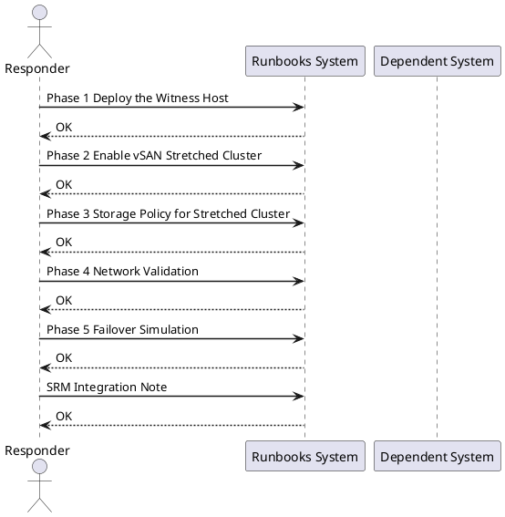

---
tags:
  - vsan
  - vmware
  - stretched-cluster
  - witness-host
  - spbm
  - storage-policy
  - srm
  - high-availability
  - runbook
---

# vSAN Stretched Cluster Setup and Validation

<div class="kb-summary">
Cross-product runbook for deploying and validating a VMware vSAN stretched cluster across two sites with a third-site witness host. Covers witness appliance deployment, fault domain configuration, SPBM storage policy creation, network validation, failover simulation, and optional SRM integration for RPO=0 protection.
</div>




## Before You Begin

**Network requirements:**

| Path | Latency Requirement | Bandwidth |
|---|---|---|
| Site A ↔ Site B (data) | RTT ≤ 5ms | ≥ 10 Gbps recommended |
| Site A ↔ Witness | RTT ≤ 200ms | 100 Mbps minimum |
| Site B ↔ Witness | RTT ≤ 200ms | 100 Mbps minimum |

**Component prerequisites:**

| Component | Requirement |
|---|---|
| vCenter | Single vCenter managing both sites (required) |
| ESXi | Minimum 4 hosts (2 per site); vSAN 7.0 U1+ |
| vSAN License | vSAN Enterprise (Stretched Cluster requires Enterprise) |
| Witness Host | Dedicated VM or physical; 2 vCPU, 8 GB RAM minimum |
| Network | Dedicated vmkernel for vSAN traffic on each host; L2 or L3 stretch |
| Disk Groups | At least 1 disk group per host (cache + capacity) already configured |

**Pre-flight checks:**

```bash
# Verify RTT between sites — run from a vmkernel on Site A to Site B
vmkping -I vmk_vsan -d 1400 192.168.20.1

# Verify NTP sync on all hosts (clock skew kills vSAN)
esxcli system time get
esxcli network ntp server list

# Verify vSAN health pre-stretch
esxcli vsan health cluster get

# Check existing vSAN cluster status
esxcli vsan cluster get
```

---

## Phase 1: Deploy the Witness Host

### 1.1 Download and Deploy Witness Appliance OVA

1. Download the **VMware vSAN Witness Appliance** OVA from VMware Customer Connect (matches your ESXi/vSAN version)
2. In vCenter UI: **Actions → Deploy OVF Template**
3. Select the witness OVA file
4. **Name:** `vsan-witness-01`
5. **Compute Resource:** Select the witness site host or cluster
6. **Storage:** Any datastore at witness site (NOT vSAN)
7. **Network mapping:**
   - Management Network → witness management portgroup
   - Witness Network → witness-site network reachable from both Site A and Site B vmkernel IPs
8. **Customize template:**
   - Set root password
   - Set management IP, gateway, DNS
9. Power on the appliance

### 1.2 Configure Witness vmkernel

```bash
# SSH to witness appliance
ssh root@vsan-witness-01.corp.local

# Verify witness vmkernel interfaces
esxcli network ip interface list

# Add witness traffic vmkernel (if not auto-configured)
esxcli network ip interface add --interface-name vmk1 --portgroup-name "Witness Traffic"
esxcli network ip interface ipv4 set --interface-name vmk1 \
  --ipv4 192.168.30.10 --netmask 255.255.255.0 --type static

# Enable vSAN witness traffic on vmk1
esxcli vsan network ip add --interface-name vmk1 --type=witness

# Verify
esxcli vsan network list
# Should show vmk1 with trafficType = Witness
```

### 1.3 Add Witness Host to vCenter

1. In vCenter UI: **Hosts and Clusters → Right-click datacenter → Add Host**
2. Enter witness hostname/IP: `vsan-witness-01.corp.local`
3. Accept certificate
4. **Do NOT** add to the vSAN cluster — it will be added automatically during stretch configuration
5. Verify host appears in vCenter inventory under a separate datacenter/folder

---

## Phase 2: Enable vSAN Stretched Cluster

### 2.1 Create Fault Domains (UI)

1. Navigate to **Cluster → Configure → vSAN → Fault Domains**
2. Click **Add Fault Domain**
3. Create `FD-SiteA` — add ESXi-A01, ESXi-A02, ESXi-A03
4. Create `FD-SiteB` — add ESXi-B01, ESXi-B02, ESXi-B03
5. Verify both fault domains appear with correct host assignments

### 2.2 Enable Stretched Cluster (UI Wizard)

1. Navigate to **Cluster → Configure → vSAN → Services → Fault Tolerance → Configure**
2. Select **Stretched Cluster**
3. **Preferred Fault Domain:** `FD-SiteA`
4. **Secondary Fault Domain:** `FD-SiteB`
5. **Witness Host:** Select `vsan-witness-01` from the host list
6. Review configuration summary
7. Click **Finish**

The wizard will:
- Reconfigure vSAN object placement across both fault domains
- Synchronize existing data (resync — can take minutes to hours depending on data size)
- Enable the stretched cluster feature

### 2.3 Verify via esxcli

```bash
# SSH to any Site A ESXi host
ssh root@esxi-a01.corp.local

# Verify stretched cluster is enabled
esxcli vsan cluster get
# Expected output includes:
#   Stretched Cluster Enabled: true
#   Preferred Fault Domain: FD-SiteA
#   Witness Host: <witness UUID>

# List fault domains
esxcli vsan faultdomain get

# Check vSAN object resync status (wait for completion before proceeding)
esxcli vsan debug object list | grep -i "Resync"
# Should return no objects in resync state after initial sync completes
```

### 2.4 PowerCLI — Verify Stretched Cluster Configuration

```powershell
Connect-VIServer -Server vcenter.corp.local

$cluster = Get-Cluster -Name "vSAN-Stretched"
$vsanConfig = Get-VsanClusterConfiguration -Cluster $cluster

$vsanConfig | Select-Object SpbmEnabled, StretchedClusterEnabled, 
  PreferredFaultDomainId, WitnessHost | Format-List
```

---

## Phase 3: Storage Policy for Stretched Cluster

### 3.1 Create SPBM Policy (UI)

1. Navigate to **Menu → Policies and Profiles → VM Storage Policies**
2. Click **Create**
3. **Name:** `vSAN-Stretched-FTT1-RAID1`
4. **Policy rules:**
   - Data service: **vSAN**
   - Site disaster tolerance: **Dual site mirroring (stretched cluster)**
   - Failures to tolerate per site: **1 failure — RAID-1 (mirroring)**
   - Number of disk stripes per object: `1`
5. Review — policy will place one component in each fault domain + witness
6. Click **Finish**

### 3.2 Create SPBM Policy via PowerCLI

```powershell
# Create the stretched cluster storage policy
$ruleset = New-SpbmRuleSet -AllOfRules @(
  New-SpbmRule -Capability (
    Get-SpbmCapability -Name "VSAN.hostFailuresToTolerate"
  ) -Value 1,
  New-SpbmRule -Capability (
    Get-SpbmCapability -Name "VSAN.checksumDisabled"
  ) -Value $false,
  New-SpbmRule -Capability (
    Get-SpbmCapability -Name "VSAN.stretchedCluster"
  ) -Value $true
)

$policy = New-SpbmStoragePolicy `
  -Name "vSAN-Stretched-FTT1-RAID1" `
  -Description "Stretched cluster RAID-1 across both sites" `
  -AnyOfRuleSets $ruleset
```

### 3.3 Assign Policy to VMs

```powershell
# Assign storage policy to all VMs in the cluster
$vms = Get-Cluster "vSAN-Stretched" | Get-VM

foreach ($vm in $vms) {
  $harddisks = $vm | Get-HardDisk
  foreach ($disk in $harddisks) {
    Set-SpbmEntityConfiguration -StoragePolicy $policy -HardDisk $disk
  }
}

# Verify compliance
$cluster = Get-Cluster "vSAN-Stretched"
Get-SpbmEntityConfiguration -Cluster $cluster | 
  Select-Object Entity, StoragePolicy, ComplianceStatus | Format-Table
```

---

## Phase 4: Network Validation

### 4.1 Test Inter-Site vSAN Bandwidth

```bash
# Run vmkping with large payload (1400 bytes = near MTU) — from Site A to Site B vmkernel
# SSH to esxi-a01
ssh root@esxi-a01.corp.local

# Ping vSAN vmkernel of a Site B host
vmkping -I vmk_vsan -d 1400 192.168.20.11
# Look for: RTT < 5ms, 0% packet loss

# Extended test — send 1000 packets
vmkping -I vmk_vsan -d 1400 -c 1000 192.168.20.11 | tail -5
```

### 4.2 Verify Witness Traffic Routing

```bash
# From Site A ESXi — ping witness vmkernel
vmkping -I vmk_vsan 192.168.30.10
# Expected: RTT < 200ms

# From Site B ESXi — ping witness vmkernel
ssh root@esxi-b01.corp.local
vmkping -I vmk_vsan 192.168.30.10
```

### 4.3 Check vSAN Health Service

```bash
# Run full health check from ESXi
esxcli vsan health cluster get

# Key checks to verify:
# - vSAN cluster partition: Healthy
# - Witness host fault domain: Healthy
# - Network latency check: Healthy (RTT within limits)
# - vSAN disk balance: Healthy

# Via PowerCLI
$cluster = Get-Cluster "vSAN-Stretched"
Invoke-VsanHealthCheck -Cluster $cluster -IncludeAllChecks | 
  Where-Object {$_.Health -ne "Green"} | 
  Select-Object TestName, Health, Suggestion | Format-Table -Wrap
```

### 4.4 Verify vSAN Object Placement

```bash
# From any ESXi host — verify objects have components in both sites
esxcli vsan debug object list

# For each object, confirm:
# - At least 1 component in FD-SiteA
# - At least 1 component in FD-SiteB
# - 1 witness component on witness host

# Count objects per fault domain
esxcli vsan debug object list | grep -c "FD-SiteA"
esxcli vsan debug object list | grep -c "FD-SiteB"
```

---

## Phase 5: Failover Simulation

### 5.1 Simulate Site A Isolation

```bash
# CAUTION: This causes a brief HA event — coordinate with change window

# Option A: Block vSAN vmkernel traffic from Site A hosts (on network switch)
# Block ports on Site A physical switches carrying vmk_vsan traffic

# Option B: Manually isolate via firewall rule (lab only)
# On each Site A host:
esxcli network firewall ruleset set --enabled false --ruleset-id vsanEncryption

# Monitor from vCenter — VMs should restart on Site B within HA timeout (default 30s–120s)
```

### 5.2 Verify VM Restart on Site B

```powershell
# Monitor HA events
Connect-VIServer -Server vcenter.corp.local
Get-VIEvent -MaxSamples 50 | Where-Object {$_.GetType().Name -like "*Ha*"} | 
  Select-Object CreatedTime, FullFormattedMessage | Format-Table -Wrap

# Verify VMs are running on Site B hosts
Get-Cluster "vSAN-Stretched" | Get-VM | 
  Where-Object {$_.PowerState -eq "PoweredOn"} | 
  Select-Object Name, VMHost | Format-Table
```

### 5.3 Check vSAN Stretched Cluster Health During Isolation

```bash
# From a Site B host (during Site A isolation)
ssh root@esxi-b01.corp.local

# Verify cluster is still accessible and vSAN is healthy
esxcli vsan cluster get
# Expected: cluster accessible, Preferred site = unreachable (normal during test)

# Check that Site B has quorum with witness
esxcli vsan debug cluster get
```

### 5.4 Restore Site A and Verify Resync

```bash
# Re-enable Site A connectivity (reverse the isolation steps)
# On each Site A host:
esxcli network firewall ruleset set --enabled true --ruleset-id vsanEncryption

# Monitor resync — components from Site A will resync with Site B
esxcli vsan debug object list | grep -i resync

# Wait until resync completes (no objects in resync state)
# Large datasets can take hours — monitor progress
watch -n 30 "esxcli vsan debug resync summary get"

# Verify cluster health post-resync
esxcli vsan health cluster get
```

### 5.5 vSAN Stretched Cluster Health in UI

1. Navigate to **Cluster → Monitor → vSAN → Skyline Health**
2. Verify:
   - **Stretched cluster health:** Green
   - **Witness host connectivity:** Healthy
   - **Data resyncing:** 0 objects (after failover recovery)
   - **Site A / Site B balance:** Within tolerance

---

## SRM Integration Note

If VMware Site Recovery Manager (SRM) is deployed alongside the stretched vSAN cluster:

```text
SRM + vSAN Stretched Cluster:
- Protection groups use vSAN-Stretched-FTT1-RAID1 storage policy
- VMs with this policy have RPO = 0 (synchronous replication built into vSAN)
- SRM recovery plans can trigger HA restart on secondary site OR controlled
  failover of VMs using vSphere Replication as the transport mechanism
- vSAN stretched cluster is the recommended substitute for array-based
  replication when both sites share the same vSAN cluster
```

```powershell
# Verify SRM-protected VMs use stretched cluster policy
$protectedVMs = Get-SrmProtectionGroup | Get-SrmProtectedVM

foreach ($vm in $protectedVMs) {
  $policy = Get-SpbmEntityConfiguration -VM (Get-VM -Id $vm.MoRef) |
    Select-Object -ExpandProperty StoragePolicy
  [PSCustomObject]@{
    VM     = $vm.Name
    Policy = $policy.Name
    RPO    = if ($policy.Name -like "*Stretched*") { "0 (sync)" } else { "Per replication schedule" }
  }
} | Format-Table
```

---

## Rollback

### Revert from Stretched Cluster to Standard vSAN

```bash
# CAUTION: Reverting removes stretch and collapses to single-site vSAN
# All VM objects will be migrated back to single fault domain
# Do not proceed if Site B has active VM workloads without migrating first

# Migrate all VMs back to Site A hosts first
# Then in vCenter UI:
# Cluster → Configure → vSAN → Services → Fault Tolerance → Edit → Disable Stretched Cluster

# Via CLI (after UI wizard completes conversion):
esxcli vsan cluster get
# Stretched Cluster Enabled should now read: false
```

### Emergency: Force vSAN to Site B Without Witness Quorum

```bash
# Use ONLY if Site A and Witness are both unreachable and VMs need to be accessed
# This permanently marks Site B as authoritative — data loss risk if Site A was ahead

ssh root@esxi-b01.corp.local
esxcli vsan debug object repair --force-unsync
# WARNING: Run only on instruction from VMware GSS
```

---

## See Also

- [VMware vSAN Overview](../../../virtualization/vmware/vsan/)
- [vSAN Troubleshooting](../../../virtualization/vmware/vsan/troubleshooting/)
- [DR Failover: SRM + SnapMirror](../dr-failover-vmware-srm-snapmirror/)
- [NSX-T Microsegmentation with AD Integration](../nsxt-microsegmentation-ad-integration/)
- [vSAN to ONTAP NFS Migration](../vmware-vsan-to-ontap-migration/)
- [VMware SRM](../../../virtualization/vmware/srm/)
