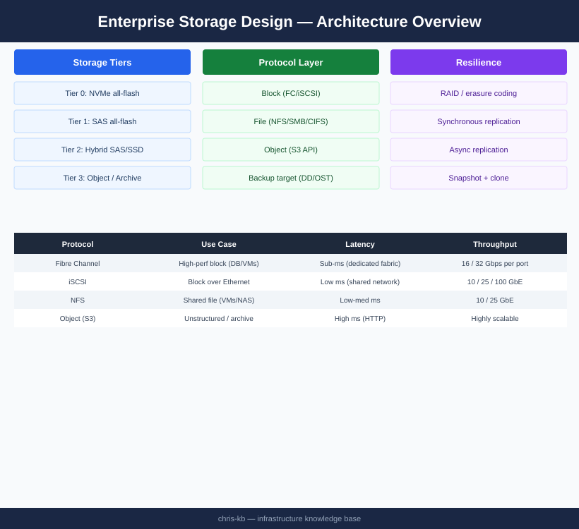
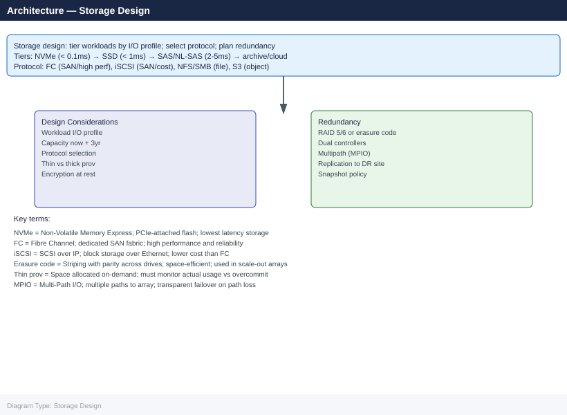
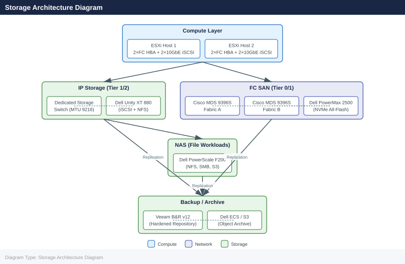

---
tags:
  - storage
  - architecture
---
# Storage Design

<div class="kb-summary">

</div>

## Overview

Storage design determines how enterprise data is stored, protected, accessed, and managed across its entire lifecycle. Poor storage design is one of the most common root causes of performance bottlenecks, outages, and cost overruns in data centre infrastructure. A rigorous approach classifies workloads by I/O profile and criticality, selects the appropriate technology tier, designs for redundancy and data protection at every level, and validates capacity and performance assumptions before production deployment.

This guide covers storage tier models, workload classification, protocol selection, storage network architecture, capacity planning, data protection design, storage array placement guidance, and cloud integration.

---

## Storage Tier Model

Not all data has the same performance, availability, or cost requirements. A tiered storage model matches the cost of storage to the value and access frequency of the data it holds.

| Tier | Technology | Latency (read) | IOPS (per drive/node) | Cost (relative) | Use Case |
|------|-----------|---------------|----------------------|----------------|----------|
| 0 — NVMe All-Flash | NVMe SSD (PCIe Gen4/5) | 50–150 µs | 500K–2M IOPS/array | Very High | Tier 0 databases, latency-sensitive OLTP, trading platforms |
| 1 — All-Flash SAS/SATA | SAS/SATA SSD | 200–500 µs | 100K–500K IOPS/array | High | General OLTP, VDI, Tier 1 workloads |
| 2 — Hybrid Flash/Spinning | SSD cache + spinning NL-SAS | 1–10 ms (cache hit) | 10K–50K IOPS (cache dependent) | Moderate | Mixed workloads, dev/test, secondary databases |
| 3 — Spinning Disk (NL-SAS) | 7.2K rpm NL-SAS | 5–20 ms | 100–200 IOPS/drive | Low | Backup target, sequential data, large file shares |
| 4 — Archive / Object | Tape, cloud object (S3/Blob) | Seconds–minutes | N/A | Very Low | Long-term retention, compliance archiving, cold data |

**Design principle:** Tier selection is driven by workload I/O profile (latency sensitivity, IOPS requirement, sequential vs. random), not by storage team preference or vendor defaults. Run a workload assessment before finalising tier placement.

---

## Workload Classification

Classify every workload before assigning storage tier. The four dominant workload classes in enterprise infrastructure each have distinct I/O signatures.

| Workload Class | I/O Pattern | Block Size | Queue Depth | Latency Sensitivity | Recommended Tier | Notes |
|---------------|------------|-----------|------------|--------------------|--------------------|-------|
| OLTP (databases) | Random read/write, 60–70% read | 4–16 KB | High (32–256) | Very high (<1 ms) | 0 or 1 | SQL Server, Oracle, MySQL; size for peak IOPS not average |
| VDI (virtual desktops) | Random read (boot storm), random write (persistent) | 4–8 KB | Medium | High (<5 ms) | 1 | Boot storms can 10× average IOPS; size for peak |
| File / NAS | Mixed sequential + random | 64 KB–1 MB | Low | Moderate | 1 or 2 | SharePoint, home drives, NFS workloads |
| Backup (source) | Sequential write | 256 KB–1 MB | Low | Low | 2 or 3 | Throughput-sensitive; not latency-sensitive |
| Backup (target / repository) | Sequential write / dedup | 64 KB–512 KB | Low | Very low | 3 | Veeam repositories, Data Domain, Dell PowerProtect |
| Archive | Sequential write, infrequent read | 1 MB+ | Very low | Very low | 4 | Compliance retention; immutability required |
| Analytics / DWH | Sequential read (large scans) | 512 KB–4 MB | Medium | Moderate | 2 | Spark, Hadoop, data warehouse batch queries |

**VDI boot storm example:** A 1,000-seat VDI environment may sustain 2,000–5,000 IOPS at steady state. At 8:00 AM when 80% of users log in within 20 minutes, the boot storm can reach 50,000–80,000 IOPS. The storage tier must be sized for the boot storm, not the steady state. All-flash (Tier 1) is typically required.

---

## Protocol Selection

The storage access protocol determines how hosts communicate with the storage array. Protocol selection is driven by workload type, existing infrastructure, latency requirements, and operational preference.

| Protocol | Transport | Block/File | Latency | Throughput | Typical Use | Considerations |
|---------|-----------|-----------|---------|-----------|------------|----------------|
| Fibre Channel (FC) | Dedicated FC SAN (8/16/32 GbFC) | Block | Lowest (<500 µs) | 8–32 Gbps/link | Tier 0/1 OLTP, Oracle, SQL Server | Requires FC HBAs and FC switches (Brocade/Cisco MDS); separate fabric from Ethernet |
| iSCSI | Ethernet (10/25 GbE) | Block | Low (<1 ms) | 10–100 Gbps | Tier 1/2 on Ethernet-only environments | Simpler than FC; requires dedicated storage VLANs and jumbo frames |
| NFS v3/v4 | Ethernet (10/25 GbE) | File (NAS) | Low–Moderate | 10–100 Gbps | VMware datastores, file shares, analytics | Stateless (NFSv3) or stateful (NFSv4.1 with pNFS); VMware supports NFSv3/v4.1 |
| SMB 3.x | Ethernet (10/25 GbE) | File (NAS) | Low | 10–100 Gbps | Windows file shares, SQL Server on SMB | SMB Multichannel provides NIC bonding natively; Hyper-V over SMB 3.0 |
| NVMe-oF (FC-NVMe / NVMe-RoCE) | FC or RDMA Ethernet | Block | Lowest (50–200 µs) | 100+ Gbps | Tier 0 NVMe arrays | Emerging; requires NVMe-capable HBAs and arrays (Dell PowerMax, Pure FlashArray//XL) |
| S3 (Object) | HTTP/HTTPS | Object | High (ms–seconds) | Variable | Archive, cloud tiering, backup target | Not suitable for structured workloads; excellent for unstructured/archive |

**Protocol selection decision guide:**

```d2
direction: right

C: "C" {shape: rectangle}
D: "Fibre Channel (FC" {shape: rectangle}
E: "E" {shape: rectangle}
F: "FC — leverage\nexisting SAN fabric" {shape: rectangle}
G: "iSCSI on dedicated\n10/25 GbE storage VLAN" {shape: rectangle}
H: "H" {shape: rectangle}
I: "SMB 3.x (CIFS" {shape: rectangle}
J: "NFS v3 or v4.1\non NAS" {shape: rectangle}
K: "K" {shape: rectangle}
L: "S3 Object Storage\n(Dell ECS, AWS S3, Azure Blob" {shape: rectangle}
A: "What is the workload?" {shape: rectangle}
B: "B" {shape: rectangle}

C -> D
E -> F
E -> G
H -> I
H -> J
K -> L
```


Where:
- **RAID Efficiency**: RAID-1 = 50%; RAID-5 (4+1) = 80%; RAID-6 (4+2) = 67%; RAID-10 = 50%
- **Overhead**: Snapshots (10–20%), metadata (2–5%), reserve/headroom (20% minimum)

### Worked Example: vSAN Cluster

**Given:**
- 6 ESXi hosts, each with 4 × 3.84 TB NVMe drives
- vSAN policy: FTT=1 (RAID-1), minimum 2 copies
- Target: leave 20% free space for performance and snapshots

**Calculation:**
```bash
Raw capacity:      6 hosts × 4 drives × 3.84 TB  = 92.16 TB raw
RAID-1 efficiency: 92.16 TB × 50%                = 46.08 TB usable (before overhead)
Snapshot + meta:   46.08 TB × (1 - 0.15)        = 39.17 TB after 15% overhead
Free space reserve: 39.17 TB × (1 - 0.20)       = 31.34 TB available for VMs
```


```text title="Expected output"
Raw capacity:      6 hosts × 4 drives × 3.84 TB  = 92.16 TB raw
RAID-1 efficiency: 92.16 TB × 50%                = 46.08 TB usable (before overhead)
Snapshot + meta:   46.08 TB × (1 - 0.15)        = 39.17 TB after 15% overhead
Free space reserve: 39.17 TB × (1 - 0.20)       = 31.34 TB available for VMs
```
Effective usable capacity: approximately **31 TB** from a 92 TB raw cluster.

**Rule of thumb:** For vSAN RAID-1 clusters, expect ~32–35% of raw capacity to be usable for VM data. For RAID-5 (FTT=1, Erasure Coding), expect ~55–60%.

### Worked Example: Traditional SAN (Dell PowerMax)

**Given:**
- Dell PowerMax 2500 with 24 × 3.84 TB NVMe drives
- RAID-5 (3+1 or 7+1 — varies by PowerMax generation and workload)
- 15% reserved for TDEV thin provisioning over-subscription headroom

```text
Raw capacity:  24 × 3.84 TB  = 92.16 TB raw
RAID-5 (7+1): 92.16 × 87.5% = 80.64 TB usable
Reserve 15%:  80.64 × 0.85  = 68.54 TB allocatable
```

Over-subscription ratio (thin provisioning): PowerMax supports up to 3:1 over-subscription. Allocatable capacity of 68.54 TB can present up to ~205 TB of thin-provisioned LUNs — but actual written data must not exceed 68.54 TB.

---

## Data Protection Levels

Data protection is layered. Each layer addresses a different failure mode; none of the layers alone is sufficient.

```d2
direction: right

P1: "Layer 1: RAID\n(protects against drive failure" {shape: rectangle}
P2: "Layer 2: Snapshots\n(protects against accidental deletion\nand application errors" {shape: rectangle}
P3: "Layer 3: Replication\n(protects against site failure" {shape: rectangle}
P4: "Layer 4: Backup\n(protects against ransomware,\ncorruption, long-term recovery" {shape: rectangle}
P5: "Layer 5: Immutable Backup Copy\n(protects against backup deletion/encryption" {shape: rectangle}

P1 -> P2
P2 -> P3
P3 -> P4
P4 -> P5
```

| Layer | Technology Examples | Protects Against | Limitations |
|-------|-------------------|-----------------|------------|
| RAID / Erasure Coding | RAID-1/5/6, vSAN policies, NetApp RAID-DP | Single/dual drive failure | Does not protect against array failure, accidental deletion, ransomware |
| Snapshots | NetApp ONTAP snapshots, Dell PowerMax TimeFinder, vSphere snapshots | Accidental deletion, application rollback | Stored on same array; does not protect against array failure |
| Synchronous Replication | SRDF/S, RecoverPoint (CDP mode), vSAN Stretched | Site failure with RPO=0 | High cost; requires low-latency inter-site links |
| Asynchronous Replication | SRDF/A, vSphere Replication, Veeam Replication | Site failure with RPO=minutes | Data loss window equal to replication lag |
| Backup (disk-to-disk) | Veeam, Commvault, Dell PowerProtect | Ransomware, corruption, long-term recovery | Recovery time depends on backup window and restore speed |
| Immutable Backup (WORM) | Veeam Hardened Repository, AWS S3 Object Lock, Dell PowerProtect CyberSense | Ransomware encryption of backup data | Requires dedicated immutable storage; cannot be deleted or modified |

**3-2-1 rule (minimum standard):**
- **3** copies of data
- **2** different storage media types
- **1** copy off-site (DR site or cloud)

For ransomware protection, extend to **3-2-1-1**: one of the copies must be **immutable** (WORM), and optionally one copy must be **air-gapped** (offline or logically isolated).

---

## Storage Architecture Diagram



---

## Dell Storage Platform Placement Guidance

| Platform | Category | Tier | Best Fit |
|---------|----------|------|----------|
| Dell PowerMax 2500 / 8500 | Block (FC/NVMe-oF) | 0 | Mission-critical databases, core banking, trading; requires SRDF for DR |
| Dell PowerStore 1200T / 9200T | Block + File (FC/iSCSI/NFS) | 1 | Mid-range OLTP, VDI, converged block+file; modern replacement for VNX/Unity in new deployments |
| Dell Unity XT 480F / 880F | Block + File (iSCSI/FC/NFS/SMB) | 1/2 | SMB-enterprise; cost-effective all-flash for mid-tier workloads |
| Dell PowerScale F200 / F900 | Scale-out NAS (NFS/SMB/S3) | 1/2 | Unstructured data, analytics, AI/ML data lakes, home directories |
| Dell ECS (Elastic Cloud Storage) | Object (S3-compatible) | 4 | Long-term archive, cloud-tier, backup target; S3 API compatibility for modern apps |
| Dell PowerProtect DD9900 | Backup target (dedup) | N/A | Backup-to-disk repository for Veeam, Commvault, NetBackup; Boost integration |

---

## Cloud Storage Integration

### Tiering and Archiving to Cloud

Configure automatic data tiering to cloud object storage for cold data. This reduces on-premises capacity costs without changing the access interface for applications.

| On-Premises Platform | Cloud Target | Protocol | Tiering Mechanism |
|---------------------|-------------|---------|------------------|
| Dell PowerScale (OneFS) | AWS S3, Azure Blob | S3-compatible | SmartPools CloudPools — automatic tier based on last-access time |
| NetApp ONTAP | AWS S3, Azure Blob, StorageGRID | S3 | FabricPool — tiering of cold blocks to cloud object tier |
| Veeam B&R | AWS S3, Azure Blob, Wasabi | S3-compatible | Scale-out Backup Repository with capacity tier offload |
| Dell PowerStore | AWS S3 (via CloudIQ) | API-based | Manual archive; no native auto-tiering |

### Cloud-Native Storage (for Hybrid Workloads)

| Service | Provider | Use Case | Notes |
|---------|---------|----------|-------|
| Amazon EBS (gp3/io2) | AWS | Block for EC2 | io2 Block Express: 256K IOPS, 4 GB/s per volume |
| Amazon EFS | AWS | NFS for EC2/Lambda | Multi-AZ, elastic; higher latency than EBS |
| Amazon S3 | AWS | Object storage | Unlimited scale; S3 Intelligent-Tiering for cost optimisation |
| Amazon FSx for NetApp ONTAP | AWS | Managed ONTAP | Full ONTAP API; SnapMirror to on-premises |
| Azure Managed Disks (Ultra) | Azure | Block for VMs | Sub-millisecond latency; 160K IOPS per disk |
| Azure NetApp Files | Azure | NFS/SMB | Enterprise NAS in Azure; low latency; SnapMirror support |
| Azure Blob Storage | Azure | Object | Hot/Cool/Archive tiers; immutability via WORM policies |

---

## Storage Design Validation Checklist

### Capacity
- [ ] Raw capacity calculated per platform; usable capacity calculated after RAID and overhead
- [ ] Thin provisioning over-subscription ratio documented and monitored (alert at 75% of physical capacity)
- [ ] Snapshot space reserved and capped (maximum 20% of datastore/volume size)
- [ ] Growth projection documented for 12 and 36 months; procurement lead time factored in

### Performance
- [ ] IOPS requirement calculated for each workload at peak (not average)
- [ ] VDI boot storm analysis completed; peak IOPS sized for 80% concurrent login in 20 minutes
- [ ] Latency requirement documented per workload; storage tier validated against latency spec
- [ ] Storage array performance counters baselined; alerts configured for latency threshold breaches

### Protocol and Network
- [ ] Fibre Channel: dual-fabric zoning configured; each host HBA on independent fabric
- [ ] iSCSI / NFS: dedicated storage VLANs with jumbo frames (MTU 9000) enabled end-to-end
- [ ] MTU validated with DF-bit ping test from each ESXi host to each storage target
- [ ] MPIO configured on all hosts; path selection policy set (Round Robin or vendor plugin)
- [ ] No storage traffic transiting firewall or production uplinks

### Data Protection
- [ ] RAID policy documented and validated per workload tier
- [ ] Snapshots scheduled and retention policy configured (minimum: daily snap, 7-day retention for Tier 1)
- [ ] Replication configured and lag monitored for all Tier 0/1 volumes
- [ ] Backup jobs configured, tested, and completing within backup window
- [ ] Backup restore validated within the last 90 days (restore to isolated environment)
- [ ] Immutable backup copy enabled (WORM) for all Tier 0/1 backup data
- [ ] 3-2-1 rule verified: off-site copy confirmed and accessible

### Monitoring and Operations
- [ ] Storage array health monitoring integrated with SNMP/syslog into monitoring platform
- [ ] Capacity utilisation alerts set (warn at 70%, critical at 85% of usable capacity)
- [ ] Performance alerts set for latency and IOPS thresholds by workload tier
- [ ] Array firmware within supported range; firmware update process documented
- [ ] Support contracts active for all storage hardware; vendor contact and case numbers documented

---

## LUN Naming Convention

LUN names must be unique across the array and encode enough context to identify the host, application, purpose, and sequence number without consulting a spreadsheet.

Pattern: `{host}_{app}_{purpose}_{num}`

| Component | Description | Example |
|---|---|---|
| `host` | Short hostname (without env/site prefix) | `wsql01` |
| `app` | Application or workload abbreviation | `mssql` |
| `purpose` | `data`, `log`, `temp`, `os`, `backup` | `data` |
| `num` | Two-digit sequence | `01` |

Examples:

- `wsql01_mssql_data_01` — first SQL data LUN on wsql01
- `wsql01_mssql_log_01` — SQL transaction log LUN
- `wapp02_tomcat_data_01` — application data LUN on a Tomcat host

LUN names are set at array provisioning time and must not be renamed after host mapping. Renaming requires a change record and re-validation of multipath.

## Multipath Configuration

All Linux hosts connected to SAN storage must use device-mapper multipath (`multipathd`). Default policy is `service-time 0`.

```ini
# /etc/multipath.conf (key sections)
defaults {
    user_friendly_names  yes
    find_multipaths      yes
    path_grouping_policy multibus
    path_selector        "service-time 0"
    failback             immediate
    no_path_retry        fail
}

blacklist {
    devnode "^sda$"   # local OS disk — never multipath
}
```

Verify after mapping a new LUN:

```bash
multipath -ll
multipath -v3 2>&1 | grep -i "wsql01"
lsblk | grep dm-
```


```text title="Expected output"
mpatha (360060e8005600000001600065d82e11) dm-0 NETAPP,LUN
size=500G features='3 queue_if_no_path pg_init_retries 50' hwhandler='1 alua' wp=rw
|-+- policy='service-time 0' prio=50 status=active
| |- 2:0:0:0 sda 8:0  active ready running
| `- 3:0:0:0 sdb 8:16 active ready running
`-+- policy='service-time 0' prio=10 status=enabled
  |- 4:0:0:0 sdc 8:32 active ready running
  `- 5:0:0:0 sdd 8:48 active ready running

mpathb (360060e8005600000001600065d82e12) dm-1 NETAPP,LUN
size=1T features='3 queue_if_no_path pg_init_retries 50' hwhandler='1 alua' wp=rw
|-+- policy='service-time 0' prio=50 status=active
| |- 2:0:1:0 sde 8:64  active ready running
| `- 3:0:1:0 sdf 8:80  active ready running

dm-0  253:0    0  500G  0 lvm
dm-1  253:1    0    1T  0 lvm
```

!!! warning "Common errors"
    **`multipath: command not found`** — Install device-mapper-multipath package with `apt-get install device-mapper-multipath` or `yum install device-mapper-multipath`.
    **`device-mapper: ioctl: 4.45.1-1.1 (2021-03-22) initialisation failed: Device or resource busy`** — Ensure no processes are actively using the multipath devices and reload the device-mapper module with `systemctl restart multipathd`.
Expected output: all paths `active ready`, queue depth per path as configured, DM device visible under `/dev/mapper/`.

## Filesystem Layout and Mount Points

Standard mount point layout for application servers:

| Mount Point | Purpose | Filesystem | Mount Options |
|---|---|---|---|
| `/` | OS root | xfs | defaults |
| `/boot` | Kernel/initrd | xfs | defaults |
| `/var` | Variable data | xfs | defaults,nodev |
| `/tmp` | Temporary files | xfs | defaults,nodev,nosuid,noexec |
| `/data` | Application data | xfs | defaults,nodev,nosuid |
| `/logs` | Application logs | xfs | defaults,nodev,nosuid |
| `/backup` | Local backup staging | xfs | defaults,nodev,nosuid |

SQL Server additional mounts: `/mssql/data`, `/mssql/log`, `/mssql/temp` — each on a dedicated LUN.

XFS is the standard filesystem for all data and log volumes. ext4 is acceptable for OS volumes on older builds. ZFS is not in standard use.

## Disk Labelling and fstab

All non-OS disks must be mounted by label or UUID — never by device name (`/dev/sdb`). Device names change when new disks are added.

```bash
# Set filesystem label at mkfs time
mkfs.xfs -L mssql_data_01 /dev/mapper/wsql01_mssql_data_01

# Mount by label
echo "LABEL=mssql_data_01  /mssql/data  xfs  defaults,nodev,nosuid  0 0" >> /etc/fstab

# Verify
mount -a && df -hT /mssql/data
```


```text title="Expected output"
meta-data=/dev/mapper/wsql01_mssql_data_01 inode-size=512   sectsz=4096   ascii ci=0 ftype=1
data     =                       bsize=4096   blocks=2621440, imsize=16384, "logbsize=32k"
naming   =version 2              bsize=4096   ascii-ci=0 ftype=1
log      =internal log           bsize=4096   blocks=2560, version=2
         =                       sectsz=4096  sunit=0 blks
realtime =none                   extsz=4096   blocks=0, rtextents=0
Filesystem     Type     Size  Used Avail Use% Mounted on
/dev/mapper/wsql01_mssql_data_01 xfs   10G  33M  9.9G   1% /mssql/data
```

!!! warning "Common errors"
    **`mkfs.xfs: /dev/mapper/wsql01_mssql_data_01 appears to contain an existing filesystem`** — Add the `-f` flag to force overwrite: `mkfs.xfs -f -L mssql_data_01 /dev/mapper/wsql01_mssql_data_01`
    **`mount: /mssql/data does not exist`** — Create the mount point directory before mounting: `mkdir -p /mssql/data`
    **`mount: can't find LABEL=mssql_data_01 in /etc/fstab`** — Verify the label matches exactly between mkfs and fstab; use `blkid` to confirm the actual label assigned.
For multipath devices, use the DM persistent name (`/dev/mapper/{alias}`) in fstab, not the dm-N path.

## Snapshot and Backup Standards

Array-level snapshots supplement but do not replace backup. Snapshot policy per tier:

| Tier | Snapshot Frequency | Retention | Notes |
|---|---|---|---|
| Production | Every 4 hours | 48 hours | Plus daily for 7 days |
| Staging | Daily | 3 days | — |
| Dev | None by default | — | Enable on request |

Snapshots must not be used for production data recovery without testing consistency. SQL and Oracle volumes require application-consistent snapshots using VSS (Windows) or the array's application-aware plugin.

All new storage builds must have a backup job configured and a successful test restore completed before going live.
