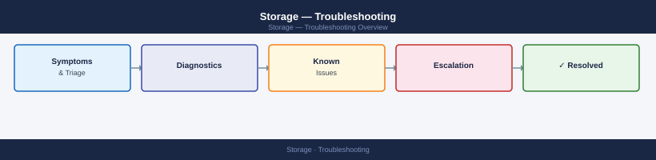

---
tags:
  - troubleshooting
search:
  boost: 1.5
---
# Storage — Troubleshooting


<div class="kb-summary">
Storage troubleshooting — APD/PDL conditions, multipath failures, replication lag, snapshot failures, host I/O errors, and array health alerts.
</div>



<div class="kb-grid kb-grid-2">
<a class="kb-card" href="replication-failures/"><strong>Replication Failures</strong><span>Storage replication failure diagnosis — lag thresholds, link state, and consistency group checks.</span></a>
<a class="kb-card" href="storage-latency/"><strong>Storage Latency</strong><span>Storage latency troubleshooting — array queue depth, fabric congestion, and host-side I/O analysis.</span></a>
</div>

```d2
direction: down

symptom: Identify Symptom {shape: diamond}
symptom_index: "Symptom Index" {shape: rectangle}
linux_host_io_diagnostics: "Linux Host I/O Diagnostics" {shape: rectangle}
vmware_apd_recovery: "VMware APD Recovery" {shape: rectangle}
replication_lag_diagnosis: "Replication Lag Diagnosis" {shape: rectangle}
array_health_check_commands: "Array Health Check Commands" {shape: rectangle}
resolution: Resolve or Escalate {shape: oval}

symptom -> symptom_index: investigate
symptom -> linux_host_io_diagnostics: investigate
symptom -> vmware_apd_recovery: investigate
symptom -> replication_lag_diagnosis: investigate
symptom -> array_health_check_commands: investigate
symptom_index -> resolution
linux_host_io_diagnostics -> resolution
vmware_apd_recovery -> resolution
replication_lag_diagnosis -> resolution
array_health_check_commands -> resolution
```

## Symptom Index

| Symptom | Likely Cause | First Command |
|---|---|---|
| All Paths Down (APD) in vCenter | Fabric or array outage | `esxcli storage core path list` |
| Permanent Device Loss (PDL) | LUN removed or array offline | Check array health; check zoning |
| Multipath path degraded | HBA or switch port issue | `multipath -ll` (Linux) |
| I/O latency spike | Overloaded storage pool; dedup/compression | Check array I/O stats |
| Snapshot job failing | Snapshot policy conflict; quota exceeded | Check array event log |
| Replication lag growing | WAN bandwidth; source I/O rate high | Check replication stats on array |
| Filesystem read-only | Underlying LUN error; I/O timeout | `dmesg | grep -i 'error\|read-only\|EXT4-fs'` |

## Linux Host I/O Diagnostics

```bash
# Check for multipath failures
multipath -ll
dmesg | grep -i 'scsi\|sd[a-z]\|mpath\|failed'

# I/O error log
journalctl -k | grep -i 'error\|i/o error\|EXT4\|XFS' | tail -50

# Check disk queue depth and wait
iostat -xz 1 5
# await > 20ms on SSD is abnormal

# Check LUN presence
lsblk; ls -la /dev/mapper/
```

**Expected output:** `multipath -ll` shows all paths in `active ready` state. `dmesg` grep returns no output. `iostat` shows `await` < 5 ms for SSD, < 20 ms for HDD under normal load.

## VMware APD Recovery

```bash
# Rescan datastores after fabric restoration
esxcli storage core adapter rescan --all
esxcli storage core path list | grep -E 'State:|Device:|Adapter:'

# If APD persists after fabric is restored:
# 1. Put host in maintenance mode
# 2. Remove and re-add storage adapter in vCenter
# 3. Rescan
```

**Expected output:** `esxcli storage core path list` shows `State: active` for all paths. APD condition resolves in vCenter (datastore no longer shows "All Paths Down").

## Replication Lag Diagnosis

```bash
# Pure FlashArray — check active replication
purepod list
purepod show replication --pod <pod_name>

# Dell PowerMax SRDF — check link state
symrdf -g <dg_name> query

# Generic: check WAN utilisation
iperf3 -c <target-site-ip> -t 10   # bandwidth test between sites
```

## Array Health Check Commands

```bash
# Pure FlashArray
purearray monitor             # latency, IOPS, bandwidth
purevolume monitor <volume>   # per-volume stats

# Dell PowerMax
symcfg show -sid <sid>        # array health summary
symdev list -sid <sid>        # device list

# NetApp ONTAP
storage aggregate show -state !online   # degraded aggregates
volume show -state !online
```
