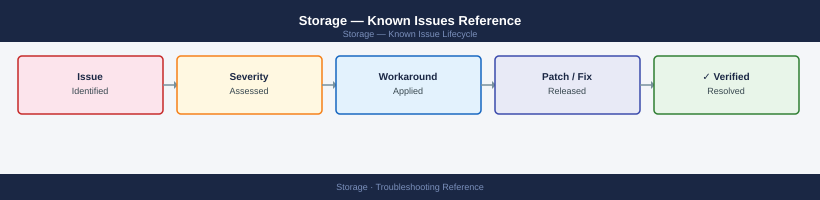

---
tags:
  - troubleshooting
  - storage
  - known-issues
description: "Index of storage product known issues and error codes. This top-level page links to per-product known-issues catalogs covering NetApp, Pure Storage, Dell..."
---
# Storage — Known Issues Reference

<div class="kb-summary">
Index of storage product known issues and error codes. This top-level page links to per-product known-issues catalogs covering NetApp, Pure Storage, Dell storage, and Ceph.

*Applies to: All storage products in this KB*
</div>



```d2
direction: down

symptom: Identify Symptom {shape: diamond}
storage_product_knownissues_pages: "Storage Product Known-Issues Pages" {shape: rectangle}
resolution: Resolve or Escalate {shape: oval}

symptom -> storage_product_knownissues_pages: investigate
storage_product_knownissues_pages -> resolution
```

## Before you begin

Storage issues often surface as application errors (I/O timeout, permission denied) — identify the protocol layer (NFS, iSCSI, FC, S3) before diving into array-specific known issues.

## Storage Product Known-Issues Pages

### NetApp

| Product | Known Issues |
|---|---|
| ONTAP | [ONTAP — Known Issues](../../products/netapp/ontap/troubleshooting/known-issues/) |
| SnapCenter | [SnapCenter — Known Issues](../../products/netapp/snapcenter/troubleshooting/known-issues/) |
| SnapMirror | [SnapMirror — Known Issues](../../products/netapp/snapmirror/troubleshooting/known-issues/) |
| InsightIQ | [InsightIQ — Known Issues](../../products/netapp/insightiq/troubleshooting/known-issues/) |
| Keystone | [Keystone — Known Issues](../../products/netapp/keystone/troubleshooting/known-issues/) |
| Superna Eyeglass | [Superna Eyeglass — Known Issues](../../products/netapp/superna-eyeglass/troubleshooting/known-issues/) |

### Pure Storage

| Product | Known Issues |
|---|---|
| FlashArray | [FlashArray — Known Issues](../../products/pure/flasharray/troubleshooting/known-issues/) |
| FlashBlade | [FlashBlade — Known Issues](../../products/pure/flashblade/troubleshooting/known-issues/) |
| Pure1 | [Pure1 — Known Issues](../../products/pure/pure1/troubleshooting/known-issues/) |

### Dell Storage

| Product | Known Issues |
|---|---|
| PowerStore | [PowerStore — Known Issues](../../products/dell/powerstore/troubleshooting/known-issues/) |
| PowerScale | [PowerScale — Known Issues](../../products/dell/powerscale/troubleshooting/known-issues/) |
| PowerMax | [PowerMax — Known Issues](../../products/dell/powermax/troubleshooting/known-issues/) |
| Data Domain | [Data Domain — Known Issues](../../products/dell/data-domain/troubleshooting/known-issues/) |
| Unity | [Unity — Known Issues](../../products/dell/unity/troubleshooting/known-issues/) |
| VPLEX | [VPLEX — Known Issues](../../products/dell/vplex/troubleshooting/known-issues/) |
| RecoverPoint | [RecoverPoint — Known Issues](../../products/dell/recoverpoint/troubleshooting/known-issues/) |

### Open Source

| Product | Known Issues |
|---|---|
| Ceph | [Ceph — Known Issues](../../products/ceph/troubleshooting/known-issues/) |

## See also

- [Storage — Common Issues](index.md)
