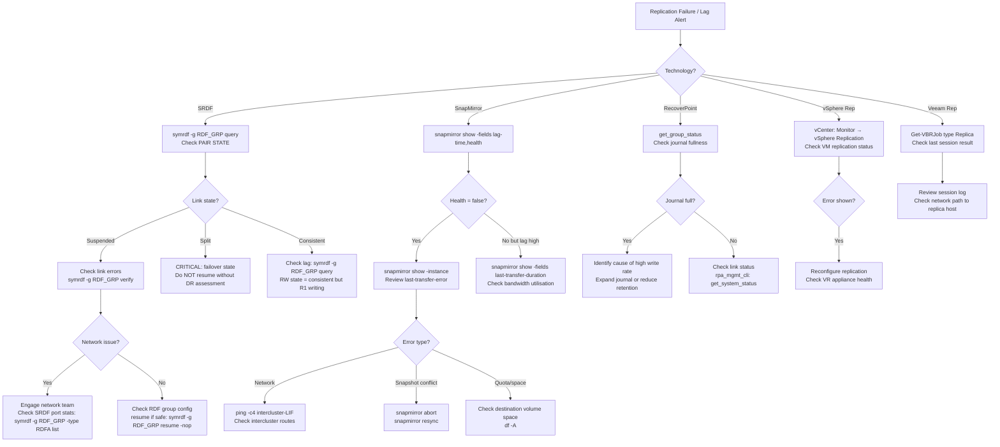

# Replication Failures Troubleshooting


<div class="kb-summary">
Replication Failures Troubleshooting reference covering Overview, Replication Technology Classification, Diagnostic Flowchart, ONTAP SnapMirror Troubleshooting, RecoverPoint Troubleshooting and 5 more sections.
</div>

## Overview

Replication failures degrade DR readiness and can result in RPO breaches. Each replication technology has distinct failure modes and tooling. This guide covers SRDF (Dell EMC PowerMax/VMAX), ONTAP SnapMirror, EMC RecoverPoint, vSphere Replication, and Veeam replication jobs. RPO breach assessment must happen immediately — sustained lag may trigger DR invocation.

---

## Replication Technology Classification

| Technology | Vendor | Replication Type | First-check Command | Typical RPO |
|---|---|---|---|---|
| SRDF/S | Dell EMC PowerMax/VMAX | Synchronous block | `symrdf -g <RDF_group> query` | 0 (synchronous) |
| SRDF/A | Dell EMC PowerMax/VMAX | Asynchronous block | `symrdf -g <RDF_group> query` | Seconds to minutes |
| SnapMirror | NetApp ONTAP | Async volume/SVM | `snapmirror show` | Minutes to hours |
| RecoverPoint | Dell EMC | Journal-based block | `get_group_status` / Web UI | Seconds (bookmark-based) |
| vSphere Replication | VMware | VM-level async | vCenter / VRMS UI; `Get-VM` | Minutes to hours |
| Veeam Replication | Veeam B&R | VM image-level | `Get-VBRJob`; Veeam console | Minutes to hours |

---

## Diagnostic Flowchart


```text
┌───────────────────────────────── Replication Failure Troubleshooting ─────────────────────────────────┐
│                                                                                                       │
│   ┌───────────────────────────────────────────────────────────────────────────────────────────────┐   │
│   │       Replication failures: WAN link loss, auth error, lag exceeds RPO, pair state error      │   │
│   │           First check: WAN connectivity → replication link state → pair state → lag           │   │
│   └───────────────────────────────────────────────────────────────────────────────────────────────┘   │
│                                                                                                       │
│                  ▼                                ▼                                ▼                  │
│                                                                                                       │
│   ┌─────────────────────────────┐  ┌─────────────────────────────┐  ┌─────────────────────────────┐   │
│   │       SRDF (PowerMax)       │  │      SnapMirror (ONTAP)     │  │         vSphere Rep         │   │
│   │      ─────────────────      │  │      ─────────────────      │  │      ─────────────────      │   │
│   │         symrdf query        │  │       snapmirror show       │  │       VR appliance UI       │   │
│   │        RDF link state       │  │        SM state field       │  │          VR status          │   │
│   │         R1/R2 state         │  │           Lag time          │  │          RPO status         │   │
│   │       symrdf failover       │  │      snapmirror resync      │  │        Re-register VM       │   │
│   │          RDF group          │  │       Peering cluster       │  │      VRS configuration      │   │
│   └─────────────────────────────┘  └─────────────────────────────┘  └─────────────────────────────┘   │
│                                                                                                       │
│   │     Symptom      │   First check    │        Fix        │      Verify      │   Escalate if    │   │
│   │ ──────────────── │ ──────────────── │ ───────────────── │ ──────────────── │──────────────────│   │
│   │    Link down     │  WAN ping/test   │      Fix WAN      │   Rep resumes    │ Persistent down  │   │
│   │     High lag     │  WAN bandwidth   │  Throttle or fix  │  Lag decreases   │    RPO breach    │   │
│   │    Pair error    │    Auth/cert     │  Re-authenticate  │   State normal   │   Data diverge   │   │
│   │    Suspended     │  Manual suspend  │     Resume rep    │     In-sync      │ If not resuming  │   │
│                                                                                                       │
│    Key terms:                                                                                         │
│                                                                                                       │
│    RDF link    = Fibre Channel or IP link between PowerMax pairs; GigE or dedicated FC                │
│    Peering     = ONTAP cluster peer relationship; required for SnapMirror cross-cluster               │
│    VRS         = vSphere Replication Server; collects replication data on target site                 │
│    RPO breach  = Lag exceeds configured RPO target; escalate immediately as DR goal at risk           │
│                                                                                                       │
└───────────────────────────────────────────────────────────────────────────────────────────────────────┘
```

### SRDF Error Codes

| State | Meaning | Action |
|---|---|---|
| Suspended | Link deliberately or automatically suspended | Investigate cause; resume after fix |
| Partitioned | Network path between arrays lost | Restore connectivity; verify port status |
| Split | Volumes deliberately split (DR/test) | Do not resume without change control |
| SyncInProg | Synchronising after resume/establish | Wait; monitor cycle progress |
| Mixed | Some devices in group out of sync | Identify device; check device-level state |
| Failed Over | R2 has become primary (DR invoked) | Full DR procedure; do not reverse without planning |

---

## ONTAP SnapMirror Troubleshooting

### Check Relationship Status

```bash
# Summary view of all SnapMirror relationships
snapmirror show

# Example output:
# Source Path    Dest Path           MirrorState   LagTime   Healthy
# ------------   --------            -----------   -------   -------
# svm1:vol_db    svm2:vol_db_dp      Snapmirrored  0:05:32   true
# svm1:vol_app   svm2:vol_app_dp     Snapmirrored  2:34:11   false  ← problem

# Detailed view of a specific relationship
snapmirror show -source-path svm1:vol_app -destination-path svm2:vol_app_dp -instance

# Key fields to check:
# Last Transfer Type: scheduled (good) or update (manual resync triggered)
# Last Transfer Error: reason for last failure
# Transfer Snapshot:  name of snapshot being transferred (progress indicator)
```

### Diagnose and Resync

```bash
# Check what error caused failure
snapmirror show -fields last-transfer-error

# Typical errors:
# "Transfer aborted: failed to get snapshot lock" → snapshot conflict
# "Destination volume is full"                    → space issue on destination
# "Connection refused"                            → network/intercluster LIF issue

# Abort stuck transfer
snapmirror abort -source-path svm1:vol_app -destination-path svm2:vol_app_dp -foreground true

# Resync (re-establishes relationship from common snapshot baseline)
snapmirror resync -source-path svm1:vol_app -destination-path svm2:vol_app_dp

# Monitor transfer progress
snapmirror show -fields transfer-progress, lag-time

# Check intercluster LIF connectivity
network interface show -role intercluster
ping -lif intercluster_lif_svm1 -destination 192.168.10.20

# Check intercluster route
network route show -vserver svm1
```

### SnapMirror Lag Threshold Table

| Volume Tier | Schedule | Warning Lag | Critical (RPO Breach) |
|---|---|---|---|
| Tier 1 — Critical DB | Every 1 hour | >2 hours | >4 hours |
| Tier 2 — App volumes | Every 4 hours | >6 hours | >8 hours |
| Tier 3 — File shares | Every 24 hours | >36 hours | >48 hours |
| Vault (compliance) | Weekly | >10 days | >14 days |

---

## RecoverPoint Troubleshooting

```bash
# Connect to RecoverPoint Management CLI (via SSH to RPA)
ssh admin@rpa01.corp.example.com

# Check consistency group status
get_group_status

# Example output:
# Group Name       State          Link Status    Journal    Lag
# PROD-CG-01      Active         Active         12% Full   2s
# PROD-CG-02      Paused         Active         87% Full   N/A   ← journal full
# PROD-CG-03      Active         Disconnected   45% Full   N/A   ← link issue

# Check RPA system status
get_system_status

# Check journal volume fullness (journal full = replication pauses)
get_group_statistics -g PROD-CG-02

# To address journal full:
# 1. Check for access policy blocking journal recycling
# 2. Check if journal volume expansion is possible
# 3. If acceptable, reduce retention period on the consistency group
```

---

## Replication Lag Threshold and RPO Breach Criteria

| Protection Tier | RPO Objective | Replication Type | Lag Threshold = Breach | Action |
|---|---|---|---|---|
| Gold (Tier 1) | 15 minutes | Synchronous / SRDF/A | Any lag >15 min | Immediate escalation; DR readiness assessment |
| Silver (Tier 2) | 4 hours | SnapMirror / SRDF/A | Lag >4 hours | Alert application owner; escalate to storage team |
| Bronze (Tier 3) | 24 hours | SnapMirror async | Lag >24 hours | Storage team investigation; no immediate DR trigger |
| Test/Dev | Best effort | Veeam replication | >48 hours | Informational only |

---

## Network Bandwidth and Latency Impact

```bash
# Measure available bandwidth between sites (install iperf3 on both sides)
# On destination site server:
iperf3 -s

# On source site:
iperf3 -c replication-dst-site-ip -t 60 -P 4

# SRDF/S (synchronous) latency budget:
# Round-trip latency between arrays should be <2ms for SRDF/S
# >2ms RTT → consider switching to SRDF/A

# Check current WAN utilisation (Cisco)
# show interface serial0/0 | include rate
#   5 minute input rate 850000000 bits/sec  ← close to 1Gbps link capacity

# Check if SRDF/A is throttling due to bandwidth
symrdf -g RDF_GRP_01 -type rdfa list | grep -i "transmit\|delay\|bandwidth"

# SnapMirror bandwidth throttling
snapmirror show -fields throttle

# Set a throttle (KB/s) to protect production workload
snapmirror modify -source-path svm1:vol_app -destination-path svm2:vol_app_dp -throttle 51200
```

---

## vSphere Replication Troubleshooting

```powershell
# PowerCLI: check replication state for all VMs
Get-VM | Get-VIObjectByVIView -MORef {$_.ExtensionData.Datastore} |
    Get-HciReplicationState  # requires Site Recovery Manager PowerCLI module

# Alternative: check via vCenter Web UI
# Monitor → Site Recovery → vSphere Replication → Virtual Machines

# Reconfigure replication if VR appliance loses connection
# vCenter → Host and Clusters → VR Appliance → Manage → VR Configuration

# Check VR appliance health via SSH
ssh admin@vr-appliance.corp.example.com
hbr-cfg status
```

---

## Veeam Replication Job Troubleshooting

```powershell
Add-PSSnapin VeeamPSSnapIn

# List replication jobs and last status
Get-VBRJob -Type Replica | Select-Object Name,
    @{N='LastResult';E={$_.GetLastResult()}},
    @{N='LastRun';E={$_.ScheduleOptions.LatestRunLocal}} |
    Format-Table -AutoSize

# Get failed session details
$job = Get-VBRJob -Name "Replica-PROD-SQL"
$session = Get-VBRReplicaSession | Where-Object {$_.JobName -eq $job.Name} |
    Sort-Object EndTime -Descending | Select-Object -First 1
$session.GetTaskSessions() | Select-Object Name, Status, Info

# Check replica VM state at target site
Get-VBRRestorePoint -Name "vm-prod-sql01-replica" | Select-Object CreationTime, IsConsistent
```

---

## Escalation Criteria — When to Invoke DR

Escalate immediately to DR coordinator / management when:

- SRDF group enters **Split** or **Failed Over** state unexpectedly (not during a planned DR test)
- RPO breach confirmed for any **Gold/Tier-1** system exceeding 30 minutes
- Replication link is down and cannot be restored within the RPO window
- RecoverPoint journal is >90% full and cannot be extended — replication will pause
- SnapMirror resync is failing repeatedly (>3 attempts) on a critical volume
- Both primary site and DR replication paths are simultaneously degraded (dual failure)
- Disaster scenario confirmed at primary site — initiate DR runbook immediately
- Any situation where last known good replication point is older than the RPO objective
