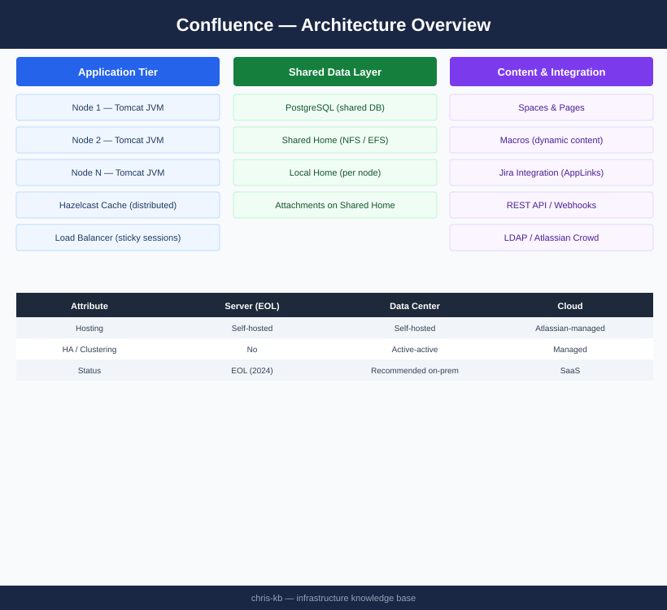

# Confluence — Architecture

<div class="kb-summary">
Confluence Data Center runs as an active-active Java cluster sharing a single PostgreSQL database, a distributed NFS/EFS home, and Hazelcast for cache invalidation. Sticky sessions are mandatory at the load balancer.
</div>

```
┌───────────────────────────────── Confluence — Architecture Overview ──────────────────────────────────┐
│                                                                                                       │
│   ┌───────────────────────────────────────────────────────────────────────────────────────────────┐   │
│   │                              Confluence Data Center Architecture                              │   │
│   │          Load balancer → multiple Tomcat app nodes → shared PostgreSQL DB + NFS home          │   │
│   │       Each node is stateless for HTTP; shared NFS provides attachments and Lucene index       │   │
│   │            Hazelcast cluster: in-memory cache synchronisation across all app nodes            │   │
│   │         Synchrony: collaborative editing service co-located or standalone on port 8091        │   │
│   └───────────────────────────────────────────────────────────────────────────────────────────────┘   │
│                                                                                                       │
│    App nodes scale horizontally; DB and NFS are the single-source-of-truth tiers                      │
│                                                                                                       │
│                          ▼                                                 ▼                          │
│                                                                                                       │
│   ┌──────────────────────────────────────────────┐  ┌─────────────────────────────────────────────┐   │
│   │               Application Tier               │  │                  Data Tier                  │   │
│   │           Tomcat JVM: heap 4-8 GB            │  │            PostgreSQL 14+ primary           │   │
│   │          Hazelcast: node discovery           │  │          DB replica for read scale          │   │
│   │           Synchrony: collab edits            │  │            NFS shared home mount            │   │
│   │           Lucene: local index copy           │  │              Attachments on NFS             │   │
│   │           REST API endpoint: 8090            │  │            JDBC: confluence user            │   │
│   │          Session: Hazelcast-backed           │  │          DB backup: pg_dump nightly         │   │
│   └──────────────────────────────────────────────┘  └─────────────────────────────────────────────┘   │
│                                                                                                       │
│    Application tier is horizontally scalable; data tier requires HA at DB and NFS level               │
│                                                                                                       │
│                          ▼                                                 ▼                          │
│                                                                                                       │
│   ┌───────────────────────────────────────────────────────────────────────────────────────────────┐   │
│   │   How It Works   │ Design Standards │    Integrations   │      Ports       │    Protocols     │   │
│   │Request lifecycle │Node sizing guide │   LDAP/SAML IdP   │  8090 HTTP app   │   AJP / HTTP/S   │   │
│   │ Search indexing  │ DB schema design │   Jira app link   │ 5432 PostgreSQL  │     JDBC TCP     │   │
│   │  Collab editing  │    NFS sizing    │   CI/CD webhooks  │  8091 Synchrony  │    WebSocket     │   │
│   │ Cache sync flow  │   HA topology    │  REST API clients │   443 HTTPS LB   │     TLS 1.2+     │   │
│   └───────────────────────────────────────────────────────────────────────────────────────────────┘   │
│                                                                                                       │
│  Physical Infrastructure (the hardware everything above runs on):                                     │
│  2+ vSphere VMs per app node · DB VM with SSD storage · NFS datastore · L4 load balancer              │
│                                                                                                       │
│  Key terms:                                                                                           │
│                                                                                                       │
│  Hazelcast    = distributed in-memory data grid; Confluence uses it for session + cache sync          │
│  Synchrony    = real-time collaborative editing service bundled with Confluence DC                    │
│  AJP          = Apache JServ Protocol; Tomcat connector for Apache httpd reverse proxy                │
│  JDBC         = Java Database Connectivity; connection pool managed by Confluence                     │
│  Lucene       = Apache search library; Confluence maintains local index per node                      │
│  NFS          = Network File System; shared home for attachments across DC nodes                      │
│  pg_dump      = PostgreSQL native backup utility; produces SQL or custom-format dump                  │
│  JVM heap     = memory allocated to Confluence JVM; set in setenv.sh (recommended 4-8 GB)             │
│  DC node      = single Confluence app server instance in a clustered DC deployment                    │
│  Load balancer= L4/L7 device distributing HTTP requests across Confluence app nodes                   │
│  Shared home  = confluence.home path mounted from NFS; same path on all nodes                         │
│  App link     = Atlassian application link connecting Confluence to Jira for auth/data                │
│                                                                                                       │
└───────────────────────────────────────────────────────────────────────────────────────────────────────┘
```
```text
┌───────────────────────────────── Confluence — Architecture Overview ──────────────────────────────────┐
│                                                                                                       │
│   ┌───────────────────────────────────────────────────────────────────────────────────────────────┐   │
│   │                              Confluence Data Center Architecture                              │   │
│   │          Load balancer → multiple Tomcat app nodes → shared PostgreSQL DB + NFS home          │   │
│   │       Each node is stateless for HTTP; shared NFS provides attachments and Lucene index       │   │
│   │            Hazelcast cluster: in-memory cache synchronisation across all app nodes            │   │
│   │         Synchrony: collaborative editing service co-located or standalone on port 8091        │   │
│   └───────────────────────────────────────────────────────────────────────────────────────────────┘   │
│                                                                                                       │
│    App nodes scale horizontally; DB and NFS are the single-source-of-truth tiers                      │
│                                                                                                       │
│                          ▼                                                 ▼                          │
│                                                                                                       │
│   ┌──────────────────────────────────────────────┐  ┌─────────────────────────────────────────────┐   │
│   │               Application Tier               │  │                  Data Tier                  │   │
│   │           Tomcat JVM: heap 4-8 GB            │  │            PostgreSQL 14+ primary           │   │
│   │          Hazelcast: node discovery           │  │          DB replica for read scale          │   │
│   │           Synchrony: collab edits            │  │            NFS shared home mount            │   │
│   │           Lucene: local index copy           │  │              Attachments on NFS             │   │
│   │           REST API endpoint: 8090            │  │            JDBC: confluence user            │   │
│   │          Session: Hazelcast-backed           │  │          DB backup: pg_dump nightly         │   │
│   └──────────────────────────────────────────────┘  └─────────────────────────────────────────────┘   │
│                                                                                                       │
│    Application tier is horizontally scalable; data tier requires HA at DB and NFS level               │
│                                                                                                       │
│                          ▼                                                 ▼                          │
│                                                                                                       │
│   ┌───────────────────────────────────────────────────────────────────────────────────────────────┐   │
│   │   How It Works   │ Design Standards │    Integrations   │      Ports       │    Protocols     │   │
│   │Request lifecycle │Node sizing guide │   LDAP/SAML IdP   │  8090 HTTP app   │   AJP / HTTP/S   │   │
│   │ Search indexing  │ DB schema design │   Jira app link   │ 5432 PostgreSQL  │     JDBC TCP     │   │
│   │  Collab editing  │    NFS sizing    │   CI/CD webhooks  │  8091 Synchrony  │    WebSocket     │   │
│   │ Cache sync flow  │   HA topology    │  REST API clients │   443 HTTPS LB   │     TLS 1.2+     │   │
│   └───────────────────────────────────────────────────────────────────────────────────────────────┘   │
│                                                                                                       │
│  Physical Infrastructure (the hardware everything above runs on):                                     │
│  2+ vSphere VMs per app node · DB VM with SSD storage · NFS datastore · L4 load balancer              │
│                                                                                                       │
│  Key terms:                                                                                           │
│                                                                                                       │
│  Hazelcast    = distributed in-memory data grid; Confluence uses it for session + cache sync          │
│  Synchrony    = real-time collaborative editing service bundled with Confluence DC                    │
│  AJP          = Apache JServ Protocol; Tomcat connector for Apache httpd reverse proxy                │
│  JDBC         = Java Database Connectivity; connection pool managed by Confluence                     │
│  Lucene       = Apache search library; Confluence maintains local index per node                      │
│  NFS          = Network File System; shared home for attachments across DC nodes                      │
│  pg_dump      = PostgreSQL native backup utility; produces SQL or custom-format dump                  │
│  JVM heap     = memory allocated to Confluence JVM; set in setenv.sh (recommended 4-8 GB)             │
│  DC node      = single Confluence app server instance in a clustered DC deployment                    │
│  Load balancer= L4/L7 device distributing HTTP requests across Confluence app nodes                   │
│  Shared home  = confluence.home path mounted from NFS; same path on all nodes                         │
│  App link     = Atlassian application link connecting Confluence to Jira for auth/data                │
│                                                                                                       │
└───────────────────────────────────────────────────────────────────────────────────────────────────────┘
```


<div class="kb-grid kb-grid-3">
<a class="kb-card" href="how-it-works/"><strong>How It Works</strong><span>Deployment models, cluster topology, component roles, and port reference.</span></a>
<a class="kb-card" href="integrations/"><strong>Integrations</strong><span>Integration with other platforms and external systems.</span></a>
<a class="kb-card" href="design-standards/"><strong>Design Standards</strong><span>Sizing guidelines, design standards, and best practices.</span></a>
</div>

---

## Deployment Models

| Model | Hosting | HA | Clustering | Atlassian Managed |
|---|---|---|---|---|
| Server (EOL) | Self-hosted | No | No | No |
| **Data Center** | Self-hosted | Yes | Yes (active/active) | No |
| Cloud | Atlassian infrastructure | Yes | Managed | Yes |

---

## Data Center Topology


