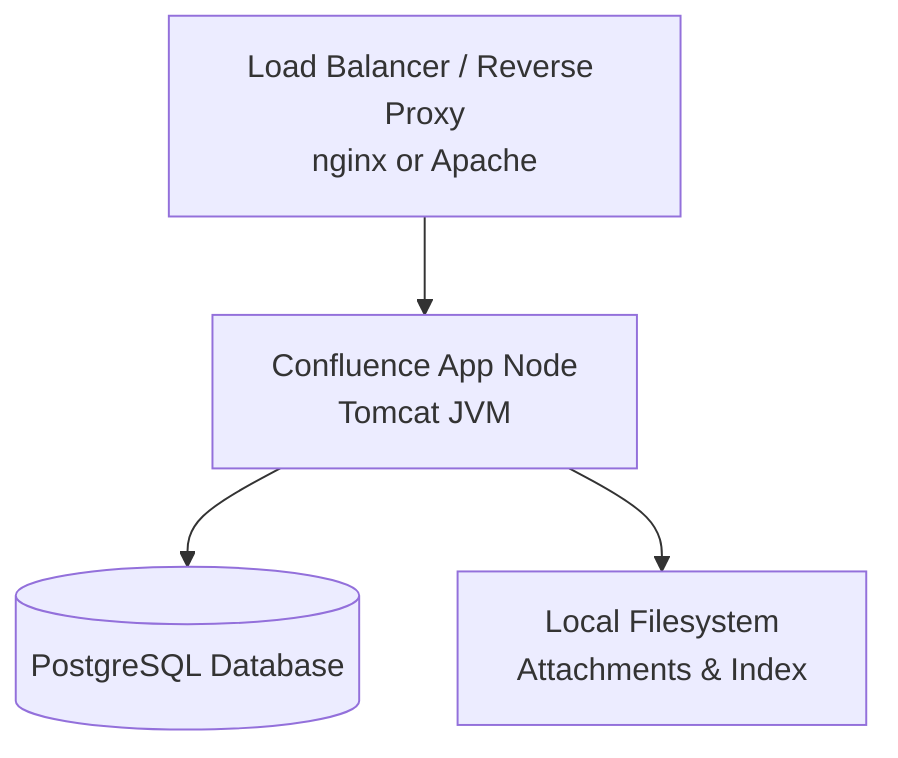
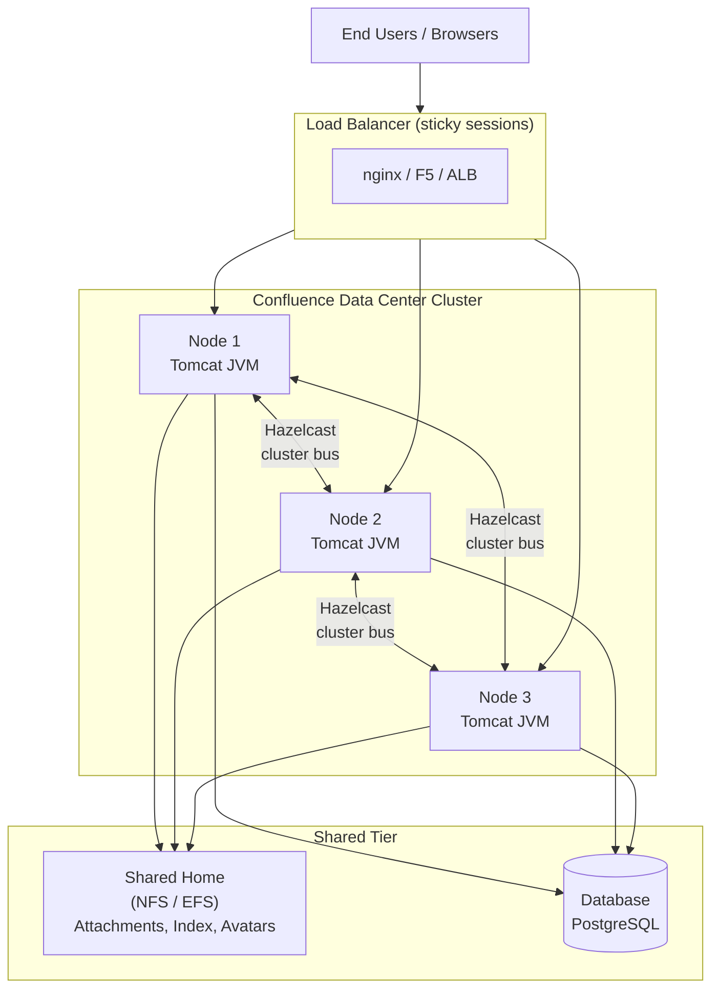

# Confluence — Architecture Overview

Confluence is Atlassian's enterprise wiki and collaboration platform. It is available in three deployment models: **Server** (EOL), **Data Center** (self-managed, HA-capable), and **Cloud** (SaaS). This page covers the internal component architecture and deployment topology relevant to on-premises Data Center deployments.

---

## Deployment Models

| Model | Hosting | HA | Clustering | Atlassian Managed |
|---|---|---|---|---|
| Server | Self-hosted | No | No | No |
| Data Center | Self-hosted | Yes | Yes (active/active) | No |
| Cloud | Atlassian infrastructure | Yes | Managed | Yes |

> Confluence Server reached End of Life on **February 15, 2024**. All self-managed deployments should be on Data Center.

---

## Core Components

### Application Server

Confluence runs as a Java web application inside an embedded **Apache Tomcat** servlet container. The application tier handles:

- HTTP/HTTPS request processing
- Session management and authentication
- Page rendering and macro execution
- Plugin (Marketplace app) lifecycle

Key configuration files:

| File | Purpose |
|---|---|
| `<CONFLUENCE_HOME>/confluence.cfg.xml` | Database connection, home directory, cluster settings |
| `<CONFLUENCE_INSTALL>/conf/server.xml` | Tomcat connector ports, TLS offload, AJP |
| `<CONFLUENCE_INSTALL>/bin/setenv.sh` | JVM heap, GC flags, system properties |
| `<CONFLUENCE_HOME>/confluence-init.properties` | Override home directory path |

### Database

Confluence requires an external relational database. Supported engines for Data Center:

| Database | Minimum Version | Notes |
|---|---|---|
| PostgreSQL | 14 | Recommended; best tested |
| Microsoft SQL Server | 2017 | Requires JDBC driver drop-in |
| MySQL | 8.0 | Requires explicit collation config |
| Oracle | 19c | Supported; least common |

The database stores all page content, space metadata, user data, permissions, and macro results. It is the **source of truth** — the local home directory is derivative.

### Search (Lucene)

Confluence uses an embedded **Apache Lucene** index for full-text search. In Data Center mode, the index lives in the **shared home** directory so all nodes share a single index.

- Index location: `<SHARED_HOME>/index/`
- Rebuilding: **Admin > General Configuration > Content Indexing**
- Partial re-index recovers from corruption without full rebuild

### File / Attachment Storage

Attachments and other binary content are stored in the filesystem, not the database.

| Mode | Location |
|---|---|
| Single node (Server) | `<LOCAL_HOME>/attachments/` |
| Data Center | `<SHARED_HOME>/attachments/` (must be accessible by all nodes) |

In Data Center the shared home **must** be mounted via a distributed filesystem (NFS, GlusterFS, Azure Files, AWS EFS) accessible from all cluster nodes simultaneously.

### Shared Home vs Local Home (Data Center)

| Directory | Scope | Contents |
|---|---|---|
| Local home (`confluence.home`) | Per node | Temp files, caches, local logs |
| Shared home (`confluence.shared-home`) | Cluster-wide | Attachments, index, avatars, backups, plugins |

---

## Deployment Topology

### Single-Node (Server / Small DC)



### Data Center — Active/Active Cluster



**Sticky sessions** (session affinity) are mandatory at the load balancer. Confluence does not support distributing a single user session across multiple nodes within the same request cycle.

### Cluster Communication — Hazelcast

Confluence Data Center uses **Hazelcast** for:

- Distributed cache invalidation
- Cluster membership and node discovery
- Distributed locks (e.g., indexing coordination)

Default Hazelcast port: **5801** (TCP). All cluster nodes must reach each other on this port. Multicast is not used in production — configure `confluence.cluster.peers` for unicast discovery.

Relevant `confluence.cfg.xml` properties:

```xml
<property name="confluence.cluster.home">/mnt/shared-home</property>
<property name="confluence.cluster.peers">10.0.1.11,10.0.1.12,10.0.1.13</property>
<property name="confluence.cluster.node.name">node-1</property>
```

---

## JVM Memory Architecture

Confluence is memory-intensive. Typical production sizing:

| Instance Size | Users | Heap (`-Xmx`) | Metaspace (`-XX:MaxMetaspaceSize`) |
|---|---|---|---|
| Small | < 500 | 2 GB | 512 MB |
| Medium | 500–2000 | 4–6 GB | 1 GB |
| Large | > 2000 | 8–16 GB | 1 GB |

Recommended GC: **G1GC** (default in JDK 11+).

```bash
# setenv.sh example
JAVA_OPTS="-Xms4g -Xmx8g \
  -XX:+UseG1GC \
  -XX:MaxMetaspaceSize=1g \
  -XX:+HeapDumpOnOutOfMemoryError \
  -XX:HeapDumpPath=/var/atlassian/application-data/confluence/dumps/"
```

---

## Network Port Reference

| Port | Protocol | Component | Notes |
|---|---|---|---|
| 8090 | TCP | Confluence HTTP | Default; front with nginx/443 |
| 8443 | TCP | Confluence HTTPS | If TLS termination at app |
| 8000 | TCP | Tomcat control | Localhost only |
| 5801 | TCP | Hazelcast | Inter-node cluster comms |
| 5432 | TCP | PostgreSQL | From app nodes to DB |
| 25 / 587 | TCP | SMTP | Outbound email |
| 636 / 389 | TCP | LDAP/AD | User directory sync |

---

## Plugin Architecture

Confluence plugins use the **Atlassian Plugin Framework (APF2)**. Plugins are bundled OSGi bundles and are stored in:

- `<SHARED_HOME>/plugins-osgi-cache/` — compiled plugin artifacts
- `<SHARED_HOME>/bundled-plugins/` — plugins shipped with Confluence
- Uploaded via: **Admin > Manage Apps > Upload App**

Plugin states and compatibility flags are stored in the database table `PLUGINVERSION`.

---

## Key Admin URLs

| URL | Purpose |
|---|---|
| `/admin/` | System administration home |
| `/admin/systeminfo.action` | JVM info, memory, uptime |
| `/admin/clustering.action` | Cluster node status |
| `/admin/indexqueue.action` | Search index queue |
| `/admin/scheduledjobs.action` | Scheduled task status |
| `/admin/logging.action` | Log level control |
