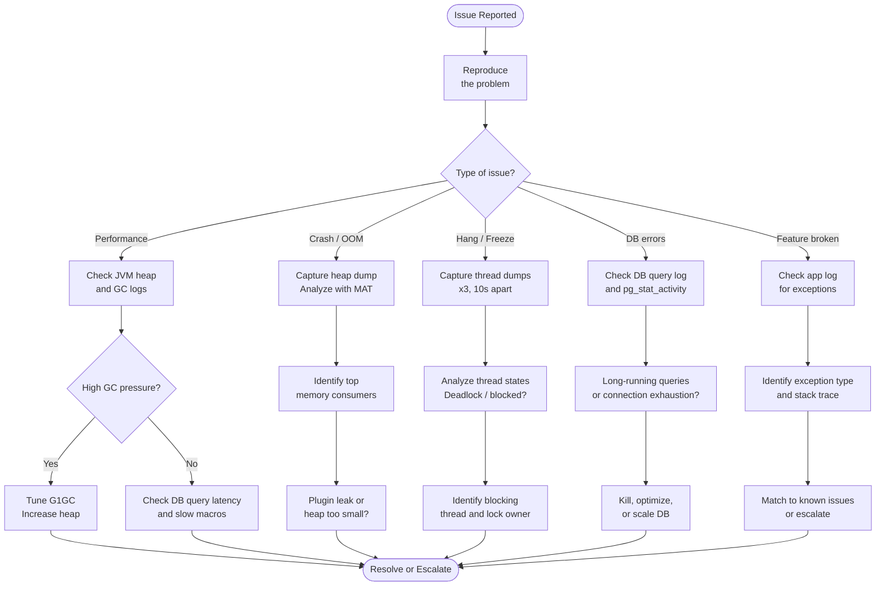

# Confluence — Diagnostics


<div class="kb-summary">
This page covers diagnostic procedures for deep investigation of Confluence issues. Use these techniques when standard log checks are insufficient and before escalating to Atlassian Support.
</div>

---

## Diagnostic Decision Flow



```text
┌────────────────────────────────────── Confluence — Diagnostics ───────────────────────────────────────┐
│                                                                                                       │
│   ┌───────────────────────────────────────────────────────────────────────────────────────────────┐   │
│   │                                 Confluence Diagnostic Runbook                                 │   │
│   │             Step 1: curl -s http://localhost:8090/status — confirms app is RUNNING            │   │
│   │                 Step 2: grep -i "ERROR|OOM|Exception" catalina.out | tail -100                │   │
│   │            Step 3: psql -U confluence -c "SELECT count(*) FROM content;" — DB alive           │   │
│   │          Step 4: df -h $CONFLUENCE_HOME — check disk; ls $CONFLUENCE_HOME/attachments         │   │
│   └───────────────────────────────────────────────────────────────────────────────────────────────┘   │
│                                                                                                       │
│    Run diagnostic steps in order; stop at first anomaly and remediate before continuing               │
│                                                                                                       │
│                          ▼                                                 ▼                          │
│                                                                                                       │
│   ┌──────────────────────────────────────────────┐  ┌─────────────────────────────────────────────┐   │
│   │           Application Diagnostics            │  │             Infrastructure Diag             │   │
│   │            curl /status endpoint             │  │                df -h home dir               │   │
│   │              grep catalina.out               │  │               mount | grep nfs              │   │
│   │             Thread dump: kill -3             │  │               pg_stat_activity              │   │
│   │              Heap: jmap -histo               │  │              netstat / ss ports             │   │
│   │             Admin > System Info              │  │                top / free -h                │   │
│   │              support-zip export              │  │           journalctl -u confluence          │   │
│   └──────────────────────────────────────────────┘  └─────────────────────────────────────────────┘   │
│                                                                                                       │
│  Physical Infrastructure (the hardware everything above runs on):                                     │
│  SSH access to Confluence VMs · PostgreSQL admin access · NFS mount visibility                        │
│                                                                                                       │
│  Key terms:                                                                                           │
│                                                                                                       │
│  kill -3 PID    = sends SIGQUIT to JVM; prints thread dump to catalina.out                            │
│  jmap -histo    = prints histogram of JVM heap object counts by class                                 │
│  pg_stat_activity = PostgreSQL view of active queries; find long-running DB queries                   │
│  catalina.out   = Tomcat stdout; primary log for startup errors and exceptions                        │
│  atlassian-confluence.log = application log; verbose errors and warning messages                      │
│  support-zip    = Admin > Troubleshooting > Create Support Zip; bundles all logs                      │
│  top            = real-time process view; check CPU and memory for java process                       │
│  netstat / ss   = list open ports; confirm 8090 and 8091 are listening                                │
│  mount          = list mounted filesystems; confirm NFS home is mounted correctly                     │
│  journalctl     = systemd log reader; useful if Confluence runs as a systemd service                  │
│  free -h        = show available system memory; check if OS swapping under pressure                   │
│  df -h          = disk usage; alert if CONFLUENCE_HOME volume >80% full                               │
│                                                                                                       │
└───────────────────────────────────────────────────────────────────────────────────────────────────────┘
```

### Useful Log Grep Patterns

```bash
LOG="/var/atlassian/application-data/confluence/logs/atlassian-confluence.log"

# All exceptions with stack traces (first line of each)
grep "Exception\|Error" "$LOG" | grep -v "DEBUG" | tail -30

# Slow page render warnings
grep -E "Slow|took [0-9]{4,}ms" "$LOG" | tail -20

# LDAP/auth issues
grep -E "(CrowdException|AuthenticationFailed|LDAPException)" "$LOG" | tail -20

# Plugin OSGi failures
grep -E "(BundleException|PluginException|Failed to start bundle)" "$LOG" | tail -20

# OOM events
grep "OutOfMemoryError" "$LOG"

# Index-related
grep -E "(IndexException|Lucene|index.*corrupt|reindex)" "$LOG" | tail -20

# Database errors
grep -E "(JDBCException|SQL.*Exception|cannot acquire.*connection)" "$LOG" | tail -20
```

---

## JVM Heap Analysis

### Check Current Heap Usage (Live)

```bash
CONF_PID=$(pgrep -f "atlassian-confluence\|confluence\.home" | head -1)

# Summary heap stats (every 5 seconds, 5 samples)
jstat -gcutil "$CONF_PID" 5000 5
# Columns: S0, S1, E (Eden), O (Old), M (Metaspace), YGC, YGCT, FGC, FGCT, GCT
# Alert if O > 90% between GC cycles

# Full GC info
jstat -gc "$CONF_PID" 5000 3
```

### Capture an On-Demand Heap Dump

```bash
CONF_PID=$(pgrep -f "atlassian-confluence\|confluence\.home" | head -1)
DUMP_FILE="/tmp/confluence-heap-$(date +%Y%m%d%H%M).hprof"

jmap -dump:format=b,file="$DUMP_FILE" "$CONF_PID"
echo "Heap dump: $DUMP_FILE ($(du -sh $DUMP_FILE | cut -f1))"
```

### Analyze Heap Dump — Eclipse MAT

1. Download [Eclipse Memory Analyzer (MAT)](https://www.eclipse.org/mat/)
2. Open the `.hprof` file in MAT
3. Run **Leak Suspects Report** (automatic analysis)
4. Key views:
   - **Dominator tree**: largest retained object graphs
   - **Histogram**: object counts by class
   - **OQL**: query object heap (e.g., `SELECT * FROM com.atlassian.plugin.* WHERE @retainedHeapSize > 1000000`)

Common findings:

| Retained Object | Likely Cause |
|---|---|
| Large `CacheManager` or `EhCache` objects | Cache size misconfigured or unbounded |
| Many `PageImpl` or `ContentEntityObject` | Bulk page render or large export in progress |
| Plugin class instances | Plugin memory leak — disable and retest |
| String arrays > 100 MB | Attachment content loaded into heap |

---

## Thread Dump Capture and Analysis

Thread dumps reveal what all JVM threads are doing at a point in time. Capture 3 dumps 10 seconds apart to identify patterns (stuck threads repeat across dumps; busy threads appear in different states).

### Capture Thread Dumps

```bash
CONF_PID=$(pgrep -f "atlassian-confluence\|confluence\.home" | head -1)

for i in 1 2 3; do
  DUMP_FILE="/tmp/threaddump_${i}_$(date +%H%M%S).txt"
  jstack -l "$CONF_PID" > "$DUMP_FILE"
  echo "Captured: $DUMP_FILE"
  [ $i -lt 3 ] && sleep 10
done

# Merge for analysis
cat /tmp/threaddump_*.txt > /tmp/threaddump_merged.txt
```

### Thread Dump Quick Analysis

```bash
# Count threads by state
grep "java.lang.Thread.State:" /tmp/threaddump_1_*.txt \
  | awk '{print $2}' | sort | uniq -c | sort -rn

# Find all BLOCKED threads
grep -A 10 "java.lang.Thread.State: BLOCKED" /tmp/threaddump_1_*.txt | head -60

# Find all threads waiting on a lock
grep -B 5 "waiting to lock" /tmp/threaddump_1_*.txt | grep "\"" | head -20

# Find deadlocks (jstack outputs these at the end)
grep -A 20 "DEADLOCK" /tmp/threaddump_1_*.txt
```

### Thread States Reference

| State | Meaning | Normal? |
|---|---|---|
| `RUNNABLE` | Actively executing | Yes |
| `WAITING` | Waiting for notify/join | Yes (idle threads) |
| `TIMED_WAITING` | Sleeping / scheduled wait | Yes |
| `BLOCKED` | Waiting to acquire a monitor lock | Occasional OK; many = problem |
| `DEADLOCK` | Circular lock dependency | Never — immediate action required |

### FastThreadLocal / Hazelcast Thread Names (Data Center)

```text
hz.cluster-thread-X       — Hazelcast cluster communication
Confluence-MainEventThread — Main event bus
http-nio-8090-exec-N      — HTTP request handler threads
ConfluenceStatsWorker-N   — Background stats collection
```

High counts of blocked `http-nio-8090-exec-N` threads → HTTP request queue building up. Root cause is usually DB or lock contention.

---

## Database Query Performance

### Identify Slow Queries

```bash
# Enable slow query logging in PostgreSQL (threshold: 500ms)
psql -h "$DB_HOST" -U postgres \
  -c "ALTER SYSTEM SET log_min_duration_statement = '500';"
psql -h "$DB_HOST" -U postgres \
  -c "SELECT pg_reload_conf();"

# View slow queries from pg log
tail -100 /var/log/postgresql/postgresql-*.log | grep "duration:"

# Real-time active query monitoring
psql -h "$DB_HOST" -U "$DB_USER" -d "$DB_NAME" \
  -c "SELECT pid,
             round(extract(epoch from now() - query_start)::numeric, 2) AS elapsed_s,
             state,
             left(query, 100) AS query_snippet
      FROM pg_stat_activity
      WHERE state != 'idle'
        AND query_start < now() - interval '5 seconds'
      ORDER BY elapsed_s DESC;"
```

### Table Bloat Check

```bash
psql -h "$DB_HOST" -U "$DB_USER" -d "$DB_NAME" \
  -c "SELECT tablename,
             pg_size_pretty(pg_relation_size(tablename::regclass)) AS table_size,
             pg_size_pretty(pg_total_relation_size(tablename::regclass)) AS total_size,
             n_dead_tup AS dead_tuples
      FROM pg_stat_user_tables
      ORDER BY n_dead_tup DESC
      LIMIT 15;"
```

High `dead_tuples` → run `VACUUM ANALYZE <tablename>;`

### EXPLAIN ANALYZE a Suspicious Query

```sql
-- Paste the slow query from pg_stat_activity and prefix with EXPLAIN (ANALYZE, BUFFERS)
EXPLAIN (ANALYZE, BUFFERS, FORMAT TEXT)
SELECT id, title, version
FROM content
WHERE spacekey = 'OPS'
  AND contenttype = 'PAGE'
  AND prevver IS NULL
ORDER BY title;
```

Look for: **Seq Scan** on large tables (missing index), high **actual rows** vs **estimated rows** (stale statistics — run `ANALYZE`).

---

## Support ZIP Collection

Atlassian Support requires a **support.zip** (also called a support bundle) when raising a ticket for complex issues.

### Generate via Admin UI

**Admin > General Configuration > Troubleshooting and Support Tools > Create Support Zip**

Select: Application Logs, Thread Dumps, System Information, Configuration Files.

### Generate via Command Line

```bash
# The support zip script (ships with Confluence)
/opt/atlassian/confluence/bin/confluence-support-zip.sh \
  --output /tmp/confluence-support-$(date +%Y%m%d).zip

# If the script is unavailable, manually collect:
SUPPORT_DIR="/tmp/confluence-support-$(date +%Y%m%d)"
mkdir -p "$SUPPORT_DIR"

# Logs
cp -r /var/atlassian/application-data/confluence/logs/ "${SUPPORT_DIR}/logs/"

# System info
curl -s -H "Authorization: Bearer $CF_TOKEN" \
  "${CF_URL}/rest/api/settings/systemInfo" > "${SUPPORT_DIR}/systeminfo.json"

# Thread dumps
CONF_PID=$(pgrep -f confluence | head -1)
for i in 1 2 3; do
  jstack -l "$CONF_PID" > "${SUPPORT_DIR}/threaddump_${i}.txt"
  sleep 10
done

# Heap histogram (non-invasive)
jmap -histo:live "$CONF_PID" > "${SUPPORT_DIR}/heap_histo.txt"

# Configuration files (no passwords)
cp /var/atlassian/application-data/confluence/confluence.cfg.xml "${SUPPORT_DIR}/"
cp /opt/atlassian/confluence/conf/server.xml "${SUPPORT_DIR}/"

# Database info (no data)
psql -h "$DB_HOST" -U "$DB_USER" -d "$DB_NAME" \
  -c "\d+" > "${SUPPORT_DIR}/db_schema.txt" 2>&1

zip -r "${SUPPORT_DIR}.zip" "$SUPPORT_DIR/"
echo "Support zip: ${SUPPORT_DIR}.zip"
```

### What Support Will Ask For

| Artifact | Collected By |
|---|---|
| atlassian-confluence.log (full, not truncated) | Support zip |
| catalina.out | Support zip |
| Thread dumps × 3 (10s apart) | Support zip / jstack |
| Heap dump or histogram | jmap |
| System info JSON | Admin UI / REST |
| DB version and table sizes | psql |
| Plugin list (with versions) | REST API |
| Confluence version and build number | Admin > System Information |
| Steps to reproduce | Your ticket description |
| Time of issue occurrence (with timezone) | Your ticket description |
