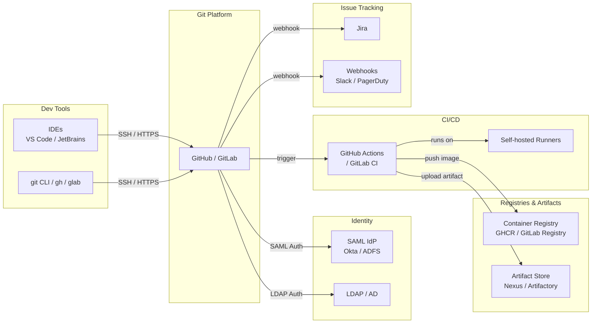

# Git — Integrations


<div class="kb-summary">
This page covers how Git platforms (GitHub, GitLab) integrate with CI/CD pipelines, issue trackers, identity providers, container registries, and developer tooling.
</div>

---

## CI/CD Integration

### GitHub Actions

GitHub Actions is natively triggered by Git events via `.github/workflows/*.yml`.

```yaml
# .github/workflows/ci.yml
name: CI

on:
  push:
    branches: ["main", "release/**"]
  pull_request:
    branches: ["main"]

jobs:
  build:
    runs-on: ubuntu-latest
    steps:
      - uses: actions/checkout@v4
        with:
          fetch-depth: 0          # full history for tools like git describe

      - name: Set up Go
        uses: actions/setup-go@v5
        with:
          go-version: "1.22"

      - name: Build
        run: go build ./...

      - name: Test
        run: go test -race ./...
```
```
┌───────────────────────────────────────── Git — Integrations ──────────────────────────────────────────┐
│                                                                                                       │
│  Git integrations: CI/CD pipelines, issue tracking, IaC tools, and IDE plugins.                       │
│                                                                                                       │
│   ┌──────────────────────────────────────────────┐  ┌─────────────────────────────────────────────┐   │
│   │              CI/CD Integration               │  │                Issue Tracking               │   │
│   │         GitHub Actions: on: push/PR          │  │       Jira: commit message references       │   │
│   │       Jenkins: webhook triggers build        │  │         GitHub Issues: linked via PR        │   │
│   │        Branch policy: require CI pass        │  │           Auto-close: "Fixes #123"          │   │
│   │        Artifact: publish on tag push         │  │       Smart commit: time / transition       │   │
│   └──────────────────────────────────────────────┘  └─────────────────────────────────────────────┘   │
│                                                                                                       │
│    Push events trigger CI; issue keys in commits auto-update tracking systems                         │
│                                                                                                       │
│                          ▼                                                 ▼                          │
│                                                                                                       │
│   ┌──────────────────────────────────────────────┐  ┌─────────────────────────────────────────────┐   │
│   │               IaC / Automation               │  │               IDE Integration               │   │
│   │        Terraform: repo per workspace         │  │         VS Code: Git Graph / GitLens        │   │
│   │          Ansible: playbooks in Git           │  │       JetBrains: built-in VCS tooling       │   │
│   │          GitOps: Argo CD / Flux CD           │  │        Conflict resolution: 3-pane UI       │   │
│   │      Secret scanning: pre-receive hook       │  │         SSH key management per user         │   │
│   └──────────────────────────────────────────────┘  └─────────────────────────────────────────────┘   │
│                                                                                                       │
│  Physical Infrastructure (the hardware everything above runs on):                                     │
│  GitHub/GitLab server · CI runners · Jira/issue tracker · developer workstations                      │
│                                                                                                       │
│  Key terms:                                                                                           │
│                                                                                                       │
│  GitHub Actions = event-driven CI/CD built into GitHub; triggered by push/PR/tag                      │
│  Webhook        = HTTP POST from Git server to CI system on push events                               │
│  Smart commit   = Jira commit syntax: ABC-123 #comment #time 1h #done                                 │
│  GitOps         = Git as single source of truth for infrastructure state                              │
│  Argo CD        = GitOps controller for Kubernetes; syncs repo to cluster state                       │
│  Flux CD        = alternative GitOps operator; push-based reconciliation                              │
│  Pre-receive    = server-side hook; runs before refs update; blocks bad pushes                        │
│  Branch policy  = GitHub/GitLab rule requiring CI + reviews before merge                              │
│  Auto-close     = PR/commit message "Fixes #n" closes issue on merge to default                       │
│  GitLens        = VS Code extension showing inline blame and history                                  │
│  Workspace      = Terraform isolated state environment mapped to a Git branch                         │
│  Artifact       = built output (container, binary) published on tag push to registry                  │
│                                                                                                       │
└───────────────────────────────────────────────────────────────────────────────────────────────────────┘
```
```

Predefined CI/CD variables:

| Variable | Value |
|----------|-------|
| `CI_COMMIT_SHA` | Full commit SHA |
| `CI_COMMIT_REF_NAME` | Branch or tag name |
| `CI_PROJECT_PATH` | `namespace/project` |
| `CI_REGISTRY` | GitLab container registry hostname |
| `CI_PIPELINE_SOURCE` | How the pipeline was triggered |
| `CI_MERGE_REQUEST_IID` | MR number (only in MR pipelines) |

---

## Jira Integration

### GitHub — Jira Smart Commits

Reference Jira issues in commit messages; the GitHub for Jira app updates the issue automatically.

```yaml
git commit -m "PROJ-123 Add retry logic for payment API

- Exponential backoff with 3 retries
- PROJ-123 #comment Fixed the race condition
- PROJ-123 #time 2h"
```

Smart commit commands:

| Syntax | Action |
|--------|--------|
| `PROJ-123` | Links commit to issue |
| `PROJ-123 #comment <text>` | Adds comment to issue |
| `PROJ-123 #time <Xh Ym>` | Logs work time |
| `PROJ-123 #transition <status>` | Transitions workflow state |

### GitLab — Jira Integration Setup

```yaml
# gitlab.rb (Omnibus) — system-wide Jira configuration
# Or configure per-project: Settings > Integrations > Jira

# Fields required in the UI:
# URL: https://yourcompany.atlassian.net
# Username: service-account@company.com
# Password/Token: <Jira API token>
# Transition IDs: 31 (In Progress), 41 (Done)
```

```bash
# Verify integration via GitLab API
curl -s --header "PRIVATE-TOKEN: $GITLAB_TOKEN" \
  "https://gitlab.example.com/api/v4/projects/:id/integrations/jira"
```

---

## Webhook Configuration

Webhooks deliver HTTP POST payloads to external services on Git events.

### GitHub Webhook

```bash
# Create webhook via API
curl -X POST \
  -H "Authorization: Bearer $GITHUB_TOKEN" \
  -H "Accept: application/vnd.github+json" \
  https://api.github.com/repos/ORG/REPO/hooks \
  -d '{
    "name": "web",
    "active": true,
    "events": ["push", "pull_request", "release"],
    "config": {
      "url": "https://hooks.example.com/github",
      "content_type": "json",
      "secret": "'"$WEBHOOK_SECRET"'",
      "insecure_ssl": "0"
    }
  }'
```

### GitLab Webhook

```bash
# Create project webhook via API
curl -X POST \
  --header "PRIVATE-TOKEN: $GITLAB_TOKEN" \
  --header "Content-Type: application/json" \
  "https://gitlab.example.com/api/v4/projects/:id/hooks" \
  --data '{
    "url": "https://hooks.example.com/gitlab",
    "push_events": true,
    "merge_requests_events": true,
    "pipeline_events": true,
    "token": "'"$WEBHOOK_SECRET"'",
    "enable_ssl_verification": true
  }'
```

### Payload Verification (HMAC-SHA256)

```bash
# Bash — verify GitHub webhook signature
verify_signature() {
  local payload="$1"
  local signature="$2"        # X-Hub-Signature-256 header value
  local secret="$WEBHOOK_SECRET"

  expected="sha256=$(echo -n "$payload" | openssl dgst -sha256 -hmac "$secret" | awk '{print $2}')"
  [ "$signature" = "$expected" ]
}
```

---

## LDAP / SSO Authentication

### GitLab LDAP (Omnibus)

```ruby
# /etc/gitlab/gitlab.rb
gitlab_rails['ldap_enabled'] = true
gitlab_rails['prevent_ldap_sign_in'] = false

gitlab_rails['ldap_servers'] = {
  'main' => {
    'label' => 'Corporate AD',
    'host' =>  'ldap.example.com',
    'port' => 636,
    'uid' => 'sAMAccountName',
    'bind_dn' => 'CN=gitlab-svc,OU=Service Accounts,DC=example,DC=com',
    'password' => ENV['LDAP_BIND_PASSWORD'],
    'encryption' => 'simple_tls',   # 'start_tls' or 'plain'
    'verify_certificates' => true,
    'base' => 'OU=Users,DC=example,DC=com',
    'user_filter' => '(memberOf=CN=GitLab-Users,OU=Groups,DC=example,DC=com)',
    'attributes' => {
      'username' => ['uid', 'userid', 'sAMAccountName'],
      'email'    => ['mail', 'email', 'userPrincipalName'],
      'name'     => 'cn',
    },
    'group_base' => 'OU=Groups,DC=example,DC=com',
    'admin_group' => 'GitLab-Admins',
    'sync_ssh_keys' => false,
  }
}
```

```bash
# Test LDAP configuration
sudo gitlab-rake gitlab:ldap:check

# Force LDAP group sync
sudo gitlab-rake gitlab:ldap:group_sync
```

### SAML / SSO (GitLab)

```ruby
# /etc/gitlab/gitlab.rb
gitlab_rails['omniauth_providers'] = [
  {
    name: "saml",
    label: "Company SSO",
    args: {
      assertion_consumer_service_url: "https://gitlab.example.com/users/auth/saml/callback",
      idp_cert_fingerprint: "AB:CD:EF:...",
      idp_sso_target_url: "https://idp.example.com/sso/saml",
      issuer: "https://gitlab.example.com",
      name_identifier_format: "urn:oasis:names:tc:SAML:2.0:nameid-format:persistent",
      attribute_statements: {
        email: ["http://schemas.xmlsoap.org/ws/2005/05/identity/claims/emailaddress"],
        name:  ["http://schemas.xmlsoap.org/ws/2005/05/identity/claims/name"],
        groups: ["Groups"]
      }
    }
  }
]
```

### GitHub Enterprise SAML

Configure under **Settings → Authentication security → SAML single sign-on**:

| Field | Value |
|-------|-------|
| Sign on URL | `https://idp.example.com/sso/saml` |
| Issuer | `https://idp.example.com` |
| Public certificate | IdP signing certificate (PEM) |
| Signature method | `RSA-SHA256` |
| Digest method | `SHA256` |

---

## Container Registry Integration

### GitLab Container Registry

```bash
# Authenticate
docker login registry.gitlab.example.com -u $USER -p $GITLAB_TOKEN

# Push image using CI variables
docker build -t "$CI_REGISTRY_IMAGE/$CI_COMMIT_REF_SLUG:$CI_COMMIT_SHORT_SHA" .
docker push "$CI_REGISTRY_IMAGE/$CI_COMMIT_REF_SLUG:$CI_COMMIT_SHORT_SHA"

# Tag latest
docker tag "$CI_REGISTRY_IMAGE/$CI_COMMIT_REF_SLUG:$CI_COMMIT_SHORT_SHA" \
           "$CI_REGISTRY_IMAGE/$CI_COMMIT_REF_SLUG:latest"
docker push "$CI_REGISTRY_IMAGE/$CI_COMMIT_REF_SLUG:latest"

# List tags via API
curl -s --header "PRIVATE-TOKEN: $GITLAB_TOKEN" \
  "https://gitlab.example.com/api/v4/projects/:id/registry/repositories" | jq .
```

### GitHub Container Registry (GHCR)

```bash
# Authenticate
echo "$GITHUB_TOKEN" | docker login ghcr.io -u "$GITHUB_ACTOR" --password-stdin

# Push
docker build -t ghcr.io/$GITHUB_REPOSITORY:$GITHUB_SHA .
docker push ghcr.io/$GITHUB_REPOSITORY:$GITHUB_SHA
```

---

## IDE Integration Overview

| IDE | Git Integration | Notes |
|-----|----------------|-------|
| **VS Code** | Built-in Source Control panel + GitLens extension | GitLens adds blame, history, PR review in-editor |
| **JetBrains (IntelliJ / GoLand / PyCharm)** | Built-in VCS (Git) tool window | Branch graph, interactive rebase, conflict resolution UI |
| **Vim / Neovim** | `vim-fugitive`, `gitsigns.nvim`, `neogit` | Fugitive is the de-facto standard; `:Git blame`, `:GBrowse` |
| **Emacs** | `magit` | Full Git porcelain inside Emacs; widely regarded as best-in-class |
| **Eclipse** | EGit plugin | Standard for Java enterprise shops |

### VS Code Settings for Large Repos

```jsonc
// .vscode/settings.json
{
  "git.autofetch": true,
  "git.autofetchPeriod": 180,
  "git.pruneOnFetch": true,
  "git.decorations.enabled": true,
  "git.openRepositoryInParentFolders": "always",
  // Disable for very large monorepos:
  "git.detectSubmodules": false,
  "search.followSymlinks": false
}
```

---

## Integration Architecture Summary


