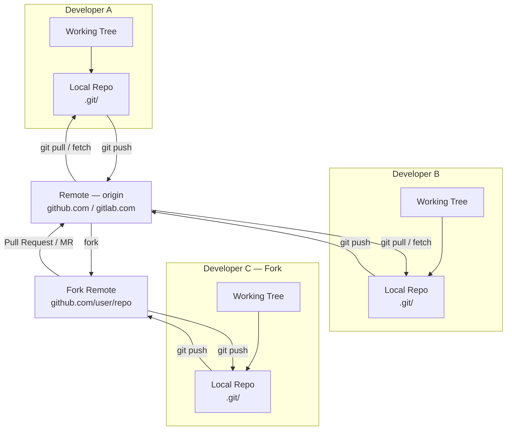
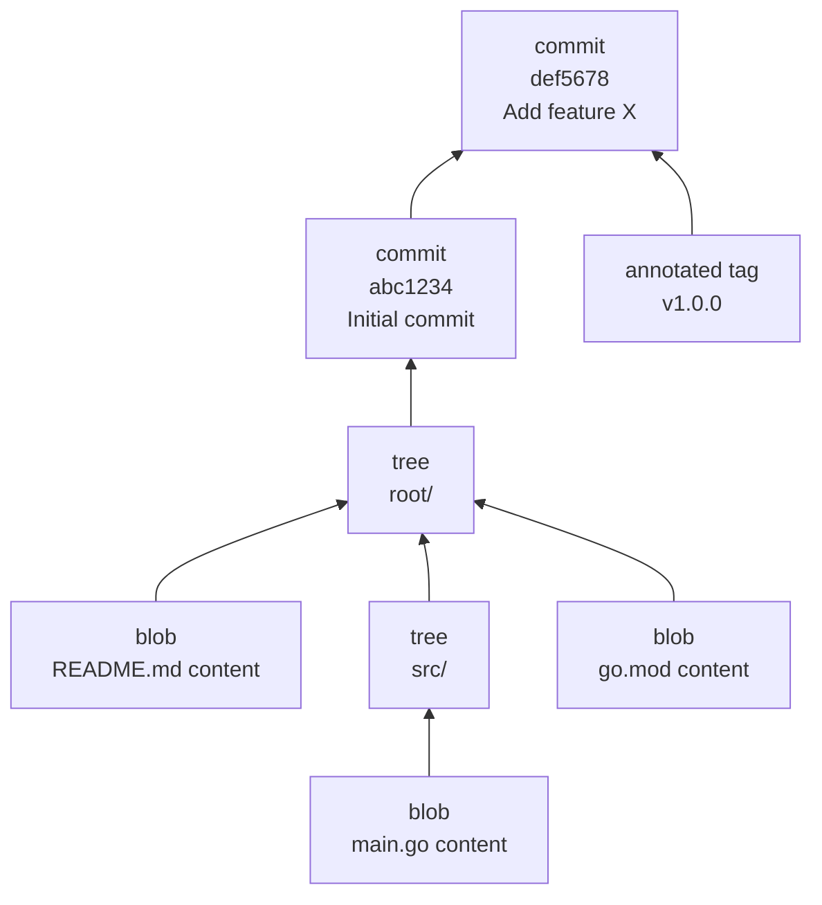
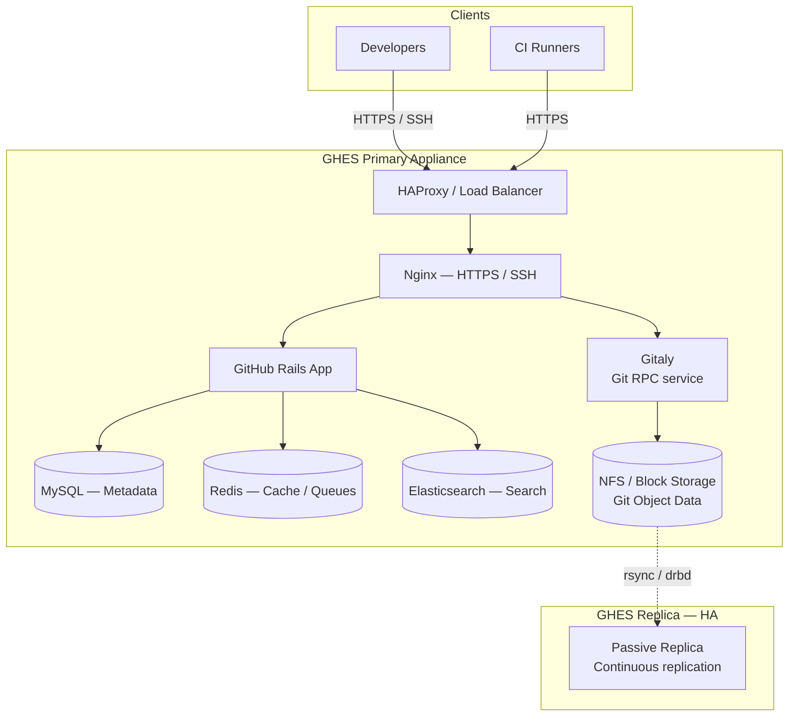
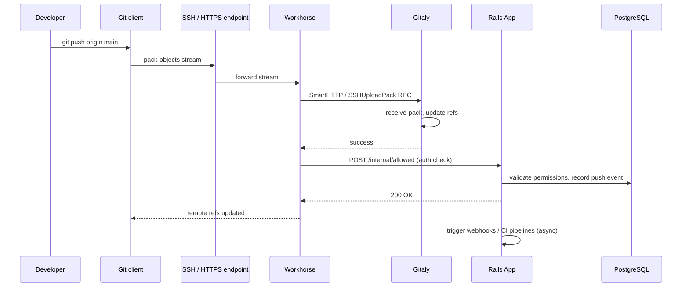

# Git — Architecture Overview

Git is a distributed version control system where every working copy is a full repository with complete history. This page covers the object model, ref system, and enterprise platform topology.

---

## Distributed Model

Unlike centralised VCS tools, every Git clone contains the entire repository history. There is no single "canonical" server — by convention teams designate one (GitHub, GitLab, Bitbucket) as the integration point.



### Key Concepts

| Term | Description |
|------|-------------|
| **Working Tree** | Files currently checked out on disk |
| **Index / Staging Area** | Snapshot being prepared for the next commit |
| **Local Repository** | `.git/` directory containing the full object database |
| **Remote** | Named reference to another repository URL (`origin`, `upstream`) |
| **Fork** | Server-side clone owned by a different user/org |

---

## Git Object Model

Everything stored by Git is content-addressed — identified by the SHA-1 (or SHA-256 in newer repos) hash of its content.



### Object Types

| Object | Description | Storage Key |
|--------|-------------|-------------|
| **blob** | Raw file content; no filename or path | `SHA1(content)` |
| **tree** | Directory listing — maps names to blob/tree SHAs and modes | `SHA1(tree_data)` |
| **commit** | Points to a tree; records author, committer, message, parent commits | `SHA1(commit_data)` |
| **tag** | Annotated reference to another object (usually a commit); stores tagger and message | `SHA1(tag_data)` |

Objects are stored in `.git/objects/` either as loose files or packed into `.git/objects/pack/`.

```bash
# Inspect any object by type
git cat-file -t <sha>     # print type
git cat-file -p <sha>     # pretty-print content

# List all objects in a pack
git verify-pack -v .git/objects/pack/*.idx | sort -k3 -n | tail -20

# Show tree for HEAD
git ls-tree -r --name-only HEAD
```

---

## Refs and Branches

Refs are human-readable names that resolve to object SHAs. They live under `.git/refs/`.

```
.git/
├── HEAD                    → ref: refs/heads/main
├── refs/
│   ├── heads/              → local branches
│   │   ├── main            → abc1234...
│   │   └── feature/xyz     → def5678...
│   ├── remotes/
│   │   └── origin/
│   │       ├── main        → abc1234...
│   │       └── HEAD        → ref: refs/remotes/origin/main
│   └── tags/
│       └── v1.0.0          → annotated tag SHA
└── packed-refs             → bulk storage for many refs
```

### Special Refs

| Ref | Purpose |
|-----|---------|
| `HEAD` | Currently checked-out commit or branch pointer |
| `ORIG_HEAD` | Previous HEAD before a merge/rebase/reset |
| `MERGE_HEAD` | The commit being merged in |
| `FETCH_HEAD` | Last fetched commit from a remote |
| `CHERRY_PICK_HEAD` | Commit being cherry-picked |

```bash
# Show where HEAD points
cat .git/HEAD
git symbolic-ref HEAD         # if on a branch
git rev-parse HEAD            # resolve to SHA

# List all refs
git show-ref
git for-each-ref --format='%(refname) %(objectname:short) %(subject)' refs/heads/
```

---

## GitHub Enterprise / GitLab Self-Managed Architecture

### GitHub Enterprise Server (GHES)

GHES runs as a single appliance VM or in a High-Availability pair.



### GitLab Self-Managed (Omnibus)

```mermaid
graph TD
    subgraph "GitLab Server"
        NGINX2[Nginx]
        PUMA[Puma — Rails Web/API]
        SIDEKIQ[Sidekiq — Background Jobs]
        GITALY2[Gitaly]
        WORKHORSE[GitLab Workhorse<br/>Large uploads / Git HTTP]
        PG[(PostgreSQL)]
        REDIS2[(Redis)]
        MINIO[(MinIO / Object Storage<br/>LFS, artifacts, uploads)]
        REPOS2[/var/opt/gitlab/git-data]
    end

    subgraph "GitLab Geo — DR Site"
        GEO[Geo Secondary<br/>Read replica]
    end

    CLIENTS[Clients] -->|HTTPS / SSH| NGINX2
    NGINX2 --> WORKHORSE
    WORKHORSE --> PUMA
    WORKHORSE --> GITALY2
    PUMA --> PG
    PUMA --> REDIS2
    SIDEKIQ --> PG
    SIDEKIQ --> REDIS2
    GITALY2 --> REPOS2
    REPOS2 -.->|Geo replication| GEO
    MINIO -.->|object sync| GEO
```

### Key Server Components

| Component | Role |
|-----------|------|
| **Gitaly** | gRPC service that owns all Git repository access; no direct disk access from other services |
| **Puma / Rails** | Web application, API, and business logic |
| **Sidekiq** | Asynchronous job processing (webhooks, emails, CI scheduling) |
| **Workhorse** | Reverse proxy for large payloads (git push/pull, uploads); offloads from Rails |
| **PostgreSQL** | Relational metadata (users, projects, MRs, CI records) |
| **Redis** | Session cache, queues, rate limiting, ActionCable |
| **Elasticsearch / Zoekt** | Full-text code search |
| **MinIO / S3** | Object storage for LFS, CI artifacts, container registry layers |

---

## Data Flow — git push



---

## Storage Layout

```bash
# GitLab on-disk layout (default Omnibus)
/var/opt/gitlab/
├── git-data/
│   └── repositories/
│       └── <namespace>/
│           └── <project>.git/          # bare repo
│               ├── objects/
│               ├── refs/
│               ├── config
│               └── hooks/
├── gitlab-rails/
│   └── uploads/
└── gitlab-workhorse/

# GHES on-disk layout
/data/
├── repositories/
│   └── <org>/<repo>.git/
└── git-hooks/
```
