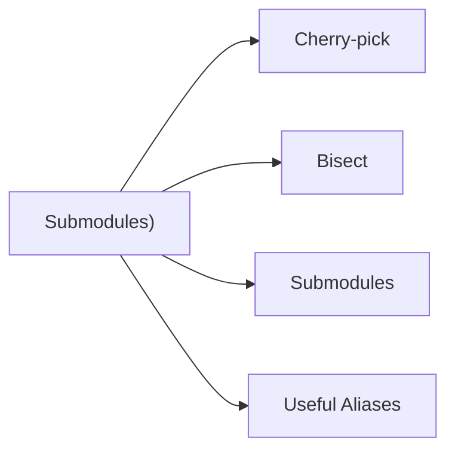

# Advanced (Cherry-pick, Bisect, Submodules)

> Part of the Git CLI Reference.



---

## Cherry-pick

```bash
git cherry-pick <commit>
git cherry-pick <commit1>..<commit2>
git cherry-pick --no-commit <commit>
git cherry-pick --abort
```

---

## Bisect

```bash
git bisect start
git bisect bad                  # Current commit is bad
git bisect good <commit>        # Last known good commit
git bisect good / git bisect bad
git bisect reset
```

---

## Submodules

```bash
git submodule add <url> <path>
git submodule update --init --recursive
git submodule foreach git pull
```

---

## Useful Aliases

```bash
git config --global alias.lg "log --oneline --graph --all --decorate"
git config --global alias.undo "reset --soft HEAD~1"
git config --global alias.unstage "restore --staged"
git config --global alias.aliases "config --get-regexp alias"
```
