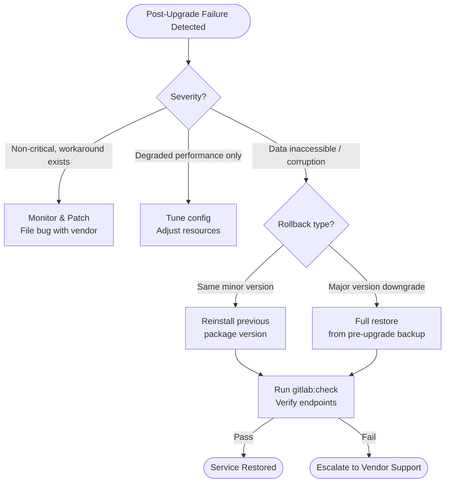

# Git — Install & Upgrade

This page covers Git client installation and upgrades across operating systems, GitLab server upgrade procedures (Omnibus and Docker), GitHub Enterprise Server upgrades, pre-upgrade checklists, and rollback steps.

---

## Git Client Installation and Upgrade

### Linux (Debian / Ubuntu)

```bash
# Install from distro repo
sudo apt-get update && sudo apt-get install -y git

# Check installed version
git --version

# Install latest stable via PPA (Ubuntu)
sudo add-apt-repository ppa:git-core/ppa -y
sudo apt-get update
sudo apt-get install -y git

# Upgrade only
sudo apt-get install --only-upgrade git
```
┌────────────────────────────────────── Git — Install and Upgrade ──────────────────────────────────────┐
│                                                                                                       │
│  Git client and server installation, upgrade paths, and self-hosted platform setup.                   │
│                                                                                                       │
│   ┌──────────────────────────────────────────────┐  ┌─────────────────────────────────────────────┐   │
│   │              Git Client Install              │  │            GitHub / GitLab Server           │   │
│   │          Linux: apt/yum install git          │  │       GitHub Enterprise: VM appliance       │   │
│   │           macOS: brew install git            │  │       GitLab: omnibus package + config      │   │
│   │        Windows: git-scm.com installer        │  │      Gitea: single binary; lightweight      │   │
│   │            Verify: git --version             │  │            Backup before upgrade            │   │
│   └──────────────────────────────────────────────┘  └─────────────────────────────────────────────┘   │
│                                                                                                       │
│    Client upgrade is non-breaking; server upgrade requires maintenance window                         │
│                                                                                                       │
│                          ▼                                                 ▼                          │
│                                                                                                       │
│   ┌──────────────────────────────────────────────┐  ┌─────────────────────────────────────────────┐   │
│   │              Git Configuration               │  │              Post-Install Steps             │   │
│   │        git config --global user.name         │  │         Generate SSH key: ssh-keygen        │   │
│   │        git config --global user.email        │  │         Add pub key to GitHub/GitLab        │   │
│   │       git config --global core.editor        │  │          Test: git clone <ssh-url>          │   │
│   │       git config --global pull.rebase        │  │           Set default branch: main          │   │
│   └──────────────────────────────────────────────┘  └─────────────────────────────────────────────┘   │
│                                                                                                       │
│  Physical Infrastructure (the hardware everything above runs on):                                     │
│  Developer workstations · self-hosted Git server VM · package repositories                            │
│                                                                                                       │
│  Key terms:                                                                                           │
│                                                                                                       │
│  git-scm.com    = official Git download site for Windows installer                                    │
│  omnibus        = GitLab all-in-one package including Nginx, Postgres, Redis                          │
│  Gitea          = lightweight self-hosted Git service; single Go binary                               │
│  GHE            = GitHub Enterprise Server; VM-based on-prem deployment                               │
│  ssh-keygen     = generates RSA/Ed25519 key pair for SSH authentication                               │
│  pull.rebase    = config to rebase instead of merge on git pull                                       │
│  core.editor    = sets preferred text editor for commit messages                                      │
│  Maintenance window= server upgrade downtime; plan for hook + webhook reconnect                       │
│  Default branch = initialises as main; change default in server settings                              │
│  Ed25519        = modern elliptic-curve SSH key type; preferred over RSA                              │
│  git config     = reads/writes ~/.gitconfig (global) or .git/config (repo)                            │
│  Appliance      = GitHub Enterprise is a VM image (OVA/AMI); managed internally                       │
│                                                                                                       │
└───────────────────────────────────────────────────────────────────────────────────────────────────────┘
```

### macOS

```bash
# Homebrew (recommended)
brew install git          # install
brew upgrade git          # upgrade

# Verify Homebrew git is on PATH ahead of Apple's git
which git                 # should be /usr/local/bin/git or /opt/homebrew/bin/git
git --version

# Xcode Command Line Tools (Apple's version — usually older)
xcode-select --install
```

### Windows

| Method | Command | Notes |
|--------|---------|-------|
| **Git for Windows** (recommended) | Download from git-scm.com | Includes bash, credential manager |
| **winget** | `winget install --id Git.Git -e` | Silent install |
| **Chocolatey** | `choco install git` / `choco upgrade git` | CI-friendly |
| **Scoop** | `scoop install git` / `scoop update git` | User-level, no admin |

```powershell
# Upgrade via winget
winget upgrade --id Git.Git -e --include-unknown

# Check version
git --version
```

---

## Pre-Upgrade Checklist (Any Platform)

Complete **all** items before beginning any upgrade.

- [ ] **Read the release notes** — check for breaking changes, deprecations, and required configuration changes
- [ ] **Check compatibility matrix** — confirm OS version, PostgreSQL, Redis, and Gitaly versions are supported
- [ ] **Notify users** — send maintenance window notification (recommend 15–30 min advance notice for minor, 2h for major)
- [ ] **Create full backup** — `gitlab-backup create` / `ghe-backup` and verify it completes successfully
- [ ] **Backup configuration** — `/etc/gitlab/gitlab.rb` and `gitlab-secrets.json`
- [ ] **Check disk space** — upgrade packages and new Gitaly version require headroom; ensure > 20% free
- [ ] **Review migration steps** — GitLab major versions require sequential upgrade path (e.g., 15.x → 16.0 → 16.11 → 17.x)
- [ ] **Test rollback procedure** — confirm snapshot or restore path is available
- [ ] **Check CI pipeline queue** — drain or pause runners to avoid failed jobs during restart
- [ ] **Verify current version is healthy** — run `gitlab-rake gitlab:check` before upgrade

---

## GitLab Upgrade — Omnibus Package

### Minor / Patch Upgrade (e.g., 17.0.1 → 17.0.3)

```bash
# 1. Back up
sudo gitlab-backup create CRON=1
sudo cp /etc/gitlab/gitlab-secrets.json /secure/
sudo cp /etc/gitlab/gitlab.rb /secure/

# 2. Update package (Ubuntu/Debian)
curl -s https://packages.gitlab.com/install/repositories/gitlab/gitlab-ee/script.deb.sh | sudo bash
sudo apt-get update
sudo apt-get install -y gitlab-ee=17.0.3-ee.0

# 3. Reconfigure and restart
sudo gitlab-ctl reconfigure
sudo gitlab-ctl restart

# 4. Run post-upgrade checks
sudo gitlab-rake gitlab:check SANITIZE=true
sudo gitlab-rake db:migrate:status | tail -5
curl -sf https://gitlab.example.com/-/readiness?all=1 | jq .
```

### Major Version Upgrade (Sequential Path Required)

GitLab requires upgrading through specific stop versions. Check the [GitLab upgrade paths](https://docs.gitlab.com/ee/update/index.html#upgrade-paths) documentation.

Example: 15.4 → 17.1 requires:

```text
15.4 → 15.11.x → 16.0.x → 16.3.x → 16.11.x → 17.1.x
```

```bash
# Stop at each required version, run migrations, verify, then continue

# Upgrade to 15.11 (last minor before 16)
sudo apt-get install -y gitlab-ee=15.11.13-ee.0
sudo gitlab-ctl reconfigure
sudo gitlab-rake db:migrate:status
sudo gitlab-rake gitlab:check SANITIZE=true

# Wait for background migrations to complete before upgrading to 16.0
sudo gitlab-rails runner "Gitlab::Database::BackgroundMigration::BatchedMigration.where(status: [:active, :queued]).count"
# Must return 0 before proceeding

# Upgrade to 16.0
sudo apt-get install -y gitlab-ee=16.0.9-ee.0
# ... repeat for each stop version
```

### Check Running Migrations

```bash
# Check for in-progress background migrations (must be 0 before major upgrade)
sudo gitlab-rails runner "
  count = Gitlab::Database::BackgroundMigration::BatchedMigration
            .where(status: [:active, :queued]).count
  puts \"Pending background migrations: #{count}\"
"

# Force-run pending migrations (if needed)
sudo gitlab-rake db:migrate
```

---

## GitLab Upgrade — Docker / Kubernetes

### Docker Compose

```yaml
# docker-compose.yml (excerpt)
services:
  gitlab:
    image: gitlab/gitlab-ee:17.0.3-ee.0   # pin the version
    ...
```

```bash
# Pull new image
docker compose pull gitlab

# Stop, upgrade, start
docker compose down gitlab
docker compose up -d gitlab

# Check logs
docker compose logs -f gitlab

# Verify
docker exec -it gitlab gitlab-rake gitlab:check SANITIZE=true
```

### Helm (GitLab on Kubernetes)

```bash
# Add / update GitLab Helm repo
helm repo add gitlab https://charts.gitlab.io
helm repo update

# Check current deployed chart version
helm list -n gitlab

# Upgrade (always review values diff first)
helm diff upgrade gitlab gitlab/gitlab \
  --namespace gitlab \
  --version 8.0.3 \
  -f values.yaml

helm upgrade gitlab gitlab/gitlab \
  --namespace gitlab \
  --version 8.0.3 \
  -f values.yaml \
  --timeout 600s \
  --wait

# Monitor rollout
kubectl rollout status deployment/gitlab-webservice -n gitlab
kubectl rollout status deployment/gitlab-sidekiq-all-in-1-v2 -n gitlab
```

---

## GitHub Enterprise Server Upgrade

GHES upgrades are applied as `.pkg` upgrade packages via the Management Console or the admin SSH interface.

### Pre-Upgrade Steps (GHES)

```bash
# 1. Enable maintenance mode
curl -X POST \
  -H "Authorization: Bearer $GHES_TOKEN" \
  "https://github.example.com/api/v3/maintenance" \
  -d '{"maintenance": {"enabled": true, "message": "Upgrading to 3.13"}}'

# 2. Verify maintenance mode is active
curl -s "https://github.example.com/api/v3/maintenance" \
  -H "Authorization: Bearer $GHES_TOKEN" | jq .

# 3. Take snapshot backup
/opt/github-backup-utils/bin/ghe-backup
```

### Apply Upgrade Package

```bash
# Upload upgrade package to appliance
scp -P 122 ghes-3.13.0.pkg admin@github.example.com:

# Apply via SSH
ssh -p 122 admin@github.example.com
ghe-upgrade /home/admin/ghes-3.13.0.pkg

# Monitor progress (takes 15–45 minutes)
# The appliance reboots automatically during upgrade

# After reboot — disable maintenance mode
curl -X POST \
  -H "Authorization: Bearer $GHES_TOKEN" \
  "https://github.example.com/api/v3/maintenance" \
  -d '{"maintenance": {"enabled": false}}'

# Verify version
curl -s "https://github.example.com/api/v3/meta" \
  -H "Authorization: Bearer $GHES_TOKEN" | jq .installed_version
```

### GHES HA Upgrade Sequence

For High-Availability pairs, upgrade the replica first, then promote/fail over:

```bash
# 1. Upgrade replica
ssh -p 122 admin@github-replica.example.com "ghe-upgrade /home/admin/ghes-3.13.0.pkg"

# 2. Failover to replica (replica becomes primary)
ssh -p 122 admin@github-replica.example.com "ghe-repl-promote"

# 3. Upgrade old primary (now replica)
ssh -p 122 admin@github-primary.example.com "ghe-upgrade /home/admin/ghes-3.13.0.pkg"

# 4. Re-establish replication
ssh -p 122 admin@github-primary.example.com "ghe-repl-setup github-replica.example.com"
ssh -p 122 admin@github-primary.example.com "ghe-repl-start"

# 5. Verify replication
ssh -p 122 admin@github-primary.example.com "ghe-repl-status"
```

---

## Rollback Steps

### GitLab Rollback (Omnibus)

GitLab does not support automatic downgrade. Rollback requires restoring from backup.

```bash
# 1. Stop GitLab
sudo gitlab-ctl stop

# 2. Install previous package version
sudo apt-get install -y gitlab-ee=<previous-version>

# 3. Restore database from backup
sudo gitlab-backup restore BACKUP=<timestamp_label>

# 4. Restore configuration
sudo cp /secure/gitlab-secrets.json /etc/gitlab/
sudo cp /secure/gitlab.rb /etc/gitlab/

# 5. Reconfigure and restart
sudo gitlab-ctl reconfigure
sudo gitlab-ctl restart

# 6. Verify
sudo gitlab-rake gitlab:check SANITIZE=true
```

### GHES Rollback

```bash
# GHES supports rollback to previous upgrade package if within the same minor version
ssh -p 122 admin@github.example.com "ghe-upgrade --allow-downgrade /home/admin/ghes-3.12.5.pkg"

# For major version rollback — restore from backup-utils snapshot
/opt/github-backup-utils/bin/ghe-restore -s /backup/ghes/<snapshot-dir> github-restored.example.com
```

### Rollback Decision Matrix



---

## Version Support Matrix

| GitLab Version | Support End | PostgreSQL | Ruby |
|----------------|-------------|------------|------|
| 17.x | ~2025-05 | 14, 15, 16 | 3.2 |
| 16.x | ~2024-09 | 13, 14, 15 | 3.1 |
| 15.x | EOL | 12, 13, 14 | 2.7 |

| GHES Version | Support End | Notes |
|--------------|-------------|-------|
| 3.13 | ~2025-06 | Current |
| 3.12 | ~2025-03 | Active |
| 3.11 | ~2024-12 | EOL soon |
