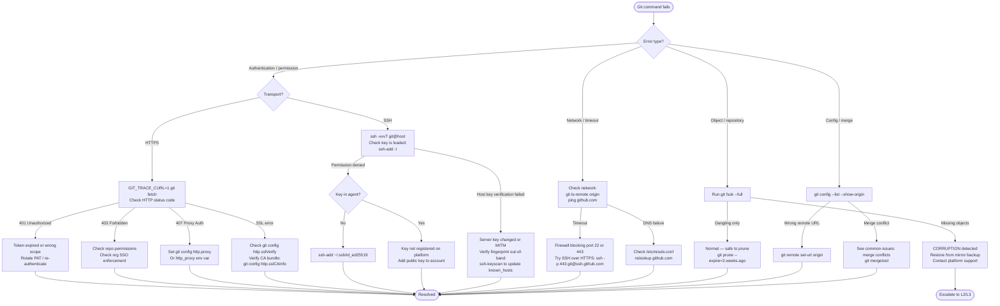

# Git — Diagnostics


<div class="kb-summary">
Systematic diagnostic techniques for troubleshooting Git client, server, and network issues. Covers debug environment variables, SSH tracing, reflog recovery, and a structured diagnostic flowchart.
</div>

---

## Git Debug Environment Variables

Git exposes granular tracing through environment variables. Set them before the `git` command; they write to stderr by default.

| Variable | What it traces |
|----------|---------------|
| `GIT_TRACE` | General Git operations, alias expansion, external command execution |
| `GIT_TRACE_PACK_ACCESS` | Pack file access patterns |
| `GIT_TRACE_PACKET` | Packet-level protocol communication with remotes |
| `GIT_TRACE_PERFORMANCE` | Timing of internal Git operations |
| `GIT_TRACE_SETUP` | Environment and config resolution |
| `GIT_TRACE_CURL` | Full HTTP request/response headers and body |
| `GIT_CURL_VERBOSE` | Same as `GIT_TRACE_CURL=1` (legacy) |
| `GIT_SSH_COMMAND` | Override SSH binary (useful for debugging) |
| `GIT_TRACE_REFS` | Reference resolution and update operations |

### Setting Trace Levels

```bash
# Output to stderr (default)
GIT_TRACE=1 git fetch origin

# Output to a log file
GIT_TRACE=/tmp/git-trace.log git push origin main
cat /tmp/git-trace.log

# Enable multiple traces simultaneously
GIT_TRACE=1 GIT_TRACE_PERFORMANCE=1 GIT_TRACE_SETUP=1 git status

# Performance profiling — identify slow operations
GIT_TRACE_PERFORMANCE=1 git log --oneline -100 2>&1 | grep "performance"
```
┌────────────────────────────────────────── Git — Diagnostics ──────────────────────────────────────────┐
│                                                                                                       │
│  Diagnostic tools for Git: verbose output, trace logs, fsck, and performance profiling.               │
│                                                                                                       │
│   ┌──────────────────────────────────────────────┐  ┌─────────────────────────────────────────────┐   │
│   │            Verbose / Trace Flags             │  │             Object Store Checks             │   │
│   │            GIT_TRACE=1 git <cmd>             │  │              git fsck [--full]              │   │
│   │       GIT_TRACE_PACKET=1: proto debug        │  │            git count-objects -vH            │   │
│   │        GIT_CURL_VERBOSE=1: HTTP trace        │  │  git verify-pack -v .git/objects/pack/*.idx │   │
│   │       GIT_SSH_COMMAND: custom SSH opts       │  │    git cat-file -t/-p <sha>: inspect obj    │   │
│   └──────────────────────────────────────────────┘  └─────────────────────────────────────────────┘   │
│                                                                                                       │
│    Trace env vars show protocol-level detail; fsck validates object integrity                         │
│                                                                                                       │
│                          ▼                                                 ▼                          │
│                                                                                                       │
│   ┌──────────────────────────────────────────────┐  ┌─────────────────────────────────────────────┐   │
│   │               History Analysis               │  │            Performance Profiling            │   │
│   │       git log --all --oneline --graph        │  │         git clone --depth 1: measure        │   │
│   │          git blame -L 10,20 <file>           │  │        git maintenance run --task gc        │   │
│   │       git bisect: find regression SHA        │  │      Large file finder: git lfs migrate     │   │
│   │     git shortlog -sn: contributor count      │  │         git-sizer: repo stats report        │   │
│   └──────────────────────────────────────────────┘  └─────────────────────────────────────────────┘   │
│                                                                                                       │
│  Physical Infrastructure (the hardware everything above runs on):                                     │
│  Developer workstation · terminal · Git remote · pack file storage                                    │
│                                                                                                       │
│  Key terms:                                                                                           │
│                                                                                                       │
│  GIT_TRACE       = env var enabling debug trace output for git commands                               │
│  GIT_TRACE_PACKET= logs pack protocol negotiation; useful for clone/fetch issues                      │
│  GIT_CURL_VERBOSE= logs HTTP request/response headers for HTTPS debugging                             │
│  git fsck        = file system check; verifies object store consistency                               │
│  cat-file -t/-p  = -t shows object type, -p pretty-prints content                                     │
│  verify-pack     = lists all objects in a pack file with their types and sizes                        │
│  git bisect      = binary search commits; mark good/bad to isolate regression                         │
│  git blame       = shows last commit touching each line; -L limits to line range                      │
│  git-sizer       = GitHub tool generating report on repo blob/tree/commit sizes                       │
│  lfs migrate     = moves large files from history to LFS; rewrites commits                            │
│  git maintenance = modern replacement for git gc; safe background maintenance                         │
│  shortlog -sn    = summary of commits per author sorted by count                                      │
│                                                                                                       │
└───────────────────────────────────────────────────────────────────────────────────────────────────────┘

Example output excerpt:

```text
16:42:01.123456 http.c:678             * Trying 140.82.121.4:443...
16:42:01.234567 http.c:678             * Connected to github.com (140.82.121.4) port 443
16:42:01.345678 http.c:678             * TLSv1.3, TLS handshake, Client hello (1):
16:42:01.456789 http.c:678             > GET /org/repo.git/info/refs?service=git-upload-pack HTTP/2
16:42:01.456790 http.c:678             > Host: github.com
16:42:01.456791 http.c:678             > Authorization: Basic <REDACTED>
16:42:01.567890 http.c:678             < HTTP/2 200
16:42:01.567891 http.c:678             < content-type: application/x-git-upload-pack-advertisement
```

### Stripping Sensitive Data from Trace Logs

```bash
# Git redacts most secrets in traces, but verify before sharing
GIT_TRACE_CURL=1 git fetch 2>&1 | sed 's/Authorization: Basic .*/Authorization: Basic <REDACTED>/'
```

---

## `git remote -v` and `git config --list` Checks

### Remote Configuration

```bash
# Show all remotes with fetch and push URLs
git remote -v
# origin  git@github.com:org/repo.git (fetch)
# origin  git@github.com:org/repo.git (push)
# upstream  git@github.com:upstream-org/repo.git (fetch)
# upstream  git@github.com:upstream-org/repo.git (push)

# Show full remote configuration
git remote show origin

# Test that the remote is reachable and list its refs
git ls-remote origin

# Check if a specific ref exists on the remote
git ls-remote origin refs/heads/main
git ls-remote origin refs/tags/v1.0.0
```

### Configuration Inspection

```bash
# List all effective config (merged: system → global → local → worktree)
git config --list

# Show config with source file for each key
git config --list --show-origin

# Show only local repo config
git config --local --list

# Show only global user config
git config --global --list

# Get a specific key
git config user.email
git config --get remote.origin.url
git config --get core.sshCommand

# Key config items to verify during troubleshooting
git config user.name
git config user.email
git config core.autocrlf
git config http.proxy
git config http.sslVerify
git config credential.helper
git config core.sshCommand
```

### Effective Config Dump for Support

```bash
# Safe config dump — redact secrets before sharing
git config --list --show-origin | grep -v -i "password\|secret\|token\|key"
```

---

## SSH Debugging with `ssh -vvv`

```bash
# Basic verbose SSH test to GitHub
ssh -vT git@github.com

# Triple-verbose for full protocol trace
ssh -vvvT git@github.com

# Test to GitLab
ssh -vvvT git@gitlab.example.com

# Test to GitLab on a non-standard port
ssh -vvvT -p 2222 git@gitlab.example.com
```

### What to Look for in SSH Debug Output

```yaml
# Key being offered
debug1: Offering public key: /Users/user/.ssh/id_ed25519 ED25519
# Platform's response to the offered key:
debug1: Authentications that can continue: publickey
# Successful auth:
debug1: Authentication succeeded (publickey).

# Common failure signatures:
# "Permission denied (publickey)" — key not registered on remote
# "No supported authentication methods available" — server config issue
# "Host key verification failed" — known_hosts mismatch
# "Connection refused" — wrong host/port or firewall block
# "Connection timed out" — firewall or network routing issue
```

### SSH Configuration Diagnostics

```bash
# Check the SSH config being applied
ssh -G git@github.com | grep -E "^(hostname|user|port|identityfile|identitiesonly)"

# List keys currently loaded in the SSH agent
ssh-add -l

# If no agent is running or no keys loaded:
eval "$(ssh-agent -s)"
ssh-add ~/.ssh/id_ed25519

# Test with explicit key (bypass agent)
ssh -i ~/.ssh/id_ed25519 -vT git@github.com

# Check known_hosts
ssh-keygen -F github.com
ssh-keygen -F gitlab.example.com

# Regenerate known_hosts entry if server key changed (after verifying legitimacy)
ssh-keygen -R github.com
ssh-keyscan -H github.com >> ~/.ssh/known_hosts
```

### Override SSH Command for Debugging

```bash
# Use custom SSH flags for a single git command
GIT_SSH_COMMAND="ssh -vvv -i ~/.ssh/id_ed25519" git fetch origin

# Set permanently in repo config for troubleshooting session
git config core.sshCommand "ssh -vvv -i ~/.ssh/id_ed25519"
# Remember to unset when done
git config --unset core.sshCommand
```

---

## Reflog Recovery

The reflog records every position HEAD and branch tips have pointed to for the past 90 days (default). It is the first tool to reach for when work appears to be lost.

```bash
# Show HEAD reflog (most recent first)
git reflog

# Show reflog for a specific branch
git reflog show main

# Show reflog with timestamps
git reflog --format='%C(auto)%h %gd %gs %cr%Creset' | head -30

# Show reflog entries as a graph
git log -g --oneline --graph
```

### Recovery Scenarios

#### Recover a Dropped Commit (`git reset --hard`)

```bash
# See what HEAD was before the reset
git reflog | head -10
# abc1234 HEAD@{0}: reset: moving to HEAD~1
# def5678 HEAD@{1}: commit: Add important feature   <-- this is the lost commit

# Restore it
git cherry-pick def5678
# or create a branch at that point
git branch recover/lost-commit def5678
```

#### Recover a Deleted Branch

```bash
# Find the commit the branch pointed to
git reflog | grep "checkout: moving from deleted-branch"
# or search by branch name
git reflog --all | grep deleted-branch | head -5

# Recreate the branch
git branch recovered-branch <sha-from-reflog>
git switch recovered-branch
```

#### Recover Dropped Stash

```bash
# List all stash entries (including dropped)
git fsck --unreachable | grep commit | awk '{print $3}' | \
  xargs git log --merges --no-walk --oneline

# Apply a recovered stash by SHA
git stash apply <sha>
```

#### Recover from Accidental `git checkout -- <file>` (Working Tree Loss)

```bash
# Unfortunately, git checkout -- <file> discards working tree changes with no reflog entry
# Check if your editor has a local backup (e.g., Vim .swp files, VS Code local history)

# If the content was staged (git add) before checkout:
git fsck --lost-found
ls .git/lost-found/other/   # blobs that were staged but not committed
```

---

## Diagnostic Flowchart



---

## Data to Collect Before Escalating

When opening a support ticket with GitHub/GitLab or escalating internally, collect:

```bash
#!/usr/bin/env bash
# collect-git-diagnostics.sh — run from within the affected repository
OUTPUT_FILE="git-diagnostics-$(date +%Y%m%d-%H%M%S).txt"

{
  echo "=== Git Diagnostics ==="
  echo "Collected: $(date -u)"
  echo ""

  echo "--- Git Version ---"
  git version

  echo ""
  echo "--- Config (sanitized) ---"
  git config --list --show-origin | grep -v -iE "password|secret|token|key"

  echo ""
  echo "--- Remote URLs ---"
  git remote -v

  echo ""
  echo "--- Branch Status ---"
  git branch -vv

  echo ""
  echo "--- Last 10 Reflog Entries ---"
  git reflog -10

  echo ""
  echo "--- Object Count ---"
  git count-objects -vH

  echo ""
  echo "--- SSH Config ---"
  ssh -G git@github.com 2>/dev/null | grep -E "^(hostname|user|port|identityfile)"

  echo ""
  echo "--- SSH Keys in Agent ---"
  ssh-add -l 2>&1

  echo ""
  echo "--- Network: github.com ---"
  curl -sv --max-time 10 https://github.com 2>&1 | head -30

} > "$OUTPUT_FILE" 2>&1

echo "Diagnostics written to: $OUTPUT_FILE"
echo "Review before sharing to ensure no secrets are present."
```
