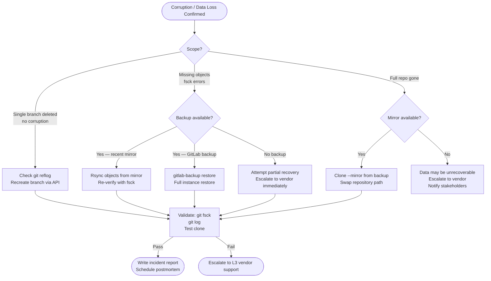

# Git — Escalation

Escalation paths for Git platform incidents, support ticket procedures, data collection requirements, emergency repository recovery, and SLA commitments.

---

## Escalation Matrix


### Tier Responsibilities

| Tier | Team | Scope | Tools |
|------|------|-------|-------|
| **L1** | On-call ops / helpdesk | User access, auth failures, basic clone/push issues, CI pipeline failures | GitLab UI, GitHub UI, `ssh -vT`, `git remote -v`, credential troubleshooting |
| **L2** | Platform / Git engineers | Server-side issues, replication lag, disk exhaustion, Gitaly errors, webhook failures, upgrade issues | `gitlab-ctl`, `gitlab-rake`, Prometheus/Grafana, Gitaly gRPC debugging |
| **L3** | Vendor support / SRE | Appliance bugs, data corruption, pack file recovery, Geo failover, catastrophic outages | Access to vendor engineering, internal tooling, heap dumps |
| **Emergency** | L2 + L3 + on-call lead | Data loss, repository corruption, full platform outage > 30 min | Everything; full access required |

### Escalation Triggers — Do Not Wait

Escalate to L2 immediately (skip L1 timer) for:

- Repository reports missing or corrupted objects (`git fsck` errors)
- GitLab readiness endpoint returns non-`ok` status for > 5 minutes
- Gitaly service is down or returning gRPC errors
- Geo secondary replication lag > 30 minutes
- Disk utilisation on git-data > 90%
- `gitlab-ctl status` shows services in crash-loop
- Any confirmed data loss or accidental destructive operation on a shared branch

---

## SLA Table

| Severity | Definition | Initial Response | Status Update Frequency | Resolution Target |
|----------|-----------|-----------------|------------------------|-------------------|
| **P1 — Critical** | Full platform outage; all users blocked; data loss confirmed or suspected | 15 minutes | Every 30 minutes | 4 hours |
| **P2 — High** | Major feature unavailable (e.g., all pushes failing, CI not triggering); significant user impact | 30 minutes | Every 1 hour | 8 hours |
| **P3 — Medium** | Degraded performance; single project/group affected; workaround available | 2 hours | Every 4 hours | 2 business days |
| **P4 — Low** | Cosmetic issue; documentation; feature request; single-user issue | Next business day | Weekly | Best effort |

### Vendor SLA (GitHub Enterprise / GitLab Ultimate)

| Vendor | Support Tier | P1 Response | P1 Escalation to Engineering |
|--------|-------------|-------------|------------------------------|
| GitHub | Premium / Enterprise | 30 minutes (24/7) | 2 hours |
| GitHub | Standard | 8 hours | 24 hours |
| GitLab | Ultimate (Premium Support) | 30 minutes (24/7) | 4 hours |
| GitLab | Premium | 4 hours (business hours) | 8 hours |

---

## GitHub Support Ticket Format

Open tickets at: **https://support.github.com/contact**

```
Subject: [P1] GHES 3.13 — Gitaly service unavailable, all git operations failing

Environment:
- Product: GitHub Enterprise Server (GHES)
- Version: 3.13.2
- Deployment: VM (VMware vSphere) / AWS EC2 / Azure VM [choose one]
- Instance URL: https://github.example.com
- HA enabled: Yes/No
- Geo enabled: Yes/No

Incident Summary:
[One paragraph description of what is broken, since when, and impact]

Timeline:
- 14:32 UTC — First alert triggered (Gitaly health probe failing)
- 14:35 UTC — Confirmed: git push/pull returning 500 errors for all users
- 14:40 UTC — Attempted: gitlab-ctl restart gitaly — did not resolve
- 14:45 UTC — Escalated to L3 / opening this ticket

Steps Taken:
1. Checked service status: sudo gitlab-ctl status → gitaly: down
2. Restarted Gitaly: sudo gitlab-ctl restart gitaly → fails to start
3. Checked logs: sudo gitlab-ctl tail gitaly → [paste relevant log lines]
4. Disk usage: df -h → git-data at 94% (possible cause)

Diagnostic Data (attached):
- git-diagnostics.txt (output of collect-git-diagnostics.sh)
- gitaly.log (last 500 lines)
- gitlab-rails/production.log (last 500 lines)
- gitlab-ctl status output

Expected Behaviour:
Gitaly service starts and serves git operations normally.

Actual Behaviour:
Gitaly fails to start. All git operations return 500 Internal Server Error.

Business Impact:
All 350 engineers cannot push code. CI/CD pipelines are blocked.
Release scheduled for 17:00 UTC today is at risk.
```

---

## GitLab Support Ticket Format

Open tickets at: **https://support.gitlab.com** (requires valid license)

```
Subject: [P1] GitLab 17.0 — Repository corruption detected on 3 projects

License: EE Ultimate — License ID: xxxxx
Instance URL: https://gitlab.example.com
Version: 17.0.2-ee
Installation type: Omnibus / Docker / Helm [choose one]
OS: Ubuntu 22.04 LTS

Describe the problem:
After running the nightly backup on 2024-05-07, git fsck reports missing blob objects
in 3 repositories. Affected projects: group/project-a, group/project-b, group/project-c.

Error messages (exact):
  error: object file .git/objects/ab/cd1234... is empty
  error: sha1 mismatch 4f3a2b1c...
  missing blob 4f3a2b1c... known as 'src/main.go'

Steps to reproduce:
1. git clone git@gitlab.example.com:group/project-a.git
2. git fsck --full
3. Error output as above

Relevant logs:
[Paste gitaly log excerpt, production.log excerpt]

What we have already tried:
- git fsck --full — confirmed corruption
- git prune — did not resolve
- Checked disk for errors: smartctl -a /dev/sda — no hardware errors reported
- Attempted restore from last night's backup — backup also shows corruption (investigating)

Urgency:
Project-a is on the critical path for a release. Engineers are blocked on that repository.
```

---

## Data to Collect Before Escalating

Collect this data immediately when a P1/P2 incident begins — do not wait until you open the ticket.

```bash
#!/usr/bin/env bash
# collect-platform-diagnostics.sh — run on GitLab server
# Requires: sudo access to gitlab-ctl / gitlab-rake
set -euo pipefail

OUT_DIR="/tmp/gitlab-diag-$(date +%Y%m%d-%H%M%S)"
mkdir -p "$OUT_DIR"

echo "Collecting diagnostics to $OUT_DIR ..."

# Service status
sudo gitlab-ctl status > "$OUT_DIR/ctl-status.txt" 2>&1

# Disk usage
df -h > "$OUT_DIR/disk-usage.txt"
du -sh /var/opt/gitlab/git-data >> "$OUT_DIR/disk-usage.txt"

# Recent logs (last 500 lines each)
for svc in gitaly puma sidekiq postgresql nginx; do
  sudo gitlab-ctl tail "$svc" 2>&1 | head -500 > "$OUT_DIR/log-${svc}.txt" || true
done

# Rails check
sudo gitlab-rake gitlab:check SANITIZE=true > "$OUT_DIR/gitlab-check.txt" 2>&1 || true

# Environment info
sudo gitlab-rake gitlab:env:info > "$OUT_DIR/env-info.txt" 2>&1 || true

# Geo status (if applicable)
sudo gitlab-rake geo:status > "$OUT_DIR/geo-status.txt" 2>&1 || true

# Background migration status
sudo gitlab-rails runner "
  puts Gitlab::Database::BackgroundMigration::BatchedMigration
         .where(status: [:active, :queued])
         .count
" > "$OUT_DIR/bg-migrations.txt" 2>&1 || true

# System resources
top -b -n 1 > "$OUT_DIR/top.txt" 2>&1 || true
free -h > "$OUT_DIR/memory.txt" 2>&1 || true

# Package version
dpkg -l gitlab-ee 2>/dev/null || rpm -q gitlab-ee 2>/dev/null > "$OUT_DIR/version.txt"

# Gitaly gRPC health
/opt/gitlab/embedded/bin/grpc_health_probe \
  -addr=unix:///var/opt/gitlab/gitaly/gitaly.socket \
  > "$OUT_DIR/gitaly-health.txt" 2>&1 || true

# Bundle and archive
tar -czf "${OUT_DIR}.tar.gz" -C "$(dirname $OUT_DIR)" "$(basename $OUT_DIR)"

echo "Diagnostics bundle: ${OUT_DIR}.tar.gz"
echo "Review for secrets before uploading to vendor support portal."
```

### Data Collection Checklist

- [ ] `gitlab-ctl status` output
- [ ] Last 500 lines: `gitaly.log`, `production.log`, `sidekiq.log`, `postgresql/current`
- [ ] `gitlab-rake gitlab:check` output
- [ ] `gitlab-rake gitlab:env:info` (version, config summary)
- [ ] `df -h` and `du -sh /var/opt/gitlab/git-data`
- [ ] `free -h` and `top` snapshot
- [ ] Prometheus metrics snapshot (if available)
- [ ] `git fsck` output for affected repositories
- [ ] Backup logs from the day of the incident
- [ ] Timeline of events (what changed, when alerts triggered)

---

## Emergency Repository Recovery Procedure

Use this procedure when a repository has confirmed object corruption or a critical branch has been accidentally destroyed.

### Step 1 — Contain

```bash
# Put GitLab in maintenance mode to prevent further writes
sudo gitlab-rails runner "Gitlab::CurrentSettings.update!(maintenance_mode: true)"

# Or via UI: Admin Area → Settings → General → Maintenance mode
```

### Step 2 — Assess Damage

```bash
# Identify which objects are missing/corrupt
REPO_PATH="/var/opt/gitlab/git-data/repositories/group/project.git"

sudo -u git git -C "$REPO_PATH" fsck --full 2>&1 | tee /tmp/fsck-report.txt

# Count severity
grep -c "missing" /tmp/fsck-report.txt
grep -c "error" /tmp/fsck-report.txt

# Check if any branches are still accessible
sudo -u git git -C "$REPO_PATH" branch -a
sudo -u git git -C "$REPO_PATH" log --oneline -10 2>/dev/null || echo "HEAD not accessible"
```

### Step 3 — Recover from Mirror/Backup

```bash
# Option A: Recover from a mirror backup repo
MIRROR="/backup/git/project.git"
DEST="/var/opt/gitlab/git-data/repositories/group/project.git"

# Copy missing objects from mirror
sudo -u git rsync -av --ignore-existing \
  "$MIRROR/objects/" \
  "$DEST/objects/"

# Re-verify
sudo -u git git -C "$DEST" fsck --full

# Option B: Re-clone from mirror into a fresh path, then switch
NEW_REPO="/var/opt/gitlab/git-data/repositories/group/project-recovered.git"
sudo -u git git clone --mirror "$MIRROR" "$NEW_REPO"
sudo -u git git -C "$NEW_REPO" fsck --full

# Swap (stop services first, then rename directories)
sudo gitlab-ctl stop puma sidekiq
sudo mv "$DEST" "${DEST}.corrupt-$(date +%Y%m%d)"
sudo mv "$NEW_REPO" "$DEST"
sudo chown -R git:git "$DEST"
sudo gitlab-ctl start puma sidekiq
```

### Step 4 — Recover a Deleted Branch (No Corruption)

```bash
# On the GitLab server — check Gitaly reflog
sudo -u git git -C "$REPO_PATH" reflog --all | grep <branch-name> | head -10

# Recreate branch at the found SHA
sudo gitlab-rails runner "
  project = Project.find_by_full_path('group/project')
  repository = project.repository
  repository.raw.write_ref('refs/heads/recovered-branch', '<sha-from-reflog>')
  puts 'Branch created'
"

# Or via API (if GitLab is accessible)
curl -X POST \
  --header "PRIVATE-TOKEN: $ADMIN_TOKEN" \
  "https://gitlab.example.com/api/v4/projects/:id/repository/branches" \
  --data "branch=recovered-branch&ref=<sha>"
```

### Step 5 — Restore from GitLab Backup

```bash
# Last resort — full restore from gitlab-backup archive
sudo gitlab-ctl stop puma sidekiq
sudo gitlab-backup restore BACKUP=<timestamp>_gitlab_backup
# Restore secrets file if required
sudo cp /secure/gitlab-secrets.json /etc/gitlab/
sudo gitlab-ctl reconfigure
sudo gitlab-ctl restart
sudo gitlab-rake gitlab:check SANITIZE=true
```

### Step 6 — Post-Recovery Validation

```bash
# Verify the recovered repository
sudo -u git git -C "$REPO_PATH" fsck --full
sudo -u git git -C "$REPO_PATH" log --oneline -20
sudo -u git git -C "$REPO_PATH" show-ref | wc -l

# Verify via API
curl -sf --header "PRIVATE-TOKEN: $GITLAB_TOKEN" \
  "https://gitlab.example.com/api/v4/projects/:id/repository/commits?per_page=5" | \
  jq '.[].title'

# Test a real clone
git clone git@gitlab.example.com:group/project.git /tmp/verify-clone
git -C /tmp/verify-clone log --oneline -10
git -C /tmp/verify-clone fsck

# Disable maintenance mode
sudo gitlab-rails runner "Gitlab::CurrentSettings.update!(maintenance_mode: false)"
```

### Recovery Decision Tree


