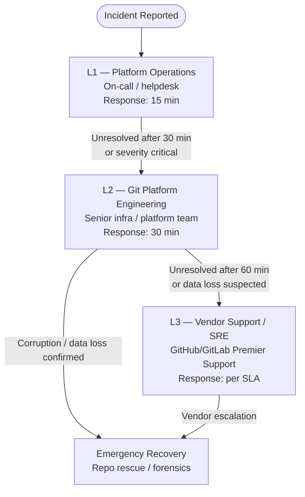

# Git — Escalation


<div class="kb-summary">
Escalation paths for Git platform incidents, support ticket procedures, data collection requirements, emergency repository recovery, and SLA commitments.
</div>

---

## Escalation Matrix


```
┌────────────────────────────────────────── Git — Escalation ───────────────────────────────────────────┐
│                                                                                                       │
│  Escalation paths for Git issues: corrupt repos, leaked secrets, and access incidents.                │
│                                                                                                       │
│   ┌──────────────────────────────────────────────┐  ┌─────────────────────────────────────────────┐   │
│   │              Corrupt Repository              │  │                Leaked Secrets               │   │
│   │      1. git fsck: identify bad objects       │  │         1. Rotate secret immediately        │   │
│   │        2. Restore from mirror backup         │  │           2. BFG: rewrite history           │   │
│   │        3. Re-push from backup mirror         │  │        3. Force-push cleaned history        │   │
│   │       4. Notify teams + update remotes       │  │         4. Audit access logs for use        │   │
│   └──────────────────────────────────────────────┘  └─────────────────────────────────────────────┘   │
│                                                                                                       │
│    Corruption → restore from backup; secrets → rotate first, clean history second                     │
│                                                                                                       │
│                          ▼                                                 ▼                          │
│                                                                                                       │
│   ┌──────────────────────────────────────────────┐  ┌─────────────────────────────────────────────┐   │
│   │               Access Incident                │  │              Data Loss Recovery             │   │
│   │           1. Revoke PAT + SSH key            │  │         1. git reflog: find lost SHA        │   │
│   │           2. Remove user from org            │  │           2. git fsck --lost-found          │   │
│   │       3. Review audit log for actions        │  │           3. git cherry-pick <sha>          │   │
│   │         4. Escalate to security team         │  │       4. Restore from mirror if needed      │   │
│   └──────────────────────────────────────────────┘  └─────────────────────────────────────────────┘   │
│                                                                                                       │
│  Physical Infrastructure (the hardware everything above runs on):                                     │
│  GitHub/GitLab audit log · mirror backup · security team · SIEM alerting                              │
│                                                                                                       │
│  Key terms:                                                                                           │
│                                                                                                       │
│  BFG Repo Cleaner= fast history rewriter; removes files or strings from all commits                   │
│  Force-push      = required after BFG history rewrite; coordinate with all cloners                    │
│  git reflog      = local ref movement log; finds commits lost after reset/rebase                      │
│  fsck --lost-found= writes dangling objects to .git/lost-found/ for inspection                        │
│  Audit log       = org-level event history on GitHub; available 90 days default                       │
│  Rotate secret   = change credential before cleaning history; assume it was used                      │
│  Mirror restore  = push --mirror from backup to new/repaired remote URL                               │
│  Revoke PAT      = Settings → Developer Settings → Personal access tokens → Revoke                    │
│  Access incident = unauthorised access to repo; treat as security incident                            │
│  Cherry-pick     = recover specific commit without full branch merge                                  │
│  Notify teams    = after force-push all cloners must git fetch + reset --hard                         │
│  SIEM alert      = audit log webhook to SIEM; enables real-time access alerts                         │
│                                                                                                       │
└───────────────────────────────────────────────────────────────────────────────────────────────────────┘
```
```bash

---

## Data to Collect Before Escalating

Collect this data immediately when a P1/P2 incident begins — do not wait until you open the ticket.

```bash
#!/usr/bin/env bash
# collect-platform-diagnostics.sh — run on GitLab server
# Requires: sudo access to gitlab-ctl / gitlab-rake
set -euo pipefail

OUT_DIR="/tmp/gitlab-diag-$(date +%Y%m%d-%H%M%S)"
mkdir -p "$OUT_DIR"

echo "Collecting diagnostics to $OUT_DIR ..."

# Service status
sudo gitlab-ctl status > "$OUT_DIR/ctl-status.txt" 2>&1

# Disk usage
df -h > "$OUT_DIR/disk-usage.txt"
du -sh /var/opt/gitlab/git-data >> "$OUT_DIR/disk-usage.txt"

# Recent logs (last 500 lines each)
for svc in gitaly puma sidekiq postgresql nginx; do
  sudo gitlab-ctl tail "$svc" 2>&1 | head -500 > "$OUT_DIR/log-${svc}.txt" || true
done

# Rails check
sudo gitlab-rake gitlab:check SANITIZE=true > "$OUT_DIR/gitlab-check.txt" 2>&1 || true

# Environment info
sudo gitlab-rake gitlab:env:info > "$OUT_DIR/env-info.txt" 2>&1 || true

# Geo status (if applicable)
sudo gitlab-rake geo:status > "$OUT_DIR/geo-status.txt" 2>&1 || true

# Background migration status
sudo gitlab-rails runner "
  puts Gitlab::Database::BackgroundMigration::BatchedMigration
         .where(status: [:active, :queued])
         .count
" > "$OUT_DIR/bg-migrations.txt" 2>&1 || true

# System resources
top -b -n 1 > "$OUT_DIR/top.txt" 2>&1 || true
free -h > "$OUT_DIR/memory.txt" 2>&1 || true

# Package version
dpkg -l gitlab-ee 2>/dev/null || rpm -q gitlab-ee 2>/dev/null > "$OUT_DIR/version.txt"

# Gitaly gRPC health
/opt/gitlab/embedded/bin/grpc_health_probe \
  -addr=unix:///var/opt/gitlab/gitaly/gitaly.socket \
  > "$OUT_DIR/gitaly-health.txt" 2>&1 || true

# Bundle and archive
tar -czf "${OUT_DIR}.tar.gz" -C "$(dirname $OUT_DIR)" "$(basename $OUT_DIR)"

echo "Diagnostics bundle: ${OUT_DIR}.tar.gz"
echo "Review for secrets before uploading to vendor support portal."
```

### Data Collection Checklist

- [ ] `gitlab-ctl status` output
- [ ] Last 500 lines: `gitaly.log`, `production.log`, `sidekiq.log`, `postgresql/current`
- [ ] `gitlab-rake gitlab:check` output
- [ ] `gitlab-rake gitlab:env:info` (version, config summary)
- [ ] `df -h` and `du -sh /var/opt/gitlab/git-data`
- [ ] `free -h` and `top` snapshot
- [ ] Prometheus metrics snapshot (if available)
- [ ] `git fsck` output for affected repositories
- [ ] Backup logs from the day of the incident
- [ ] Timeline of events (what changed, when alerts triggered)

---

## Emergency Repository Recovery Procedure

Use this procedure when a repository has confirmed object corruption or a critical branch has been accidentally destroyed.

### Step 1 — Contain

```bash
# Put GitLab in maintenance mode to prevent further writes
sudo gitlab-rails runner "Gitlab::CurrentSettings.update!(maintenance_mode: true)"

# Or via UI: Admin Area → Settings → General → Maintenance mode
```

### Step 2 — Assess Damage

```bash
# Identify which objects are missing/corrupt
REPO_PATH="/var/opt/gitlab/git-data/repositories/group/project.git"

sudo -u git git -C "$REPO_PATH" fsck --full 2>&1 | tee /tmp/fsck-report.txt

# Count severity
grep -c "missing" /tmp/fsck-report.txt
grep -c "error" /tmp/fsck-report.txt

# Check if any branches are still accessible
sudo -u git git -C "$REPO_PATH" branch -a
sudo -u git git -C "$REPO_PATH" log --oneline -10 2>/dev/null || echo "HEAD not accessible"
```

### Step 3 — Recover from Mirror/Backup

```bash
# Option A: Recover from a mirror backup repo
MIRROR="/backup/git/project.git"
DEST="/var/opt/gitlab/git-data/repositories/group/project.git"

# Copy missing objects from mirror
sudo -u git rsync -av --ignore-existing \
  "$MIRROR/objects/" \
  "$DEST/objects/"

# Re-verify
sudo -u git git -C "$DEST" fsck --full

# Option B: Re-clone from mirror into a fresh path, then switch
NEW_REPO="/var/opt/gitlab/git-data/repositories/group/project-recovered.git"
sudo -u git git clone --mirror "$MIRROR" "$NEW_REPO"
sudo -u git git -C "$NEW_REPO" fsck --full

# Swap (stop services first, then rename directories)
sudo gitlab-ctl stop puma sidekiq
sudo mv "$DEST" "${DEST}.corrupt-$(date +%Y%m%d)"
sudo mv "$NEW_REPO" "$DEST"
sudo chown -R git:git "$DEST"
sudo gitlab-ctl start puma sidekiq
```

### Step 4 — Recover a Deleted Branch (No Corruption)

```bash
# On the GitLab server — check Gitaly reflog
sudo -u git git -C "$REPO_PATH" reflog --all | grep <branch-name> | head -10

# Recreate branch at the found SHA
sudo gitlab-rails runner "
  project = Project.find_by_full_path('group/project')
  repository = project.repository
  repository.raw.write_ref('refs/heads/recovered-branch', '<sha-from-reflog>')
  puts 'Branch created'
"

# Or via API (if GitLab is accessible)
curl -X POST \
  --header "PRIVATE-TOKEN: $ADMIN_TOKEN" \
  "https://gitlab.example.com/api/v4/projects/:id/repository/branches" \
  --data "branch=recovered-branch&ref=<sha>"
```

### Step 5 — Restore from GitLab Backup

```bash
# Last resort — full restore from gitlab-backup archive
sudo gitlab-ctl stop puma sidekiq
sudo gitlab-backup restore BACKUP=<timestamp>_gitlab_backup
# Restore secrets file if required
sudo cp /secure/gitlab-secrets.json /etc/gitlab/
sudo gitlab-ctl reconfigure
sudo gitlab-ctl restart
sudo gitlab-rake gitlab:check SANITIZE=true
```

### Step 6 — Post-Recovery Validation

```bash
# Verify the recovered repository
sudo -u git git -C "$REPO_PATH" fsck --full
sudo -u git git -C "$REPO_PATH" log --oneline -20
sudo -u git git -C "$REPO_PATH" show-ref | wc -l

# Verify via API
curl -sf --header "PRIVATE-TOKEN: $GITLAB_TOKEN" \
  "https://gitlab.example.com/api/v4/projects/:id/repository/commits?per_page=5" | \
  jq '.[].title'

# Test a real clone
git clone git@gitlab.example.com:group/project.git /tmp/verify-clone
git -C /tmp/verify-clone log --oneline -10
git -C /tmp/verify-clone fsck

# Disable maintenance mode
sudo gitlab-rails runner "Gitlab::CurrentSettings.update!(maintenance_mode: false)"
```

### Recovery Decision Tree


