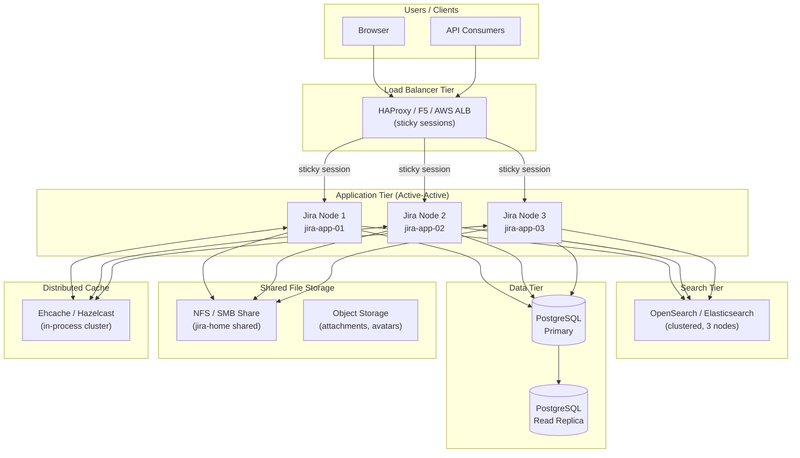
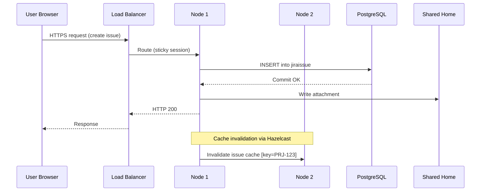

# Jira — How It Works

## Deployment Models

Jira is available in three deployment models, each with distinct architectural characteristics:

| Model | Hosting | Clustering | DB Control | Customisation |
|---|---|---|---|---|
| **Server** | Self-hosted | Single node | Full | Full |
| **Data Center** | Self-hosted | Active-active | Full | Full |
| **Cloud** | Atlassian-managed | Managed | None | Limited |

!!! warning "Server End-of-Life"
    Jira Server reached end of support on **15 February 2024**. All on-premises deployments should be on Data Center.

---

## Data Center Reference Architecture



---

## Component Descriptions

### Load Balancer

The load balancer is the single ingress point for all Jira traffic. **Sticky sessions (session affinity)** are mandatory for Jira Data Center — a user session must remain on the same node throughout its lifetime.

| Setting | Value |
|---|---|
| Session persistence | Cookie-based (`JSESSIONID`) |
| Health check endpoint | `GET /status` → HTTP 200 |
| Protocol | HTTPS (TLS termination at LB or pass-through) |
| Timeout | 60 s connection, 300 s request |

### Application Nodes

Each Jira node runs an identical instance of the Jira application within a Java servlet container (Tomcat). Nodes share no in-process state — all shared state is managed through the database and shared home.

| Resource | Minimum | Recommended (production) |
|---|---|---|
| vCPU | 8 | 16 |
| RAM | 16 GB | 32 GB |
| OS disk | 50 GB SSD | 100 GB SSD |
| JVM heap | 4 GB | 8–16 GB |
| JVM metaspace | 512 MB | 1 GB |

```bash
# /opt/atlassian/jira/bin/setenv.sh
JVM_MINIMUM_MEMORY="4096m"
JVM_MAXIMUM_MEMORY="16384m"
JVM_SUPPORT_RECOMMENDED_ARGS="-XX:+UseG1GC -XX:MaxGCPauseMillis=200 \
  -XX:+ExplicitGCInvokesConcurrent -XX:+ParallelRefProcEnabled"
```

### Database

Jira requires a single shared relational database. Supported engines:

| Engine | Supported Versions | Notes |
|---|---|---|
| PostgreSQL | 14, 15, 16 | Recommended for new deployments |
| MySQL | 8.0 | Requires specific JDBC config |
| Oracle | 19c | Supported, not recommended |
| SQL Server | 2019, 2022 | Enterprise license required |

### Search (OpenSearch / Elasticsearch)

| Parameter | Value |
|---|---|
| Recommended version | OpenSearch 2.x / Elasticsearch 7.x |
| Heap per node | 8–16 GB |
| Minimum nodes | 3 (quorum) |
| Replication factor | 1 |
| Index rebuild trigger | Manual or after restore |

### Shared Home (NFS / SMB)

All nodes mount a shared file system at the Jira shared home path (`/var/atlassian/application-data/jira/shared`). This share contains attachments, avatars, logos, export files, and plugin data.

```text
/var/atlassian/application-data/jira/
├── shared/               ← NFS/SMB mount (all nodes)
│   ├── attachments/
│   ├── avatars/
│   ├── export/
│   └── plugins/
├── log/                  ← Node-local
├── tmp/                  ← Node-local
└── dbconfig.xml          ← Node-local (same content on each)
```

NFS mount options:

```text
nfs-server:/jira-shared /var/atlassian/application-data/jira/shared \
  nfs4 rw,sync,hard,intr,noatime,rsize=131072,wsize=131072 0 0
```

### Distributed Cache (Hazelcast)

Jira Data Center uses Hazelcast for in-cluster cache invalidation and distributed locking.

| Port | Protocol | Purpose |
|---|---|---|
| 5701 | TCP | Hazelcast cluster communication |
| 40001 | TCP | Ehcache replication (legacy) |

```properties
# /var/atlassian/application-data/jira/cluster.properties
jira.node.id=jira-app-01
jira.shared.home=/var/atlassian/application-data/jira/shared
```

---

## Clustering

### Node Registration

```sql
-- Check active cluster nodes
SELECT node_id, node_name, status, last_heartbeat
FROM clusternodeinfo
ORDER BY last_heartbeat DESC;
```

### Cluster Traffic Flow



---

## Port Reference

| Port | Protocol | Component | Direction |
|---|---|---|---|
| 443 | TCP | Load Balancer (HTTPS) | Inbound from clients |
| 8080 | TCP | Jira Tomcat | LB → App nodes |
| 5432 | TCP | PostgreSQL | App nodes → DB |
| 9200 | TCP | OpenSearch HTTP | App nodes → Search |
| 5701 | TCP | Hazelcast | App nodes (internal) |
| 389 / 636 | TCP | LDAP / LDAPS | App nodes → Directory |

---

## Cloud Architecture (Reference)

For Jira Cloud, Atlassian manages all infrastructure on AWS:

- No direct DB or file system access — all operations via REST API or UI
- Data residency configurable for Enterprise plans (EU, US, AUS)
- Atlassian Access required for SAML SSO and enforced MFA
- Connect / Forge app framework replaces Server plugins
