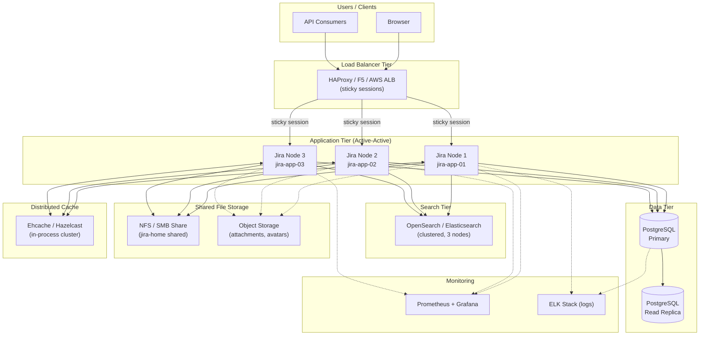
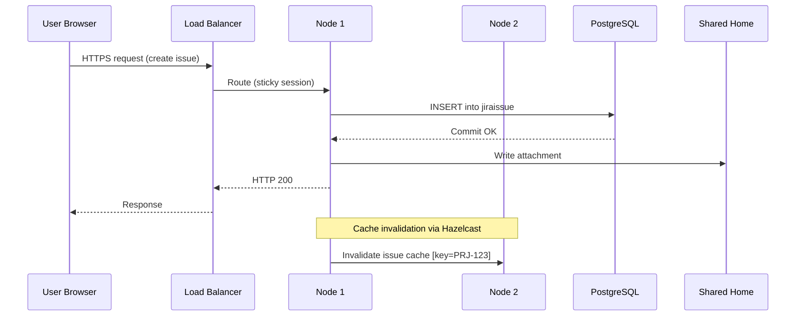

# Jira — Architecture Overview

## Deployment Models

Jira is available in three deployment models, each with distinct architectural characteristics:

| Model | Hosting | Clustering | DB Control | Customisation |
|---|---|---|---|---|
| **Server** | Self-hosted | Single node | Full | Full |
| **Data Center** | Self-hosted | Active-active | Full | Full |
| **Cloud** | Atlassian-managed | Managed | None | Limited |

!!! warning "Server End-of-Life"
    Jira Server reached end of support on **15 February 2024**. All on-premises deployments should be on Data Center.

---

## Data Center Reference Architecture

The following diagram represents a production-grade Jira Data Center deployment with high availability:



---

## Component Descriptions

### Load Balancer

The load balancer is the single ingress point for all Jira traffic. **Sticky sessions (session affinity)** are mandatory for Jira Data Center — a user session must remain on the same node throughout its lifetime.

| Setting | Value |
|---|---|
| Session persistence | Cookie-based (`JSESSIONID`) |
| Health check endpoint | `GET /status` → HTTP 200 |
| Protocol | HTTPS (TLS termination at LB or pass-through) |
| Timeout | 60 s connection, 300 s request |

### Application Nodes

Each Jira node runs an identical instance of the Jira application within a Java servlet container (Tomcat). Nodes share no in-process state — all shared state is managed through the database and shared home.

| Resource | Minimum | Recommended (production) |
|---|---|---|
| vCPU | 8 | 16 |
| RAM | 16 GB | 32 GB |
| OS disk | 50 GB SSD | 100 GB SSD |
| JVM heap | 4 GB | 8–16 GB |
| JVM metaspace | 512 MB | 1 GB |

JVM options are configured in `setenv.sh` (Linux) or `setenv.bat` (Windows):

```bash
# /opt/atlassian/jira/bin/setenv.sh
JVM_MINIMUM_MEMORY="4096m"
JVM_MAXIMUM_MEMORY="16384m"
JVM_SUPPORT_RECOMMENDED_ARGS="-XX:+UseG1GC -XX:MaxGCPauseMillis=200 \
  -XX:+ExplicitGCInvokesConcurrent -XX:+ParallelRefProcEnabled"
```

### Database

Jira requires a single shared relational database. Supported engines:

| Engine | Supported Versions | Notes |
|---|---|---|
| PostgreSQL | 14, 15, 16 | Recommended for new deployments |
| MySQL | 8.0 | Requires specific JDBC config |
| Oracle | 19c | Supported, not recommended |
| SQL Server | 2019, 2022 | Enterprise license required |

The database contains all Jira entities: projects, issues, workflows, users, configurations, and audit logs. File attachments and search indexes are stored separately.

### Search (OpenSearch / Elasticsearch)

Jira uses an embedded or external search index to power JQL text searches, issue navigator, and board filtering. In Data Center, an external clustered OpenSearch/Elasticsearch deployment is required.

| Parameter | Value |
|---|---|
| Recommended version | OpenSearch 2.x / Elasticsearch 7.x |
| Heap per node | 8–16 GB |
| Minimum nodes | 3 (quorum) |
| Replication factor | 1 |
| Index rebuild trigger | Manual or after restore |

### Shared Home (NFS / SMB)

All nodes mount a shared file system at the Jira shared home path (`/var/atlassian/application-data/jira/shared`). This share contains:

- Attachments
- Avatars
- Logos
- Export files
- Plugin data

```
/var/atlassian/application-data/jira/
├── shared/               ← NFS/SMB mount (all nodes)
│   ├── attachments/
│   ├── avatars/
│   ├── export/
│   └── plugins/
├── log/                  ← Node-local
├── tmp/                  ← Node-local
└── dbconfig.xml          ← Node-local (same content on each)
```

NFS mount options (recommended):

```
nfs-server:/jira-shared /var/atlassian/application-data/jira/shared \
  nfs4 rw,sync,hard,intr,noatime,rsize=131072,wsize=131072 0 0
```

### Distributed Cache (Hazelcast)

Jira Data Center uses Hazelcast for in-cluster cache invalidation and distributed locking. Communication is peer-to-peer on a dedicated multicast or unicast network.

| Port | Protocol | Purpose |
|---|---|---|
| 5701 | TCP | Hazelcast cluster communication |
| 40001 | TCP | Ehcache replication (legacy) |

Hazelcast is auto-configured; manual configuration is in `cluster.properties`:

```properties
# /var/atlassian/application-data/jira/cluster.properties
jira.node.id=jira-app-01
jira.shared.home=/var/atlassian/application-data/jira/shared
```

---

## Clustering Overview

### Node Registration

When a node starts, it registers itself in the `CLUSTERNODEINFO` database table. The cluster heartbeat is written every 30 seconds. A node is considered offline if no heartbeat is recorded for 2 minutes.

```sql
-- Check active cluster nodes
SELECT node_id, node_name, status, last_heartbeat
FROM clusternodeinfo
ORDER BY last_heartbeat DESC;
```

### Cluster Traffic Flow



### Session Affinity Requirement

Jira stores ephemeral session data locally on the node (e.g., issue draft state, in-progress wizard steps). Without sticky sessions, a user mid-workflow could be routed to a different node that lacks this state, causing errors or data loss.

---

## Port Reference

| Port | Protocol | Component | Direction |
|---|---|---|---|
| 443 | TCP | Load Balancer (HTTPS) | Inbound from clients |
| 80 | TCP | Load Balancer (HTTP redirect) | Inbound from clients |
| 8080 | TCP | Jira Tomcat | LB → App nodes |
| 8443 | TCP | Jira Tomcat (SSL) | LB → App nodes |
| 5432 | TCP | PostgreSQL | App nodes → DB |
| 9200 | TCP | OpenSearch HTTP | App nodes → Search |
| 9300 | TCP | OpenSearch Transport | Search cluster internal |
| 5701 | TCP | Hazelcast | App nodes (internal) |
| 25 / 587 | TCP | SMTP | App nodes → Mail server |
| 389 / 636 | TCP | LDAP / LDAPS | App nodes → Directory |

---

## Cloud Architecture (Reference)

For Jira Cloud, Atlassian manages all infrastructure on AWS. Key points for administrators:

- **No direct DB or file system access** — all operations via REST API or UI
- **Data residency** configurable for Enterprise plans (EU, US, AUS)
- **Atlassian Access** required for SAML SSO and enforced MFA
- **Connect / Forge** app framework replaces Server plugins
- **Sandbox / Staging** environment available on Premium and Enterprise plans
