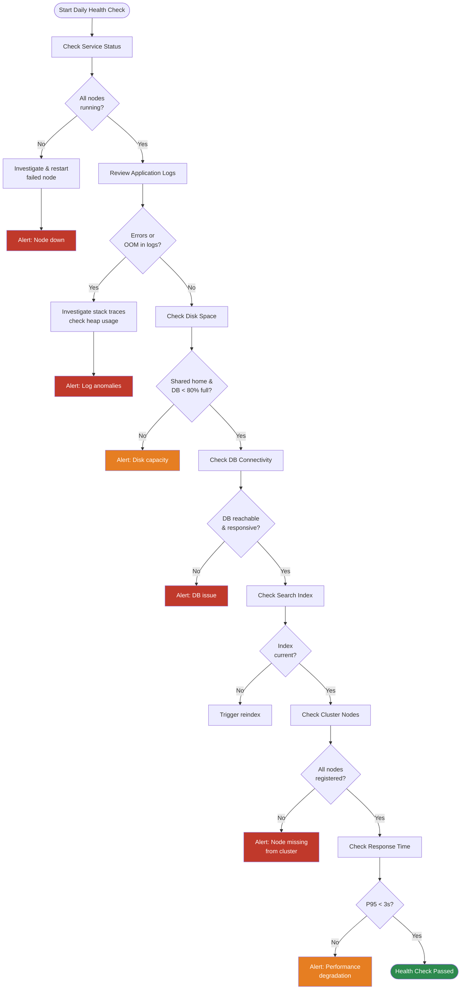

# Jira — Health Checks


<div class="kb-summary">
Health Checks reference covering Health Check Overview, 2. Log Review, 3. Disk Space, 4. Database Connectivity, 5. Search Index Status and 3 more sections.
</div>

## Health Check Overview


┌──────────────────────────────────────── Jira — Health Checks ─────────────────────────────────────────┐
│                                                                                                       │
│   ┌──────────────────────────────────────────────┐  ┌─────────────────────────────────────────────┐   │
│   │              Application Health              │  │            Infrastructure Health            │   │
│   │            GET /status → RUNNING             │  │               DB connectivity               │   │
│   │               Heap usage < 80%               │  │                  Disk < 80%                 │   │
│   │                No OOM in logs                │  │               NFS mount active              │   │
│   │               Lucene index OK                │  │               Backup completed              │   │
│   │              Background jobs OK              │  │                SMTP reachable               │   │
│   └──────────────────────────────────────────────┘  └─────────────────────────────────────────────┘   │
│                                                                                                       │
│  Physical Infrastructure (the hardware everything above runs on):                                     │
│  Jira app VMs · PostgreSQL DB · NFS shared home · SMTP relay                                          │
│                                                                                                       │
│  Key terms:                                                                                           │
│                                                                                                       │
│  GET /status    = curl http://localhost:8080/status; returns RUNNING or error                         │
│  Heap check     = Admin > System Info > JVM Memory Usage; alert if >80%                               │
│  Lucene index   = Admin > System > Indexing; shows index size and last update time                    │
│  Background jobs = Admin > Scheduled Jobs; verify last-run time and error count                       │
│  DB check       = psql -U jira -c "SELECT 1;" to confirm connectivity                                 │
│  Disk check     = df -h JIRA_HOME; alert at 80%; attachments fill disk gradually                      │
│  NFS check      = mount | grep nfs; ls JIRA_HOME/data/attachments                                     │
│  SMTP check     = Admin > Outgoing Mail > Send Test Email                                             │
│  Backup check   = verify pg_dump file timestamp and non-zero size                                     │
│  OOM check      = grep OutOfMemoryError catalina.out; OOM indicates heap too small                    │
│  Scheduled jobs = Jira runs DB clean-up, indexing, and mail jobs on schedule                          │
│  JMX            = expose JVM metrics; scrape with Prometheus JMX exporter                             │
│                                                                                                       │
└───────────────────────────────────────────────────────────────────────────────────────────────────────┘
```

Expected: All nodes show `healthy` / `UP`.

---

## 2. Log Review

### Log Locations

| Log File | Location | Purpose |
|---|---|---|
| Application log | `/opt/atlassian/jira/logs/atlassian-jira.log` | Main Jira application events |
| Catalina log | `/opt/atlassian/jira/logs/catalina.out` | JVM / Tomcat stdout |
| GC log | `/opt/atlassian/jira/logs/gc.log` | Garbage collection events |
| Access log | `/opt/atlassian/jira/logs/localhost_access_log.*.txt` | HTTP request log |
| Audit log | Jira Admin → Audit Log | Admin-action audit trail |

### Log Review Commands

```bash
# Check for ERROR/WARN in last hour
grep -E "^[0-9]{4}-[0-9]{2}-[0-9]{2} $(date +%H):" \
  /opt/atlassian/jira/logs/atlassian-jira.log \
  | grep -E "ERROR|WARN" | tail -50

# Check for OutOfMemoryError
grep -i "OutOfMemoryError\|Java heap space\|GC overhead" \
  /opt/atlassian/jira/logs/catalina.out | tail -20

# Check for slow queries
grep -i "slow query\|query took" \
  /opt/atlassian/jira/logs/atlassian-jira.log | tail -20

# Count errors in last 24h
grep "^$(date +%Y-%m-%d)" /opt/atlassian/jira/logs/atlassian-jira.log \
  | grep -c "ERROR"
```

### Key Error Patterns

| Pattern | Severity | Meaning |
|---|---|---|
| `OutOfMemoryError: Java heap space` | Critical | JVM heap exhausted — increase Xmx or investigate leak |
| `OutOfMemoryError: Metaspace` | Critical | Metaspace exhausted — increase MaxMetaspaceSize |
| `Unable to acquire lock` | High | Distributed lock contention — check cluster health |
| `Could not get JDBC Connection` | High | DB connection pool exhausted |
| `Index is corrupted` | High | Lucene index corruption — reindex required |
| `LDAP: error code 49` | Medium | LDAP bind failure — check service account credentials |
| `SocketTimeoutException` | Medium | Network timeout — check external service connectivity |
| `com.hazelcast.*Exception` | Medium | Cluster communication issue |

---

## 3. Disk Space

```bash
# Check all relevant mount points
df -hT | grep -E "Filesystem|/var/atlassian|/opt/atlassian|/backup"

# Shared home breakdown
du -sh /var/atlassian/application-data/jira/shared/* | sort -hr | head -10

# Find large files
find /var/atlassian/application-data/jira/shared -type f -size +100M \
  | sort -t/ -k1 | head -20

# Log directory size
du -sh /opt/atlassian/jira/logs/
```

### Disk Usage Thresholds

| Mount Point | Warning | Critical | Action |
|---|---|---|---|
| Shared home | 70% | 85% | Archive old exports, purge temp files |
| App node OS disk | 75% | 90% | Rotate logs, clear temp |
| Database volume | 70% | 85% | Archive old audit data, extend volume |
| Backup storage | 80% | 90% | Delete old backups per retention policy |

---

## 4. Database Connectivity

```bash
# Test connection from app node
psql -h db.example.com -U jira -d jiradb -c "\conninfo"

# Check active connections
psql -h db.example.com -U jira -d jiradb \
  -c "SELECT count(*), state FROM pg_stat_activity WHERE datname='jiradb' GROUP BY state;"

# Check for long-running queries (> 30 seconds)
psql -h db.example.com -U jira -d jiradb -c "
SELECT pid, now() - query_start AS duration, state, query
FROM pg_stat_activity
WHERE datname = 'jiradb'
  AND state != 'idle'
  AND query_start < now() - interval '30 seconds'
ORDER BY duration DESC;"

# Check replication lag (if using replica)
psql -h db-replica.example.com -U jira -d jiradb \
  -c "SELECT now() - pg_last_xact_replay_timestamp() AS replication_lag;"
```

### Connection Pool Health (via REST)

```bash
curl -s -u "${JIRA_USER}:${JIRA_TOKEN}" \
  "${JIRA_URL}/rest/api/2/configuration" | python3 -m json.tool
```

Via UI: `Admin → System → Database → Connection Pool Monitoring`

| Metric | Warning | Critical |
|---|---|---|
| Active connections | > 80% of pool max | > 95% of pool max |
| Wait count | > 0 persistent | > 5 for > 30s |
| Replication lag | > 30s | > 5 min |

---

## 5. Search Index Status

```bash
# Check index age via REST
curl -s -u "${JIRA_USER}:${JIRA_TOKEN}" \
  "${JIRA_URL}/rest/api/2/reindex" | python3 -m json.tool
```

Expected response when healthy:

```json
{
  "progressUrl": "/rest/api/2/reindex/progress",
  "type": "BACKGROUND_PREFERRED",
  "submittedTime": "2026-05-08T01:00:00.000+0000",
  "startTime": "2026-05-08T01:00:05.000+0000",
  "finishTime": "2026-05-08T01:23:45.000+0000",
  "success": true,
  "currentSubTask": "Completed"
}
```

Check index size on disk:

```bash
du -sh /var/atlassian/application-data/jira/caches/indexes/
```

Signs of index problems:

- JQL searches returning 0 results for known issues
- `Index is corrupted` in logs
- Reindex progress stuck at same percentage for > 30 minutes

---

## 6. Cluster Node Status

```bash
# Database-level cluster check
psql -h db.example.com -U jira -d jiradb -c "
SELECT node_id, node_name, status, ip, last_heartbeat,
       EXTRACT(EPOCH FROM (now() - last_heartbeat)) AS seconds_since_heartbeat
FROM clusternodeinfo
ORDER BY last_heartbeat DESC;"
```

Via UI: `Admin → System → Clustering`

All expected nodes should appear with:
- Status: `ACTIVE`
- Last heartbeat: < 60 seconds ago

Via REST:

```bash
curl -s -u "${JIRA_USER}:${JIRA_TOKEN}" \
  "${JIRA_URL}/rest/api/2/cluster/nodes" | python3 -m json.tool
```

---

## 7. Key Metrics Reference

| Metric | Healthy | Warning | Critical | Source |
|---|---|---|---|---|
| HTTP response time (P95) | < 1s | 1–3s | > 3s | LB metrics / APM |
| JVM heap usage | < 70% | 70–85% | > 85% | JMX / `jstat` |
| JVM GC pause (P99) | < 200ms | 200–500ms | > 500ms | GC log |
| DB connection pool used | < 70% | 70–90% | > 90% | Jira admin |
| DB query time (P95) | < 100ms | 100–500ms | > 500ms | pg_stat_statements |
| Disk usage (shared home) | < 70% | 70–85% | > 85% | `df` |
| Cluster heartbeat age | < 30s | 30–60s | > 60s | DB clusternodeinfo |
| Replication lag | < 5s | 5–30s | > 30s | PostgreSQL |
| Active Jira threads | < 100 | 100–200 | > 200 | Thread dump / JMX |
| Error log rate (/hour) | < 10 | 10–100 | > 100 | Log grep |
| Failed logins (/hour) | < 5 | 5–50 | > 50 | Audit log |

---

## 8. Automated Health Check Script

```bash
#!/bin/bash
# jira-health-check.sh — Run daily via cron

JIRA_URL="https://jira.example.com"
JIRA_USER="health-check-svc"
JIRA_TOKEN="${JIRA_HEALTH_TOKEN}"
ALERT_EMAIL="ops-team@example.com"
FAILURES=()

# --- 1. HTTP health endpoint ---
STATUS=$(curl -s -o /dev/null -w "%{http_code}" "${JIRA_URL}/status")
if [ "${STATUS}" != "200" ]; then
  FAILURES+=("Jira health endpoint returned HTTP ${STATUS}")
fi

# --- 2. Disk space ---
DISK_PCT=$(df /var/atlassian/application-data/jira/shared \
  | awk 'NR==2{print $5}' | tr -d '%')
if [ "${DISK_PCT}" -gt 85 ]; then
  FAILURES+=("Shared home disk usage at ${DISK_PCT}% — CRITICAL")
elif [ "${DISK_PCT}" -gt 70 ]; then
  FAILURES+=("Shared home disk usage at ${DISK_PCT}% — WARNING")
fi

# --- 3. DB connectivity ---
if ! psql -h db.example.com -U jira -d jiradb -c "SELECT 1" -q > /dev/null 2>&1; then
  FAILURES+=("PostgreSQL connection failed")
fi

# --- 4. Error log check ---
ERROR_COUNT=$(grep "^$(date +%Y-%m-%d)" \
  /opt/atlassian/jira/logs/atlassian-jira.log \
  | grep -c "ERROR" || true)
if [ "${ERROR_COUNT}" -gt 100 ]; then
  FAILURES+=("High error rate: ${ERROR_COUNT} errors today")
fi

# --- 5. Cluster node heartbeat ---
STALE_NODES=$(psql -h db.example.com -U jira -d jiradb -tAc "
  SELECT count(*) FROM clusternodeinfo
  WHERE status = 'ACTIVE'
    AND last_heartbeat < now() - interval '2 minutes'")
if [ "${STALE_NODES}" -gt 0 ]; then
  FAILURES+=("${STALE_NODES} cluster node(s) have stale heartbeat")
fi

# --- Report ---
if [ ${#FAILURES[@]} -gt 0 ]; then
  BODY=$(printf '%s\n' "${FAILURES[@]}")
  echo "${BODY}" | mail -s "[JIRA HEALTH] $(hostname) — $(date)" "${ALERT_EMAIL}"
  echo "HEALTH CHECK FAILED:"
  printf '  - %s\n' "${FAILURES[@]}"
  exit 1
else
  echo "Health check passed: $(date)"
  exit 0
fi
```

Schedule:

```cron
*/15 * * * * jira /opt/scripts/jira-health-check.sh >> /var/log/jira-health.log 2>&1
```
