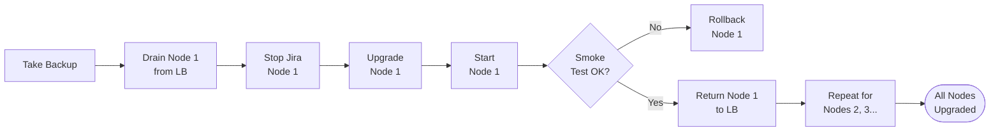

# Jira — Install & Upgrade


<div class="kb-summary">
Install & Upgrade reference covering Version Matrix, Pre-Upgrade Checklist, Upgrade Procedure (Data Center), Rollback Procedure.
</div>

## Version Matrix

| Jira Version | Release Type | Java | PostgreSQL | End of Support |
|---|---|---|---|---|
| 10.3.x | LTS | 17 | 14, 15, 16 | TBD |
| 10.0.x | LTS | 17 | 14, 15, 16 | TBD |
| 9.12.x | LTS | 11, 17 | 13, 14, 15 | Feb 2027 |
| 9.4.x | LTS | 11 | 12, 13, 14 | Feb 2026 |
| 9.0.x | Feature | 11 | 12, 13 | Feb 2025 |

!!! info "LTS vs Feature Releases"
    Always upgrade production to an **LTS release**. Feature releases receive security patches only for 6 months. LTS releases are supported for 2 years.

Check the current Jira compatibility matrix: `Admin → System → Jira Information`

---

## Pre-Upgrade Checklist

Complete all items before beginning an upgrade. Do not proceed until all items are checked.

### Environment Checks

- [ ] Read the [Jira upgrade guide](https://confluence.atlassian.com/adminjira) for the target version
- [ ] Review the [Jira bug tracker](https://jira.atlassian.com) for known issues in the target version
- [ ] Confirm Java version compatibility (upgrade JDK if required)
- [ ] Confirm PostgreSQL version compatibility
- [ ] Check all installed apps against the [Atlassian Marketplace](https://marketplace.atlassian.com) compatibility matrix
- [ ] Verify operating system compatibility (RHEL/Ubuntu/Windows version)
- [ ] Confirm sufficient disk space: installation requires ~2× current install size

### Backup Verification

- [ ] Database backup completed and verified: `pg_restore --list <backup.pgdump>`
- [ ] Shared home filesystem backup completed
- [ ] Local home (`dbconfig.xml`, `cluster.properties`) copied to safe location
- [ ] Backup restored to test environment and validated (smoke test)

### Coordination

- [ ] Change request raised and approved (CAB/change management)
- [ ] Maintenance window scheduled and communicated to users
- [ ] Rollback time and procedure agreed with team
- [ ] Monitoring alerts silenced for upgrade window
- [ ] Load balancer drain procedure documented

### App Compatibility Check

```bash
# List all installed apps and versions
curl -s -u "${JIRA_USER}:${JIRA_TOKEN}" \
  "${JIRA_URL}/rest/api/2/plugins/1.0/plugin" \
  | python3 -c "
import sys, json
plugins = json.load(sys.stdin)
for p in plugins:
    print(f\"{p.get('key','')}\t{p.get('version','')}\t{p.get('name','')}\")
" | sort > /tmp/jira-plugins-before.txt

cat /tmp/jira-plugins-before.txt
```
┌───────────────────────────────────── Jira — Install and Upgrade ──────────────────────────────────────┐
│                                                                                                       │
│   ┌───────────────────────────────────────────────────────────────────────────────────────────────┐   │
│   │                            Jira Installation and Upgrade Procedure                            │   │
│   │           Install: JDK 11/17 → download installer → set JIRA_HOME → run setup wizard          │   │
│   │                DB: PostgreSQL 14+ → create DB/role → configure via setup wizard               │   │
│   │              Upgrade: snapshot → pg_dump → stop → new installer → start → verify              │   │
│   │            DC node add: install on new VM → same DB + NFS JIRA_HOME → cluster joins           │   │
│   └───────────────────────────────────────────────────────────────────────────────────────────────┘   │
│                                                                                                       │
│    Snapshot VMs and backup DB before every upgrade; prepare rollback plan                             │
│                                                                                                       │
│                          ▼                                                 ▼                          │
│                                                                                                       │
│   ┌──────────────────────────────────────────────┐  ┌─────────────────────────────────────────────┐   │
│   │             Fresh Install Steps              │  │                Upgrade Steps                │   │
│   │              Install JDK 11/17               │  │               Snapshot VM + DB              │   │
│   │              Download Jira .bin              │  │                pg_dump backup               │   │
│   │              Set JIRA_HOME env               │  │                Stop all nodes               │   │
│   │             Create PostgreSQL DB             │  │              Run new installer              │   │
│   │               Run setup wizard               │  │               Start and verify              │   │
│   │              Apply license key               │  │              Test key workflows             │   │
│   └──────────────────────────────────────────────┘  └─────────────────────────────────────────────┘   │
│                                                                                                       │
│  Physical Infrastructure (the hardware everything above runs on):                                     │
│  Fresh VM (RHEL/CentOS) · PostgreSQL VM · NFS for shared home · load balancer                         │
│                                                                                                       │
│  Key terms:                                                                                           │
│                                                                                                       │
│  JIRA_HOME    = data directory; set in jira-application.properties; NFS mount for DC                  │
│  JDK 11/17    = Jira 9.x supports JDK 11 and 17; check Jira version compatibility matrix              │
│  Setup wizard = browser-based config: DB, license, admin account, project template                    │
│  License key  = Atlassian Jira DC or Server license; apply in setup or Admin panel                    │
│  Installer    = Atlassian-provided .bin for Linux; chmod +x; run as root                              │
│  Snapshot     = VM snapshot before upgrade; revert if upgrade fails                                   │
│  Plugin compat = check app compatibility before upgrade; UPM shows incompatible apps                  │
│  setenv.sh    = JVM flags; JIRA_INSTALL/bin/setenv.sh; set -Xmx here                                  │
│  Rollback     = revert VM snapshot; restore pg_dump; restart previous version                         │
│  Upgrade path = some Jira versions require intermediate upgrade steps; check docs                     │
│  DC cluster   = additional node joins when same DB and NFS home configured                            │
│  PostgreSQL 14 = minimum recommended for Jira 9.x; check matrix for exact version                     │
│                                                                                                       │
└───────────────────────────────────────────────────────────────────────────────────────────────────────┘
```
┌───────────────────────────────────── Jira — Install and Upgrade ──────────────────────────────────────┐
│                                                                                                       │
│   ┌───────────────────────────────────────────────────────────────────────────────────────────────┐   │
│   │                            Jira Installation and Upgrade Procedure                            │   │
│   │           Install: JDK 11/17 → download installer → set JIRA_HOME → run setup wizard          │   │
│   │                DB: PostgreSQL 14+ → create DB/role → configure via setup wizard               │   │
│   │              Upgrade: snapshot → pg_dump → stop → new installer → start → verify              │   │
│   │            DC node add: install on new VM → same DB + NFS JIRA_HOME → cluster joins           │   │
│   └───────────────────────────────────────────────────────────────────────────────────────────────┘   │
│                                                                                                       │
│    Snapshot VMs and backup DB before every upgrade; prepare rollback plan                             │
│                                                                                                       │
│                          ▼                                                 ▼                          │
│                                                                                                       │
│   ┌──────────────────────────────────────────────┐  ┌─────────────────────────────────────────────┐   │
│   │             Fresh Install Steps              │  │                Upgrade Steps                │   │
│   │              Install JDK 11/17               │  │               Snapshot VM + DB              │   │
│   │              Download Jira .bin              │  │                pg_dump backup               │   │
│   │              Set JIRA_HOME env               │  │                Stop all nodes               │   │
│   │             Create PostgreSQL DB             │  │              Run new installer              │   │
│   │               Run setup wizard               │  │               Start and verify              │   │
│   │              Apply license key               │  │              Test key workflows             │   │
│   └──────────────────────────────────────────────┘  └─────────────────────────────────────────────┘   │
│                                                                                                       │
│  Physical Infrastructure (the hardware everything above runs on):                                     │
│  Fresh VM (RHEL/CentOS) · PostgreSQL VM · NFS for shared home · load balancer                         │
│                                                                                                       │
│  Key terms:                                                                                           │
│                                                                                                       │
│  JIRA_HOME    = data directory; set in jira-application.properties; NFS mount for DC                  │
│  JDK 11/17    = Jira 9.x supports JDK 11 and 17; check Jira version compatibility matrix              │
│  Setup wizard = browser-based config: DB, license, admin account, project template                    │
│  License key  = Atlassian Jira DC or Server license; apply in setup or Admin panel                    │
│  Installer    = Atlassian-provided .bin for Linux; chmod +x; run as root                              │
│  Snapshot     = VM snapshot before upgrade; revert if upgrade fails                                   │
│  Plugin compat = check app compatibility before upgrade; UPM shows incompatible apps                  │
│  setenv.sh    = JVM flags; JIRA_INSTALL/bin/setenv.sh; set -Xmx here                                  │
│  Rollback     = revert VM snapshot; restore pg_dump; restart previous version                         │
│  Upgrade path = some Jira versions require intermediate upgrade steps; check docs                     │
│  DC cluster   = additional node joins when same DB and NFS home configured                            │
│  PostgreSQL 14 = minimum recommended for Jira 9.x; check matrix for exact version                     │
│                                                                                                       │
└───────────────────────────────────────────────────────────────────────────────────────────────────────┘
```

### Install Jira

```bash
# Download installer (replace version as appropriate)
JIRA_VERSION="9.12.0"
wget "https://www.atlassian.com/software/jira/downloads/binary/atlassian-jira-software-${JIRA_VERSION}-x64.bin" \
  -O /tmp/jira-installer.bin

chmod +x /tmp/jira-installer.bin

# Run installer (interactive)
/tmp/jira-installer.bin

# Or with response file for silent install:
cat > /tmp/jira-response.varfile << 'EOF'
#install4j response file
sys.adminRights$Boolean=true
app.jiraHome=/var/atlassian/application-data/jira
app.install.service$Boolean=true
portChoice=default
EOF

/tmp/jira-installer.bin -q -varfile /tmp/jira-response.varfile
```

### Configure Database

Edit `/var/atlassian/application-data/jira/dbconfig.xml`:

```xml
<?xml version="1.0" encoding="UTF-8"?>
<jira-database-config>
  <name>defaultDS</name>
  <delegator-name>default</delegator-name>
  <database-type>postgres72</database-type>
  <schema-name>public</schema-name>
  <jdbc-datasource>
    <url>jdbc:postgresql://db.example.com:5432/jiradb</url>
    <driver-class>org.postgresql.Driver</driver-class>
    <username>jira</username>
    <password>strong-password-here</password>
    <pool-min-size>20</pool-min-size>
    <pool-max-size>100</pool-max-size>
    <pool-max-wait>30000</pool-max-wait>
    <pool-max-idle>20</pool-max-idle>
    <validation-query>select 1</validation-query>
    <min-evictable-idle-time-millis>60000</min-evictable-idle-time-millis>
    <time-between-eviction-runs-millis>300000</time-between-eviction-runs-millis>
  </jdbc-datasource>
</jira-database-config>
```

### Configure Data Center Clustering

Create `/var/atlassian/application-data/jira/cluster.properties`:

```properties
jira.node.id=jira-app-01
jira.shared.home=/var/atlassian/application-data/jira/shared
ehcache.peer.discovery=default
ehcache.listener.hostName=10.0.1.10
ehcache.listener.port=40001
ehcache.object.port=40011
```

### Start and Complete Setup

```bash
systemctl start jira
# Complete setup wizard via browser: http://<node-ip>:8080
```

---

## Upgrade Procedure (Data Center)

### Overview

Data Center supports rolling upgrades (zero-downtime) for minor/patch versions within the same major version. Major version upgrades require a maintenance window with all nodes stopped.



### Step-by-Step Upgrade

#### Step 1 — Backup

```bash
# Database backup
PGPASSWORD="${JIRA_DB_PASSWORD}" pg_dump \
  -h db.example.com -U jira -Fc jiradb \
  -f /backup/jira/db/jira_pre_upgrade_$(date +%Y%m%d).pgdump

# Shared home backup
rsync -av /var/atlassian/application-data/jira/shared/ \
  /backup/jira/shared-pre-upgrade-$(date +%Y%m%d)/
```

#### Step 2 — Download Upgrade Package

```bash
NEW_VERSION="9.12.3"
wget "https://www.atlassian.com/software/jira/downloads/binary/atlassian-jira-software-${NEW_VERSION}-x64.bin" \
  -O /tmp/jira-upgrade-${NEW_VERSION}.bin
chmod +x /tmp/jira-upgrade-${NEW_VERSION}.bin
```

#### Step 3 — Drain Node from Load Balancer

```bash
# HAProxy — mark backend server as drain
echo "set server jira_backend/jira-app-01 state drain" \
  | socat stdio /var/run/haproxy/admin.sock

# Wait for active connections to complete (check count)
watch -n5 "echo 'show stat' | socat stdio /var/run/haproxy/admin.sock | cut -d',' -f1,2,8"
```

#### Step 4 — Stop Node

```bash
systemctl stop jira
# Verify stopped
systemctl status jira
```

#### Step 5 — Run Upgrade Installer

```bash
/tmp/jira-upgrade-${NEW_VERSION}.bin -q

# Monitor installer output
tail -f /opt/atlassian/jira/logs/atlassian-jira-software-upgrade-*.log
```

The installer will:
1. Back up the existing installation to `<install-dir>.old`
2. Extract new application files
3. Preserve `bin/setenv.sh` and `conf/server.xml` customisations

#### Step 6 — DB Schema Upgrade

For major version upgrades, the first node to start will run DB schema migrations automatically. This can take 30–90 minutes for large instances. Monitor via:

```bash
# Schema upgrade progress (during startup)
tail -f /opt/atlassian/jira/logs/atlassian-jira.log \
  | grep -E "schema|migration|upgrade"
```

#### Step 7 — Start Node and Validate

```bash
systemctl start jira

# Monitor startup
tail -f /opt/atlassian/jira/logs/catalina.out \
  | grep -E "INFO|ERROR|WARN|started"

# Health check
curl -s https://jira.example.com/status
# {"state":"RUNNING"}

# Version check
curl -s -u "${JIRA_USER}:${JIRA_TOKEN}" \
  "${JIRA_URL}/rest/api/2/serverInfo" | python3 -m json.tool
```

#### Step 8 — Return Node to Load Balancer

```bash
echo "set server jira_backend/jira-app-01 state ready" \
  | socat stdio /var/run/haproxy/admin.sock
```

#### Step 9 — Repeat for Remaining Nodes

Repeat Steps 3–8 for each remaining node, one at a time.

#### Step 10 — Post-Upgrade Tasks

```bash
# Verify all apps (plugins) re-enabled
curl -s -u "${JIRA_USER}:${JIRA_TOKEN}" \
  "${JIRA_URL}/rest/api/2/plugins/1.0/plugin" \
  | python3 -c "
import sys, json
plugins = json.load(sys.stdin)
disabled = [p for p in plugins if not p.get('enabled', True)]
print(f'{len(disabled)} plugin(s) disabled:')
for p in disabled:
    print(f\"  {p.get('key')} — {p.get('name')}\")
"

# Re-index if major version upgrade
curl -u "${JIRA_USER}:${JIRA_TOKEN}" -X POST \
  "${JIRA_URL}/rest/api/2/reindex?type=BACKGROUND_PREFERRED"
```

---

## Rollback Procedure

### Rollback Conditions

Initiate rollback if:
- Jira fails to start after upgrade
- Critical functionality broken (login, issue creation, workflows)
- Data corruption detected
- Plugin failures affecting core business processes

### Rollback Steps

```bash
# 1. Stop Jira
systemctl stop jira

# 2. Restore application files (installer created backup in .old directory)
mv /opt/atlassian/jira /opt/atlassian/jira-failed
mv /opt/atlassian/jira.old /opt/atlassian/jira

# 3. Restore database (only if DB schema was modified)
psql -h db.example.com -U postgres \
  -c "SELECT pg_terminate_backend(pid) FROM pg_stat_activity WHERE datname = 'jiradb';"
psql -h db.example.com -U postgres \
  -c "DROP DATABASE jiradb; CREATE DATABASE jiradb OWNER jira ENCODING 'UTF8';"

PGPASSWORD="${JIRA_DB_PASSWORD}" pg_restore \
  -h db.example.com -U jira -d jiradb --jobs 4 \
  /backup/jira/db/jira_pre_upgrade_$(date +%Y%m%d).pgdump

# 4. Start Jira
systemctl start jira

# 5. Validate
curl -s https://jira.example.com/status
```

!!! danger "Database Rollback"
    If the new version ran DB schema migrations, you **must** restore the database backup. The previous version cannot run against a schema migrated for the new version. This requires a full maintenance window.
