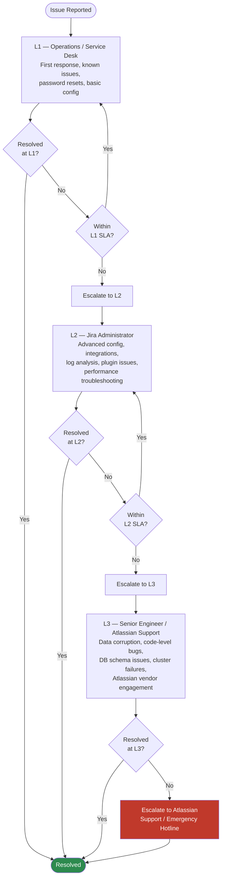

# Jira — Escalation

## Escalation Matrix



---

## L1 / L2 / L3 Role Definitions

| Level | Role | Responsibilities | Skills Required |
|---|---|---|---|
| **L1** | Operations / Service Desk | First response, incident triage, user-facing issues, known-issue workarounds, access requests | Jira UI navigation, basic JQL, user administration |
| **L2** | Jira Administrator | Configuration changes, plugin management, workflow editing, log analysis, LDAP/SSO issues, performance diagnosis | Jira admin, REST API, log analysis, DB queries |
| **L3** | Senior Platform Engineer | DB-level investigation, JVM analysis, cluster issues, data corruption, architectural changes, Atlassian case management | PostgreSQL DBA, Java/JVM, Atlassian internals, Data Center architecture |
| **Vendor** | Atlassian Support | Product bugs, licensing, undocumented behaviour, Data Center cluster defects | N/A — Atlassian responsibility |

---

## SLA Table

| Priority | Description | L1 Response | L1 Resolution | L2 Response | L2 Resolution | L3 Response |
|---|---|---|---|---|---|---|
| **P1 — Critical** | Jira down for all users | 15 min | 1 hour | 30 min | 4 hours | 1 hour |
| **P2 — High** | Core functionality broken (create, transition, search) for majority of users | 30 min | 4 hours | 1 hour | 8 hours | 2 hours |
| **P3 — Medium** | Functionality degraded, workaround available | 2 hours | 1 business day | 4 hours | 2 business days | Next business day |
| **P4 — Low** | Minor issue, cosmetic, single-user problem | 4 hours | 3 business days | Next BD | 5 business days | Scheduled |

!!! note "Business Days"
    Business days are Monday–Friday, 08:00–18:00 local time, excluding public holidays. Out-of-hours P1 coverage must be arranged through the on-call rota.

---

## Pre-Escalation Information Checklist

Collect the following before escalating to the next level. Incomplete escalations delay resolution.

### L1 → L2 Escalation Checklist

- [ ] Issue summary: what is broken, what is the user impact
- [ ] First occurrence time and date
- [ ] Number of affected users (all / subset / single user)
- [ ] Steps to reproduce
- [ ] Error message or screenshot (exact text)
- [ ] Jira URL of affected issue/project (if applicable)
- [ ] User(s) affected: username(s) and roles
- [ ] Recent changes: any config changes, upgrades, or deployments in last 48h
- [ ] Temporary workaround in place (yes / no / what)

### L2 → L3 Escalation Checklist

All L1→L2 items, plus:

- [ ] Jira version and Data Center node count
- [ ] Relevant log excerpts (from `atlassian-jira.log`, `catalina.out`) with timestamps
- [ ] Database version and PostgreSQL version
- [ ] Cluster node status (`SELECT * FROM clusternodeinfo`)
- [ ] JVM heap configuration (`JVM_MAXIMUM_MEMORY` from `setenv.sh`)
- [ ] Installed plugins (output of plugin list script or admin UI screenshot)
- [ ] DB query performance: any slow queries identified
- [ ] Recent backup status (date of last successful backup)
- [ ] Timeline of events leading to issue
- [ ] Actions already taken and their results

### L3 → Atlassian Support Checklist

All L2→L3 items, plus:

- [ ] Atlassian support.zip generated and attached
- [ ] Thread dumps (minimum 3, 10s apart)
- [ ] Heap dump (if OOM or memory-related)
- [ ] Full DB schema version (`SELECT attribute_value FROM propertyentry WHERE property_key = 'jira.version'`)
- [ ] Exact reproduction steps tested in isolation
- [ ] Licence details (Server ID, SEN)
- [ ] AWS/infrastructure topology diagram (if relevant)

---

## Atlassian Support Ticket Template

Use this template when opening a ticket at [support.atlassian.com](https://support.atlassian.com):

```yaml
Subject: [JIRA DC] <Brief description> — P<1/2/3/4>

## Environment
- Product: Jira Software Data Center
- Version: 9.12.3
- Nodes: 3
- Database: PostgreSQL 15.4
- Java: OpenJDK 17.0.9
- OS: RHEL 9.3
- Atlassian Server ID: BXXXXXXXXXXXXX
- SEN: SEN-LXXXXXXXXX

## Priority Justification
[P1 — All users unable to log in since 09:00 UTC]

## Summary
[Concise one-paragraph description of the problem]

## Steps to Reproduce
1. 
2. 
3. 

## Expected Behaviour
[What should happen]

## Actual Behaviour
[What actually happens — include exact error message]

## Impact
- Users affected: [All / X users / Single user]
- Business impact: [Project delivery blocked / No workaround / Workaround available]
- Since: [Date and time]

## Timeline
- HH:MM — First report received
- HH:MM — L1 investigated, escalated to L2
- HH:MM — L2 investigated [describe steps]
- HH:MM — Escalated to L3/Atlassian

## Actions Taken
1. [Action 1 — result]
2. [Action 2 — result]

## Attachments
- [ ] support.zip
- [ ] atlassian-jira.log (relevant section)
- [ ] catalina.out (relevant section)
- [ ] Thread dumps (x3)
- [ ] Heap dump (if applicable)
- [ ] Screenshots

## Contact
Primary:  Name, email, phone
Secondary: Name, email, phone
```

---

## Emergency Contacts

| Contact | Role | When to Use | Channel |
|---|---|---|---|
| Jira Admin On-Call | L2 on-call | P1/P2 outside business hours | Ops paging system |
| Platform Engineering Lead | L3 escalation | P1 — all users affected | Mobile / Slack |
| Atlassian Enterprise Support | Vendor support | Confirmed product bug / Data Center defect | support.atlassian.com + phone |
| Atlassian Emergency Hotline | Vendor critical | P1 with no ETA, licensed Enterprise customers | Atlassian Enterprise Support ticket → request callback |
| Database Administrator (DBA) | DB issues | DB corruption, replication failure, schema issues | Ops paging system |
| Security Team | Security incidents | Suspected breach, data exposure, audit failures | Security Slack channel |

!!! warning "Atlassian Emergency Support"
    Atlassian telephone/callback support is available only on **Premier** and **Enterprise** support tiers. Standard support is ticket-only with response within 1 business day for P1. Confirm your support tier in the Atlassian admin portal before planning SLAs.

---

## Escalation Communication Template

### Internal Incident Update

Send to stakeholders during an active P1/P2:

```yaml
[JIRA INCIDENT] Status Update — HH:MM UTC

SUMMARY: [One sentence — what is broken]
IMPACT: [Who is affected, what they cannot do]
STATUS: [Investigating / Identified root cause / Implementing fix / Monitoring]
ETA: [Expected resolution time, or "Unknown — under investigation"]

LAST ACTION: [Most recent step taken]
NEXT ACTION: [What is being done now]

Updates every [30 min / 1 hour] or on status change.
Contact: [on-call name] via [Slack channel / phone]
```

### Resolution Notification

```text
[JIRA RESOLVED] — HH:MM UTC

ISSUE: [Brief description]
RESOLVED AT: HH:MM UTC (Duration: Xh Ym)
ROOT CAUSE: [One sentence]
FIX APPLIED: [What was done]
PREVENTIVE ACTION: [What will be done to prevent recurrence]

Post-mortem scheduled: [Date/time or "within 5 business days"]
```

---

## Post-Incident Review (PIR) Checklist

Complete within 5 business days for all P1 and P2 incidents.

- [ ] Incident timeline documented (minute by minute for P1)
- [ ] Root cause identified and confirmed
- [ ] Contributing factors listed
- [ ] Immediate fix documented
- [ ] Preventive actions agreed with owners and due dates set
- [ ] Monitoring gaps identified and addressed
- [ ] Documentation updated (runbooks, KB articles)
- [ ] SLA breach assessed — did response and resolution meet targets?
- [ ] PIR document published to Confluence incident space
- [ ] PIR shared with stakeholders
