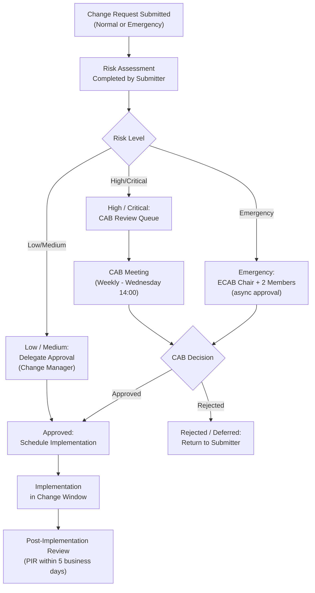

# ServiceNow — ITSM Standards

This page documents operational standards enforced within the ServiceNow platform, including incident priority, change risk scoring, CMDB naming conventions, SLA targets, and change governance procedures.

---

## Incident Priority Matrix

Priority is calculated from Impact × Urgency. ServiceNow evaluates this automatically on incident submission if auto-calculation is enabled (Business Rule: **Calculate Priority**).

| | **Urgency 1 — Critical** | **Urgency 2 — High** | **Urgency 3 — Medium** | **Urgency 4 — Low** |
|---|---|---|---|---|
| **Impact 1 — Enterprise** | P1 — Critical | P1 — Critical | P2 — High | P3 — Medium |
| **Impact 2 — Department** | P1 — Critical | P2 — High | P3 — Medium | P4 — Low |
| **Impact 3 — Individual** | P2 — High | P3 — Medium | P4 — Low | P4 — Low |

### Definitions

**Impact** — breadth of the disruption:

| Value | Definition |
|---|---|
| 1 — Enterprise | Multiple departments or a business-critical service unavailable |
| 2 — Department | One department or a significant service degraded |
| 3 — Individual | Single user or minor function affected |

**Urgency** — speed at which the business impact increases:

| Value | Definition |
|---|---|
| 1 — Critical | No workaround; business operations halting now |
| 2 — High | Workaround available but costly; significant degradation |
| 3 — Medium | Workaround available; limited business impact |
| 4 — Low | Cosmetic or trivial issue; business fully operational |

---

## SLA Targets

SLA clocks start when the incident moves to **In Progress** and pause when state is **On Hold - Awaiting Vendor** or **On Hold - Awaiting User**.

| Priority | Initial Response | Acknowledgement | Resolution Target |
|---|---|---|---|
| P1 — Critical | 15 minutes | 30 minutes | 4 hours |
| P2 — High | 30 minutes | 1 hour | 8 hours |
| P3 — Medium | 2 hours | 4 hours | 3 business days |
| P4 — Low | 8 hours | 1 business day | 10 business days |

**SLA breach notifications:**

- 75% elapsed — notification to assignee and assignment group manager
- 90% elapsed — escalation to service owner
- 100% elapsed (breach) — auto-escalation to director; OLA breach recorded

---

## Change Risk Scoring

Change risk is assessed using ServiceNow's **Change Risk Assessment** questionnaire. Risk score drives the approval workflow:

| Risk Score | Risk Level | CAB Required | Standard Window |
|---|---|---|---|
| 0–25 | Low | No | Any approved window |
| 26–50 | Medium | Optional (Delegate) | Approved window only |
| 51–75 | High | Yes | Approved change window |
| 76–100 | Critical | Full CAB + ECAB | Emergency window |

### Risk Assessment Factors (weighted inputs)

| Factor | Weight |
|---|---|
| Number of CIs affected | 20% |
| Is the CI in production? | 20% |
| Has this change been done before? | 15% |
| Rollback plan documented? | 15% |
| Testing in sub-production completed? | 15% |
| Off-hours implementation? | 15% |

---

## Change Types

| Type | Description | Auto-Approval | CAB |
|---|---|---|---|
| Standard | Pre-approved, low-risk, repeatable | Yes | No |
| Normal | Assessed, planned change | No | Yes (if High/Critical) |
| Emergency | Urgent fix, post-implementation review | CAB Chair only | ECAB |

**Standard Changes** must be registered in the Standard Change Catalog with a documented template before they can bypass the approval workflow.

---

## Change Advisory Board (CAB) Workflow


┌──────────────────────────────────── ServiceNow — Design Standards ────────────────────────────────────┐
│                                                                                                       │
│   ┌───────────────────────────────────────────────────────────────────────────────────────────────┐   │
│   │                         ServiceNow Design and Configuration Standards                         │   │
│   │                MID Server: min 4 vCPU / 8 GB RAM; Windows or Linux; n+1 for HA                │   │
│   │           Instance: prod/test/dev; clone prod to test monthly for regression testing          │   │
│   │             Script standards: always use GlideRecord; avoid cross-scope scripting             │   │
│   │          Change management: all SNOW config changes via Update Set; tracked in source         │   │
│   └───────────────────────────────────────────────────────────────────────────────────────────────┘   │
│                                                                                                       │
│    SNOW design standards govern MID sizing, scripting, and config management                          │
│                                                                                                       │
│                          ▼                                                 ▼                          │
│                                                                                                       │
│   ┌──────────────────────────────────────────────┐  ┌─────────────────────────────────────────────┐   │
│   │             MID Server Standards             │  │              Platform Standards             │   │
│   │               Min 4 vCPU/8 GB                │  │           Update Sets for changes           │   │
│   │              n+1 MID redundancy              │  │            Scripting: GlideRecord           │   │
│   │              Outbound 443 only               │  │            No cross-scope scripts           │   │
│   │            Dedicated MID per env             │  │            Test in sub-prod first           │   │
│   │              JVM: 4 GB heap min              │  │             CMDB: CI naming std             │   │
│   │             OS patching schedule             │  │            SLA definition review            │   │
│   └──────────────────────────────────────────────┘  └─────────────────────────────────────────────┘   │
│                                                                                                       │
│  Physical Infrastructure (the hardware everything above runs on):                                     │
│  MID Server VMs (prod/test/dev) · firewall allowing outbound 443 only                                 │
│                                                                                                       │
│  Key terms:                                                                                           │
│                                                                                                       │
│  Update Set    = container for SNOW config changes; migrate via XML export/import                     │
│  GlideRecord   = SNOW server-side API; always preferred over raw SQL or direct DB                     │
│  Cross-scope   = accessing data from different application scope; use public APIs                     │
│  MID HA        = n+1 MID Servers; SNOW auto-fails over to available MID                               │
│  Clone         = copy prod data to test/dev; Admin > System Clone > Clone Instance                    │
│  CI naming     = consistent CMDB naming: hostname in lowercase, FQDN preferred                        │
│  SLA definition = Agreement + SLA Definition + Workflow; reviewed quarterly                           │
│  Dedicated MID = separate MID Server per environment (prod/test) to avoid confusion                   │
│  JVM heap      = set in JAVA_OPTS in MID Server wrapper.conf; min 4 GB for prod                       │
│  Script scope  = ServiceNow app scope isolation; prevents cross-app data access                       │
│  Sub-prod test = always test Update Sets in test before applying to prod                              │
│  Outbound 443  = MID Server only needs outbound HTTPS to *.service-now.com                            │
│                                                                                                       │
└───────────────────────────────────────────────────────────────────────────────────────────────────────┘
```

| Token | Values | Example |
|---|---|---|
| `site` | 3-letter site code (LON, NYC, SYD, AWS, AZR) | `LON` |
| `type` | Server type abbreviation | `SRV`, `DB`, `LB`, `FW`, `SW` |
| `function` | Functional descriptor | `WEB`, `APP`, `MQ`, `CACHE` |
| `sequence` | Zero-padded 2-digit number | `01`, `02` |

**Examples:**

| CI Name | Meaning |
|---|---|
| `LON-SRV-WEB-01` | London data center, server, web tier, unit 1 |
| `NYC-DB-MYSQL-02` | New York, database server, MySQL, unit 2 |
| `AWS-LB-APP-01` | AWS hosted, load balancer, application tier, unit 1 |
| `AZR-SRV-APP-03` | Azure hosted, server, application tier, unit 3 |

### CI Class Mapping

| Infrastructure Type | CMDB Class |
|---|---|
| Physical server | `cmdb_ci_server` |
| Virtual machine | `cmdb_ci_vmware_instance` |
| Cloud VM (AWS) | `cmdb_ci_ec2_instance` |
| Cloud VM (Azure) | `cmdb_ci_azure_virtualmachine` |
| Network device | `cmdb_ci_netgear` / `cmdb_ci_ip_switch` |
| Database | `cmdb_ci_database` |
| Application | `cmdb_ci_appl` |
| Business service | `cmdb_ci_service` |

### Prohibited Naming Patterns

- Generic names: `server1`, `test`, `temp`, `myapp`
- IP addresses as CI names
- Spaces or special characters (underscores permitted)
- Duplicate names within the same CI class

---

## CMDB Data Quality Standards

| Attribute | Mandatory | Source |
|---|---|---|
| Name | Yes | Discovery / manual |
| IP Address | Yes (servers) | Discovery |
| OS | Yes (servers) | Discovery |
| Owner (support group) | Yes | Manual / LDAP |
| Environment | Yes | Discovery tag / manual |
| Location | Yes | Discovery / manual |
| Managed by | Recommended | LDAP / manual |

CI completeness is measured by the **CMDB Health Dashboard**. Target: >90% completeness score for Tier 1 CIs.
