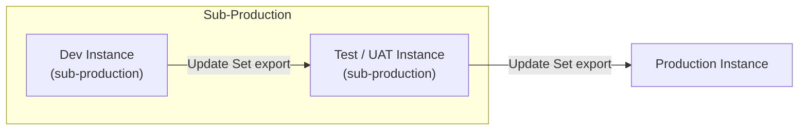
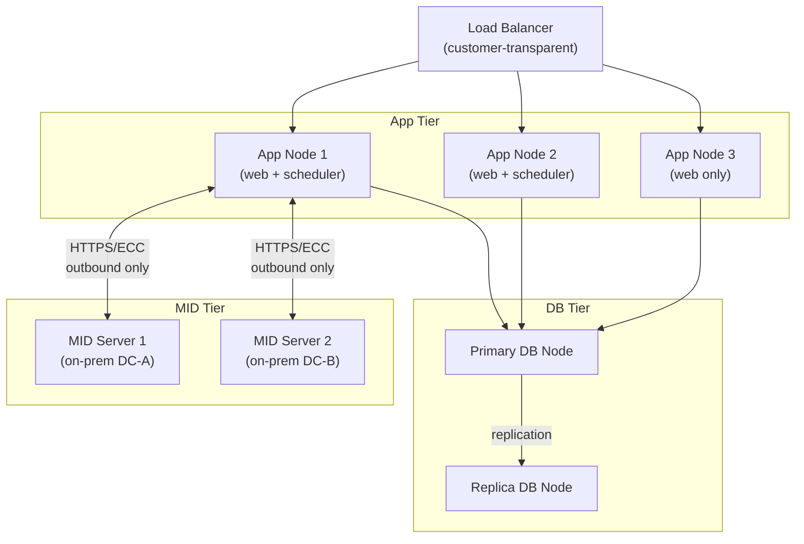
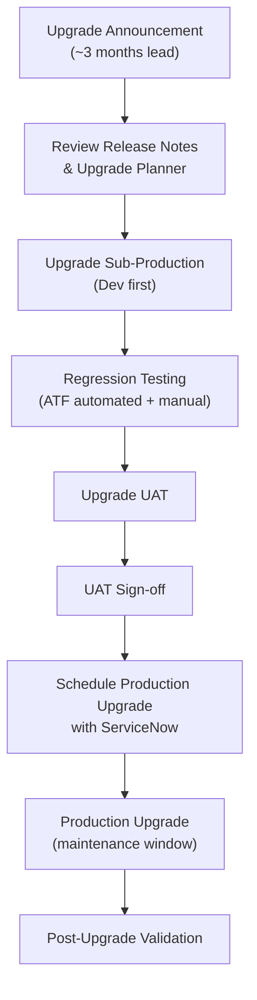

# ServiceNow — How It Works

ServiceNow is delivered as a multi-instance SaaS platform running on dedicated infrastructure per customer. Each customer receives isolated database, application, and storage layers — there is no shared compute between tenants.

---

## Multi-Instance Cloud Model

| Characteristic | Detail |
|---|---|
| Database engine | MariaDB (MySQL-compatible) |
| App server | Java / Jetty |
| Storage | SAN-backed, encrypted at rest |
| Redundancy | Active-active within a data center zone |
| Regions | Americas, EMEA, AP-Southeast, GovCloud |
| SLA | 99.8% uptime (standard), 99.95% (Hi) |

Each instance receives a URL in the form `https://<instance-name>.service-now.com`.

---

## Instance Hierarchy

Most enterprise deployments maintain a minimum of three instances arranged in a promotion pipeline:

**Promotion rules:**
- No direct change to production without prior UAT validation
- Update Sets must be in **Complete** state before export
- Peer review required before marking an Update Set complete

---

## Platform Node Topology

Within a production instance, ServiceNow runs multiple application nodes behind a load balancer:

MID Servers are customer-managed Java agents deployed on-premises. All communication is **outbound from MID Server to the instance** (port 443), eliminating inbound firewall requirements.

---

## Key Platform Components

### Now Platform (Core)

| Component | Function |
|---|---|
| Workflow Engine | Visual process automation (Flow Designer / Legacy WF) |
| Service Catalog | Self-service request portal |
| Notification Engine | Email, SMS, push via notification rules |
| Scripting Runtime | Server-side JavaScript (Rhino/GraalVM) |
| Update Set Manager | Change packaging and instance promotion |
| Scheduled Jobs | Background execution framework |

### ITSM

| Process | Key Table | SLA Driven |
|---|---|---|
| Incident Management | `incident` | Yes |
| Problem Management | `problem` | No |
| Change Management | `change_request` | No |
| Service Request | `sc_request` / `sc_req_item` | Yes |
| Knowledge Base | `kb_knowledge` | No |

### CMDB

The Configuration Management Database stores Configuration Items (CIs) and their relationships.

- Base CI class: `cmdb_ci`
- Relationship table: `cmdb_rel_ci`
- Identification and Reconciliation Engine (IRE) deduplicates data from multiple discovery sources

### Discovery

Automated infrastructure discovery using MID Servers:

1. Scheduled probes run against IP ranges or cloud accounts
2. MID Server executes discovery scripts (SSH, WMI, SNMP, APIs)
3. Payload data is parsed and mapped to CMDB CI classes via IRE
4. Reconciliation order enforced by source ranking (authoritative source wins)

---

## Upgrade Lifecycle

ServiceNow releases two major versions per year. Cloud instances are auto-upgraded by ServiceNow on a negotiated schedule.

| Phase | Owner | Duration |
|---|---|---|
| Release notes review | Platform team | 1 week |
| Dev upgrade + testing | Platform team + developers | 2–3 weeks |
| UAT upgrade + sign-off | Business stakeholders | 1–2 weeks |
| Production upgrade scheduling | ServiceNow + customer | 1 week |
| Production upgrade window | ServiceNow (automated) | 2–4 hours |
| Post-upgrade validation | Platform team | 1 day |
