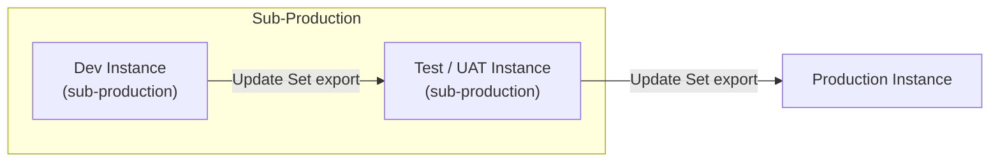
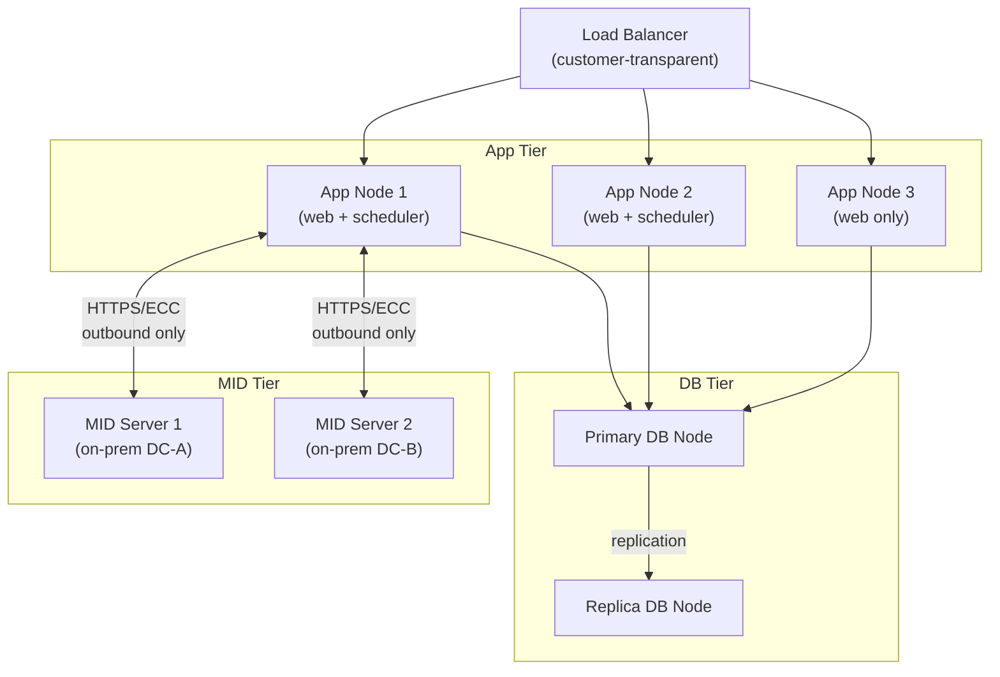
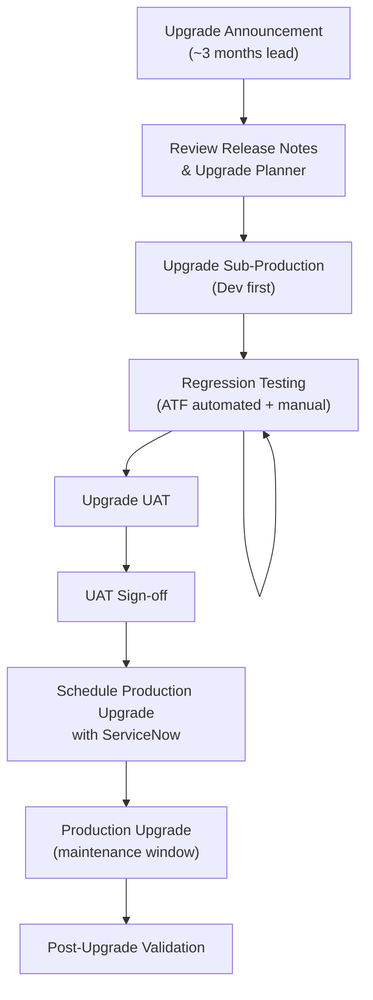

# ServiceNow — Architecture Overview

ServiceNow is delivered as a multi-instance SaaS platform running on dedicated infrastructure per customer. Each customer receives isolated database, application, and storage layers — there is no shared compute between tenants. Understanding the platform architecture is essential for capacity planning, integration design, and change management.

---

## Multi-Instance Cloud Model

ServiceNow runs customer instances in geographically distributed data centers. Each instance is a full stack: dedicated VMs (or containers), a MariaDB-compatible database cluster, and a Java-based application server (Jetty/Tomcat). Customer data never co-mingles with other tenants.

| Characteristic | Detail |
|---|---|
| Database engine | MariaDB (MySQL-compatible) |
| App server | Java / Jetty |
| Storage | SAN-backed, encrypted at rest |
| Redundancy | Active-active within a data center zone |
| Regions | Americas, EMEA, AP-Southeast, GovCloud |
| SLA | 99.8% uptime (standard), 99.95% (Hi) |

Each instance receives a URL in the form `https://<instance-name>.service-now.com`. Sub-production instances typically follow a naming convention such as `<instance-name>dev`, `<instance-name>test`, and `<instance-name>uat`.

---

## Instance Hierarchy

Most enterprise deployments maintain a minimum of three instances arranged in a promotion pipeline:

```
Sub-Production (Dev) → Sub-Production (Test/UAT) → Production
```

Changes are developed in Dev, validated in Test/UAT, then promoted to Production via Update Sets or CI/CD pipelines (ServiceNow DevOps or GitHub Actions via the ServiceNow CLI).



### Promotion Rules

- No direct change to production without prior UAT validation
- Update Sets must be in **Complete** state before export
- Peer review required before marking an Update Set complete
- Emergency fixes follow a separate Fast-Track CAB process (see [Standards](../standards/))

---

## Platform Zoning and Node Topology

Within a production instance, ServiceNow runs multiple application nodes behind a load balancer. Nodes are categorized by role:



**Key points:**

- App nodes communicate with the DB tier over an internal private network
- MID Servers are customer-managed Java agents deployed on-premises; all communication is **outbound from MID Server to the instance** (port 443), eliminating inbound firewall requirements
- The load balancer is fully managed by ServiceNow; customers do not configure it

---

## Key Platform Components

### Now Platform (Core)

The foundational layer all applications share:

| Component | Function |
|---|---|
| Workflow Engine | Visual process automation (Flow Designer / Legacy WF) |
| Service Catalog | Self-service request portal |
| Notification Engine | Email, SMS, push via notification rules |
| Scripting Runtime | Server-side JavaScript (Rhino/GraalVM) |
| Update Set Manager | Change packaging and instance promotion |
| Scheduled Jobs | Background execution framework |

### ITSM

Covers Incident, Problem, Change, Request, and Knowledge Management. The ITSM suite is the baseline for most enterprise deployments:

| Process | Key Table | SLA Driven |
|---|---|---|
| Incident Management | `incident` | Yes |
| Problem Management | `problem` | No |
| Change Management | `change_request` | No |
| Service Request | `sc_request` / `sc_req_item` | Yes |
| Knowledge Base | `kb_knowledge` | No |

### CMDB

The Configuration Management Database stores Configuration Items (CIs) and their relationships. Discovery populates and reconciles CI data automatically.

- Base CI class: `cmdb_ci`
- Relationship table: `cmdb_rel_ci`
- Service maps built from CI relationships
- Identification and Reconciliation Engine (IRE) deduplicates data from multiple discovery sources

### Discovery

Automated infrastructure discovery using MID Servers:

1. Scheduled probes run against IP ranges or cloud accounts
2. MID Server executes discovery scripts (SSH, WMI, SNMP, APIs)
3. Payload data is parsed and mapped to CMDB CI classes via IRE
4. Reconciliation order enforced by source ranking (authoritative source wins)

### Orchestration

Extends Flow Designer and Workflow Engine to execute remote operations via MID Server (run scripts, call APIs, invoke PowerShell on Windows hosts). Used for automated remediation, provisioning, and CI/CD integration.

---

## Upgrade Lifecycle

ServiceNow releases two major versions per year (Washington DC, Xanadu, Yokohama…). Cloud instances are auto-upgraded by ServiceNow on a schedule negotiated with the customer.



| Phase | Owner | Duration |
|---|---|---|
| Release notes review | Platform team | 1 week |
| Dev upgrade + testing | Platform team + developers | 2–3 weeks |
| UAT upgrade + sign-off | Business stakeholders | 1–2 weeks |
| Production upgrade scheduling | ServiceNow + customer | 1 week |
| Production upgrade window | ServiceNow (automated) | 2–4 hours |
| Post-upgrade validation | Platform team | 1 day |

**Skipped versions policy:** ServiceNow supports upgrading across one or more versions. However, skipping more than two major releases is not recommended — see [Install & Upgrade](../../operations/install-upgrade/) for detailed guidance.

---

## In this section

<div class="kb-grid kb-grid-3">
<a class="kb-card" href="components/"><strong>Components</strong><span>Core components, services, and technical specifications.</span></a>
<a class="kb-card" href="integrations/"><strong>Integrations</strong><span>Integration with other platforms and external systems.</span></a>
<a class="kb-card" href="standards/"><strong>Standards</strong><span>Sizing guidelines, design standards, and best practices.</span></a>
</div>
