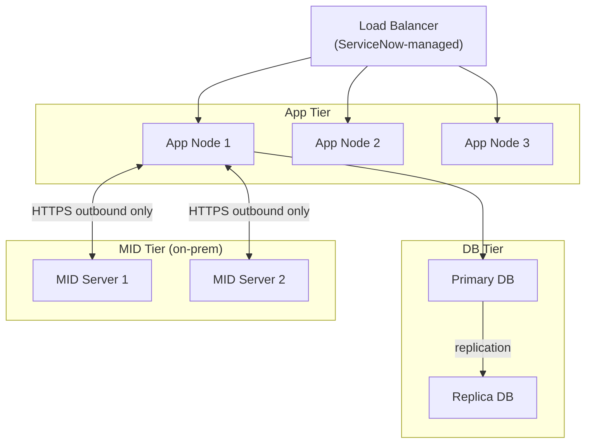

# ServiceNow — Architecture

ServiceNow is a multi-instance SaaS platform with fully isolated per-customer stacks. On-premises integration is handled via MID Servers — outbound-only Java agents that eliminate inbound firewall requirements.

<a class="kb-card" href="how-it-works/"><strong>How It Works</strong>Instance model, node topology, MID Servers, platform components, and upgrade lifecycle.</a>
<a class="kb-card" href="integrations/"><strong>Integrations</strong>Integration with other platforms and external systems.</a>
<a class="kb-card" href="design-standards/"><strong>Design Standards</strong>Sizing guidelines, design standards, and best practices.</a>

---

## Instance Hierarchy

| Instance | Purpose |
|---|---|
| Dev | Development and initial testing |
| Test / UAT | Validation before production promotion |
| Production | Live environment |

---

## Platform Node Topology

