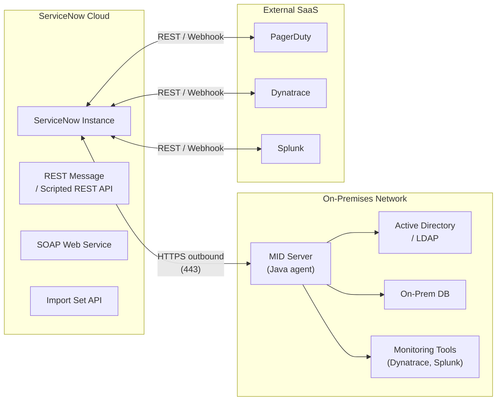
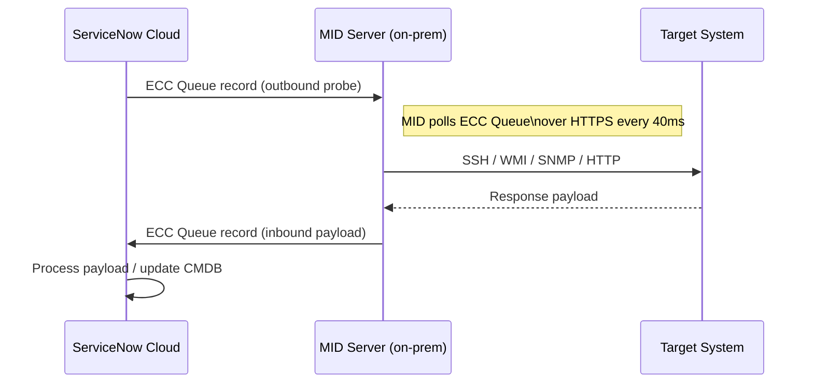
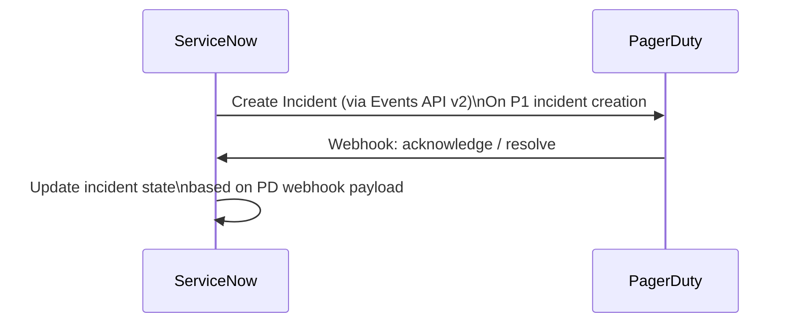

# ServiceNow — Integration Patterns


<div class="kb-summary">
ServiceNow is designed as an integration hub as much as an ITSM platform. Integration patterns range from simple REST API calls to complex bidirectional event streams via MID Servers. This page covers the primary patterns in use.
</div>

---

## Integration Architecture Overview


┌─────────────────────────────── ServiceNow — Architecture Integrations ────────────────────────────────┐
│                                                                                                       │
│   ┌───────────────────────────────────────────────────────────────────────────────────────────────┐   │
│   │                                ServiceNow Integration Landscape                               │   │
│   │                 Auth: SAML SSO (Okta/ADFS); MFA at IdP; LDAP user provisioning                │   │
│   │               ITSM integrations: Jira (sync), PagerDuty (alert), Slack (notify)               │   │
│   │            Monitoring: Zabbix/Prometheus/Datadog → SNOW event via REST or MID probe           │   │
│   │            REST Table API: create/update incidents from external systems via HTTPS            │   │
│   └───────────────────────────────────────────────────────────────────────────────────────────────┘   │
│                                                                                                       │
│    ServiceNow sits at the integration centre of ops tooling ecosystem                                 │
│                                                                                                       │
│                  ▼                                ▼                                ▼                  │
│                                                                                                       │
│   ┌─────────────────────────────┐  ┌─────────────────────────────┐  ┌─────────────────────────────┐   │
│   │       Identity & Auth       │  │       Dev & ITSM Tools      │  │          Monitoring         │   │
│   │     SAML SSO (Okta/ADFS)    │  │       Jira: issue sync      │  │        Zabbix alerts        │   │
│   │      LDAP provisioning      │  │     PagerDuty: escalate     │  │      Prometheus events      │   │
│   │         MFA via IdP         │  │        Slack: notify        │  │        Datadog events       │   │
│   │      OAuth 2.0 API auth     │  │     Confluence: KB link     │  │          SNMP traps         │   │
│   │     Basic auth (legacy)     │  │        Bitbucket PRs        │  │        Syslog ingest        │   │
│   └─────────────────────────────┘  └─────────────────────────────┘  └─────────────────────────────┘   │
│                                                                                                       │
│  Physical Infrastructure (the hardware everything above runs on):                                     │
│  IdP (Okta/ADFS) · LDAP/AD · MID Server VM · SMTP relay · network connectivity                        │
│                                                                                                       │
│  Key terms:                                                                                           │
│                                                                                                       │
│  SAML SSO     = ServiceNow supports SAML 2.0; configure under System Properties > SSO                 │
│  LDAP provisioning = ServiceNow LDAP integration creates/updates users from AD                        │
│  Table API    = REST endpoint for CRUD on any table; used by external integrations                    │
│  Jira sync    = Jira issues linked to SNOW changes via webhook or REST                                │
│  PagerDuty    = incident alert routing; SNOW triggers PagerDuty via REST outbound                     │
│  Slack        = SNOW sends notifications to Slack channels via Integration Hub                        │
│  OAuth 2.0    = recommended API auth method; create OAuth app under System OAuth                      │
│  SNMP trap    = network device alert; received by MID Server or event connector                       │
│  Syslog       = log stream from servers; parsed by SNOW event connector                               │
│  MID probe    = MID Server sensor that polls target systems for monitoring data                       │
│  Event connector = SNOW module that receives external events and creates incidents                    │
│  Integration Hub = pre-built action library for REST, JDBC, LDAP flow steps                           │
│                                                                                                       │
└───────────────────────────────────────────────────────────────────────────────────────────────────────┘
```text

---

## SOAP Web Services

Legacy integrations often use SOAP. ServiceNow auto-generates WSDL for every table:

```text
https://<instance>.service-now.com/<table_name>.do?WSDL
```

Inbound SOAP is consumed via **Web Service Import Sets** or direct table SOAP endpoints. Outbound SOAP is configured under **System Web Services > Outbound > SOAP Message**.

SOAP is considered legacy — prefer REST for new integrations.

---

## MID Server Architecture

The Management, Instrumentation, and Discovery (MID) Server is a Java application running on a customer-managed host. It bridges the ServiceNow cloud and on-premises resources.

### MID Server Communication Flow



### ECC Queue

The External Communication Channel (ECC) Queue is the asynchronous message bus between the instance and MID Servers. MID Servers long-poll the queue rather than listening on an open port.

| Queue Direction | Meaning |
|---|---|
| Output | Instance → MID (commands, probes) |
| Input | MID → Instance (results, payloads) |

**ECC Queue monitoring:** Navigate to **MID Server > ECC Queue** and filter by `state = error` to surface failed communication records.

### MID Server Sizing Guidelines

| Workload | Min RAM | Min CPU | Max concurrent probes |
|---|---|---|---|
| Light (Discovery only, <500 CIs) | 4 GB | 2 vCPU | 50 |
| Medium (<5,000 CIs + Orchestration) | 8 GB | 4 vCPU | 100 |
| Heavy (>5,000 CIs + Orchestration + JDBC) | 16 GB | 8 vCPU | 200 |

### MID Server High Availability

Deploy a minimum of two MID Servers per on-premises zone. ServiceNow load-balances probes across validated MID Servers in the same cluster. If one MID Server fails, the instance automatically routes work to the remaining healthy MID Servers.

Configure MID Server clusters under **MID Server > Clusters**.

---

## LDAP / Active Directory Integration

ServiceNow uses LDAP to import and authenticate users from AD.

### Configuration Path

**System LDAP > LDAP Server**

Key fields:

| Field | Example Value |
|---|---|
| Server URL | `ldaps://dc01.corp.example.com:636` |
| User | `CN=svc-snow,OU=Service Accounts,DC=corp,DC=example,DC=com` |
| Base DN | `DC=corp,DC=example,DC=com` |
| Encryption | SSL/TLS (recommended) |

### LDAP Import Schedule

LDAP imports run via a scheduled job. The default interval is once per day; increase frequency if near-real-time user provisioning is required. The import maps LDAP attributes to `sys_user` table fields via **LDAP OU Definition** field map.

### LDAP Troubleshooting Quick Reference

| Symptom | Check |
|---|---|
| Import job errors | **LDAP > LDAP Listener Log** |
| Users not syncing | Verify Base DN and filter query |
| SSL handshake failures | Check certificate chain on LDAP server; import CA cert to ServiceNow keystore |
| Duplicate users | IRE deduplication rules on `sys_user` |

---

## Email Integration

ServiceNow sends and receives email natively.

**Inbound:** ServiceNow polls a configured mailbox (IMAP/POP3) and creates or updates records based on email rules. Configure under **System Mailboxes > Incoming**.

**Outbound:** SMTP relay configuration under **System Mailboxes > Outgoing**. For cloud instances, ServiceNow's shared SMTP infrastructure is used by default; a customer SMTP relay can be specified.

**Email Notification Rules** trigger on record insert/update and are filtered by condition, recipients, and email template.

---

## Monitoring Tool Integrations

### Dynatrace

ServiceNow provides a certified Dynatrace integration that pushes Dynatrace problem events as ServiceNow incidents via REST.

- Integration package: **ServiceNow Integration** in Dynatrace Hub
- Creates incidents on problem open; resolves on problem close
- Populates `cmdb_ci` lookup for affected entities
- Configuration on Dynatrace side: webhook URL = `https://<instance>.service-now.com/api/now/table/incident`

### Splunk

Two patterns are common:

1. **Splunk Phantom / SOAR → ServiceNow:** Create incidents/changes from Splunk playbooks via Table API
2. **ServiceNow → Splunk:** Outbound REST message sends alert or audit data to Splunk HEC

Splunk App for ServiceNow (available on Splunkbase) provides pre-built dashboards that query the ServiceNow Table API for incident, change, and CMDB data.

### PagerDuty

Bidirectional integration:



Configure via **PagerDuty** spoke in Flow Designer (ServiceNow Integration Hub) or manually via REST Messages. Required fields:
- `routing_key` (PagerDuty Integration Key)
- `dedup_key` (ServiceNow `sys_id` — prevents duplicate PD incidents)
