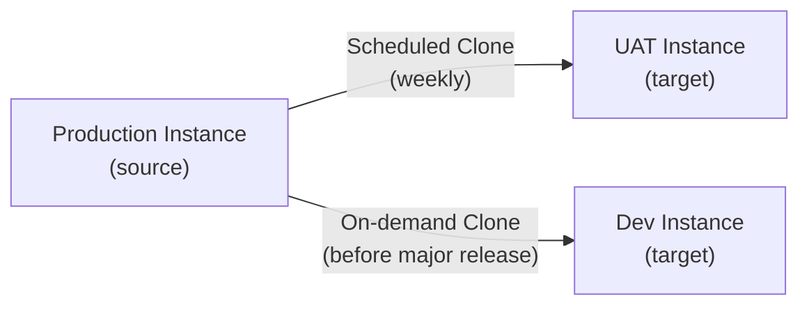

# ServiceNow — Backup & Restore

ServiceNow cloud instances do not expose direct database backup access. The primary mechanisms for instance protection and data recovery are **Instance Cloning** (for sub-production refresh and disaster recovery testing) and **Export Sets** (for selective data export). This page covers both in detail.

---

## Instance Clone Overview

Instance cloning copies the full data and configuration of a source instance to a target instance. The most common use case is refreshing a sub-production instance with a recent production snapshot.



**What is cloned:**
- All table data (records)
- System configuration (properties, business rules, workflows)
- Update Sets (in Complete or In Progress state)
- Attachments and stored files

**What is excluded by default:**
- Instance-specific integration credentials (replaced by excluder)
- Email notification settings (can be suppressed post-clone)
- MID Server configuration records (MID re-registers after clone)

---

## Pre-Clone Checklist

Before initiating a clone, complete all items:

- [ ] Confirm clone target instance is not in active use (coordinate with development team)
- [ ] Export any in-progress Update Sets from the target that have not been promoted to production
- [ ] Note any custom scheduled jobs or integration URLs configured on the target — these will be overwritten
- [ ] Confirm the Clone Excluder list is up to date (see below)
- [ ] Verify clone target has adequate storage (ServiceNow manages this; confirm with ServiceNow support if target is smaller)
- [ ] Schedule clone during a low-activity window (clones take 2–8 hours depending on instance size)
- [ ] Notify affected teams via Change Request

---

## Configuring Clone Excluders

Clone excluders preserve specific records on the target instance, preventing them from being overwritten by the source data.

Navigate to: **System Clone > Exclude Tables**

Recommended excluders for sub-production targets:

| Table | Field | Reason |
|---|---|---|
| `sys_properties` | `name LIKE 'mid.%'` | Preserve MID Server config |
| `sys_properties` | `name LIKE 'glide.email%'` | Prevent production emails from sub-production |
| `sys_email_account` | All | Suppress email sending |
| `ecc_agent` | All | MID Server registrations |
| `oauth_entity` | All | OAuth tokens (replace post-clone) |
| `sys_certificate` | All | Instance certificates |

---

## Initiating a Clone (On-Demand)

1. Log in to the **target** sub-production instance as an administrator
2. Navigate to **System Clone > Request Clone**
3. Fill in the clone request form:

| Field | Value |
|---|---|
| Source instance | `<prod-instance-name>` |
| Target instance | (current instance — pre-filled) |
| Clone options | Select appropriate excluder profiles |
| Preserve theme | Optional (recommended: No — take production theme) |
| Notify on completion | Your email address |

4. Click **Submit**
5. A clone request is sent to ServiceNow. The instance becomes unavailable during the clone operation.
6. ServiceNow sends an email notification when the clone is complete.

---

## Scheduling Recurring Clones

Recurring clones are configured by raising a request with **ServiceNow Support** (HI portal). You cannot schedule recurring clones from the instance UI directly.

Information to provide in the HI request:

```
Subject: Schedule Recurring Clone - <instance-name>

- Source instance: <prod-instance>.service-now.com
- Target instance: <dev-instance>.service-now.com
- Frequency: Weekly
- Preferred day/time: Sunday 02:00 UTC
- Excluder profiles: [list]
- Notification email: <your-team-dl>
```

Typical schedule options: daily, weekly, bi-weekly, monthly.

---

## Post-Clone Validation Checklist

After a clone completes, validate the target instance before returning it to use:

### System Health

- [ ] Log in as admin — confirm no errors on homepage
- [ ] Navigate to **System Diagnostics > Stats** — confirm no critical alerts
- [ ] Check **MID Server > MID Servers** — MID Servers should auto-reconnect and show **Up** within 15 minutes
- [ ] Check **System Logs > All** — review for ERROR-level entries from the past hour

### Integration Validation

- [ ] Open **System Properties > Email** — confirm outbound email is **disabled** or pointing to a test mailbox
- [ ] Open each outbound REST Message and verify URLs point to non-production endpoints
- [ ] Review OAuth entity records — rotate or replace credentials as needed
- [ ] Verify LDAP server configuration points to the correct directory (production LDAP is usually acceptable for sub-production)

### Functional Validation

- [ ] Create a test incident and confirm assignment rules, notifications (to test mailbox), and SLA calculation work
- [ ] Run a Discovery scan against a test IP range and confirm CMDB population
- [ ] Execute a sample Flow Designer flow end-to-end
- [ ] Confirm Scheduled Jobs list matches expected configuration (not production)

### Data Integrity

- [ ] Spot-check record counts in key tables (incidents, changes, CIs) match expected production snapshot
- [ ] Confirm user list is current (LDAP import may need to be re-run)

---

## Data Export via Export Sets

For selective data backup or migration, use Export Sets rather than cloning.

### Creating an Export Set

1. Navigate to **System Import Sets > Export Sets**
2. Click **New**
3. Configure:

| Field | Value |
|---|---|
| Label | `Incident Export - 2026-Q2` |
| Table | `incident` |
| Filter | Encoded query (e.g., `active=true`) |
| Export columns | Select relevant fields |

4. Click **Export Now** or schedule via Export Schedule

### Export Formats

| Format | Use Case |
|---|---|
| XML | Full fidelity; reimportable via Import Sets |
| CSV | Analysis in Excel / data warehouse |
| JSON | REST consumer import |
| PDF | Audit evidence |
| Excel | Reporting |

### Reimporting from XML Export

1. Navigate to **System Import Sets > Load Data**
2. Choose **Import from XML file**
3. Upload the exported XML
4. Map to target table (usually auto-detected)
5. Run the Transform Map
6. Review import log for errors

---

## ServiceNow Backup Infrastructure (HI-Managed)

ServiceNow takes automated database snapshots of all customer instances at the infrastructure level. These are not directly accessible to customers but can be requested via the HI portal for specific point-in-time restores.

| Backup Type | Retention |
|---|---|
| Daily snapshots | 7 days |
| Weekly snapshots | 4 weeks |
| Monthly snapshots | 12 months |

**Requesting a HI-level restore:**

This is a last-resort option for catastrophic data loss. Raise a P1 case on the HI portal with:
- Instance name
- Target point-in-time (UTC)
- Description of the data loss event
- Business justification

ServiceNow SLA for restore initiation: 4 hours (P1 priority).
