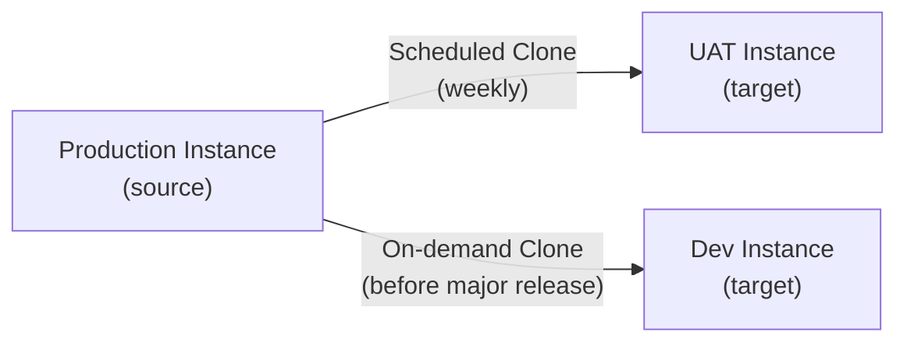

# ServiceNow — Backup & Restore


<div class="kb-summary">
ServiceNow cloud instances do not expose direct database backup access. The primary mechanisms for instance protection and data recovery are **Instance Cloning** (for sub-production refresh and disaster recovery testing) and **Export Sets** (for selective data export).
</div>

 This page covers both in detail.

---

## Instance Clone Overview

Instance cloning copies the full data and configuration of a source instance to a target instance. The most common use case is refreshing a sub-production instance with a recent production snapshot.


```
┌─────────────────────────────────── ServiceNow — Backup and Restore ───────────────────────────────────┐
│                                                                                                       │
│  ServiceNow SaaS backup model: ServiceNow manages infrastructure backups; tenant manages exports.     │
│                                                                                                       │
│   ┌──────────────────────────────────────────────┐  ┌─────────────────────────────────────────────┐   │
│   │          ServiceNow Managed Backups          │  │            Tenant-Managed Exports           │   │
│   │      Full DB backup: nightly automated       │  │     Data export: XML/CSV via sys_export     │   │
│   │      Retention: 7 days rolling snapshot      │  │      Scheduled export jobs → SFTP/email     │   │
│   │        Restore: raise P1 case with SN        │  │       Update Set export → XML archive       │   │
│   │        Clone: prod → sub-prod refresh        │  │     Table rotation: archive old records     │   │
│   └──────────────────────────────────────────────┘  └─────────────────────────────────────────────┘   │
│                                                                                                       │
│    Restore request via ServiceNow support; tenant exports supplement for self-service recovery        │
│                                                                                                       │
│                          ▼                                                 ▼                          │
│                                                                                                       │
│   ┌──────────────────────────────────────────────┐  ┌─────────────────────────────────────────────┐   │
│   │               Clone Procedures               │  │                Data Archival                │   │
│   │         Request clone from HI portal         │  │       Archive rule: age + record count      │   │
│   │        Pre-clone: export update sets         │  │        Destination: ar_ shadow tables       │   │
│   │       Post-clone: disable prod integr.       │  │       Destroy rule: purge after N days      │   │
│   │       Post-clone: reset user passwords       │  │       Compliance: audit log preserved       │   │
│   └──────────────────────────────────────────────┘  └─────────────────────────────────────────────┘   │
│                                                                                                       │
│  Physical Infrastructure (the hardware everything above runs on):                                     │
│  ServiceNow data centres · HI portal · SFTP export destination · sub-prod instances                   │
│                                                                                                       │
│  Key terms:                                                                                           │
│                                                                                                       │
│  HI portal    = ServiceNow internal support portal for instance management requests                   │
│  sys_export   = platform mechanism for scheduled or on-demand table data export                       │
│  Update Set   = container of customisations; exported as XML for promotion/backup                     │
│  Clone        = copy of production instance pushed to sub-prod; refreshes dev/test                    │
│  ar_ tables   = archive shadow tables; records moved here by archive rules                            │
│  Destroy rule = deletes archived records after configured retention period                            │
│  Table rotation= periodic job moves old closed records to archive to trim live DB                     │
│  P1 case      = priority 1 support case; required to trigger SN-managed restore                       │
│  Post-clone   = steps run after clone: disable integrations, reset passwords, notify                  │
│  SFTP export  = file transfer to tenant-owned server for off-platform data retention                  │
│  7-day window = SN retention period; restore only possible within this window                         │
│  Audit log    = sys_audit table; preserved through archival for compliance evidence                   │
│                                                                                                       │
└───────────────────────────────────────────────────────────────────────────────────────────────────────┘
```
```

Typical schedule options: daily, weekly, bi-weekly, monthly.

---

## Post-Clone Validation Checklist

After a clone completes, validate the target instance before returning it to use:

### System Health

- [ ] Log in as admin — confirm no errors on homepage
- [ ] Navigate to **System Diagnostics > Stats** — confirm no critical alerts
- [ ] Check **MID Server > MID Servers** — MID Servers should auto-reconnect and show **Up** within 15 minutes
- [ ] Check **System Logs > All** — review for ERROR-level entries from the past hour

### Integration Validation

- [ ] Open **System Properties > Email** — confirm outbound email is **disabled** or pointing to a test mailbox
- [ ] Open each outbound REST Message and verify URLs point to non-production endpoints
- [ ] Review OAuth entity records — rotate or replace credentials as needed
- [ ] Verify LDAP server configuration points to the correct directory (production LDAP is usually acceptable for sub-production)

### Functional Validation

- [ ] Create a test incident and confirm assignment rules, notifications (to test mailbox), and SLA calculation work
- [ ] Run a Discovery scan against a test IP range and confirm CMDB population
- [ ] Execute a sample Flow Designer flow end-to-end
- [ ] Confirm Scheduled Jobs list matches expected configuration (not production)

### Data Integrity

- [ ] Spot-check record counts in key tables (incidents, changes, CIs) match expected production snapshot
- [ ] Confirm user list is current (LDAP import may need to be re-run)

---

## Data Export via Export Sets

For selective data backup or migration, use Export Sets rather than cloning.

### Creating an Export Set

1. Navigate to **System Import Sets > Export Sets**
2. Click **New**
3. Configure:

| Field | Value |
|---|---|
| Label | `Incident Export - 2026-Q2` |
| Table | `incident` |
| Filter | Encoded query (e.g., `active=true`) |
| Export columns | Select relevant fields |

4. Click **Export Now** or schedule via Export Schedule

### Export Formats

| Format | Use Case |
|---|---|
| XML | Full fidelity; reimportable via Import Sets |
| CSV | Analysis in Excel / data warehouse |
| JSON | REST consumer import |
| PDF | Audit evidence |
| Excel | Reporting |

### Reimporting from XML Export

1. Navigate to **System Import Sets > Load Data**
2. Choose **Import from XML file**
3. Upload the exported XML
4. Map to target table (usually auto-detected)
5. Run the Transform Map
6. Review import log for errors

---

## ServiceNow Backup Infrastructure (HI-Managed)

ServiceNow takes automated database snapshots of all customer instances at the infrastructure level. These are not directly accessible to customers but can be requested via the HI portal for specific point-in-time restores.

| Backup Type | Retention |
|---|---|
| Daily snapshots | 7 days |
| Weekly snapshots | 4 weeks |
| Monthly snapshots | 12 months |

**Requesting a HI-level restore:**

This is a last-resort option for catastrophic data loss. Raise a P1 case on the HI portal with:
- Instance name
- Target point-in-time (UTC)
- Description of the data loss event
- Business justification

ServiceNow SLA for restore initiation: 4 hours (P1 priority).
