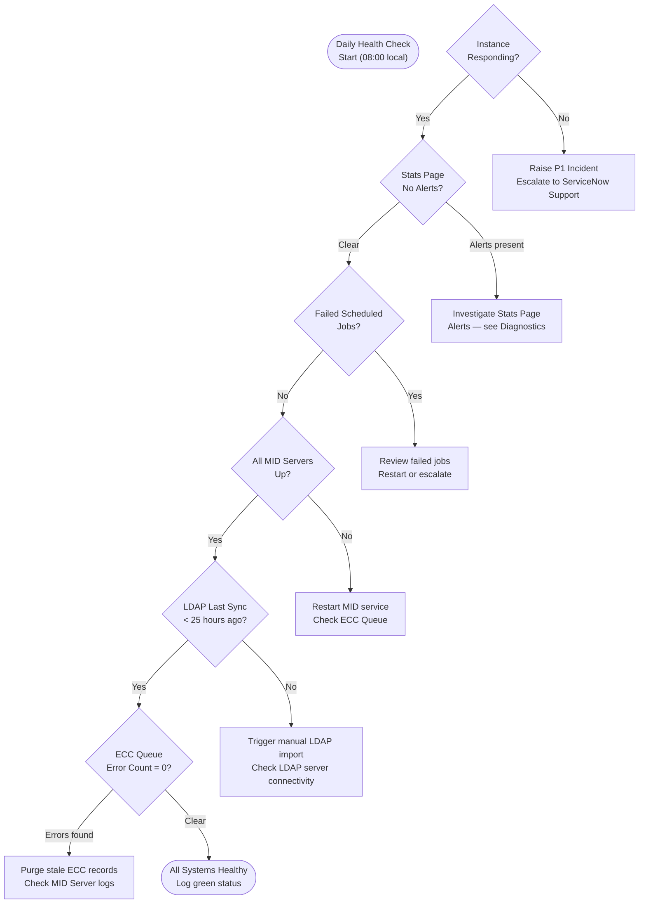

# ServiceNow — Health Checks

Routine health checks detect degradation before users are impacted. This page defines the daily, weekly, and on-demand checks for a ServiceNow production instance, covering availability, performance, background processing, and MID Server health.

---

## Health Check Decision Flow



---

## 1. Instance Availability

### Manual Check

Navigate to `https://<instance>.service-now.com/` and confirm:

- Login page renders in < 3 seconds
- No maintenance banner displayed
- Able to log in and reach the homepage

### Automated Check

```bash
#!/bin/bash
INSTANCE="https://mycompany.service-now.com"
HTTP_CODE=$(curl -s -o /dev/null -w "%{http_code}" \
  --max-time 10 "$INSTANCE/api/now/table/sys_user?sysparm_limit=1" \
  -u "$SN_USER:$SN_PASS" -H "Accept: application/json")

if [ "$HTTP_CODE" -ne 200 ]; then
  echo "ALERT: Instance returned HTTP $HTTP_CODE" >&2
  exit 1
fi
echo "OK: Instance responding (HTTP 200)"
```

### ServiceNow Status Page

Check `https://status.servicenow.com/` for any active incidents affecting your hosting region. Subscribe to RSS or email alerts for your data center zone.

---

## 2. Stats Page (Performance)

Navigate to: `https://<instance>.service-now.com/stats.do`

This is the primary performance dashboard. Key sections:

### System Information

| Metric | Healthy Range | Alert Threshold |
|---|---|---|
| Instance uptime | > 72h between restarts | Unexpected restart = P2 |
| Allocated heap | < 75% used | > 85% = investigate |
| Free memory | > 25% of allocated | < 15% = alert |
| Active sessions | Baseline ± 20% | Spike > 200% = investigate |
| DB connections | < 80% of pool | > 90% = alert |

### Threads

| Thread Pool | Healthy State | Red Flag |
|---|---|---|
| Worker threads | < 80% busy | All workers waiting or blocked |
| Scheduler threads | Running scheduled jobs | Stuck in WAIT state > 30 min |
| GlideRecord cache | Hit rate > 80% | Hit rate < 50% |

### Node Statistics (multi-node instances)

Check that all nodes show balanced session counts. A single node carrying > 60% of sessions indicates a load balancer issue.

---

## 3. Active Sessions

Navigate to: **System Diagnostics > Session Debug** or query directly:

```bash
# Count active sessions via API
curl -s -u "$SN_USER:$SN_PASS" \
  "$INSTANCE/api/now/stats/sys_user_session?sysparm_query=active=true&sysparm_count=true" \
  -H "Accept: application/json" | jq '.result.stats.count'
```

Baseline your active session count over 2 weeks to establish normal business-hours peaks. An unexplained 3x spike often indicates a script loop or runaway REST integration.

---

## 4. Scheduled Job Health

Navigate to: **System Scheduler > Scheduled Jobs**

Filter for jobs in **Error** state:

```
state = error
```

### Common Scheduled Jobs to Monitor

| Job Name | Expected Frequency | Impact if Failed |
|---|---|---|
| LDAP Import - Users | Daily | User accounts not synced |
| Discovery - Infrastructure | Daily / Weekly | CMDB stale |
| SLA Workflow | Every 5 minutes | SLA breach not escalated |
| Import Set Cleanup | Daily | Staging tables grow unbounded |
| Incident Inactivity Closer | Daily | Old incidents not auto-closed |
| Email Reader | Every 2 minutes | Inbound emails not processed |
| ATF Test Runner | On demand | Not applicable to production |

For any job in Error state:

1. Click the job to view the execution log
2. Check **System Logs > All** filtered to the job's last run time
3. Review the script for logic errors or external dependency failures
4. Manually trigger the job once the root cause is resolved

---

## 5. MID Server Health

Navigate to: **MID Server > MID Servers**

All production MID Servers should show **Status: Up** and **Validated: true**.

| Field | Healthy Value | Action if Not |
|---|---|---|
| Status | Up | Restart MID service on host |
| Validated | true | Check MID credentials; re-validate |
| Last refreshed | < 5 minutes ago | MID Server may be hung; restart |
| Version | Current or N-1 | Upgrade if two versions behind |

### MID Server Service Check (Linux)

```bash
# On the MID Server host
systemctl status mid-server

# Restart if needed
sudo systemctl restart mid-server

# Tail MID Server log
tail -f /opt/servicenow/mid/agent/logs/agent0.log.0
```

### MID Server Service Check (Windows)

```powershell
# Check service state
Get-Service -Name "ServiceNow MID Server_*"

# Restart
Restart-Service -Name "ServiceNow MID Server_myinstance"

# View log
Get-Content "C:\ServiceNow\MID Server\agent\logs\agent0.log.0" -Tail 50
```

---

## 6. ECC Queue Error Review

Navigate to: **MID Server > ECC Queue**

Filter: `state = error`

A healthy instance should have zero ECC queue errors. Errors indicate failed communication between the instance and MID Servers.

```bash
# Check ECC error count via API
curl -s -u "$SN_USER:$SN_PASS" \
  "$INSTANCE/api/now/stats/ecc_queue?sysparm_query=state=error&sysparm_count=true" \
  -H "Accept: application/json" | jq '.result.stats.count'
```

**Resolution steps:**

1. Identify the MID Server referenced in the error record
2. Check MID Server status (above)
3. If MID is Up but errors persist, check the **Error** field on the ECC record for the failure message
4. Stale error records older than 24 hours can be purged: change `state` to `processed` in bulk

---

## 7. LDAP / Directory Sync Status

Navigate to: **System LDAP > LDAP Listener Log**

Confirm the most recent successful run timestamp is within the last 25 hours (for daily sync schedules).

| Log Entry | Meaning |
|---|---|
| `Refreshed X users` | Successful import |
| `SSL handshake failed` | Certificate or connectivity issue |
| `Invalid credentials` | Service account password expired |
| `No records returned` | Base DN or filter misconfigured |

---

## 8. System Log Review

Navigate to: **System Logs > All**

Filter: `level = error`, `sys_created_on > last 1 hour`

Review for patterns:

- Repeated stack traces from the same script — indicates a bug in a business rule or script include
- Database timeout errors — high query load or missing index
- Outbound REST failures — external system unreachable
- Authentication failures — potential brute force or misconfigured integration account

---

## Health Check Log Template

Record daily health check results in a shared log (ticket, spreadsheet, or knowledge article):

```
Date: 2026-05-08
Checked by: C. Anastasiadis
Instance: mycompany.service-now.com

Availability:       PASS  (HTTP 200, login OK)
Stats page:         PASS  (heap 62%, no thread alerts)
Active sessions:    PASS  (142 — within baseline 120-160)
Scheduled jobs:     WARN  (LDAP Import failed — investigating)
MID Server health:  PASS  (MID1: Up, MID2: Up)
ECC queue errors:   PASS  (0 errors)
LDAP sync:          FAIL  (Last sync: 30 hours ago — see above)
System log errors:  PASS  (2 errors — duplicate key, non-critical)

Actions:
- Triggered manual LDAP import at 08:15 — resolved
- Opened INC0042187 for LDAP import job failure root cause
```
