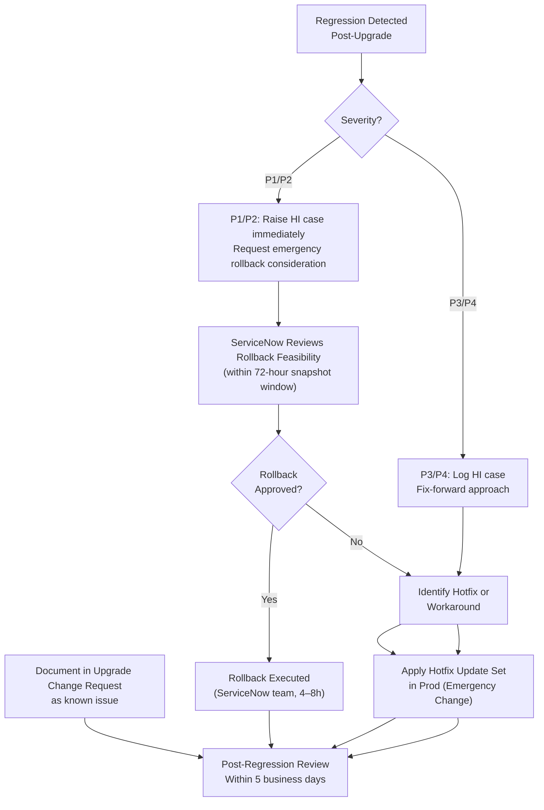

# ServiceNow — Escalation

This page defines the internal escalation matrix, ServiceNow support engagement procedures, SLA expectations for support cases, and the process for upgrade regression escalation.

---

## Internal Escalation Matrix

| Severity | Issue Type | First Responder | Escalate To (L2) | Escalate To (L3) | Management Notify |
|---|---|---|---|---|---|
| P1 | Instance down / unavailable | Platform Engineer on-call | Platform Lead | ServiceNow Support (P1 case) | Director of IT within 15 min |
| P1 | Data loss or corruption | Platform Lead | Platform Architect + DBA | ServiceNow Support (P1 case) | Director of IT + CISO within 15 min |
| P2 | Severe performance degradation | Platform Engineer | Platform Lead | ServiceNow Support (P2 case) | Manager within 30 min |
| P2 | Integration failure (production) | Platform Engineer | Integration Lead | ServiceNow Support if platform-related | Manager within 1 hour |
| P2 | MID Server down (all) | Platform Engineer | Platform Lead | ServiceNow Support if instance-side | Manager within 1 hour |
| P3 | Single process failure | Platform Engineer | Platform Lead as needed | — | — |
| P4 | Cosmetic / low-impact | Service Desk | Platform Engineer | — | — |

### On-Call Contact Details

Maintain the on-call roster in your team's incident management system (PagerDuty / OpsGenie). The contacts below are role-based:

| Role | Contact Method |
|---|---|
| Platform Engineer (on-call) | PagerDuty rotation: `servicenow-platform` |
| Platform Lead | Direct mobile + PagerDuty escalation |
| Platform Architect | Direct mobile (P1 only) |
| ServiceNow Support | HI portal + phone (P1 only) |

---

## ServiceNow Support Tiers

| Support Tier | ServiceNow Name | Included In |
|---|---|---|
| Standard | General Support | All contracts |
| Enhanced | Now Support Enhanced | Premier Success contracts |
| Premier | Named CSM + TAM | Enterprise / Premier Success |

Contact ServiceNow support via: `https://hi.service-now.com`

### Support Case Priority Mapping

| Your Business Priority | ServiceNow Case Priority | Expected Initial Response |
|---|---|---|
| P1 — Production down | P1 — Critical | 1 hour (24x7) |
| P2 — Severe degradation | P2 — High | 4 hours (24x7 for prod) |
| P3 — Moderate impact | P3 — Moderate | 8 business hours |
| P4 — Low impact | P4 — Low | 2 business days |
| Enhancement request | P5 | Best effort |

### ServiceNow Support SLA Table

| Priority | Initial Response | Update Frequency | Escalation Right |
|---|---|---|---|
| P1 | 1 hour | Every 2 hours | Request duty manager at 2 hours |
| P2 | 4 hours | Every 4 hours | Request duty manager at 8 hours |
| P3 | 8 business hours | Daily | — |
| P4 | 2 business days | Weekly | — |

---

## ServiceNow Support Ticket Template

Use this template when raising a case on the HI portal. A well-structured ticket reduces initial back-and-forth by 60–80%.

### P1 / P2 — Production Issue Template

```yaml
SUBJECT: [PROD] [P1] Instance unavailable — login page not loading

INSTANCE: mycompany.service-now.com
BUILD: Yokohama Patch 5 (check stats.do)
PRIORITY REQUESTED: P1 Critical
ISSUE START TIME: 2026-05-08 09:00 UTC

---
ISSUE DESCRIPTION:
Production instance is returning HTTP 503 for all requests since 09:00 UTC.
Users cannot log in. All business operations dependent on ServiceNow are halted.

IMPACT:
- 500+ users unable to access ServiceNow
- ITSM incident management unavailable
- Service desk operating on manual processes

STEPS TO REPRODUCE:
1. Navigate to https://mycompany.service-now.com
2. Observe HTTP 503 response (confirmed via curl from multiple locations)

WHAT HAS BEEN CHECKED:
- ServiceNow Status page (status.servicenow.com): No active incidents for EMEA
- stats.do: Unreachable
- Network: Outbound connectivity from user locations confirmed working

LOGS:
[Paste any available error messages]

DIAGNOSTICS ATTACHED:
- curl output showing 503 response
- Screenshot of status.servicenow.com

CONTACT:
Primary: Chris Anastasiadis, platform-team@example.com, +44-xxx-xxx-xxxx
Secondary: [Platform Lead name + contact]
```

### P3 — Functional Issue Template

```yaml
SUBJECT: [PROD] [P3] LDAP import scheduled job failing since 2026-05-06

INSTANCE: mycompany.service-now.com
BUILD: Yokohama Patch 5
PRIORITY REQUESTED: P3 Moderate

---
ISSUE DESCRIPTION:
The daily LDAP user import scheduled job has been failing since 2026-05-06.
New users onboarded in Active Directory are not being created in ServiceNow.

IMPACT:
~10 new starters per day cannot access ServiceNow. Workaround: manual user
creation. Impact is manageable short-term but needs resolution within 3 days.

STEPS TO REPRODUCE:
1. Navigate to System Scheduler > Scheduled Jobs
2. Filter for "LDAP Import - Users"
3. Observe status = Error since 2026-05-06 02:00 UTC

ERROR FROM LOGS (System Logs > All, 2026-05-06 02:00–02:05 UTC):
[PASTE log excerpt here]

LDAP SERVER CONFIGURATION:
Server: ldaps://dc01.corp.example.com:636
Base DN: DC=corp,DC=example,DC=com
Test Connection result: [Success / Failure]

WHAT HAS BEEN CHECKED:
- LDAP server reachable from ServiceNow (Test Connection = Success)
- Service account password valid (tested directly)
- No changes to LDAP OU structure known
- Issue started after Yokohama Patch 5 was applied on 2026-05-05

CONTACT:
Chris Anastasiadis, platform-team@example.com
```

---

## Information to Gather Before Escalating

Collect this information before opening a support case or escalating internally. Having it ready prevents a second round of questions.

### Always Gather

- [ ] Instance name and full URL
- [ ] ServiceNow version and patch level (`stats.do` > System Information)
- [ ] Exact time the issue started (UTC)
- [ ] Number of users/processes affected
- [ ] Steps to reproduce (specific, numbered)
- [ ] Screenshot of `stats.do` at time of issue
- [ ] Relevant log entries from **System Logs > All** (time-filtered)

### For Performance Issues

- [ ] Thread Monitor (`thread_monitor.do`) screenshot
- [ ] DB Activity Monitor screenshot showing slow queries
- [ ] Before/after comparison (e.g., "was fast before Patch 5")

### For Integration Failures

- [ ] MID Server status (name, version, status, last refreshed)
- [ ] ECC Queue error records (export as CSV)
- [ ] MID Server log excerpt (`agent0.log.0`) — last 200 lines
- [ ] Network connectivity test from MID Server host to instance

### For Workflow / Flow Issues

- [ ] Record `sys_id` of the affected record
- [ ] Workflow context or Flow execution `sys_id`
- [ ] Screenshot of the stalled execution showing which step failed
- [ ] Script extract from the failing activity

### For Upgrade Regressions

- [ ] Previous version and exact upgrade date/time
- [ ] Which Upgrade Planner skipped items were accepted
- [ ] ATF test results (pass/fail report)
- [ ] Specific functionality that broke (provide before/after behavior)

---

## Upgrade Regression Escalation Procedure

When a production upgrade causes a regression in critical functionality:



### Rollback Request Criteria

ServiceNow will consider rollback only when:

1. The regression is production-affecting at P1/P2 severity
2. The case is raised **within 72 hours** of the upgrade completing
3. There is no viable workaround that restores business function
4. The pre-upgrade snapshot has not been overwritten

### Communication During Escalation

- Update the internal incident every 30 minutes during active P1 escalation
- Post status updates in the team communications channel (Slack/Teams): `#platform-incidents`
- Maintain an incident timeline log for post-incident review
- Notify stakeholders via the major incident notification process

### Post-Escalation Actions

Within 5 business days of resolution:

- [ ] Root cause analysis completed
- [ ] Upgrade Change Request closed with lessons learned documented
- [ ] Preventive measures identified (e.g., additional ATF coverage, Upgrade Planner review improvements)
- [ ] Knowledge article created if the issue is likely to recur or affect other teams
