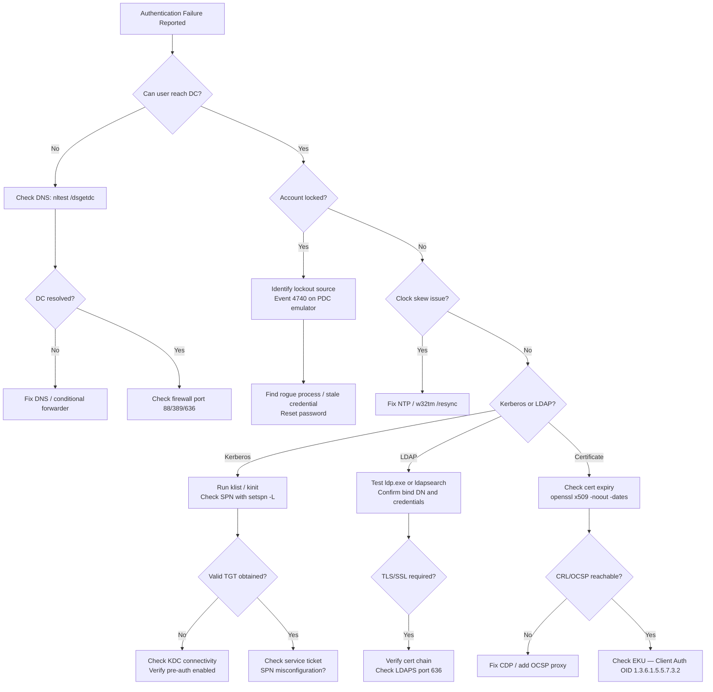

# Authentication Failures Troubleshooting

```
┌──────────────────────────────────────────────────────────────────────┐
│                   Auth Failure Triage Flow                           │
│                                                                      │
│  Login fails                                                         │
│        │                                                             │
│  ┌─────▼──────────────────────────────────────────────────────────┐ │
│  │  Is account locked? (Event 4740 on DC / net user <acct> /DOM) │ │
│  │  Yes ──► unlock account · identify lockout source             │ │
│  └─────┬──────────────────────────────────────────────────────────┘ │
│        │ not locked                                                 │
│  ┌─────▼──────────────────────────────────────────────────────────┐ │
│  │  Password expired? (Event 4625 code 0xC000006E)                │ │
│  │  Yes ──► reset password / update service account              │ │
│  └─────┬──────────────────────────────────────────────────────────┘ │
│        │ password ok                                                │
│  ┌─────▼──────────────────────────────────────────────────────────┐ │
│  │  LDAP/DC reachable? (ldapsearch · nltest /dsgetdc:domain)      │ │
│  │  Fail ──► firewall (88/389/636) · DNS resolution for DC       │ │
│  └─────┬──────────────────────────────────────────────────────────┘ │
│        │ DC reachable                                               │
│  ┌─────▼──────────────────────────────────────────────────────────┐ │
│  │  Clock drift? (KRB5KRB_AP_ERR_SKEW > 5 min)                   │ │
│  │  Yes ──► chronyc makestep / w32tm /resync /force              │ │
│  └─────┬──────────────────────────────────────────────────────────┘ │
│        │                                                             │
│  ┌─────▼──────────────────────────────────────────────────────────┐ │
│  │  Check SSO service (ADFS / vIDM / Okta) · SSSD / Winbind status│ │
│  └────────────────────────────────────────────────────────────────┘ │
└──────────────────────────────────────────────────────────────────────┘
```

## Overview

Authentication failures span multiple subsystems: Active Directory (Kerberos and NTLM), LDAP bind operations, certificate-based authentication, and MFA. This guide provides structured diagnosis from symptom to root cause with enterprise-grade tooling.

---

## Symptom Classification

| Symptom | Likely Subsystem | First Check |
|---|---|---|
| "Logon failure: unknown username or bad password" | AD / NTLM | Event 4625 on DC; account lockout status |
| "The referenced account is currently locked out" | AD lockout | Event 4740; lockout source IP |
| KRB5KDC_ERR_PREAUTH_FAILED | Kerberos pre-auth | Wrong password or disabled pre-auth |
| KRB5KRB_AP_ERR_SKEW | Kerberos clock skew | Time difference >5 min between client and KDC |
| KRB5KDC_ERR_C_PRINCIPAL_UNKNOWN | Kerberos | Account does not exist in target realm |
| LDAP error 49 (Invalid Credentials) | LDAP bind | Wrong bind DN or password |
| LDAP error 32 (No Such Object) | LDAP | Bind DN path incorrect |
| LDAP error 81 (Server Down) | LDAP network | Port 389/636 blocked or service down |
| SEC_E_CERT_EXPIRED | Certificate auth | Client or server cert expired |
| CRL check failed / OCSP unreachable | Certificate auth | CRL distribution point not reachable |
| MFA push not received | MFA | RADIUS proxy or MFA agent issue |
| "No logon servers available" | AD network | DC unreachable — DNS or firewall |

---

## Diagnostic Flowchart



---

## Kerberos Troubleshooting

### 1. Verify KDC Reachability

```powershell
# Locate the DC for the domain
nltest /dsgetdc:corp.example.com /kdc /force

# Expected output:
#           DC: \\dc01.corp.example.com
#      Address: \\10.10.1.10
#     Dom Guid: <GUID>
#     Dom Name: corp.example.com
#  Forest Name: corp.example.com
# Dc Site Name: Site-London
# Our Site Name: Site-London
#        Flags: PDC KDC DS LDAP GC WRITABLE DNS_DC DNS_DOMAIN DNS_FOREST CLOSE_SITE

# Test port 88 (Kerberos) directly
Test-NetConnection -ComputerName dc01.corp.example.com -Port 88
```

### 2. Inspect Current Tickets

```cmd
# List cached Kerberos tickets
klist

# Example output:
# Cached Tickets: (3)
# #0>     Client: jsmith @ CORP.EXAMPLE.COM
#         Server: krbtgt/CORP.EXAMPLE.COM @ CORP.EXAMPLE.COM
#         KerbTicket Encryption Type: AES-256-CTS-HMAC-SHA1-96
#         Start Time: 5/8/2026 08:12:00 (local)
#         End Time:   5/8/2026 18:12:00 (local)
#         Renew Until: 5/15/2026 08:12:00 (local)

# Purge stale tickets
klist purge

# Re-request TGT (Linux/Mac with MIT Kerberos)
kinit jsmith@CORP.EXAMPLE.COM
```

### 3. Clock Skew Detection

Kerberos requires clocks within 5 minutes. Skew >5 min causes KRB5KRB_AP_ERR_SKEW.

```powershell
# Check domain time sync status
w32tm /query /status

# Example output:
# Leap Indicator: 0(no warning)
# Stratum: 3 (secondary reference - syncd by (S)NTP)
# Precision: -23 (119.209ns per tick)
# Root Delay: 0.0151367s
# Root Dispersion: 0.0397949s
# Reference Id: 0xC0A8010A (source  dc01.corp.example.com)
# Last Successful Sync Time: 5/8/2026 8:10:22 AM

# Force resync
w32tm /resync /force

# Compare time between client and KDC
w32tm /stripchart /computer:dc01.corp.example.com /samples:5
```

### 4. SPN Diagnosis

```powershell
# List SPNs registered for a service account
setspn -L svc-sql

# Check for duplicate SPNs (common cause of auth failures)
setspn -X -F

# Example duplicate SPN output:
# Checking domain DC=corp,DC=example,DC=com
# Duplicate SPNs found!
# MSSQLSvc/sql01.corp.example.com:1433 is registered on:
#   CN=svc-sql,OU=ServiceAccounts,...
#   CN=sql01$,OU=Servers,...
```

---

## AD Account Lockout Investigation

### Locate Lockout Source

```powershell
# Check lockout status (run on PDC emulator or target DC)
Get-ADUser -Identity jsmith -Properties LockedOut, BadLogonCount, BadPasswordTime, LastBadPasswordAttempt |
    Select-Object Name, LockedOut, BadLogonCount, BadPasswordTime, LastBadPasswordAttempt

# Unlock account
Unlock-ADAccount -Identity jsmith

# Find the PDC emulator (lockouts are forwarded here)
(Get-ADDomain).PDCEmulator
```

### Search Security Event Logs

```powershell
# Event 4625 = Failed logon
# Event 4740 = Account locked out
# Event 4776 = NTLM credential validation attempt

# Search for lockout events on PDC emulator
Get-WinEvent -ComputerName pdc01 -FilterHashtable @{
    LogName   = 'Security'
    Id        = 4740
    StartTime = (Get-Date).AddHours(-2)
} | Select-Object TimeCreated, Message | Format-List

# Extract caller workstation from event 4740
Get-WinEvent -ComputerName pdc01 -FilterHashtable @{LogName='Security'; Id=4740} -MaxEvents 10 |
    ForEach-Object {
        $xml = [xml]$_.ToXml()
        [PSCustomObject]@{
            Time      = $_.TimeCreated
            User      = $xml.Event.EventData.Data | Where-Object Name -eq 'TargetUserName' | Select-Object -Expand '#text'
            Caller    = $xml.Event.EventData.Data | Where-Object Name -eq 'CallerComputerName' | Select-Object -Expand '#text'
        }
    }
```

---

## LDAP Bind Failure Diagnosis

```bash
# Linux: test anonymous and authenticated bind
ldapsearch -x -H ldap://dc01.corp.example.com -b "DC=corp,DC=example,DC=com" "(sAMAccountName=jsmith)"

# Test authenticated bind
ldapsearch -x -H ldap://dc01.corp.example.com \
  -D "CN=svc-ldap,OU=ServiceAccounts,DC=corp,DC=example,DC=com" \
  -W -b "DC=corp,DC=example,DC=com" "(sAMAccountName=jsmith)"

# Test LDAPS (port 636)
ldapsearch -x -H ldaps://dc01.corp.example.com:636 \
  -D "CN=svc-ldap,OU=ServiceAccounts,DC=corp,DC=example,DC=com" \
  -W -b "DC=corp,DC=example,DC=com" "(sAMAccountName=jsmith)"
```

### LDAP Result Codes

| Code | Meaning | Fix |
|---|---|---|
| 0 | Success | — |
| 32 | No Such Object | Verify base DN and bind DN path |
| 49 | Invalid Credentials | Wrong password or account locked |
| 52e | Invalid credentials (Windows extended) | Wrong password |
| 530 | Not permitted to logon at this time | Logon hours restriction |
| 531 | Not permitted to logon from this workstation | Workstation restriction |
| 533 | Account disabled | Enable the account |
| 701 | Account expired | Extend account expiry |
| 773 | Password must change | Force password reset |

---

## Certificate-Based Authentication Failures

```bash
# Check certificate expiry dates
openssl x509 -in /etc/ssl/certs/client.crt -noout -dates
# Output:
# notBefore=May  8 00:00:00 2025 GMT
# notAfter=May  8 23:59:59 2026 GMT

# Verify the full certificate chain
openssl verify -CAfile /etc/ssl/certs/ca-bundle.crt /etc/ssl/certs/client.crt

# Check CRL distribution point from certificate
openssl x509 -in /etc/ssl/certs/client.crt -noout -text | grep -A3 "CRL Distribution"

# Test OCSP manually
openssl ocsp -issuer issuer.crt -cert client.crt \
  -url http://ocsp.corp.example.com -text

# Check Extended Key Usage (must include Client Authentication)
openssl x509 -in client.crt -noout -text | grep -A2 "Extended Key Usage"
# Expected: TLS Web Client Authentication
```

```powershell
# Windows: check certificate store
Get-ChildItem Cert:\LocalMachine\My | Where-Object {$_.NotAfter -lt (Get-Date).AddDays(30)} |
    Select-Object Subject, NotAfter, Thumbprint

# Check NTAuth store (required for smart card / certificate logon to AD)
certutil -viewstore -enterprise NTAuth
```

---

## Kerberos Error Code Reference

| Error Code | Hex | Meaning | Common Cause |
|---|---|---|---|
| KDC_ERR_NONE | 0x0 | No error | — |
| KDC_ERR_C_PRINCIPAL_UNKNOWN | 0x6 | Client not found in Kerberos DB | Account doesn't exist or wrong realm |
| KDC_ERR_PREAUTH_FAILED | 0x18 | Pre-auth failed | Wrong password |
| KRB_AP_ERR_SKEW | 0x25 | Clock skew too large | >5 min time difference |
| KRB_AP_ERR_TKT_EXPIRED | 0x20 | Ticket expired | Clock issue or ticket TTL exceeded |
| KDC_ERR_BADOPTION | 0x11 | KDC cannot accommodate requested option | Constrained delegation misconfiguration |
| KDC_ERR_ETYPE_NOTSUPP | 0x1B | Encryption type not supported | RC4 disabled; client doesn't support AES |
| KDC_ERR_WRONG_REALM | 0x44 | Wrong realm | Cross-forest trust misconfiguration |

---

## Escalation Criteria

Escalate to Active Directory / Identity team when:

- Domain Controller is unreachable from multiple sites simultaneously
- Mass lockouts affecting >10 accounts within 15 minutes (potential credential stuffing)
- Kerberos encryption type changes (RC4 disabled) causing widespread failures
- Certificate Authority is offline or CRL is expired
- SPN conflicts cannot be resolved without schema-level investigation
- Federated identity (ADFS / Azure AD) trust failures affecting external access
- Smart card / PIV authentication failure affecting regulated users (compliance impact)

---

## Quick Reference: Time Sync Verification Chain

```
Authoritative NTP (Stratum 1)
        ↓
PDC Emulator DC (Stratum 2) ← All DCs sync here
        ↓
Domain Members / Servers (Stratum 3)
        ↓
VMs (sync from ESXi host OR domain — not both)
```

```powershell
# Verify which NTP server a machine is using
w32tm /query /peers

# Identify PDC emulator in domain
netdom query fsmo | findstr "PDC"
```
