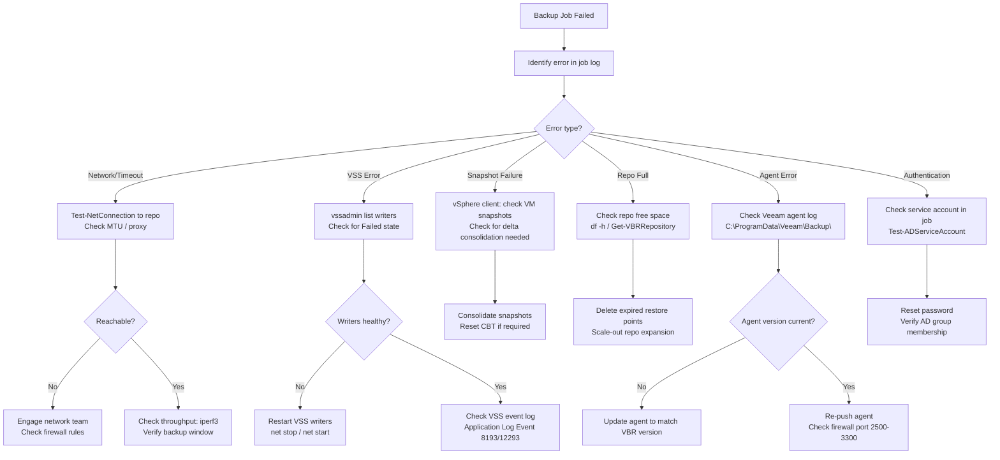

# Backup Failures Troubleshooting


<div class="kb-summary">
Backup Failures Troubleshooting reference covering Overview, Failure Classification, Diagnostic Flowchart, Commvault Troubleshooting, NetBackup Troubleshooting and 4 more sections.
</div>

## Overview

Backup failures directly degrade recovery capability. This guide covers failure classification and deep troubleshooting for Veeam Backup & Replication, Commvault, and Veritas NetBackup in enterprise environments. Address failures within the RTO window defined for each protection tier.

---

## Failure Classification

| Failure Type | Typical Symptom | Primary Tool | First Check |
|---|---|---|---|
| Network timeout | Job fails after X minutes; "connection reset" in log | ping, Test-NetConnection | MTU, firewall, proxy bypass |
| Agent error | Guest processing failed; VSS error in job log | Veeam Guest Log; Event Viewer | VSS writers, agent version |
| Repository full | "Not enough space" error; job aborted | df -h; Get-VBRRepository | Free capacity; maintenance mode |
| Snapshot failure | "Failed to create VM snapshot"; CBT error | vSphere events; VMware KB | VMware snapshot consolidation |
| VSS error | "Backup job completed with warnings"; app-consistent fail | vssadmin list writers | VSS writer state; service restart |
| Authentication failure | "Access denied" to guest or repository | Security event log | Service account credentials / SPNs |
| Catalog corruption | Restore points missing; import fails | Veeam catalog rebuild | Database consistency check |
| CBT reset | Full backup unexpectedly triggered | esxcli storage core; CBT flag | Reset CBT flag on VMDK |

---

## Diagnostic Flowchart


┌─────────────────────────────────────────── Backup Failures ───────────────────────────────────────────┐
│                                                                                                       │
│   ┌───────────────────────────────────────────────────────────────────────────────────────────────┐   │
│   │         Backup failures: job errors, proxy overload, repo full, snapshot stun, network        │   │
│   │             First check: job log → error code → check proxy/repo/network → resolve            │   │
│   └───────────────────────────────────────────────────────────────────────────────────────────────┘   │
│                                                                                                       │
│                  ▼                                ▼                                ▼                  │
│                                                                                                       │
│   ┌─────────────────────────────┐  ┌─────────────────────────────┐  ┌─────────────────────────────┐   │
│   │            Veeam            │  │          NetBackup          │  │          Commvault          │   │
│   │      ─────────────────      │  │      ─────────────────      │  │      ─────────────────      │   │
│   │      Proxy agent error      │  │       Media server err      │  │        MA agent error       │   │
│   │       Repository full       │  │           STU full          │  │      Disk library full      │   │
│   │       Snapshot removal      │  │       Snapshot timeout      │  │         VSS failure         │   │
│   │       VMware tools err      │  │        Client network       │  │        Subclient miss       │   │
│   │        Transport mode       │  │        Expired certs        │  │         Job schedule        │   │
│   └─────────────────────────────┘  └─────────────────────────────┘  └─────────────────────────────┘   │
│                                                                                                       │
│   │     Problem      │   First check    │        Fix        │      Verify      │   Escalate if    │   │
│   │ ──────────────── │ ──────────────── │ ───────────────── │ ──────────────── │──────────────────│   │
│   │    Job failed    │  Job log error   │   Per error code  │   Job retry OK   │ Persistent fail  │   │
│   │    Repo full     │  Repo capacity   │   Expire/expand   │   Space freed    │  No space avail  │   │
│   │  Snapshot fail   │   VMware tools   │    Update tools   │   Snapshot OK    │  Datastore full  │   │
│   │    Proxy err     │  Proxy CPU/RAM   │    Reduce tasks   │  Job completes   │ Agent reinstall  │   │
│                                                                                                       │
│    Key terms:                                                                                         │
│                                                                                                       │
│    Transport mode= Veeam: HotAdd, NBD, Direct SAN; wrong mode causes snapshot or perf issues          │
│    VSS           = Windows Volume Shadow Copy Service; required for consistent Windows backups        │
│    STU           = NetBackup Storage Unit; target for backup data; check capacity and path            │
│    Snapshot stun = ESXi: brief VM pause during snapshot create/commit; worse on large disks           │
│                                                                                                       │
└───────────────────────────────────────────────────────────────────────────────────────────────────────┘
```

### VSS Error Investigation

```cmd
rem List VSS writers and state
vssadmin list writers

rem Expected healthy output:
rem Writer name: 'SqlServerWriter'
rem    Writer Id: {a65faa63-5ea8-4ebc-9dbd-a0c4db26912a}
rem    Writer Instance Id: {xxxxxxxx-xxxx-xxxx-xxxx-xxxxxxxxxxxx}
rem    State: [1] Stable
rem    Last error: No error

rem A failed writer shows:
rem    State: [8] Failed
rem    Last error: Retryable error
```

```powershell
# Restart common VSS writers
$writers = @(
    'VSS',
    'SQLWriter',
    'MSExchangeWriter',
    'System Writer'
)
foreach ($svc in @('VSS','SQLWriter','MSExchangeIS','BITS')) {
    Restart-Service -Name $svc -Force -ErrorAction SilentlyContinue
    Write-Host "Restarted $svc"
}
```

---

## Commvault Troubleshooting

### Job Status

```bash
# List recent backup jobs (run on CommServe or via CLI)
qlist job -t backup -n 20

# Example output:
# JOBID  TYPE    STATUS     CLIENT          SUBCLIENT   START              END
# 10234  Backup  Completed  srv-prod-db01   default     05/08 02:00:03     05/08 03:45:11
# 10235  Backup  Failed     srv-prod-app02  default     05/08 02:00:05     05/08 02:17:33

# Get failure reason for a specific job
qoperation execscript -sn QS_GetJobFailureReason -si 10235

# List active jobs
qlist job -t backup -st running
```

### Log Locations and Analysis

| Component | Log File |
|---|---|
| File System Agent | `/var/log/commvault/Log_Files/clBackup.log` |
| MediaAgent | `/var/log/commvault/Log_Files/CVMA.log` |
| cvfwd (network) | `/var/log/commvault/Log_Files/cvfwd.log` |
| CommServe | `C:\Program Files\Commvault\ContentStore\Log Files\cvd.log` |

```bash
# Check cvfwd log for network errors
grep -i "error\|fail\|timeout" /var/log/commvault/Log_Files/cvfwd.log | tail -50

# Check connectivity from client to MediaAgent
telnet mediaagent01.corp.example.com 8400
```

### Commvault Job Failure Reason Codes

| Code | Meaning | Fix |
|---|---|---|
| 19:65 | Network error between client and MA | Check firewall port 8400; verify cvfwd |
| 19:70 | MediaAgent offline | Start cvd service on MA |
| 14:61 | Disk library full | Extend disk library or prune old jobs |
| 9:77 | VSS snapshot failure | Investigate VSS writers on client |
| 69:59 | Tape drive offline | Physical check; clean drive |

---

## NetBackup Troubleshooting

### Job Status

```bash
# List recent jobs with status
bpdbjobs -report -all_columns -M master01.corp.example.com

# Filter failed jobs only
bpdbjobs -report -M master01 | grep " 1 " | head -20

# Get detailed job info
bpdbjobs -jobid 123456 -all_columns

# Query error detail
bperror -S master01 -jobid 123456 -l
```

### NetBackup Status Code Reference

| Status Code | Meaning | Fix |
|---|---|---|
| 0 | Successful | — |
| 13 | File read failed | Check permissions on backup path |
| 23 | Socket read failed | Network issue between client and master |
| 41 | Network connection timed out | Firewall; NB ports 1556, 13724 |
| 58 | Client timed out | Slow disk on client; increase CLIENT_READ_TIMEOUT |
| 83 | Media mount failure | Check robot / tape library |
| 99 | NDMP backup failure | Check NDMP service on NAS |
| 196 | Client backup was not attempted | Backup window missed; check schedule |

```bash
# Check backup client connectivity
bptestbpcd -client client01.corp.example.com

# Verify NetBackup daemon status on client
/usr/openv/netbackup/bin/bpps -a

# Check catalog health
bpdbm -consistency -M master01
```

---

## Repository Capacity Checks

```bash
# Linux: disk usage on repository mount
df -h /backup
# Filesystem      Size  Used Avail Use% Mounted on
# /dev/sdb1        20T   18T  2.0T  90% /backup

# Find largest directories consuming space
du -sh /backup/* | sort -rh | head -10

# Windows: check backup drive
Get-PSDrive -Name D | Select-Object Name, Used, Free |
    ForEach-Object {
        [PSCustomObject]@{
            Drive   = $_.Name
            UsedGB  = [math]::Round($_.Used/1GB, 1)
            FreeGB  = [math]::Round($_.Free/1GB, 1)
            UsedPct = [math]::Round($_.Used/($_.Used+$_.Free)*100, 1)
        }
    }
```

---

## Network Path Validation to Backup Target

```powershell
# Test TCP connectivity to backup repository (Veeam default ports 2500-3300)
Test-NetConnection -ComputerName repo01.corp.example.com -Port 2500
Test-NetConnection -ComputerName repo01.corp.example.com -Port 2501

# Measure throughput with iperf3 (install on both ends)
# Server side:
iperf3 -s -p 5201
# Client side:
iperf3 -c repo01.corp.example.com -p 5201 -t 30 -P 4

# Example good output:
# [SUM]   0.00-30.00  sec  33.8 GBytes  9.69 Gbits/sec    0   sender
```

---

## Top 10 Veeam Error Codes with Fixes

| Error | Message | Fix |
|---|---|---|
| Agent failed to process method {DataTransfer.SyncDisk} | CBT error on VMDK | Reset CBT: disable/enable CBT via PowerCLI |
| Cannot open VDDK transport: VDDK error 2 | VDDK library missing or version mismatch | Reinstall matching VDDK on proxy |
| Failed to call RPC function 'StartRPCServer' | Guest agent not responding | Re-push Veeam agent; check firewall 6160/6162 |
| Snapshot creation failed | VMware snapshot error | Consolidate existing snapshots; check VMFS space |
| Repository <name> is not accessible | Network/auth to repo | Verify share path; credentials; SMB port 445 |
| Warning: Cannot truncate transaction logs | SQL log truncation failed | Check SQL VSS writer; verify sysadmin on account |
| GetBackupFiles error — invalid path | Changed proxy or repo path | Rescan backup files; update job config |
| GFS retention policy conflict | Archival chain broken | Disable GFS temporarily; rebuild chain |
| Failed to check whether Veeam Installer Service is installed | WMI failure | Restart WMI service on guest |
| VDDK transport mode: SAN — no LUN access | SAN zoning or iSCSI IQN issue | Switch proxy to NBD mode; fix SAN zoning |

---

## Escalation Criteria

Escalate to backup vendor TAC or infrastructure team when:

- Any Tier-1 protected system has missed 2+ consecutive backup cycles
- Repository is above 85% capacity with no automated pruning available
- VSS writer failures persist after service restart (possible OS corruption)
- CBT resets are recurring on the same VM (VMware or storage-level issue)
- NetBackup master server catalog is reporting consistency errors
- Backup window is consistently exceeding the defined maintenance window
- DR test restore fails — RPO/RTO commitments at risk
- Ransomware suspected: check for mass deletion of restore points
