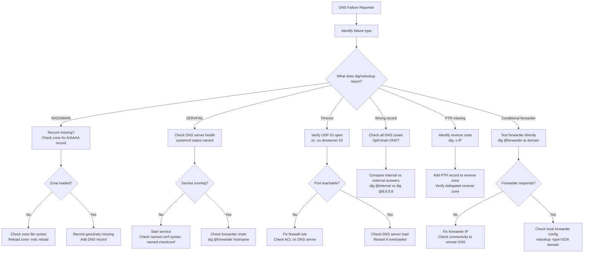

# DNS Resolution Failures


<div class="kb-summary">
DNS Resolution Failures reference covering Overview, Failure Classification, Diagnostic Flowchart, DNS Server Health Checks, Zone Transfer Verification and 6 more sections.
</div>

## Overview

DNS failures cascade rapidly across infrastructure: Kerberos authentication breaks without PTR records, NFS mounts fail, application service discovery stops, and vMotion can fail. This guide provides structured diagnosis from failure type through to resolution across Windows DNS and BIND/named environments.

---

## Failure Classification

| Failure Type | DNS Response | Symptom | Likely Cause |
|---|---|---|---|
| NXDOMAIN | Name does not exist | App cannot connect; "unknown host" | Missing A/AAAA record; wrong zone |
| SERVFAIL | Server failed | Intermittent failures; slow resolution | Forwarding loop; zone load failure |
| Timeout (no response) | No DNS answer | Complete resolution failure | DNS server down; firewall on UDP 53 |
| Wrong record returned | Resolves but wrong IP | App connects to wrong host; auth fails | Stale record; split-brain misconfiguration |
| PTR missing | Reverse lookup fails | Kerberos fails; NFS mount denied; SMTP rejected | PTR not created; reverse zone missing |
| Conditional forwarder broken | NXDOMAIN for external domain | Cross-domain trust auth fails | Forwarder IP wrong; firewall blocks |
| Cache poisoning | Incorrect cached answer | Security incident; intermittent wrong routing | DNSSEC failure; rogue response injected |

---

## Diagnostic Flowchart


┌─────────────────────────────────── DNS Resolution Troubleshooting ────────────────────────────────────┐
│                                                                                                       │
│   ┌───────────────────────────────────────────────────────────────────────────────────────────────┐   │
│   │          DNS failures: forward lookup fail, reverse fail, forwarder down, stale cache         │   │
│   │              Diagnose with: nslookup, dig, Resolve-DnsName, ipconfig /displaydns              │   │
│   └───────────────────────────────────────────────────────────────────────────────────────────────┘   │
│                                                                                                       │
│                          ▼                                                 ▼                          │
│                                                                                                       │
│   ┌──────────────────────────────────────────────┐  ┌─────────────────────────────────────────────┐   │
│   │             Diagnostic Commands              │  │                 Common Fixes                │   │
│   │      ─────────────────────────────────       │  │      ─────────────────────────────────      │   │
│   │           nslookup <host> <dns_ip>           │  │          Flush DNS cache on client          │   │
│   │             dig @<dns_ip> <host>             │  │          Check/restart DNS service          │   │
│   │              dig +trace <host>               │  │           Add missing A/PTR record          │   │
│   │              ipconfig /flushdns              │  │             Fix forwarder config            │   │
│   │             Resolve-DnsName (PS)             │  │          Replicate zone to all DCs          │   │
│   └──────────────────────────────────────────────┘  └─────────────────────────────────────────────┘   │
│                                                                                                       │
│   │     Problem      │    Diagnosis     │     Root cause    │       Fix        │      Verify      │   │
│   │ ──────────────── │ ──────────────── │ ───────────────── │ ──────────────── │──────────────────│   │
│   │ Fwd lookup fail  │  nslookup fails  │    No A record    │   Add A record   │ nslookup passes  │   │
│   │   Reverse fail   │ nslookup reverse │   No PTR record   │  Add PTR record  │   PTR resolves   │   │
│   │   Stale cache    │Wrong IP returned │   Cached record   │ Flush client DNS │    Correct IP    │   │
│   │  Forwarder fail  │  External fail   │   Forwarder down  │  Fix forwarder   │External resolves │   │
│                                                                                                       │
│    Key terms:                                                                                         │
│                                                                                                       │
│    Forwarder   = DNS server passing unresolved queries to upstream server (e.g., ISP or 8.8.8.8)      │
│    Split-brain = Internal and external DNS serving different records for same name                    │
│    TTL         = Time To Live; cached record duration; lower TTL speeds propagation                   │
│    PTR record  = Reverse DNS record; IP → hostname; required for many services and logs               │
│                                                                                                       │
└───────────────────────────────────────────────────────────────────────────────────────────────────────┘
```
┌─────────────────────────────────── DNS Resolution Troubleshooting ────────────────────────────────────┐
│                                                                                                       │
│   ┌───────────────────────────────────────────────────────────────────────────────────────────────┐   │
│   │          DNS failures: forward lookup fail, reverse fail, forwarder down, stale cache         │   │
│   │              Diagnose with: nslookup, dig, Resolve-DnsName, ipconfig /displaydns              │   │
│   └───────────────────────────────────────────────────────────────────────────────────────────────┘   │
│                                                                                                       │
│                          ▼                                                 ▼                          │
│                                                                                                       │
│   ┌──────────────────────────────────────────────┐  ┌─────────────────────────────────────────────┐   │
│   │             Diagnostic Commands              │  │                 Common Fixes                │   │
│   │      ─────────────────────────────────       │  │      ─────────────────────────────────      │   │
│   │           nslookup <host> <dns_ip>           │  │          Flush DNS cache on client          │   │
│   │             dig @<dns_ip> <host>             │  │          Check/restart DNS service          │   │
│   │              dig +trace <host>               │  │           Add missing A/PTR record          │   │
│   │              ipconfig /flushdns              │  │             Fix forwarder config            │   │
│   │             Resolve-DnsName (PS)             │  │          Replicate zone to all DCs          │   │
│   └──────────────────────────────────────────────┘  └─────────────────────────────────────────────┘   │
│                                                                                                       │
│   │     Problem      │    Diagnosis     │     Root cause    │       Fix        │      Verify      │   │
│   │ ──────────────── │ ──────────────── │ ───────────────── │ ──────────────── │──────────────────│   │
│   │ Fwd lookup fail  │  nslookup fails  │    No A record    │   Add A record   │ nslookup passes  │   │
│   │   Reverse fail   │ nslookup reverse │   No PTR record   │  Add PTR record  │   PTR resolves   │   │
│   │   Stale cache    │Wrong IP returned │   Cached record   │ Flush client DNS │    Correct IP    │   │
│   │  Forwarder fail  │  External fail   │   Forwarder down  │  Fix forwarder   │External resolves │   │
│                                                                                                       │
│    Key terms:                                                                                         │
│                                                                                                       │
│    Forwarder   = DNS server passing unresolved queries to upstream server (e.g., ISP or 8.8.8.8)      │
│    Split-brain = Internal and external DNS serving different records for same name                    │
│    TTL         = Time To Live; cached record duration; lower TTL speeds propagation                   │
│    PTR record  = Reverse DNS record; IP → hostname; required for many services and logs               │
│                                                                                                       │
└───────────────────────────────────────────────────────────────────────────────────────────────────────┘
```

### SRV Records (critical for AD/Kerberos)

```bash
# Locate Kerberos KDC for a domain
dig _kerberos._tcp.corp.example.com SRV

# Expected output:
# _kerberos._tcp.corp.example.com. 600 IN SRV 0 100 88 dc01.corp.example.com.
# _kerberos._tcp.corp.example.com. 600 IN SRV 0 100 88 dc02.corp.example.com.

# Locate LDAP servers
dig _ldap._tcp.corp.example.com SRV

# Locate PDC emulator
dig _kerberos._tcp.dc._msdcs.corp.example.com SRV
```

---

## DNS Server Health Checks

### Windows DNS (PowerShell)

```powershell
# Get DNS server configuration
Get-DnsServer -ComputerName dc01.corp.example.com | Select-Object *

# List all zones
Get-DnsServerZone -ComputerName dc01.corp.example.com |
    Select-Object ZoneName, ZoneType, IsAutoCreated, DynamicUpdate, ReplicationScope |
    Format-Table -AutoSize

# Check zone for specific record
Resolve-DnsName -Name app01.corp.example.com -Server dc01.corp.example.com -Type A

# Check conditional forwarders
Get-DnsServerZone -ComputerName dc01 | Where-Object {$_.ZoneType -eq 'Forwarder'} |
    Select-Object ZoneName, MasterServers

# Test DNS resolution and measure response time
Measure-Command { Resolve-DnsName -Name app01.corp.example.com -Server dc01 }

# Clear DNS server cache
Clear-DnsServerCache -ComputerName dc01 -Force

# Check DNS debug logging (enable for detailed diagnostics)
Set-DnsServerDiagnostics -ComputerName dc01 -All $true
# Logs to: C:\Windows\System32\dns\dns.log
```

### Linux (BIND / named)

```bash
# Check service status
systemctl status named
# or
systemctl status bind9

# Validate configuration syntax before restart
named-checkconf /etc/named.conf

# Validate zone file
named-checkzone corp.example.com /var/named/corp.example.com.zone

# Reload zones without restarting
rndc reload

# Flush DNS cache
rndc flush

# Check named statistics
rndc stats
cat /var/named/data/named_stats.txt | grep -E "queries|errors"

# Live query logging (enable temporarily)
rndc querylog on
tail -f /var/log/named/queries.log
```

---

## Zone Transfer Verification

```bash
# Test if zone transfer is permitted (AXFR)
dig AXFR corp.example.com @dc01.corp.example.com

# If permitted, output shows all zone records
# If blocked:
# ; Transfer failed.
# corp.example.com.  0  IN  SOA  dc01... (and no records)

# Check SOA serial number matches between primary and secondary
dig SOA corp.example.com @dc01.corp.example.com
dig SOA corp.example.com @dc02.corp.example.com
# Serial numbers must match after replication; mismatch = replication issue
```

---

## Conditional Forwarder Testing

```bash
# Test resolution through a conditional forwarder
# Example: corp.example.com forwarder should reach 10.10.1.10
dig @10.10.1.10 host.corp.example.com

# Test forwarder for external partner domain
dig @10.10.1.10 server.partner.com

# Trace the full path (shows if forwarder is being used)
dig +trace @dc01 server.partner.com
```

---

## Split-Brain DNS Verification

Split-brain DNS serves different answers internally vs externally (common for public services with private back-ends).

```bash
# Compare internal resolution
dig @dc01.corp.example.com app.example.com

# Compare external resolution
dig @8.8.8.8 app.example.com

# If answers differ — this is intentional split-brain
# Document expected internal vs external IPs
# If they should match and don't — investigate zone records

# Check which view is being served (BIND views)
dig @nameserver app.example.com +short  # from internal IP
dig @nameserver app.example.com +short  # from external IP (via VPN off)
```

---

## PTR Record Validation

PTR records are mandatory for Kerberos mutual authentication and NFS access control.

```bash
# Verify PTR exists for all servers in a subnet
for ip in 10.10.1.{50..60}; do
    result=$(dig -x $ip +short)
    echo "$ip -> ${result:-MISSING}"
done

# Example output:
# 10.10.1.50 -> app01.corp.example.com.
# 10.10.1.51 -> MISSING          ← will cause Kerberos/NFS failures
# 10.10.1.52 -> db01.corp.example.com.

# Add missing PTR (Windows DNS)
Add-DnsServerResourceRecordPtr -ZoneName "1.10.10.in-addr.arpa" `
    -Name "51" -PtrDomainName "app02.corp.example.com" `
    -ComputerName dc01.corp.example.com
```

---

## Common Failure Scenarios

| Scenario | Root Cause | Fix |
|---|---|---|
| Kerberos KRB5KDC_ERR_C_PRINCIPAL_UNKNOWN | Missing PTR for client IP | Add PTR record in reverse zone |
| NFS mount fails with "access denied" | NFS server cannot reverse-resolve client | Add PTR for NFS client |
| vMotion fails "destination host not reachable" | Hostname of destination host not resolvable | Verify A and PTR for ESXi management IP |
| App can ping IP but not hostname | Missing or wrong A record | Check zone; correct A record |
| Cross-forest auth fails | Conditional forwarder for partner domain broken | Re-create conditional forwarder |
| Intermittent failures same hostname | DNS round-robin; one server down | Check all A records; remove unhealthy IP |
| New server not resolving | Dynamic DNS registration failed | Run `ipconfig /registerdns`; check DHCP scope DNS |
| External name resolves internally to public IP | Missing internal split-brain zone entry | Add internal zone record |
| SMTP email rejected | PTR for mail server IP missing | Add PTR matching MX hostname |

---

## DNS Cache Poisoning Checks

```bash
# Check DNSSEC validation status (Linux resolver)
dig +dnssec corp.example.com

# Look for AD (Authenticated Data) flag in response
# ;; flags: qr rd ra ad;   ← 'ad' flag = DNSSEC validated

# Check DNSSEC on Windows DNS
Get-DnsServerDnsSecZone -ComputerName dc01

# Verify response source matches expected nameserver
dig corp.example.com | grep "SERVER:"
# ;; SERVER: 10.10.1.10#53(10.10.1.10)
```

---

## Escalation Criteria

Escalate to DNS / AD team or network team when:

- All DNS servers for a zone are unreachable simultaneously
- Zone serial number divergence persists after 30 minutes (replication broken)
- DNSSEC validation failures indicate potential cache poisoning or key rollover issue
- AD-integrated DNS zone is not replicating (check AD replication health: `repadmin /replsummary`)
- DNS resolution fails only for specific VLANs (ACL or scoped response misconfiguration)
- Wildcard records or unexpected record changes discovered (security incident)
- PTR record inconsistencies affect more than 20 hosts (systematic reverse zone issue)
