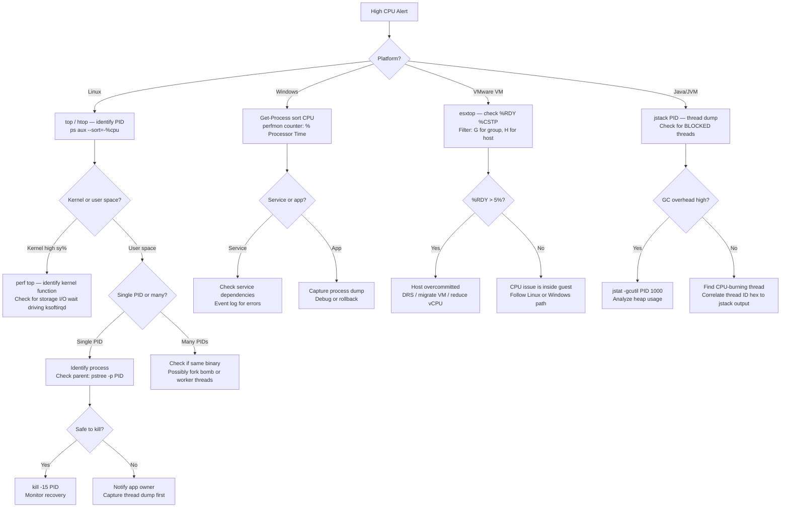

# High CPU Troubleshooting


<div class="kb-summary">
High CPU Troubleshooting reference covering Overview, CPU Threshold Reference, Diagnostic Flowchart, Windows CPU Diagnosis, VMware ESXi: esxtop CPU Analysis and 4 more sections.
</div>

## Overview

High CPU utilization causes application latency, request queuing, and service instability. Effective diagnosis requires platform-specific tools to distinguish user-space runaway processes, kernel-level contention, JVM thread saturation, and hypervisor-level CPU ready time — each with different remediation paths.

---

## CPU Threshold Reference

| Platform | Metric | Warning | Critical | Action |
|---|---|---|---|---|
| Linux | Overall CPU % (top) | >70% sustained 5 min | >90% sustained 2 min | Identify top process; check recent deploy |
| Linux | Load average vs vCPU count | Load > vCPU count | Load > 2x vCPU count | Check for blocked I/O or CPU-bound tasks |
| Windows | CPU % (Task Manager) | >80% sustained | >95% sustained | perfmon; process tree analysis |
| VMware ESXi host | Overall host CPU % | >70% | >85% | Check VM density; DRS balancing |
| VMware VM | %RDY (CPU Ready) | >5% | >10% | Reduce vCPU count; migrate VM; DRS |
| VMware VM | %CSTP (Co-Stop) | >3% | >5% | Reduce vCPU count on SMP VMs |
| JVM | GC CPU overhead | >10% of CPU | >25% of CPU | Heap analysis; GC tuning |
| Database | CPU during query | Spikes >80% | Sustained >90% | Slow query log; missing indexes |

---

## Diagnostic Flowchart


┌────────────────────────────────────── High CPU Troubleshooting ───────────────────────────────────────┐
│                                                                                                       │
│   ┌───────────────────────────────────────────────────────────────────────────────────────────────┐   │
│   │      High CPU: identify top consumers, check for CPU ready, investigate runaway processes     │   │
│   │           ESXi: CPU ready > 5% indicates overcommit; vCPU wait for physical CPU time          │   │
│   └───────────────────────────────────────────────────────────────────────────────────────────────┘   │
│                                                                                                       │
│                  ▼                                ▼                                ▼                  │
│                                                                                                       │
│   ┌─────────────────────────────┐  ┌─────────────────────────────┐  ┌─────────────────────────────┐   │
│   │            Linux            │  │           Windows           │  │        ESXi / VMware        │   │
│   │      ─────────────────      │  │      ─────────────────      │  │      ─────────────────      │   │
│   │          top / htop         │  │         Task Manager        │  │         esxtop: CPU         │   │
│   │     ps aux --sort=-%cpu     │  │       Get-Process sort      │  │         CPU ready %         │   │
│   │           perf top          │  │        Perfmon: % CPU       │  │          Co-stop %          │   │
│   │         sar -u 1 10         │  │         WPA profiler        │  │         VM CPU limit        │   │
│   │       strace / ftrace       │  │         Process dump        │  │        NUMA topology        │   │
│   └─────────────────────────────┘  └─────────────────────────────┘  └─────────────────────────────┘   │
│                                                                                                       │
│   │     Symptom      │       Tool       │     Indicator     │       Fix        │      Verify      │   │
│   │ ──────────────── │ ──────────────── │ ───────────────── │ ──────────────── │──────────────────│   │
│   │   Runaway proc   │  top / Task Mgr  │   High PID CPU%   │  Kill/restrain   │  CPU normalises  │   │
│   │    CPU ready     │   esxtop %RDY    │        > 5%       │   Reduce vCPU    │   Ready drops    │   │
│   │    Steal time    │     top %st      │    > 0 in cloud   │ Upgrade VM type  │    Steal = 0     │   │
│   │     IRQ load     │  cat /proc/intr  │   One CPU pinned  │    irqbalance    │    IRQ spread    │   │
│                                                                                                       │
│    Key terms:                                                                                         │
│                                                                                                       │
│    CPU ready  = ESXi: time vCPU waits for physical CPU; > 5% impacts VM performance                   │
│    Co-stop    = ESXi SMP VMs wait for all vCPUs to be scheduled simultaneously                        │
│    Steal time = In VMs: hypervisor withholding CPU from guest; indicates host overcommit              │
│    irqbalance = Linux daemon; distributes hardware interrupts across CPUs for load balance            │
│                                                                                                       │
└───────────────────────────────────────────────────────────────────────────────────────────────────────┘
```
┌────────────────────────────────────── High CPU Troubleshooting ───────────────────────────────────────┐
│                                                                                                       │
│   ┌───────────────────────────────────────────────────────────────────────────────────────────────┐   │
│   │      High CPU: identify top consumers, check for CPU ready, investigate runaway processes     │   │
│   │           ESXi: CPU ready > 5% indicates overcommit; vCPU wait for physical CPU time          │   │
│   └───────────────────────────────────────────────────────────────────────────────────────────────┘   │
│                                                                                                       │
│                  ▼                                ▼                                ▼                  │
│                                                                                                       │
│   ┌─────────────────────────────┐  ┌─────────────────────────────┐  ┌─────────────────────────────┐   │
│   │            Linux            │  │           Windows           │  │        ESXi / VMware        │   │
│   │      ─────────────────      │  │      ─────────────────      │  │      ─────────────────      │   │
│   │          top / htop         │  │         Task Manager        │  │         esxtop: CPU         │   │
│   │     ps aux --sort=-%cpu     │  │       Get-Process sort      │  │         CPU ready %         │   │
│   │           perf top          │  │        Perfmon: % CPU       │  │          Co-stop %          │   │
│   │         sar -u 1 10         │  │         WPA profiler        │  │         VM CPU limit        │   │
│   │       strace / ftrace       │  │         Process dump        │  │        NUMA topology        │   │
│   └─────────────────────────────┘  └─────────────────────────────┘  └─────────────────────────────┘   │
│                                                                                                       │
│   │     Symptom      │       Tool       │     Indicator     │       Fix        │      Verify      │   │
│   │ ──────────────── │ ──────────────── │ ───────────────── │ ──────────────── │──────────────────│   │
│   │   Runaway proc   │  top / Task Mgr  │   High PID CPU%   │  Kill/restrain   │  CPU normalises  │   │
│   │    CPU ready     │   esxtop %RDY    │        > 5%       │   Reduce vCPU    │   Ready drops    │   │
│   │    Steal time    │     top %st      │    > 0 in cloud   │ Upgrade VM type  │    Steal = 0     │   │
│   │     IRQ load     │  cat /proc/intr  │   One CPU pinned  │    irqbalance    │    IRQ spread    │   │
│                                                                                                       │
│    Key terms:                                                                                         │
│                                                                                                       │
│    CPU ready  = ESXi: time vCPU waits for physical CPU; > 5% impacts VM performance                   │
│    Co-stop    = ESXi SMP VMs wait for all vCPUs to be scheduled simultaneously                        │
│    Steal time = In VMs: hypervisor withholding CPU from guest; indicates host overcommit              │
│    irqbalance = Linux daemon; distributes hardware interrupts across CPUs for load balance            │
│                                                                                                       │
└───────────────────────────────────────────────────────────────────────────────────────────────────────┘
```

### perf — Deeper Kernel Analysis

```bash
# Record 30 seconds of CPU activity
perf record -g -a sleep 30

# Generate report
perf report --stdio | head -40

# Flame graph approach
perf script | stackcollapse-perf.pl | flamegraph.pl > cpu_flame.svg
```

### Safe Process Termination

```bash
# Send SIGTERM first (graceful)
kill -15 14321

# Wait 10 seconds; if still running:
kill -9 14321

# For a runaway cgroup (containerised service):
systemctl stop application-service

# Throttle CPU via cgroup without killing (temporary relief)
systemctl set-property application.service CPUQuota=50%
```

---

## Windows CPU Diagnosis

```powershell
# Top CPU consumers — snapshot
Get-Process | Sort-Object CPU -Descending | Select-Object -First 15 |
    Select-Object Name, Id, CPU, WorkingSet, Description | Format-Table -AutoSize

# Example output:
# Name          Id      CPU WorkingSet Description
# java        4512  48923.4  845557760 Java Platform SE
# sqlservr    1024  12401.2 2147483648 SQL Server Windows NT

# Per-core CPU utilization
Get-WmiObject Win32_Processor | Select-Object Name, LoadPercentage

# perfmon — collect CPU counter
$query = "select PercentProcessorTime from Win32_PerfFormattedData_PerfOS_Processor where Name='_Total'"
(Get-WmiObject -Query $query).PercentProcessorTime

# Continuous monitoring via typeperf
typeperf "\Processor(_Total)\% Processor Time" -si 5 -sc 12

# Check CPU affinity for a process
$proc = Get-Process -Id 4512
$proc.ProcessorAffinity
```

---

## VMware ESXi: esxtop CPU Analysis

```bash
# Connect via SSH to ESXi host or run esxtop from vCenter
esxtop

# In esxtop, press 'c' for CPU view
# Key columns:
# %USED — percentage of physical CPU used
# %RDY  — CPU Ready: VM waiting for physical CPU (guest vCPUs scheduled but host busy)
# %CSTP — Co-Stop: SMP VMs waiting for all vCPUs to be scheduled simultaneously
# %MLMTD — Hard limit reached (resource pool limit)
# %SWPWT — Swap wait: memory swapping causing CPU stall

# Export esxtop batch data for analysis
esxtop -b -d 2 -n 30 > /tmp/esxtop_$(date +%Y%m%d_%H%M).csv

# Filter for specific VM by name (press 'f' then select GID)
```

### CPU Ready Time Interpretation

| %RDY Value | Interpretation | Action |
|---|---|---|
| 0–5% | Healthy | No action required |
| 5–10% | Warning — minor contention | Monitor; check host CPU utilization |
| 10–20% | Significant contention | Reduce vCPU count; DRS migration |
| >20% | Critical | Immediate VM migration; host overloaded |
| >30% | Severe | Emergency: evacuate VMs; add capacity |

```bash
# PowerCLI: get CPU Ready for all VMs on a host
Get-VM | Get-Stat -Stat cpu.ready.summation -MaxSamples 5 -Realtime |
    Group-Object Entity |
    Select-Object @{N='VM';E={$_.Name}},
                  @{N='CPUReady_ms';E={($_.Group | Measure-Object Value -Average).Average}} |
    Sort-Object CPUReady_ms -Descending | Select-Object -First 10

# Convert ms to %: Ready% = (Ready_ms / (20000 * vCPU_count)) * 100
```

---

## Java/JVM High CPU Troubleshooting

```bash
# Identify which Java thread is consuming CPU
# Step 1: get PID
ps aux | grep java
# PID = 14321

# Step 2: get top threads within that PID (Linux)
top -H -p 14321
# Note the TID of the highest CPU thread (e.g., TID 14456)

# Step 3: convert TID to hex
printf '%x\n' 14456
# Output: 3878

# Step 4: capture thread dump
jstack 14321 > /tmp/jstack_$(date +%H%M%S).txt

# Step 5: find thread 0x3878 in jstack output
grep -A 20 "nid=0x3878" /tmp/jstack_$(date +%H%M%S).txt

# Step 6: check GC overhead
jstat -gcutil 14321 1000 10
# Output:
#   S0     S1     E      O      M     CCS    YGC     YGCT    FGC    FGCT     GCT
#  0.00  95.32  88.12  99.01  97.64  95.52    854  120.412   42  310.897  431.309
# ^ FGC=42 Full GCs, FGCT=310s → GC overhead is very high → heap exhaustion
```

---

## Database CPU Spikes

### MySQL / MariaDB

```sql
-- Show currently running queries
SHOW FULL PROCESSLIST;

-- Find long-running queries
SELECT id, user, host, db, command, time, state, info
FROM information_schema.processlist
WHERE time > 10
ORDER BY time DESC;

-- Check slow query log
-- my.cnf: slow_query_log=1, long_query_time=2
SHOW VARIABLES LIKE 'slow_query_log%';
```

### Microsoft SQL Server

```sql
-- Find top CPU queries
SELECT TOP 10
    qs.total_worker_time/qs.execution_count AS avg_cpu_us,
    qs.execution_count,
    SUBSTRING(qt.text, qs.statement_start_offset/2,
        (CASE qs.statement_end_offset WHEN -1 THEN LEN(CONVERT(nvarchar(max), qt.text)) * 2
         ELSE qs.statement_end_offset END - qs.statement_start_offset)/2) AS query_text
FROM sys.dm_exec_query_stats qs
CROSS APPLY sys.dm_exec_sql_text(qs.sql_handle) qt
ORDER BY avg_cpu_us DESC;

-- Check for blocking
SELECT blocking_session_id, session_id, wait_type, wait_time, cpu_time
FROM sys.dm_exec_requests
WHERE blocking_session_id <> 0;
```

---

## Recent Change Correlation

```bash
# Check for deployments, package installs, or cron jobs at time of spike
grep "Install\|deploy\|update" /var/log/dpkg.log | tail -20   # Debian/Ubuntu
grep "Install\|deploy\|update" /var/log/yum.log | tail -20    # RHEL

# Check cron jobs that ran during the spike window
grep "CMD" /var/log/cron | grep "08:00\|08:05\|08:10"

# Check systemd service start times
systemctl list-units --state=active --type=service |
    xargs -I{} systemctl show {} --property=ActiveEnterTimestamp
```

---

## Escalation Criteria

Escalate to application team, platform team, or vendor when:

- CPU utilization sustained >90% for >15 minutes with no identified runaway process
- %RDY >20% on multiple VMs across the same ESXi host simultaneously (capacity event)
- JVM thread dump shows deadlock or all threads BLOCKED (application bug)
- CPU spike correlates with a database query that cannot be killed without data risk
- Kernel CPU (sy%) >50% indicating potential kernel bug or driver issue
- CPU throttling via cgroup/resource pool is masking an unresolved application fault
- Security scan or crypto mining suspected (unexpected processes, outbound connections)
- Host hardware fault suspected: check `esxcli hardware cpu list` and IPMI/iLO SEL logs
