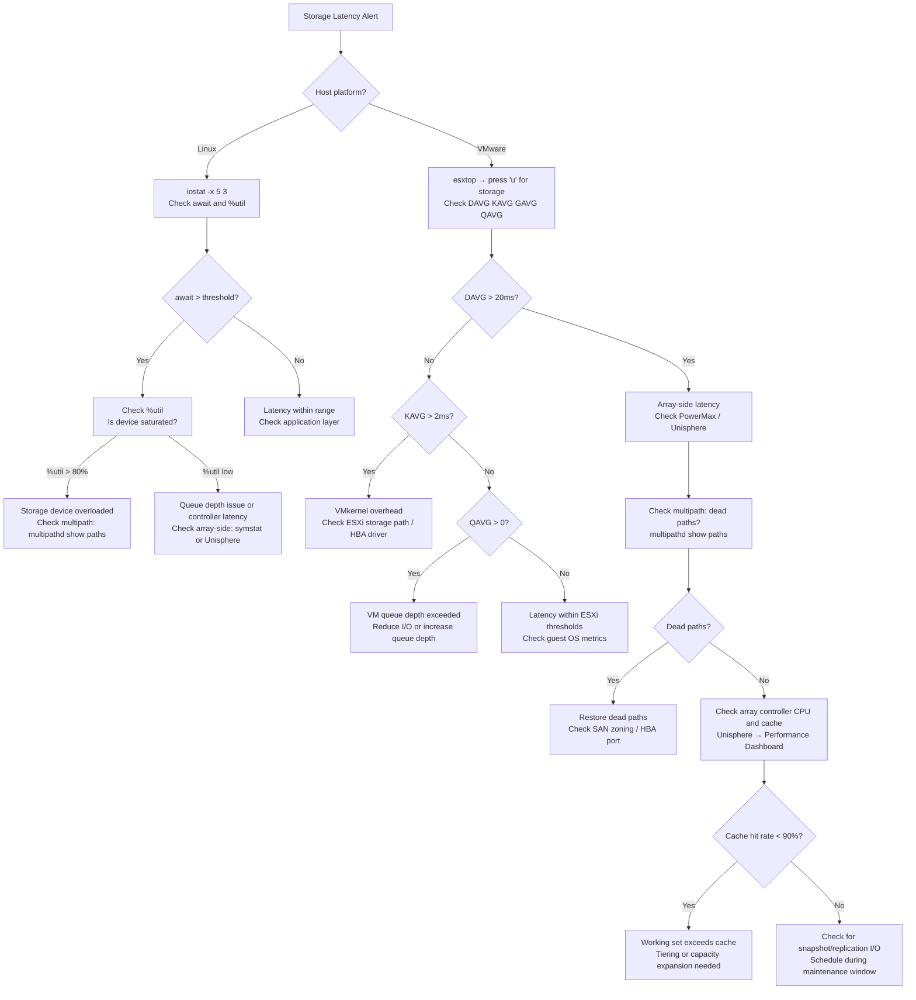

# Storage Latency Troubleshooting


<div class="kb-summary">
Storage Latency Troubleshooting reference covering Overview, Latency Threshold Reference, Diagnostic Flowchart, VMware ESXi esxtop Storage Analysis, PowerMax / VMAX Performance Analysis and 6 more sections.
</div>

## Overview

Storage latency is a primary cause of application performance degradation, database timeouts, and VM instability. Diagnosis requires correlating host-side metrics (iostat, esxtop) with array-side metrics (Unisphere, symstat) and multipath health. This guide covers NVMe, SSD, HDD, NFS, and iSCSI environments including PowerMax/VMAX and VMware ESXi.

---

## Latency Threshold Reference

| Storage Type | Protocol | Normal (ms) | Warning (ms) | Critical (ms) | Notes |
|---|---|---|---|---|---|
| NVMe SSD (local) | NVMe | <0.1 | 0.5 | >1.0 | Latency >1ms = hardware fault |
| All-Flash Array | FC/iSCSI | <1 | 2–5 | >5 | DAVG >5ms on AFA = investigate |
| Hybrid Array (SSD tier) | FC/iSCSI | <2 | 5 | >10 | Tiering may not be working |
| HDD Array | FC/iSCSI | <10 | 20 | >30 | Queue depth and RAID overhead |
| NFS (LAN) | NFS | <1 | 3 | >5 | Check NFS server CPU and cache |
| iSCSI (10GbE LAN) | iSCSI | <2 | 5 | >10 | MTU (jumbo frames) critical |
| VMware DAVG | FC/iSCSI | <10 | 20 | >30 | esxtop threshold; DAVG >20 = concern |
| VMware GAVG | FC/iSCSI | <10 | 25 | >50 | Includes DAVG + KAVG + QAVG |

---

## Diagnostic Flowchart


```
┌─────────────────────────────────── Storage Latency Troubleshooting ───────────────────────────────────┐
│                                                                                                       │
│   ┌───────────────────────────────────────────────────────────────────────────────────────────────┐   │
│   │           High storage latency: check queue depth, path health, array load, and KAVG          │   │
│   │            ESXi: KAVG > 5ms = host queue issue; DAVG = array latency; GAVG = total            │   │
│   └───────────────────────────────────────────────────────────────────────────────────────────────┘   │
│                                                                                                       │
│                  ▼                                ▼                                ▼                  │
│                                                                                                       │
│   ┌─────────────────────────────┐  ┌─────────────────────────────┐  ┌─────────────────────────────┐   │
│   │          Host Layer         │  │          Path / HBA         │  │         Array Layer         │   │
│   │      ─────────────────      │  │      ─────────────────      │  │      ─────────────────      │   │
│   │          KAVG > 5ms         │  │          Dead paths         │  │         DAVG > 10ms         │   │
│   │      Queue depth limit      │  │        Degraded paths       │  │        Hot pool/tier        │   │
│   │         ABPG (abort)        │  │          HBA errors         │  │       Array queue full      │   │
│   │         IO scheduler        │  │        MPIO imbalance       │  │       Cache hit ratio       │   │
│   │        VMware balloon       │  │       FC fabric errors      │  │        Drive rebuild        │   │
│   └─────────────────────────────┘  └─────────────────────────────┘  └─────────────────────────────┘   │
│                                                                                                       │
│   │      Metric      │       Tool       │     Threshold     │      Cause       │       Fix        │   │
│   │ ──────────────── │ ──────────────── │ ───────────────── │ ──────────────── │──────────────────│   │
│   │       KAVG       │esxtop/vscsistats │       < 5ms       │    Host queue    │Reduce queue depth│   │
│   │       DAVG       │esxtop/vscsistats │       < 10ms      │    Array perf    │Array QoS/tiering │   │
│   │       GAVG       │      esxtop      │     KAVG+DAVG     │     Combined     │  Isolate layer   │   │
│   │   Path health    │    esxcli nmp    │     All active    │    Dead path     │   Rescan HBAs    │   │
│                                                                                                       │
│    Key terms:                                                                                         │
│                                                                                                       │
│    KAVG = Kernel Average latency; time I/O spends in ESXi storage stack (queue)                       │
│    DAVG = Device Average latency; time I/O spends on storage array (wire + array)                     │
│    GAVG = Guest Average; total latency seen by VM; KAVG + DAVG approximately                          │
│    ABPG = Abort Per Second; commands timing out; indicates severe latency or path issue               │
│    MPIO = Multipath I/O; balanced across paths; single active path = higher DAVG                      │
│                                                                                                       │
└───────────────────────────────────────────────────────────────────────────────────────────────────────┘
```
```bash

### esxtop Storage Threshold Summary

| Counter | Green | Warning | Critical | Action |
|---|---|---|---|---|
| DAVG (ms) | <10 | 10–20 | >20 | Array investigation |
| KAVG (ms) | <2 | 2–5 | >5 | ESXi / HBA driver issue |
| GAVG (ms) | <15 | 15–30 | >30 | Correlate DAVG+KAVG |
| QAVG (ms) | 0 | >0 | >5 | Reduce queue depth or I/O load |
| ABRTS/s | 0 | >0 | >5 | Path or timeout issue; urgent |
| RESETS/s | 0 | >0 | >1 | HBA or storage controller fault |

---

## PowerMax / VMAX Performance Analysis

```bash
# Run symstat for array performance (requires SYMCLI)
symstat -sid 000123 -type lun -interval 10 -count 6

# Example LUN-level output:
# Device   Reads/s  Writes/s  Read MB/s  Write MB/s  Read MS  Write MS  %Busy
# 00A0     1250.0    800.0      40.0       25.0        1.2      2.1     45.0
# 00A1     2100.0    100.0      65.0        3.0       18.5      5.0     88.0  ← high
# 00A2      450.0    900.0      14.0       28.0        0.8      1.5     32.0

# Check SRDF impact on performance (SRDF/S adds write latency)
symdev -sid 000123 show 00A1 | grep -i "rdf\|srdf"

# Check director (FA port) performance
symstat -sid 000123 -type director -interval 10 -count 6

# Check frontend director (FA) port utilisation
symcfg -sid 000123 list -fa all -port all
```

### Unisphere for PowerMax — Key Performance Views

| View | Location in Unisphere | What to Check |
|---|---|---|
| Array-level latency | Performance → Dashboard → Latency | Overall read/write ms; trend over 24h |
| Director utilisation | Performance → Directors | FA/RA director CPU; >70% = near saturation |
| Cache hit rate | Performance → Cache | Read hit rate; <90% = working set too large |
| SRP capacity | Storage → SRP | Used capacity; >80% = tiering pressure |
| Volume performance | Storage → Volumes → select volume | Per-volume read/write latency |

---

## Multipath Issues

Dead or degraded paths cause I/O to be rerouted through remaining paths, increasing load and latency.

```bash
# Linux device mapper multipath — show all paths
multipathd show paths

# Example output:
# name      sysfs  dm-st  dev    dev_t   pri  dm-st   chk_st  next_check
# 3600507680282874fc400000000000002
#   |- sdb  running  active  ready   1  active  ready  up
#   |- sdc  running  active  ready   1  active  ready  up
#   |- sdd  running  failed  faulty  0  faulty  undef  up   ← dead path
#   |- sde  running  active  ready   1  active  ready  up

# Check multipath topology (which paths are active)
multipath -ll

# Check path failures and reinstate a path (after fixing SAN issue)
multipathd reinstate path sdd

# Show device usage to identify which LUN is affected
multipathd show maps

# Verify HBA port status (Linux)
systool -c fc_host -v | grep -E "port_state|port_id|symbolic_name"

# Check SAN fabric login (Brocade / Cisco FC switch)
# Brocade:
nsshow | grep <wwpn>
# Cisco MDS:
# show flogi database | include <wwpn>
```

---

## Snapshot and Replication Impact on Latency

Snapshots consume array resources during creation and maintenance. Active snapshots increase write latency.

```bash
# Check VMware snapshot count on VMs (PowerCLI)
Get-VM | Where-Object {$_.ExtensionData.Snapshot} |
    Select-Object Name,
        @{N='SnapCount';E={(Get-Snapshot -VM $_).Count}},
        @{N='SnapAgeDays';E={(Get-Snapshot -VM $_ | Sort-Object Created | Select-Object -First 1).Created}} |
    Sort-Object SnapCount -Descending | Select-Object -First 10

# Check ONTAP volume snapshot count
volume snapshot show -vserver svm1 -volume vol_db

# Check snapshot space consumption
volume show -vserver svm1 -volume vol_db -fields size,used,percent-snapshot-space

# PowerMax: check snapshot count per device
symsnap -sid 000123 -name snap_* list

# Check SRDF/A journal consumption (high journal = SRDF/A falling behind)
symrdf -g RDF_GRP_01 -type rdfa list | grep -i journal
```

---

## Storage Controller CPU and Cache Hit Rate

```bash
# ONTAP: check node CPU and cache
statistics show -object system -instance node01 -counter cpu_busy

# Cache performance
statistics show -object wafl -instance node01 -counter read_cache_hit_percent

# Example healthy output:
# read_cache_hit_percent: 97%   ← good
# read_cache_hit_percent: 64%   ← working set larger than cache — latency will increase

# PowerMax: cache stats via symstat
symstat -sid 000123 -type cache -interval 10 -count 3

# Check ONTAP aggregate (disk group) performance
statistics show -object aggr -instance aggr0 -counter total_ops,read_latency,write_latency
```

---

## Queue Depth Analysis

```bash
# Check current queue depth for a device (Linux)
cat /sys/block/sdb/queue/nr_requests
# Default: 128 for HDD, 1024 for NVMe

# Check HBA queue depth
cat /sys/class/scsi_host/host0/cmd_per_lun

# VMware: check queue depth for an adapter (esxcli)
esxcli storage core adapter list
esxcli storage core device list | grep -A5 "Queue Full"

# Set queue depth for Fibre Channel HBA (Emulex example) — requires reboot
esxcli system module parameters set -m lpfc -p "lpfc_lun_queue_depth=64"

# Check if queue full events are occurring
esxcli storage core device stats get -d naa.6006016011602d00abcd | grep -i queue
```

---

## Common Causes and Fixes

| Symptom | Root Cause | Fix |
|---|---|---|
| DAVG >20ms, KAVG <2ms | Array-side latency; controller overloaded | Check array director utilisation; balance LUN distribution |
| KAVG >2ms, DAVG normal | ESXi HBA driver issue or PSP misconfigured | Update HBA driver; check path selection policy (Round Robin) |
| await spikes during backup window | Backup I/O competing with production | Schedule backup during off-peak; enable backup throttling |
| QAVG >5ms | Queue depth exceeded; I/O queuing in VMkernel | Increase LUN queue depth; reduce VM I/O or add paths |
| Intermittent latency spikes | Dead multipath causing path failover | Fix dead path; check SAN switch zoning |
| High write latency only | Write-cache disabled on array | Re-enable write cache; check SP battery/vault |
| Latency after snapshot creation | Too many active snapshots on volume | Remove old snapshots; evaluate snapshot policy |
| NFS latency high | NFS server CPU/memory pressure | Check NFS server load; consider moving to dedicated NFS volume |
| iSCSI timeouts | MTU mismatch (jumbo frames not configured end-to-end) | Verify MTU=9000 on all iSCSI interfaces and switches |

---

## Escalation Criteria

Escalate to storage team or vendor TAC when:

- DAVG >30ms sustained for >5 minutes impacting production VMs
- ABRTS/s >0 on any production LUN (I/O abort indicates path or controller failure)
- Multipath dead path count >50% of total paths for any device (I/O risk)
- Array controller CPU >85% sustained (storage vendor must investigate)
- Cache hit rate <80% (working set analysis and capacity planning required)
- SRDF/A falling behind during SRDF performance degradation (RPO impact)
- Storage array reporting hardware fault in Unisphere or SYMCLI health check
- Queue full conditions occurring repeatedly (storage fabric or array tuning required)
- Latency cannot be correlated to a specific cause after 30 minutes of investigation
