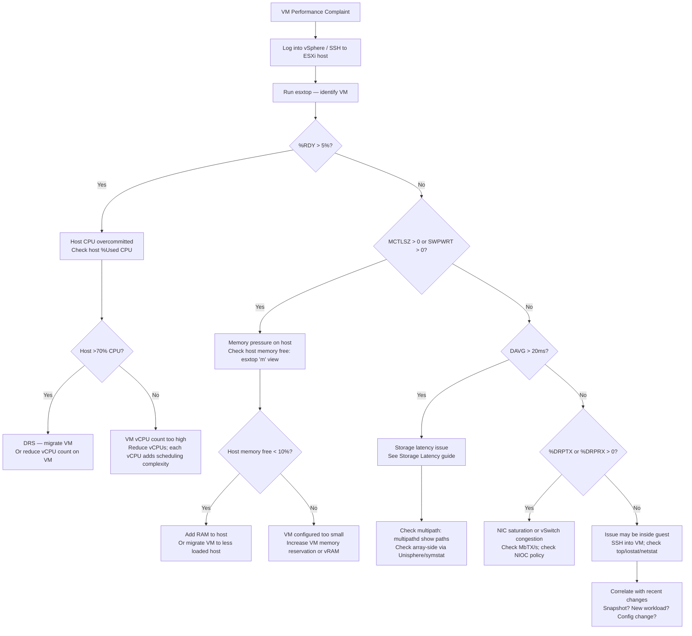

# VM Performance Troubleshooting

## Triage Flow — Quick Start

Start here. OS first, then hypervisor, then storage/hardware.

## Triage Flow — With Thresholds

Use this when you need specific numbers to confirm whether a metric is a problem.

---

## Overview

VM performance degradation can originate at the hypervisor layer (CPU ready, memory balloon, storage path), at the vSphere infrastructure layer (DRS, resource pools, vSAN), or inside the guest OS. Effective diagnosis requires correlating esxtop counters with guest-level symptoms and recent infrastructure changes. This guide focuses on VMware ESXi 7.x/8.x environments with vSphere.

---

## VM Performance Symptom Matrix

| Resource | esxtop Counter | Warning Threshold | Critical Threshold | Guest Symptom |
|---|---|---|---|---|
| CPU | %RDY | >5% | >10% | Slow application response; high latency |
| CPU | %CSTP | >3% | >5% | Sluggish SMP VM; co-scheduling bottleneck |
| CPU | %MLMTD | >0% | sustained | VM hitting vCPU hard limit (resource pool) |
| Memory | MCTLSZ (MB) | >0 | >256 MB | Guest reports low memory; balloon driver active |
| Memory | SWPWRT (MB/s) | >0 | >10 MB/s | Heavy swapping; disk I/O from memory pressure |
| Memory | MEMCTL% | >1% | >5% | vmmemctl (balloon) reclaiming memory |
| Storage | DAVG (ms) | >10 | >20 | Application I/O timeouts; high disk latency |
| Storage | KAVG (ms) | >2 | >5 | VMkernel path or HBA driver overhead |
| Storage | ABRTS/s | >0 | >1 | I/O aborted; path failure or timeout |
| Network | %DRPTX | >0 | >1% | Outbound packet drops; NIC saturation |
| Network | %DRPRX | >0 | >1% | Inbound packet drops; NIC receive overrun |
| Network | MbTX/s + MbRX/s | >800 (on 1G) | >9000 (on 10G) | Network throughput saturation |

---

## Diagnostic Flowchart



---

## CPU Ready Time Investigation

CPU Ready time (%RDY) is the percentage of time a VM's vCPU was ready to run but waiting for a physical CPU. It is the single most impactful hypervisor-level CPU metric.

```bash
# In esxtop — press 'c' for CPU view
# Find VM by name (press 'G' to filter by group/world)
# Key: %RDY column, per vCPU and aggregate

# Convert esxtop %RDY to milliseconds:
# %RDY of 10% on a 20000ms interval = 2000ms of ready time per CPU per 20s
# Formula: Ready_ms = %RDY * 20000 / 100

# Batch collect and analyse CPU ready via PowerCLI
Get-VM | Get-Stat -Stat cpu.ready.summation -MaxSamples 10 -Realtime |
    Group-Object {$_.Entity.Name} |
    ForEach-Object {
        $avgReady = ($_.Group | Measure-Object Value -Average).Average
        $vcpu = ($_.Group[0].Entity | Get-VM).NumCpu
        $readyPct = [math]::Round($avgReady / (20000 * $vcpu) * 100, 2)
        [PSCustomObject]@{
            VM          = $_.Name
            vCPU_Count  = $vcpu
            AvgReady_ms = [math]::Round($avgReady, 0)
            ReadyPct    = "$readyPct%"
        }
    } | Sort-Object AvgReady_ms -Descending | Select-Object -First 10
```

### CPU Ready — Common Causes and Fixes

| Cause | Indicator | Fix |
|---|---|---|
| Host CPU overcommitted | Host %Used >70%; many VMs on host | DRS migration; add ESXi host |
| VM has too many vCPUs | %CSTP high; VM rarely uses all vCPUs | Reduce vCPU count to match workload |
| vCPU hard limit set | %MLMTD >0 | Remove or increase CPU limit on VM |
| Hyper-threading contention | HT siblings competing | Adjust HT sharing policy in advanced settings |

---

## Memory Balloon and Swap Investigation

VMware uses a three-tier memory reclamation hierarchy: Balloon → Swap → Compress.

```bash
# In esxtop — press 'm' for memory view
# Key columns for a VM:
# MCTLSZ  — current balloon size in MB (vmmemctl active)
#            >0 = guest OS is being asked to give back memory
# SWPWRT  — swap write rate MB/s (hypervisor swapping VM pages to disk)
#            >0 = serious; causes dramatic latency
# MEMCTL%  — percentage of allocated VM memory being ballooned
# GRANT    — memory granted to VM (may be less than configured)
# CNSM     — memory consumed by VM
# TCHD     — memory touched (active working set)

# Check balloon driver status inside Linux guest
dmesg | grep -i balloon
lsmod | grep vmmemctl

# Check inside Windows guest (PowerShell)
Get-WmiObject Win32_PhysicalMemory | Measure-Object Capacity -Sum

# Check host-level memory pressure (ESXi host)
# esxtop 'm' → look at host row: free memory, swap in/out rates
```

### Memory Reclamation States

| State | Trigger | Guest Impact | Action |
|---|---|---|---|
| Balloon active (MCTLSZ >0) | Host memory moderately low | Guest may page to disk | Migrate VM; add RAM to host |
| Swap active (SWPWRT >0) | Host memory low; balloon insufficient | Severe latency (disk I/O) | Emergency: migrate VM immediately |
| Compression active | Moderate pressure | Moderate CPU overhead | Monitor; plan capacity |
| Transparent page sharing | Always on | Near-zero impact | No action |

---

## Storage DAVG Latency — VM-Level

```bash
# esxtop storage device view — press 'u' then 'e'
# Identify the device (naa.xxx) used by the VM's VMDK
# DAVG must be checked at device level, not just VM level

# PowerCLI: get storage latency stats for specific VM
Get-VM -Name "vm-prod-sql01" |
    Get-Stat -Stat disk.maxTotalLatency.latest -MaxSamples 20 -Realtime |
    Select-Object Entity, Timestamp, Value |
    Sort-Object Value -Descending | Select-Object -First 10

# Get all disk stats for a VM
Get-VM -Name "vm-prod-sql01" |
    Get-Stat -Stat disk.* -MaxSamples 5 -Realtime |
    Group-Object MetricId |
    Select-Object @{N='Metric';E={$_.Name}},
                  @{N='Avg';E={($_.Group | Measure-Object Value -Average).Average}} |
    Sort-Object Avg -Descending
```

---

## Network Packet Drop Analysis

```bash
# esxtop — press 'n' for network view
# Key columns:
# %DRPTX — transmit drop percentage (VM cannot send fast enough)
# %DRPRX — receive drop percentage (VM cannot consume packets fast enough)
# MbTX/s — megabits transmitted per second
# MbRX/s — megabits received per second
# PKTTX/s — packets transmitted per second
# PKTRX/s — packets received per second

# Inside Linux guest — check NIC errors
ethtool -S eth0 | grep -i "drop\|error\|miss"
ip -s link show eth0

# Check if NIC is saturated (10Gbps vmxnet3 ~ 9000 Mbps max)
ip -s link show eth0 | grep -E "RX|TX"

# If drops are occurring inside the vSwitch / dvSwitch:
# vCenter → Networking → dvSwitch → Monitor → Port Statistics
```

### Network Performance Fixes

| Issue | Symptom | Fix |
|---|---|---|
| vmxnet3 adapter | Drops with old VMXNET version | Upgrade VMware Tools; use VMXNET3 |
| NIC saturation | %DRPTX >0; MbTX near line rate | Enable NIOC; migrate VM or add vNIC |
| TSO/LRO offload disabled | High CPU for network | Enable TSO in guest; verify vmxnet3 offload |
| vSwitch MTU mismatch | Large frame drops only | Set consistent MTU on vSwitch and physical |

---

## VMware DRS Recommendation Review

```powershell
# PowerCLI: check DRS recommendations for a cluster
$cluster = Get-Cluster -Name "PROD-Cluster"
$cluster.ExtensionData.GetRecommendation() |
    Select-Object Reason, Rating, Target |
    Format-Table -AutoSize

# Check current DRS score per VM
Get-VM | Select-Object Name,
    @{N='DRS_Score';E={$_.ExtensionData.Summary.Runtime.DasVmProtection}} |
    Sort-Object DRS_Score

# Check if DRS is in manual mode (recommendations not auto-applied)
Get-Cluster | Select-Object Name, DrsEnabled, DrsAutomationLevel
# DrsAutomationLevel: FullyAutomated / PartiallyAutomated / Manual
```

---

## VM Right-Sizing Assessment

```powershell
# Get average CPU and memory utilisation over last 7 days
$vm = Get-VM -Name "vm-prod-app01"
$end = Get-Date
$start = $end.AddDays(-7)

$cpuStats = Get-Stat -Entity $vm -Stat cpu.usage.average -Start $start -Finish $end -IntervalMins 30
$memStats = Get-Stat -Entity $vm -Stat mem.usage.average -Start $start -Finish $end -IntervalMins 30

$avgCPU = ($cpuStats | Measure-Object Value -Average).Average
$maxCPU = ($cpuStats | Measure-Object Value -Maximum).Maximum
$avgMem = ($memStats | Measure-Object Value -Average).Average
$maxMem = ($memStats | Measure-Object Value -Maximum).Maximum

[PSCustomObject]@{
    VM          = $vm.Name
    vCPU        = $vm.NumCpu
    vRAM_GB     = $vm.MemoryGB
    AvgCPU_Pct  = [math]::Round($avgCPU, 1)
    MaxCPU_Pct  = [math]::Round($maxCPU, 1)
    AvgMem_Pct  = [math]::Round($avgMem, 1)
    MaxMem_Pct  = [math]::Round($maxMem, 1)
    Recommendation = if ($maxCPU -lt 25 -and $vm.NumCpu -gt 2) {"Reduce vCPU"} `
                     elseif ($maxMem -lt 30) {"Reduce vRAM"} `
                     else {"Sized appropriately"}
}
```

---

## Snapshot Impact on Performance

Active snapshots cause VMware to write to a delta VMDK chain, increasing write I/O and latency.

```powershell
# Find VMs with snapshots older than 7 days
Get-VM | Get-Snapshot |
    Where-Object {$_.Created -lt (Get-Date).AddDays(-7)} |
    Select-Object @{N='VM';E={$_.VM.Name}},
                  Name, Created,
                  @{N='SizeGB';E={[math]::Round($_.SizeGB, 1)}},
                  Description |
    Sort-Object Created | Format-Table -AutoSize

# Remove a specific snapshot (consolidates delta into base disk)
Get-VM -Name "vm-prod-app01" | Get-Snapshot -Name "Pre-patch" | Remove-Snapshot -Confirm:$false

# Check if consolidation is needed (stale delta files exist without snapshot entry)
Get-VM | Where-Object {$_.ExtensionData.Runtime.ConsolidationNeeded} |
    Select-Object Name | Format-Table
```

---

## vSphere Performance Counter Reference

| Counter | Category | Unit | Description |
|---|---|---|---|
| cpu.ready.summation | CPU | ms | Accumulated ready time per interval |
| cpu.usage.average | CPU | % | CPU utilisation |
| cpu.costop.summation | CPU | ms | Co-stop time for SMP VMs |
| mem.balloon.average | Memory | KB | Memory reclaimed by balloon driver |
| mem.swapout.average | Memory | KB/s | Swap write rate |
| mem.consumed.average | Memory | KB | Memory consumed by VM |
| disk.maxTotalLatency.latest | Disk | ms | Maximum read or write latency |
| disk.commandsAborted.summation | Disk | count | I/O aborts |
| net.droppedTx.summation | Network | count | Transmit packet drops |
| net.droppedRx.summation | Network | count | Receive packet drops |
| net.usage.average | Network | Kbps | Network utilisation |

---

## Escalation to VMware GSS

Escalate to internal VMware admin team or open a VMware GSS case when:

- %RDY >20% on multiple VMs simultaneously and no available host for migration (capacity crisis)
- SWPWRT >50 MB/s sustained — active hypervisor swap is impacting multiple production VMs
- ABRTS/s >5 on any production VM LUN (potential data integrity risk)
- vmxnet3 or PVSCSI driver bugs suspected (compare driver version against VMware KB)
- vSAN or distributed storage health degraded causing VM-level latency
- DRS repeatedly migrating VMs in a loop (DRS instability / oscillation)
- Snapshot consolidation fails repeatedly ("consolidation needed" persists after retry)
- ESXi host PSOD (Purple Screen of Death) occurred — collect `/var/core/` and `vmkernel.log`
- VM is experiencing random reboots with no guest OS cause (hardware fault or VMware bug)
- vMotion migration fails for a specific VM after 3 attempts (object ID / storage issue)
