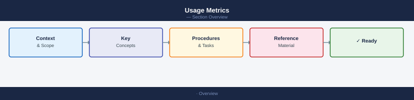

# Usage Metrics

<div class="kb-summary">
Knowledge base statistics: page counts, section distribution, and content type coverage.
</div>



Generated: 2026-06-27

## Current totals

| Metric | Count |
|---|---:|
| Total markdown pages | 2,846 |
| Sections | 11 |
| Pages with full-width ASCII diagrams | 63 |
| Pages with SVG diagrams | 2,846 |
| Pages with Mermaid diagrams | 744 |
| Pages with kb-summary | 2,567 |
| Pages with tags | 2,819 |
| Audit score | 36 / 37 |

## Section page counts

| Section | Pages |
|---|---:|
| Storage | 709 |
| Virtualization | 685 |
| Cloud | 295 |
| Compute | 175 |
| ITSM | 153 |
| SAN | 136 |
| Automation | 126 |
| Security | 113 |
| Backup | 103 |
| Networking | 83 |
| Certifications | 14 |

## Health checks

```bash
python3 scripts/site_audit.py          # full 37-check audit
python3 scripts/site_audit.py --full   # include all issue details
mkdocs build --strict                  # strict build check
mkdocs serve                           # local preview
```
