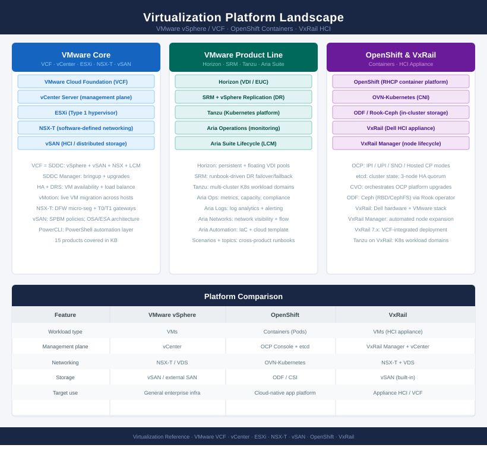

# Virtualization

<div class="kb-summary">
Virtualization platform knowledge base covering VMware and OpenShift. Includes architecture references, operational procedures, CLI commands, health checks, lifecycle management, and troubleshooting guides.
</div>



```text
┌──────────────────────────────────────── VMware Platform Stack ────────────────────────────────────────┐
│                                                                                                       │
│   ┌───────────────────────────────────────────────────────────────────────────────────────────────┐   │
│   │                              VMware Cloud Foundation (VCF / SDDC)                             │   │
│   │             Packages and delivers the full SDDC: vSphere + vSAN + NSX + Lifecycle             │   │
│   │              SDDC Manager: bringup · upgrades · compliance · certificate rotation             │   │
│   │                      Tanzu: Kubernetes workload domains hosted within VCF                     │   │
│   └───────────────────────────────────────────────┴───────────────────────────────────────────────┘   │
│                                                   │                                                   │
│                                             orchestrates                                              │
│                                                                                                       │
│                  ┌────────────────────────────────┼────────────────────────────────┐                  │
│                  ▼                                ▼                                ▼                  │
│   ┌─────────────────────────────┐  ┌─────────────────────────────┐  ┌─────────────────────────────┐   │
│   │           vCenter           │  │            NSX-T            │  │            VxRail           │   │
│   │  Management & Control Plane │  │ Software-Defined Networking │  │  Hyper-Converged Appliance  │   │
│   │  Inventory · Roles · Alarms │  │  Segments · T0/T1 Gateways  │  │ Dell hardware + VMware stack│   │
│   │  HA · DRS · vMotion · vLCM  │  │  Distributed Firewall · LB  │  │  VxRail Manager · Lifecycle │   │
│   │   SSO · LDAP · Permissions  │  │   Micro-segmentation · VPN  │  │   Automated node expansion  │   │
│   └──────────────┴──────────────┘  └──────────────┴──────────────┘  └─────────────────────────────┘   │
│                                                                                                       │
│    vCenter manages ESXi hosts and cluster resources; NSX-T runs inside the hypervisor                 │
│                                                                                                       │
│                  ▼                                ▼                                                   │
│                                                                                                       │
│   ┌───────────────────────────────────────────────────────────────────────────────────────────────┐   │
│   │                                  ESXi Hosts (vSphere Cluster)                                 │   │
│   │           Type-1 hypervisor: installed directly on bare metal — no host OS required           │   │
│   │                  Cluster features: HA · DRS · vMotion · Fault Tolerance · EVC                 │   │
│   │            VMkernel adapters: vmk0(mgmt) · vmk1(vMotion) · vmk2(vSAN) · vmk3(other)           │   │
│   │                 Each host runs 50-200+ VMs; types: web · DB · app · AD · infra                │   │
│   └───────────────────────────────────────────────┴───────────────────────────────────────────────┘   │
│                                                                                                       │
│    ESXi local disks contribute capacity to vSAN — no external storage array required                  │
│                                                                                                       │
│                                                   ▼                                                   │
│                                                                                                       │
│   ┌───────────────────────────────────────────────────────────────────────────────────────────────┐   │
│   │                                vSAN (Software-Defined Storage)                                │   │
│   │           Pools local NVMe/SSD/HDD disks from all ESXi hosts into a shared datastore          │   │
│   │          Storage policy assigned per VM: RAID-1 (mirror) · RAID-5/6 (erasure coding)          │   │
│   │             Features: Deduplication · Compression · Encryption · Stretched Cluster            │   │
│   └───────────────────────────────────────────────────────────────────────────────────────────────┘   │
│                                                                                                       │
│  Physical Infrastructure (the hardware all layers above run on):                                      │
│  CPU cores · RAM (GBs to TBs per host) · NIC (10/25/100 GbE) · NVMe/SSD/HDD · Power & Cooling         │
│                                                                                                       │
│  Key terms:                                                                                           │
│                                                                                                       │
│  VCF      = VMware Cloud Foundation; packages vSphere + vSAN + NSX with lifecycle mgmt                │
│  SDDC Mgr = VCF lifecycle orchestrator; automates bringup, upgrades, and compliance                   │
│  Tanzu    = VMware Kubernetes platform; runs container workloads inside VCF domains                   │
│  vCenter  = central management UI/API; manages hosts, VMs, roles, alarms, and lifecycle               │
│  NSX-T    = software-defined networking; segments, gateways, DFW, LB, VPN, and routing                │
│  VxRail   = Dell HCI appliance; compute + storage + networking in one rack unit                       │
│  ESXi     = Type-1 hypervisor; installed directly on bare metal — no host OS needed                   │
│  vSAN     = software-defined storage; pools local ESXi disks — no external array needed               │
│  HA       = High Availability; vSphere auto-restarts VMs on another host if one fails                 │
│  DRS      = Distributed Resource Scheduler; auto-balances VM workload across ESXi hosts               │
│  vMotion  = live migration of a running VM between ESXi hosts with zero downtime                      │
│  SSO      = Single Sign-On; central identity used by all vCenter/vSphere authentication               │
│  vLCM     = vSphere Lifecycle Manager; patches ESXi hosts and manages firmware baselines              │
│  DFW      = Distributed Firewall (NSX-T); stateful firewall enforced on every vNIC                    │
│  HCI      = Hyper-Converged Infrastructure; compute + storage + networking in one box                 │
│  SDDC     = Software-Defined Data Centre; compute, storage, and network all virtualised               │
│                                                                                                       │
└───────────────────────────────────────────────────────────────────────────────────────────────────────┘
```

<div class="kb-grid kb-grid-3">
<a class="kb-card" href="vmware/"><strong>VMware Platform</strong><span>vCenter, ESXi, vSAN, NSX, VCF, VxRail, Aria Suite, Horizon, SRM, and vSphere Replication.</span></a>
<a class="kb-card" href="openshift/"><strong>OpenShift</strong><span>Red Hat OpenShift Container Platform — IPI/UPI install, RHCOS, OVN-Kubernetes, MachineSet, OLM, SCC, and PSA.</span></a>
<a class="kb-card" href="vxrail/"><strong>VxRail</strong><span>Dell HCI appliance reference — hardware, lifecycle, VxRail Manager, RASR, scripts, and field notes.</span></a>
<a class="kb-card" href="operations/"><strong>Operations</strong><span>Cross-platform virtualization operations — health checks, runbooks, and troubleshooting.</span></a>
<a class="kb-card" href="reference/"><strong>Reference</strong><span>Design decisions, standards, licensing, inventory, upgrade readiness, HA design, and quick reference.</span></a>
</div>
