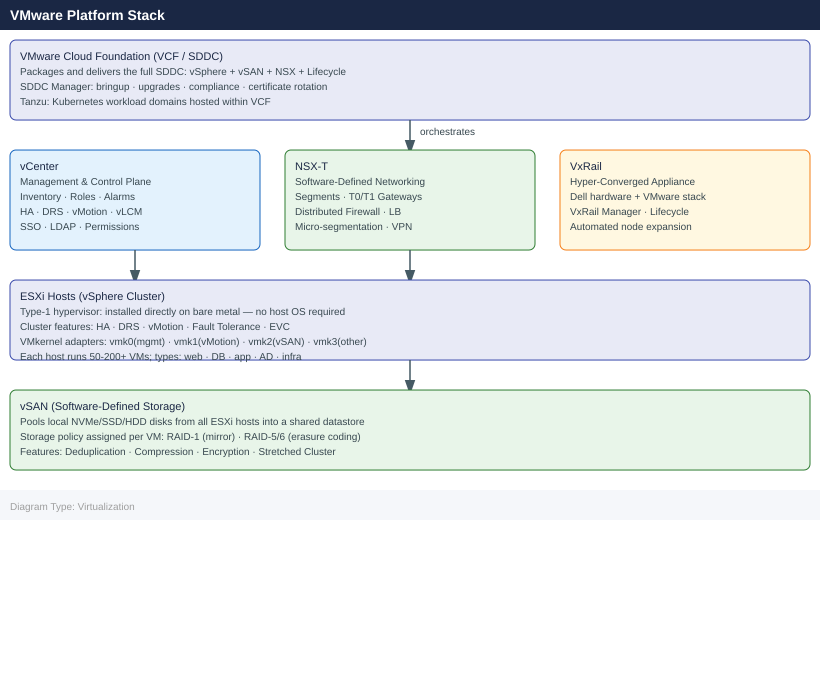

# Virtualization

Virtualization platform knowledge base covering VMware and OpenShift. Includes architecture references, operational procedures, CLI commands, health checks, lifecycle management, and troubleshooting guides.

<a class="kb-card" href="vmware/"><strong>VMware Platform</strong>vCenter, ESXi, vSAN, NSX, VCF, VxRail, Aria Suite, Horizon, SRM, and vSphere Replication.</a>
<a class="kb-card" href="nutanix/"><strong>Nutanix</strong>AOS, AHV, Prism Central, Files, Objects, Flow, and Calm — HCI architecture, operations, and troubleshooting.</a>
<a class="kb-card" href="openshift/"><strong>OpenShift</strong>Red Hat OpenShift Container Platform — IPI/UPI install, RHCOS, OVN-Kubernetes, MachineSet, OLM, SCC, and PSA.</a>

