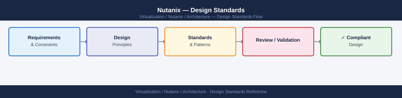

---
tags:
  - nutanix
  - architecture
  - design
---
# Nutanix — Design Standards

<div class="kb-summary">
Cluster sizing rules, node type selection, replication factor decisions, network design, storage container configuration, and block/rack awareness for production Nutanix deployments.

*Applies to: AOS 6.x · AHV*
</div>


---

## Before you begin

- **Access:** Prism Central admin or Nutanix SE for sizing validation
- **Tools:** Nutanix Sizer (sizer.nutanix.com) for official sizing; NCC for existing cluster health
- **Dependencies:** Finalise hypervisor choice (AHV vs ESXi) and workload profile before committing to node type

---

## Cluster Minimum Requirements

| Constraint | Minimum | Recommended |
|---|---|---|
| Nodes per cluster | 3 | 4+ (enables EC-X) |
| RF2 node failures tolerated | 1 | — |
| RF3 node failures tolerated | 2 | — |
| NIC speed | 10 GbE | 25 GbE |
| Storage network MTU | 1500 | 9000 (jumbo) |
| AOS version | 6.0 | Latest LTS (6.8+) |

A 3-node cluster is functional but cannot run Erasure Coding (minimum 4 nodes for EC 4+2). For production workloads requiring >1 failure tolerance, use RF3 with at least 5 nodes.

---

## Node Type Selection

| Platform | Form factor | Workload fit |
|---|---|---|
| Nutanix NX | 2U 4-node or 1U 2-node | General purpose; standard support |
| Dell XC Core | Dell PowerEdge chassis | Existing Dell estate; integrated support |
| HPE dHCI | ProLiant DL/Apollo | HPE-centric environments; iLO management |
| Lenovo HX | ThinkSystem | Lenovo-centric; enterprise campus |
| Cisco UCS HX | UCS blade/rack | Cisco-centric; Intersight integration |

**Node profiles:**
- **Compute-heavy**: high vCPU:core ratio, moderate storage (VDI, web tiers)
- **Storage-heavy**: NVMe + dense SSD/HDD capacity (databases, analytics, backup targets)
- **All-NVMe**: NVMe cache + NVMe capacity (latency-sensitive OLTP, AI/ML)
- **Hybrid**: NVMe cache + HDD capacity (archive, general VM workloads with tiering)

---

## Replication Factor (RF) Selection

| Factor | When to use | Failure tolerance |
|---|---|---|
| RF2 | Standard production; 3+ nodes | 1 node failure |
| RF3 | Business-critical; 5+ nodes | 2 simultaneous node failures |
| EC-X | 4+ nodes; cold data only | Configurable (4+2, 8+2, 16+2) |

**Rules:**
- Always use RF2 minimum in production — RF1 has no redundancy
- EC-X reduces raw overhead (4+2 → ~1.5× vs RF2 2×) but increases rebuild time — only for cold/capacity tier data
- Containers can mix RF policies: VM disks on RF2, backups on EC-X
- Set Replication Factor per container, not per VM

---

## Storage Container Design

A **container** is a logical storage pool mapped to a datastore (ESXi) or directly to VMs (AHV).

```text
Container design (recommended):
  VMs (general)      → RF2, compression=on, dedup=off
  Databases          → RF2, compression=off, dedup=off (random I/O, low compressibility)
  VDI full clones    → RF2, dedup=on, compression=on
  VDI linked clones  → RF2, dedup=on (high shared-page ratio)
  Backup targets     → EC-X or RF2, compression=on, dedup=on
  ISOs / templates   → RF2, low capacity impact
```

**Reserved capacity:** Keep at least 20% free on each container. Alert at 70%, do not exceed 80%.

---

## Network Design

```text
Recommended: dual 25 GbE (bonded) per node
  Bond0: active-backup or LACP
    VLAN 10 (native) → AHV + CVM management
    VLAN 20          → Storage / backplane (MTU 9000 required)
    VLAN 30+         → VM networks (trunked)
  Out-of-band: IPMI / iDRAC / iLO on dedicated OOB switch
```

**Critical requirements:**
- Storage VLAN must be L2 or low-latency routed between all CVMs
- MTU 9000 end-to-end (switch port → NIC → CVM) — verify with `ping -M do -s 8972 <cvm-ip>`
- Open ports: TCP 2009, 3260, 3261 (iSCSI), UDP 2049 (NFS) on storage VLANs

### IP addressing

| Component | Type | Notes |
|---|---|---|
| IPMI/iDRAC | Static | OOB network; one per node |
| AHV host | Static | Management VLAN; one per node |
| CVM | Static | Management VLAN; one per node |
| Cluster virtual IP | VIP (floats) | Active Prism Element node |
| Data Services IP (DSIP) | VIP | iSCSI target for volume groups |
| Prism Central | Static | Separate management VM |

---

## Block Awareness (Fault Domains)

For RF2, AOS places replicas on different **blocks** (chassis). If a block loses power, only one copy of any data is on that block.

- Minimum for block-aware RF2: 2 blocks
- Minimum for block-aware RF3: 3 blocks
- Configure: `ncli block add block-serial=<serial> rack-id=<rack>`
- Verify: Prism → Hardware → Blocks → Block-Aware = Yes

---

## CPU and Memory Sizing

**CVM reservations (subtract from host totals):**

| Cluster size | CVM vCPU | CVM RAM |
|---|---|---|
| Small (3–6 nodes) | 4 vCPU | 12 GB |
| Medium (7–15 nodes) | 6 vCPU | 20 GB |
| Large (16+ nodes) | 8 vCPU | 32 GB |

**Headroom rules:**
- Target 70% average CPU utilisation; hard ceiling 80%
- Reserve N-1 node capacity for HA failover (1 node failure)
- Memory overcommit: limit to 1.5× physical RAM with AHV page sharing enabled

---

## Storage Efficiency Features

| Feature | Enable when | Notes |
|---|---|---|
| Inline compression | Most workloads | Minimal CPU cost; reduces write amplification |
| Inline deduplication | VDI / clones | High shared-page workloads only |
| Post-process dedup | General VMs | Runs off-peak; safe for most workloads |
| Erasure coding (EC-X) | Cold data; 4+ nodes | Lower overhead than RF2 but longer rebuild |
| Zero suppression | Always | Suppresses zero-block writes at no cost |

**Do not enable inline dedup on databases** — random I/O produces no savings but adds metadata load.

---

## LCM Upgrade Sequence

1. AOS (cluster software) — rolling, one CVM at a time
2. AHV (hypervisor) — rolling, one host at a time; VMs live-migrate
3. Firmware (NIC, HBA, BIOS, BMC) — node by node; requires maintenance mode
4. Prism Central — separate upgrade; does not affect clusters

**Pre-upgrade checklist:**
- NCC all green
- Cluster can tolerate 1 node maintenance (RF2) or 2 nodes (RF3)
- Crash-consistent snapshots of critical VMs

---

## See also

- [Nutanix — How It Works](../how-it-works/)
- [Nutanix — Deploy](../../deploy/)
