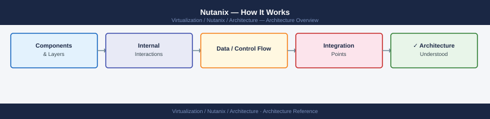
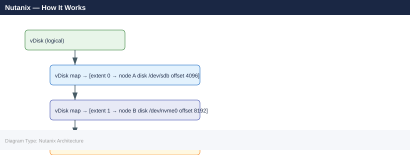

---
tags:
  - nutanix
  - architecture
  - aos
  - ahv
---
# Nutanix — How It Works

<div class="kb-summary">
AOS distributed storage fabric, CVM role on every node, AHV hypervisor internals, Prism management planes, and the I/O path from VM to NVMe. Covers the five core AOS services (Stargate, Curator, Cassandra, Zeus, Medusa) and how they interact.

*Applies to: AOS 6.x · AHV*
</div>



---

```d2
direction: right

cluster: Nutanix HCI Cluster {
  node1: Node 1 {
    cvm1: CVM 1 {shape: rectangle}
    vm1: Guest VMs {shape: rectangle}
    disk1: Local NVMe/SSD/HDD {shape: cylinder}
    cvm1 -> disk1: manages
  }
  node2: Node 2 {
    cvm2: CVM 2 {shape: rectangle}
    vm2: Guest VMs {shape: rectangle}
    disk2: Local NVMe/SSD/HDD {shape: cylinder}
    cvm2 -> disk2: manages
  }
  node3: Node 3 {
    cvm3: CVM 3 {shape: rectangle}
    vm3: Guest VMs {shape: rectangle}
    disk3: Local NVMe/SSD/HDD {shape: cylinder}
    cvm3 -> disk3: manages
  }
}

prism: Prism Central\n(management) {shape: rectangle}
ad: Active Directory {shape: rectangle}

prism -> cluster.node1.cvm1: manage
prism -> cluster.node2.cvm2: manage
prism -> cluster.node3.cvm3: manage
prism -> ad: auth

cluster.node1.cvm1 -> cluster.node2.cvm2: DSF replication
cluster.node2.cvm2 -> cluster.node3.cvm3: DSF replication
cluster.node1.cvm1 -> cluster.node3.cvm3: DSF replication
```

## The Controller VM (CVM)

Every Nutanix node runs a **Controller VM (CVM)** — a privileged VM that owns the local storage devices and runs the AOS storage stack. The CVM:

- Mounts local NVMe/SSD/HDD devices and presents them to AOS
- Handles all storage I/O from user VMs on the same node (local write path)
- Replicates data to CVMs on other nodes for redundancy
- Runs the five core AOS processes: Stargate, Curator, Cassandra, Zeus, and Medusa

The CVM is isolated from user VMs. It uses a dedicated bridge (`virbr0` on AHV) and communicates with other CVMs over the storage network. User VMs are configured to send iSCSI/NFS I/O to `127.0.0.1` which the hypervisor redirects to the local CVM — this keeps hot-path I/O local.

**CVM specs (typical):**
- 4–8 vCPUs (reserved from host)
- 12–32 GB RAM (reserved from host)
- Cannot be powered off — cluster health degrades immediately

---

## AOS Core Services

### Stargate

Stargate is the **I/O controller** — it handles every read and write from user VMs.

- Receives I/O from the hypervisor (iSCSI/NFS/SMB pass-through)
- Applies **compression**, **deduplication**, and **erasure coding** in the data path
- Writes to local NVMe cache tier first (write-back), then drains to capacity tier
- Replicates data blocks to Stargate instances on other nodes per the storage policy (RF2 or RF3)
- Handles read: checks local cache first (typically 90%+ cache hit rate for hot data)

### Curator

Curator is the **cluster manager** — a MapReduce-based background job runner.

- Runs scans across the cluster to identify work: dedup, compression, erasure coding, rebalance
- Schedules and distributes scan jobs across CVMs
- Handles **disk balancing** when a new node is added or a disk fills up
- Performs **garbage collection** on unreferenced data blocks
- Triggers **extent group migration** during node removal or maintenance

### Cassandra

Cassandra is the **metadata store** — a modified version of Apache Cassandra.

- Stores extent group metadata (which vDisk blocks are on which nodes/disks)
- Distributed across all CVMs in the cluster — no single point of failure
- Quorum-based writes (majority of CVMs must acknowledge)
- `nodetool status` shows ring health; `nodetool ring` shows token distribution

### Zeus

Zeus is the **configuration store** — backed by Apache ZooKeeper.

- Holds cluster configuration: node membership, disk list, storage container config, network config
- Leader-elected among CVMs; ZooKeeper consensus for membership changes
- All AOS services read cluster config from Zeus on startup
- `zeus_config_printer` CLI tool prints current cluster configuration

### Medusa

Medusa is the **key-value metadata layer** — abstracts storage metadata access.

- Provides a consistent interface for storing metadata objects (vDisk maps, extent references)
- Used by Stargate for mapping logical vDisk offsets to physical extent groups
- Backed by Cassandra; decouples the storage data path from the Cassandra schema

---

## AHV Hypervisor

AHV is Nutanix's native **KVM-based Type-1 hypervisor**, included at no additional license cost.

**Key characteristics:**
- Based on RHEL/CentOS KVM with QEMU user-space
- VMs defined as libvirt domain XML; managed via `virsh` (CLI) or Prism (UI)
- **virtio** drivers for disk and NIC provide near-native performance
- Supports live migration (equivalent to vMotion) via `acropolis_live_migrate`
- GPU passthrough supported (NVIDIA, AMD) for VDI and AI workloads
- SR-IOV NIC passthrough for latency-sensitive workloads

**AHV networking:**
- Open vSwitch (OVS) for VM networking
- Bonds: active-backup or LACP (802.3ad) across two 10/25 GbE ports
- Virtual switches map to VLANs; VMs connect to virtual NICs on the OVS bridge
- `manage_ovs` command to inspect OVS config; `ovs-vsctl show` for bridge details

**VM storage path on AHV:**
1. VM writes to virtio-blk or virtio-scsi device
2. QEMU routes the I/O to the local CVM via `127.0.0.1:3261` (iSCSI)
3. CVM Stargate receives the I/O, deduplicates/compresses, writes to NVMe cache
4. Stargate replicates the write to RF-1 or RF-2 additional CVMs over the storage network
5. Stargate acknowledges the write to the VM once the required replicas are confirmed

---

## Storage Architecture

### Distributed Object Store

AOS stores all data as **extent groups** — fixed-size chunks (typically 1 MB) stored in **containers** (logical storage pools). A vDisk is a logical mapping from sequential offsets to extent groups scattered across the cluster.



Each extent group is replicated RF times. RF2 means 2 copies; RF3 means 3 copies. Copies are placed on different nodes and, where possible, different block/rack failure domains.

### Storage Tiers

| Tier | Device | Role |
|---|---|---|
| Performance (hot) | NVMe / SSD | Write cache; frequently accessed reads |
| Capacity (cold) | SSD / HDD | Persistent storage; sequential data |

Data is written to the performance tier first. Curator periodically moves cold data to the capacity tier (tiering) and promotes hot data back if access patterns change.

### Erasure Coding (EC-X)

For clusters with 4+ nodes, AOS supports **Erasure Coding** — reduces raw capacity overhead vs RF2/RF3 at the cost of rebuild time.

- EC 4+2: 4 data strips + 2 parity strips — tolerates 2 simultaneous disk/node failures
- EC 8+2, 16+2 available for larger clusters
- Applied to cold data (eligible after configurable inactivity period)
- Not applied to hot data (too much overhead for write-intensive workloads)

---

## Prism Management Planes

### Prism Element

Prism Element (PE) runs inside the cluster and manages a single cluster:

- **Dashboard**: cluster health, storage usage, performance charts
- **VM management**: create, configure, snapshot, migrate VMs (AHV only)
- **Storage**: containers, storage pools, vDisks, protection domains
- **Hardware**: node and disk status, alerts
- **NCC**: run health checks, view results
- **LCM**: one-click upgrades for AOS, AHV, firmware

Access: `https://<cluster-virtual-ip>:9440`

### Prism Central

Prism Central (PC) is a separate VM (or 3-VM HA deployment) that manages multiple PE clusters:

- **Global search** across all clusters
- **Calm**: infrastructure-as-code automation; blueprints, runbooks
- **Flow**: microsegmentation policy for AHV VMs
- **Karbon**: managed Kubernetes clusters on Nutanix
- **Objects**: S3-compatible object storage
- **Files**: scale-out NFS/SMB file services
- **Analytics**: capacity trending, workload analysis across all clusters

Access: `https://<prism-central-ip>:9440`

---

## Network Design

| Network | Purpose | Typical VLAN |
|---|---|---|
| Management (IPMI) | Out-of-band host management | Dedicated OOB VLAN |
| Host management | CVM + AHV management; Prism access | Management VLAN |
| Storage (backplane) | CVM-to-CVM replication and I/O | Storage VLAN (jumbo frames 9000 MTU) |
| VM (UVM) | User VM traffic | One or more VM VLANs |

CVMs communicate over the storage network for replication. Jumbo frames (MTU 9000) strongly recommended for the storage network — enables higher throughput with less CPU overhead.

---

## See also

- [Nutanix — Design Standards](../design-standards/)
- [Nutanix — Deploy](../deploy/)
- [Nutanix — Integrations](../integrations/)
