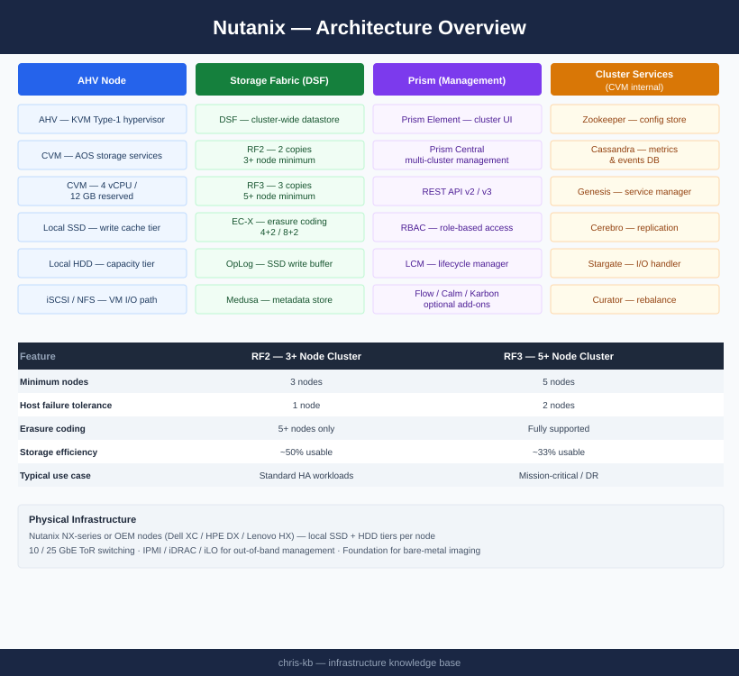
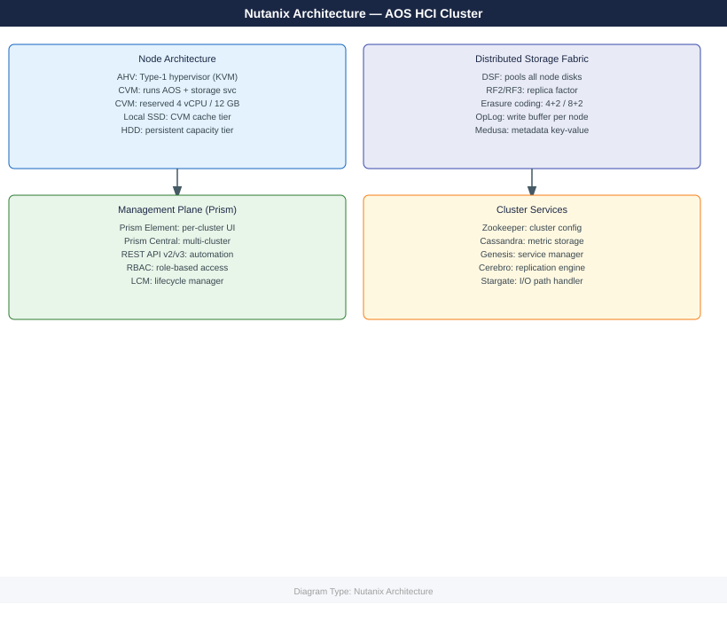

# Nutanix — Architecture

AOS distributed architecture, AHV hypervisor, Prism management plane, and cluster design standards. Foundation for understanding how Nutanix HCI works and how to design clusters for production workloads.

*Applies to: AOS 6.x · AHV*

  <a class="kb-card" href="how-it-works/">
    <strong>How It Works</strong>
    AOS data path, CVM role, Stargate I/O, replication factor, and storage tiers. Start here.
  </a>
  <a class="kb-card" href="design-standards/">
    <strong>Design Standards</strong>
    Node selection, cluster sizing, RF2 vs RF3, container design, network layout, and block awareness.
  </a>
  <a class="kb-card" href="integrations/">
    <strong>Integrations</strong>
    Prism Central registration, AD/LDAP, Veeam, HYCU, Zerto, Prometheus, Nutanix Files, and Calm.
  </a>

