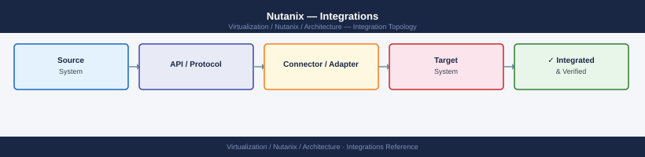

---
tags:
  - nutanix
  - architecture
  - integrations
---
# Nutanix — Integrations

<div class="kb-summary">
Prism Central multi-cluster registration, Active Directory/LDAP integration, backup product compatibility, monitoring with Prometheus and SNMP, Nutanix Files/Objects, and VMware vCenter plugin for ESXi-based clusters.

*Applies to: AOS 6.x · AHV*
</div>



---

## Prism Central Registration

Prism Central (PC) is the multi-cluster management layer. Each Prism Element (PE) cluster must be registered with PC.

**Register a cluster with Prism Central:**

```bash
# From Prism Element (PE) UI:
# Settings → Prism Central Registration → Register

# Via ncli:
ncli multicluster add-to-multicluster \
  external-ip-address-or-svm-ips=<prism-central-ip> \
  username=admin \
  password=<pc-password>
```

**Verify registration:**

```bash
ncli multicluster get-cluster-state
```

**Expected output:** `Cluster State: Connected`

---

## Active Directory / LDAP Integration

### Prism Central AD Integration

```text
Prism Central → Settings → Authentication → Directory Services → Add Directory
  Type: Active Directory
  Domain: corp.local
  Directory URL: ldap://dc01.corp.local:389 (or ldaps://... port 636)
  Domain search path: DC=corp,DC=local
  Service account: svc-nutanix@corp.local + password
```

**Role mapping (Prism Central):**

| AD Group | Prism Role |
|---|---|
| `nutanix-admins` | Prism Admin |
| `nutanix-operators` | Prism Operator |
| `nutanix-viewers` | Prism Viewer |

Add role mappings: Prism Central → Settings → Role Mappings → Add Mapping

**Verify AD auth:**

```bash
# From any CVM:
ncli authconfig get-directory-services
# Check: Status = Connected
```

### LDAP Integration (non-AD)

Supported for OpenLDAP, FreeIPA, and other LDAP-compliant directories. Use `ldaps://` (TLS) for production. Configure the same way as AD but set Type = OpenLDAP and provide the user/group search base DN.

---

## Backup Integrations

Nutanix AOS provides crash-consistent and app-consistent snapshots that backup products consume via API.

| Product | Integration method | Notes |
|---|---|---|
| Veeam Backup & Replication | AHV Backup Proxy (Nutanix plugin) | Full + incremental via changed-block tracking |
| Commvault | Nutanix REST API (v2/v3) | Snapshot-based; IntelliSnap support |
| Zerto | Replication appliance on AHV | Continuous replication; near-zero RPO |
| HYCU | Native Nutanix integration | Application-aware backup for AHV VMs |
| Veritas NetBackup | NetBackup for AHV | Standard Nutanix AHV API |

**Nutanix native protection (no third-party license):**
- **Protection Domains** (legacy): define VM groups, schedule snapshots, replicate to another cluster
- **Nutanix DR** (PC-managed): policy-based replication, linear/non-linear snapshot schedules, failover runbooks

---

## Monitoring

### Prometheus + Nutanix Exporter

The Nutanix community Prometheus exporter exposes cluster metrics via `/metrics` endpoint.

```bash
# Run as a container or VM
docker run -d \
  -e NUTANIX_HOST=<prism-central-ip> \
  -e NUTANIX_USERNAME=admin \
  -e NUTANIX_PASSWORD=<password> \
  -p 9408:9408 \
  ghcr.io/nutanix/nutanix-exporter:latest
```

**Key metrics exposed:**
- `nutanix_cluster_cpu_usage_ppm` — cluster CPU utilisation (ppm = parts per million)
- `nutanix_cluster_memory_usage_bytes` — memory utilisation
- `nutanix_storage_usage_bytes` / `nutanix_storage_capacity_bytes` — storage fill
- `nutanix_host_cpu_usage_ppm` — per-node CPU
- `nutanix_vm_cpu_ready_time_ppm` — VM CPU ready time (latency indicator)

### SNMP

Nutanix supports SNMP v2c and v3 for alert forwarding to existing NMS platforms.

```text
Prism Element → Settings → SNMP → Enable SNMP
  Version: v3 (recommended)
  Traps: configure trap receiver IP and community string
  MIB: download from Prism Settings → SNMP → Download MIB
```

### Email Alerts

```text
Prism Element → Settings → SMTP → Configure SMTP server
Prism Element → Settings → Alert Email → Add recipient
Alert severity: Critical / Warning / Info
```

---

## Nutanix Files (Scale-Out NFS/SMB)

Nutanix Files runs as a cluster of File Server VMs (FSVMs) on AHV, providing NFS v4 and SMB 2/3 shares using capacity from the AOS datastore.

**Deploy from Prism Central:**
```text
Prism Central → Files → Create File Server
  Name: nutanix-files
  Internal IPs: 3 IPs on storage network (one per FSVM)
  External IPs: floating IPs on client network
  Storage: select container; allocate initial capacity
```

**Create shares:**
```text
Prism Element → Files → Shares → Create
  Type: SMB (Windows) or NFS (Linux)
  Protocol: SMB 3 / NFSv4
  Authentication: AD passthrough (SMB), Kerberos or AUTH_SYS (NFS)
```

---

## Nutanix Objects (S3-Compatible)

Nutanix Objects provides S3-compatible object storage on AHV. Used for backup targets, media, analytics cold storage.

**Deploy from Prism Central:**
```text
Prism Central → Objects → Create Object Store
  Name: nutanix-objects
  Worker nodes: 3+ (scales horizontally)
  Storage: select container and initial capacity
  Domain: corp.local (for AD-integrated access)
```

**Access:**
```bash
# S3 CLI using standard AWS endpoint syntax
aws s3 ls s3://my-bucket/ \
  --endpoint-url https://<objects-ip>:443 \
  --no-verify-ssl
```

---

## VMware vCenter Plugin (ESXi-Based Clusters)

If the Nutanix cluster runs ESXi (not AHV), the Nutanix vCenter Plugin extends vCenter with Nutanix management:

```text
Install: Prism Element → Settings → vCenter Registration → Register vCenter
  vCenter FQDN: vcenter.corp.local
  Username: svc-nutanix@corp.local
  Password: <password>
```

After registration:
- vCenter Datastores panel shows Nutanix containers
- vCenter → Hosts shows Nutanix hardware health (disk, CVM status)
- VM snapshots route through Nutanix snapshot API (crash-consistent)

---

## Calm (Infrastructure Automation)

Nutanix Calm is a blueprint-based automation engine available through Prism Central.

- **Blueprints**: define multi-VM application topologies (DB + web + LB) as infrastructure as code
- **Providers**: AHV, ESXi, AWS, Azure, GCP, bare metal
- **Runbooks**: scripted operations (day-2 tasks, remediation)
- **Marketplace**: publish/subscribe blueprints across teams

---

## See also

- [Nutanix — How It Works](how-it-works/)
- [Nutanix — Deploy](../deploy/)
