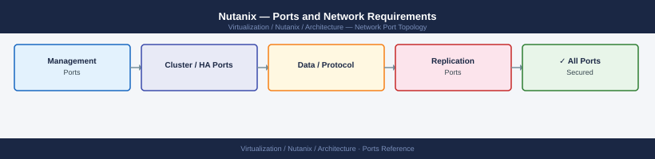

---
tags:
  - nutanix
  - networking
  - firewall
  - ports
  - ahv
  - prism
---
# Nutanix — Ports and Network Requirements

<div class="kb-summary">
Firewall port reference for Nutanix AHV clusters. Covers Prism management, CVM-to-CVM cluster fabric, AHV live migration, storage protocols, remote replication, and Prism Central connectivity.

*Applies to: AOS 6.x · AHV 20230302+*
</div>



## Before you begin

- CVM-to-CVM traffic (cluster fabric) requires no firewall on the CVM VLAN — all CVMs must reach each other without filtering
- AHV host-to-host live migration traffic uses the AHV management network, not a separate VMkernel
- Prism Central is separate from Prism Element; both listen on 9440 but are distinct management planes

---

## Inbound — Client to Prism (Element and Central)

| Port | Protocol | Source | Purpose |
|---|---|---|---|
| 9440 | TCP | Admin workstations, automation, Prism Central | Prism web UI and REST API v2/v3 |
| 22 | TCP | Jump hosts | SSH to CVM — for CLI operations and GSS support |
| 22 | TCP | Jump hosts | SSH to AHV host — for host-level troubleshooting |

---

## Prism Central to Prism Element

| Port | Protocol | Source | Destination | Purpose |
|---|---|---|---|---|
| 9440 | TCP | Prism Central | Prism Element (CVM IP / cluster VIP) | PC ↔ PE management API |
| 2074 | TCP | Prism Central | Prism Element | LCM (Life Cycle Management) agent communication |

---

## CVM Cluster Fabric (Internal — No Firewall)

All CVMs in a cluster must reach each other on every port below. Place CVMs on a dedicated VLAN with no inter-CVM firewall.

| Port | Protocol | Between | Purpose |
|---|---|---|---|
| 2009 | TCP | CVM ↔ CVM | Stargate — data I/O and replication |
| 2020 | TCP | CVM ↔ CVM | Zeus — cluster configuration and coordination |
| 2014 | TCP | CVM ↔ CVM | Genesis — cluster service management |
| 2030 | TCP | CVM ↔ CVM | Hades — disk and hardware event handling |
| 2036 | TCP | CVM ↔ CVM | Curator — distributed cluster management |
| 2040 | TCP | CVM ↔ CVM | Pithos — metadata service |
| 2027 | TCP | CVM ↔ CVM | Cassandra — metadata ring (Medusa) |
| 2055 | TCP | CVM ↔ CVM | Arithmos — capacity metrics |
| 2060 | TCP | CVM ↔ CVM | Chronos — scheduled jobs |

---

## AHV Host to CVM

| Port | Protocol | Source | Destination | Purpose |
|---|---|---|---|---|
| 8080 | TCP | AHV host | Local CVM | Acropolis hypervisor API |
| 2009 | TCP | AHV host | Local CVM | Storage I/O via local Stargate |

---

## AHV Live Migration (Host to Host)

| Port | Protocol | Source | Destination | Purpose |
|---|---|---|---|---|
| 16509 | TCP | AHV source host | AHV destination host | libvirt (plain, used internally by AHV) |
| 16514 | TCP | AHV source host | AHV destination host | libvirt TLS (default for live migration in AHV 5.15+) |
| 49152–49215 | TCP | AHV hosts | AHV hosts | QEMU migration data transfer (dynamic range) |

---

## Storage Protocols (Client to Cluster VIP / Data IP)

| Port | Protocol | Source | Destination | Purpose |
|---|---|---|---|---|
| 3260 | TCP | iSCSI initiator | CVM data IP / cluster VIP | Nutanix iSCSI (volumes) |
| 2049 | TCP/UDP | NFS client | CVM data IP / cluster VIP | NFS v3 (Files or native NFS) |
| 445 | TCP | SMB client | Nutanix Files server IP | SMB file access (Nutanix Files) |
| 111 | TCP/UDP | NFS client | CVM data IP | rpcbind (NFS portmapper) |

---

## Remote Replication (Nutanix Disaster Recovery)

| Port | Protocol | Source | Destination | Purpose |
|---|---|---|---|---|
| 2009 | TCP | CVM (source site) | CVM (remote site) | Stargate — replication data channel |
| 49152–49200 | TCP | CVM (source site) | CVM (remote site) | Replication data transfer (protection domains) |
| 9440 | TCP | Prism Central (source) | Prism Central (remote) | PC-to-PC orchestration (Leap) |

---

## Nutanix Outbound Services

| Port | Protocol | Destination | Purpose |
|---|---|---|---|
| 443 | TCP | *.nutanix.com, portal.nutanix.com | Pulse (telemetry), LCM catalog, support upload |
| 443 | TCP | LCM download endpoint | Life Cycle Management patch downloads |
| 25 / 465 / 587 | TCP | SMTP relay | Alert email delivery |
| 123 | UDP | NTP servers | Time synchronisation |
| 514 | UDP/TCP | Syslog server | Log forwarding |

---

## Active Directory Integration

| Port | Protocol | Destination | Purpose |
|---|---|---|---|
| 389 | TCP | Active Directory DCs | LDAP |
| 636 | TCP | Active Directory DCs | LDAPS (preferred) |
| 88 | TCP/UDP | Active Directory DCs | Kerberos |
| 445 | TCP | Active Directory DCs | Nutanix Files domain join |
| 3268 | TCP | Active Directory DCs | Global Catalog |

---

## Firewall Zone Summary

| From | To | Ports | Notes |
|---|---|---|---|
| Admin clients | Prism Element VIP | 9440 | Web UI and REST API |
| Admin / jump hosts | CVM management IP | 22 | SSH for CLI |
| Prism Central | Prism Element VIP | 9440, 2074 | PC management plane |
| CVM ↔ CVM | CVM ↔ CVM | All internal ports | No firewall on CVM VLAN |
| AHV host | Local CVM | 8080 | Hypervisor → CVM API |
| AHV host ↔ AHV host | AHV host ↔ AHV host | 16509, 16514, 49152-49215 | Live migration |
| iSCSI initiators | CVM data IP | 3260 | iSCSI volumes |
| NFS clients | CVM data IP | 2049, 111 | NFS shares |
| CVM (source) | CVM (remote) | 2009, 49152-49200 | Remote replication |
| CVMs | *.nutanix.com | 443 | Pulse, LCM, support |

---

## Verify

```bash
# From jump host — test Prism Element API
curl -sk -o /dev/null -w "%{http_code}" https://<prism-element-vip>:9440/PrismGateway/services/rest/v2.0/cluster/

# From jump host — test CVM SSH
ssh nutanix@<cvm-ip>

# From CVM — test remote CVM reachability (replication path)
nc -zv <remote-cvm-ip> 2009

# From CVM — check cluster services
cluster status

# From CVM — check NTP sync
sudo ntpq -p

# From AHV host — test libvirt port to peer AHV
nc -zv <peer-ahv-ip> 16514
```

---

## See also

- [Nutanix — Architecture](how-it-works/)
- [Nutanix — Deploy](../deploy/)
- [Nutanix — Operations](../operations/)
- [Nutanix — Troubleshooting](../troubleshooting/)
