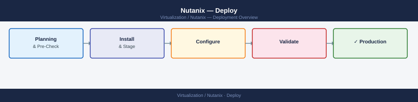
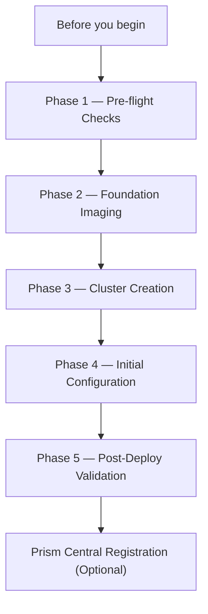

---
tags:
  - nutanix
  - deploy
  - foundation
search:
  boost: 1.5
---
# Nutanix — Deploy

<div class="kb-summary">
End-to-end Nutanix cluster deployment — Foundation imaging, IPMI/iDRAC pre-flight, cluster creation via ncli, network configuration, Prism Element initial setup, Active Directory join, and post-deploy NCC validation.

*Applies to: AOS 6.x · AHV*
</div>



---




```d2
direction: right

plan: "Plan" {shape: oval}
phase_1_preflight_checks: "Phase 1 — Pre-flight Checks" {shape: rectangle}
phase_2_foundation_imaging: "Phase 2 — Foundation Imaging" {shape: rectangle}
phase_3_cluster_creation: "Phase 3 — Cluster Creation" {shape: rectangle}
phase_4_initial_configuration: "Phase 4 — Initial Configuration" {shape: rectangle}
phase_5_postdeploy_validation: "Phase 5 — Post-Deploy Validation" {shape: rectangle}
prism_central_registration_optional: "Prism Central Registration (Optional)" {shape: rectangle}
validate: "Validate" {shape: oval}

plan -> phase_1_preflight_checks
phase_1_preflight_checks -> phase_2_foundation_imaging
phase_2_foundation_imaging -> phase_3_cluster_creation
phase_3_cluster_creation -> phase_4_initial_configuration
phase_4_initial_configuration -> phase_5_postdeploy_validation
phase_5_postdeploy_validation -> prism_central_registration_optional
prism_central_registration_optional -> validate
```

## Before you begin

- **Access:** IPMI/iDRAC/iLO credentials for all nodes; network switch admin access
- **Files:** AOS ISO and AHV ISO (download from Nutanix support portal: portal.nutanix.com)
- **IPs allocated (per node):** IPMI IP, AHV host IP, CVM IP + 1 cluster VIP + 1 DSIP
- **DNS records:** forward + reverse for all node IPs and the cluster VIP
- **NTP server:** reachable from all CVM and AHV management IPs
- **Switch configured:** storage VLAN with MTU 9000; management VLAN; VM VLANs trunked

---

## Phase 1 — Pre-flight Checks

### IPMI / Out-of-Band Access

Verify IPMI access to each node before racking:

```bash
# Test IPMI connectivity (from deployment workstation)
ipmitool -I lanplus -H <ipmi-ip> -U ADMIN -P <password> chassis power status

# Verify virtual console works (needed for Foundation)
# Access: https://<ipmi-ip> → Remote Console
```

Each node must have a unique IPMI IP on a dedicated OOB network.

### Network Pre-flight

```bash
# Verify MTU 9000 on storage VLAN (run from each node after OS is up)
ping -c 4 -M do -s 8972 <other-cvm-ip>

# Verify VLAN tags are correct on switch (show interface trunk on Cisco)
# Each node bond should see: mgmt VLAN (native), storage VLAN, VM VLANs (tagged)
```

---

## Phase 2 — Foundation Imaging

Foundation is Nutanix's deployment tool that discovers nodes via IPMI and installs AOS + AHV in parallel.

### Run Foundation VM

Foundation runs as a VM (download OVA from portal.nutanix.com):

```text
1. Deploy Foundation OVA to any hypervisor with IPMI network access
2. Start Foundation VM → open browser to http://<foundation-ip>:8000
3. Foundation Discovery:
   - Click "Start Discovery" → Foundation finds nodes via IPMI multicast or manual IP entry
   - Select nodes to image

4. AOS configuration:
   - AOS version: select downloaded AOS installer
   - AHV version: select downloaded AHV installer (if using AHV)

5. Per-node configuration:
   - IPMI IP (pre-set on each node)
   - Hypervisor (AHV) IP — the management IP the AHV host will use
   - CVM IP — the Controller VM IP on each node
   - Hypervisor VLAN: management VLAN ID

6. Click "Start" — Foundation images all nodes in parallel (~45–90 min)
```

**During imaging:** Foundation boots each node via IPMI virtual media, formats local disks, installs AHV, and starts the CVM. Progress visible in the Foundation UI.

**Expected result:** All nodes show green in Foundation. CVMs reachable via SSH on their management IPs.

### Verify Nodes Post-Imaging

```bash
# SSH to each CVM and verify AOS services are running
ssh nutanix@<cvm-ip>   # password: nutanix/4u (change immediately)
genesis status          # all services should be running
cluster status          # cluster not yet created — "Not part of a cluster"
```

---

## Phase 3 — Cluster Creation

```bash
# SSH to any CVM
ssh nutanix@<cvm1-ip>

# Create the cluster (list all CVM IPs)
cluster -s <cvm1-ip>,<cvm2-ip>,<cvm3-ip> create

# Example with 3 nodes:
cluster -s 10.0.1.11,10.0.1.12,10.0.1.13 create
```

**Expected output:** Cluster creation takes 5–10 minutes. Watch for `Cluster successfully created`.

```bash
# Set the cluster name
ncli cluster edit-params new-name=<cluster-name>

# Set the cluster Virtual IP (VIP) — used for Prism and management access
ncli cluster edit-params external-ip-address=<cluster-vip>

# Set the Data Services IP (DSIP) — iSCSI endpoint for volume groups
ncli cluster edit-params external-data-services-ip-address=<dsip>

# Verify cluster is up
cluster status    # all services running
ncli cluster info
```

---

## Phase 4 — Initial Configuration

### DNS and NTP

```bash
# Set DNS servers
ncli cluster edit-params dns-server-ip-address-list=<dns1>,<dns2>

# Set NTP servers
ncli cluster edit-params ntp-server-ip-address-list=<ntp1>,<ntp2>

# Verify NTP sync
allssh "ntpq -pn"   # all CVMs should show * next to the active NTP server
```

### Admin Password

```bash
# Change default admin password immediately
ncli user change-password username=admin \
  current-password="Nutanix/4u" new-password=<new-password>
```

### SMTP Alerts

```text
Prism Element → Settings → SMTP Server
  Server: smtp.corp.local
  Port: 587
  Auth: TLS + credentials
  From: nutanix-alerts@corp.local

Prism Element → Settings → Alert Email
  Add recipient: infra-team@corp.local
  Alert severity: Critical and Warning
```

### Active Directory Join

```text
Prism Element → Settings → Authentication → Directory Services → Add Directory
  Type: Active Directory
  Domain: corp.local
  Directory URL: ldap://dc01.corp.local:389
  Service account: svc-nutanix@corp.local + password
  Search base: DC=corp,DC=local

Prism Element → Settings → Role Mapping → Add Mapping
  AD Group: nutanix-admins → Role: Cluster Admin
```

### Storage Configuration

```bash
# List existing storage pools (created automatically during cluster creation)
ncli sp list

# Create a VM container (datastore)
ncli ctr create name=VMs sp-name=default-storage-pool \
  compression-enabled=true compression-delay-in-secs=0

# Create a backup container (with EC-X)
ncli ctr create name=Backups sp-name=default-storage-pool \
  compression-enabled=true erasure-code=on

# Verify containers
ncli ctr list
```

---

## Phase 5 — Post-Deploy Validation

### NCC Health Check

```bash
# Run from any CVM (takes 15–30 minutes)
ssh nutanix@<cvm-ip>
ncc --health_checks run_all 2>&1 | tee /tmp/ncc-baseline.txt

# Check summary
ncc --health_checks run_all 2>&1 | grep -E "PASS|FAIL|WARN|ERR"
```

**Expected result:** All checks PASS. Any FAIL must be resolved before going production.

### Cluster Resilience Check

```bash
# Verify cluster can tolerate a node failure
ncli cluster get-domain-fault-tolerance-status type=node

# Expected: FaultToleranceStatus = CAN_TOLERATE_FAILURE_COUNT=1 (RF2) or =2 (RF3)
```

### VM Creation Test

```bash
# Create a test VM via acli (AHV CLI)
acli vm.create TestVM num_vcpus=2 num_cores_per_vcpu=1 memory=2G

# Add a disk
acli vm.disk_create TestVM clone_from_image=<AHV-tools-ISO> cdrom=true
acli vm.disk_create TestVM create_size=20G container=VMs

# Add a NIC
acli vm.nic_create TestVM network=<vm-network-name>

# Power on
acli vm.on TestVM

# Power off and delete after test
acli vm.off TestVM
acli vm.delete TestVM
```

### Network Reachability

```bash
# Ping cluster VIP from client workstation
ping <cluster-vip>

# Verify Prism Element accessible
curl -k https://<cluster-vip>:9440

# Verify storage network MTU (from each CVM)
allssh "ping -c 3 -M do -s 8972 <other-cvm-ip>"
```

---

## Prism Central Registration (Optional)

```bash
# Register the new cluster with Prism Central
# From Prism Element:
# Settings → Prism Central Registration → Register
# Enter Prism Central IP/FQDN + credentials

# Verify from PC: Prism Central → Clusters → cluster appears and shows Connected
```

---

## See also

- [Nutanix — How It Works](../architecture/how-it-works/)
- [Nutanix — Health Checks](../operations/health-checks/)
- [Nutanix — Common Issues](../troubleshooting/common-issues/)
