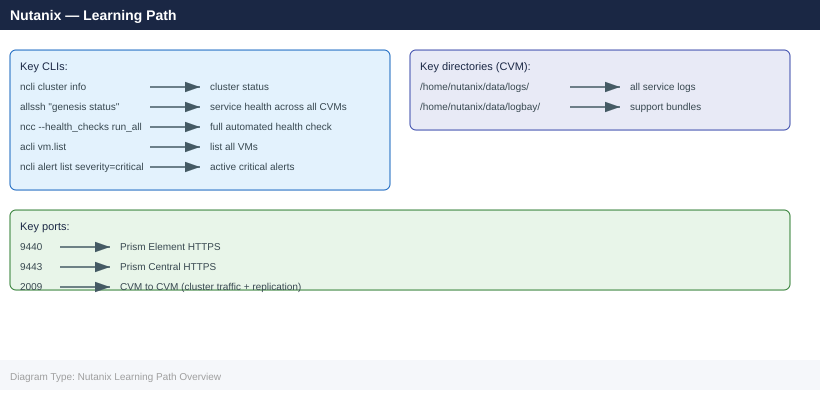

---
tags:
  - nutanix
  - learning-path
  - getting-started
description: "Recommended reading order for engineers getting up to speed on Nutanix HCI — from first concepts through day-to-day operations to advanced topics and..."
---
# Nutanix — Learning Path

Recommended reading order for engineers getting up to speed on Nutanix HCI — from first concepts through day-to-day operations to advanced topics and certification prep.

*Applies to: AOS 6.x · AHV*

---

## Stage 1 — Foundation (Start Here)

Read in order. Each page builds on the previous.

1. **[Architecture — How It Works](../architecture/how-it-works/)** — the AOS data path, CVM role, Stargate, and why HCI is different from traditional SAN+hypervisor
2. **[Architecture — Design Standards](../architecture/design-standards/)** — node selection, RF2 vs RF3, cluster sizing, container design
3. **[Deploy — Cluster Deployment](../deploy/)** — Foundation imaging, cluster creation, initial configuration (read even if you won't deploy — sets up context for operations)

**Outcome:** You understand what Nutanix is, how it stores data, and how a cluster is built.

---

## Stage 2 — Day-to-Day Operations

Work through these as a set. They describe the steady-state of a running cluster.

4. **[Operations — Health Checks](../operations/health-checks/)** — the daily/weekly routine; the "Run This Routine" sequence is the single most important operational page
5. **[Operations — CLI Reference](../operations/cli-reference/)** — ncli, acli, ncc, allssh — bookmark this for lookups
6. **[Operations — Procedures](../operations/procedures/)** — maintenance mode, LCM upgrades, adding/removing nodes, cloning VMs
7. **[Operations — Backup & Restore](../operations/backup-restore/)** — protection domains, Nutanix DR, Veeam/HYCU integration

**Outcome:** You can run a Nutanix cluster confidently — health checks, maintenance tasks, and backups.

---

## Stage 3 — Security

8. **[Security — Authentication](../security/authentication/)** — AD/LDAP integration, role mapping
9. **[Security — Access Control](../security/access-control/)** — RBAC, categories, projects
10. **[Security — Hardening](../security/hardening/)** — cluster lockdown, password policy, TLS
11. **[Security — Encryption](../security/encryption/)** — data-at-rest encryption, native KMS, KMIP

**Outcome:** You can harden and secure a cluster for production use.

---

## Stage 4 — Troubleshooting

12. **[Troubleshooting — Common Issues](../troubleshooting/common-issues/)** — the most frequent problems and how to fix them
13. **[Troubleshooting — Diagnostics](../troubleshooting/diagnostics/)** — NCC, log locations, support bundle collection
14. **[Troubleshooting — Escalation](../troubleshooting/escalation/)** — when and how to open a Nutanix GSS case

**Outcome:** You can triage Nutanix alerts, diagnose most common problems, and escalate effectively.

---

## Stage 5 — Advanced Topics

15. **[Internals](../internals/)** — deep dive into Stargate, Cassandra, Curator, Zeus, Medusa (needed for root-cause analysis of complex issues)
16. **[Architecture — Integrations](../architecture/integrations/)** — Veeam, Zerto, HYCU, Prometheus, Nutanix Files, Calm

**Outcome:** You understand the system deeply enough to participate in architecture reviews and lead post-mortems.

---

## Recommended Certifications

| Cert | Level | Relevance |
|---|---|---|
| NCA (Nutanix Certified Associate) | Entry | Broad HCI concepts; take after Stage 1–2 |
| NCP-MCI (Multi-Cloud Infrastructure) | Professional | Covers AOS, AHV, Prism Central; target after all stages |
| NCP-EUC | Professional | Nutanix + Citrix/Horizon EUC platform |

All Nutanix certs use the **Pearson VUE** exam delivery platform.

**Study resources:**
- Nutanix University (university.nutanix.com) — free courses covering NCA and NCP content
- Nutanix Bible (nutanixbible.com) — unofficial deep technical reference
- Nutanix Portal KB (portal.nutanix.com) — KB articles cross-referenced in this guide

---

## Quick Reference Card

---

## See also

- [Nutanix — Architecture Overview](../architecture/how-it-works/)
- [Nutanix — Health Checks](../operations/health-checks/)
