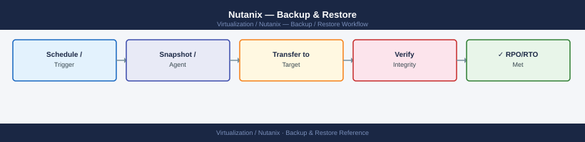

---
tags:
  - nutanix
  - operations
  - backup
  - restore
---
# Nutanix — Backup & Restore

<div class="kb-summary">
Nutanix native snapshot-based protection, Protection Domain replication to a remote cluster, Prism Central DR policies, and integration with Veeam and HYCU for VM-level backup and restore.

*Applies to: AOS 6.x · AHV*
</div>


---

## Before you begin

- **Access:** Prism Element admin (for PD/local snapshots); Prism Central admin (for DR policies)
- **Networking:** Remote site must be reachable on TCP port 2009 from source CVMs
- **Licensing:** Nutanix DR (PC-managed) requires Nutanix Pro or Ultimate license

---

## Backup Approaches

| Approach | Granularity | RPO | Licence |
|---|---|---|---|
| Protection Domain (legacy) | VM group | Hourly | Included with AOS |
| Nutanix DR (PC-managed) | Per VM or category | Minutes | Pro/Ultimate |
| Veeam for AHV | Per VM | Minutes | Veeam licence |
| HYCU | Per VM / app | Minutes | HYCU licence |
| Nutanix Objects + script | Data-only | Hours | Objects licence |

---

## Native Snapshots (Local — No Replication)

Local snapshots protect against accidental deletion or corruption, not node failure.

```bash
# Create a crash-consistent snapshot
acli vm.snapshot_create <vm-name> snapshot_name=pre-change-$(date +%Y%m%d)

# Create app-consistent snapshot (requires NGT installed)
acli vm.snapshot_create <vm-name> \
  snapshot_name=<snap-name> \
  vm_consistency_type=APPLICATION_CONSISTENT

# List snapshots
acli vm.snapshot_list <vm-name>

# Restore (VM must be off)
acli vm.off <vm-name>
acli vm.snapshot_revert <vm-name> snapshot_name=<snap-name>
acli vm.on <vm-name>

# Delete snapshot to free space
acli vm.snapshot_delete <vm-name> snapshot_name=<snap-name>
```

---

## Protection Domains (Replication to Remote Cluster)

Protection Domains (PDs) group VMs, take coordinated snapshots, and replicate to a remote Nutanix cluster.

### Setup Remote Site

```bash
# Configure the remote cluster as a remote site
ncli remote-site create name=<dr-site-name> \
  address-list=<remote-cvm-ip>
  
# Verify connectivity
ncli remote-site ping name=<dr-site-name>
```

### Create and Configure Protection Domain

```bash
# Create PD
ncli pd create name=<pd-name>

# Add VMs
ncli pd add-vms name=<pd-name> vm-names=vm1,vm2,vm3

# Schedule snapshots with replication
ncli pd set-schedule name=<pd-name> \
  app-consistent=false \
  every-nth=3600 \          # every 1 hour
  num-snaps-to-retain=24 \  # keep 24 local copies
  remote-site-list=<dr-site-name>

# Take an immediate snapshot and replicate
ncli pd snapshot name=<pd-name>
```

### Monitor Replication

```bash
ncli pd get name=<pd-name>         # PD status, last snapshot, replication state
ncli pd ls-snapshots name=<pd-name>   # list snapshots (local + remote)

# Check replication transfer progress
ncli pd get name=<pd-name> | grep -i "replication\|bytes"
```

### Failover to Remote Site

```bash
# Activate PD on remote site (failover)
# SSH to remote CVM
ncli pd activate name=<pd-name>

# VMs are restored from the latest replicated snapshot
# Power on VMs manually after activation:
acli vm.on <vm-name>
```

---

## Nutanix DR (Prism Central — Policy-Based)

Nutanix DR replaces Protection Domains for new deployments. Managed entirely from Prism Central.

### Create a Recovery Plan

```text
Prism Central → Data Protection → Recovery Plans → Create Recovery Plan
  Source cluster: <primary>
  Target cluster: <dr-site>
  Network mappings: map source VLANs to DR VLANs
  Boot order: define VM startup sequence (DB before App before Web)
```

### Create a Protection Policy

```text
Prism Central → Data Protection → Protection Policies → Create
  Primary location: <primary cluster>
  Recovery location: <dr cluster>
  RPO: 1 hour (minimum: 1 minute with async replication)
  Retention: local 24 snapshots, remote 7 days
  Assign categories: tag VMs with the policy category
```

### Assign VMs to Policy

```text
Prism Central → VMs → select VMs → Manage Categories
  Add category: ProtectionPolicy=<policy-name>
```

VMs with the category are automatically protected by the policy.

### Test Failover (Non-Disruptive)

```text
Prism Central → Recovery Plans → select plan → Test Failover
  Target: DR cluster
  Power on VMs: Yes (in test network, isolated)
  Review results, then clean up test VMs
```

---

## Veeam Backup & Replication for AHV

Veeam uses the Nutanix AHV Backup Proxy (a Veeam-provided VM on AHV) to back up VMs via the AOS snapshot API.

### Architecture

```text
Veeam Backup Server → Nutanix AHV Backup Proxy VM → AOS API → VM Snapshots
                    ↓
              Veeam Backup Repository (NFS/SMB/S3/dedup appliance)
```

### Initial Setup

```text
1. Deploy Veeam AHV Backup Proxy OVA on the Nutanix cluster
2. In Veeam Backup & Replication:
   Backup Infrastructure → Managed Servers → Add Server
   Type: Nutanix AHV
   Address: <Prism Element IP>
   Credentials: Nutanix admin

3. Configure backup repository (target storage for backups)

4. Create backup job:
   Backup Jobs → New Job → Virtual Machine
   Select VMs or categories
   Backup repository: <configured repo>
   Schedule: daily at 02:00
   Retention: 14 days
```

### Restore Options

- **Full VM restore**: Veeam → Restores → select backup → Restore entire VM
- **Disk restore**: restore individual vDisks to a VM
- **File-level restore**: Windows: Veeam Explorer; Linux: mount backup as NFS

---

## HYCU for Nutanix

HYCU is a purpose-built backup solution for Nutanix with direct AOS API integration.

```text
1. Deploy HYCU appliance from Nutanix Marketplace or OVA
2. Connect to Nutanix cluster: HYCU UI → Sources → Add
3. Assign targets (S3, NFS, SMB) → Targets → Add
4. Create backup policies and assign to VMs or categories
5. Schedule: daily full or incremental
```

HYCU supports application-aware backup (Exchange, SQL, Oracle) without agents by leveraging NGT VSS integration.

---

## Restore Runbook

### Restore a VM from Nutanix Snapshot

```bash
# List available snapshots
acli vm.snapshot_list <vm-name>

# Restore (clone from snapshot to avoid overwriting original)
acli vm.clone <vm-name> \
  clone_vm_name=<vm-name>-restored \
  snapshot_name=<snap-name>

# OR revert in place (destructive — VM must be off)
acli vm.off <vm-name>
acli vm.snapshot_revert <vm-name> snapshot_name=<snap-name>
acli vm.on <vm-name>
```

### Restore a VM from Protection Domain

```bash
# List snapshots in the PD
ncli pd ls-snapshots name=<pd-name>

# Restore VM from a specific snapshot
ncli pd restore-vm name=<pd-name> \
  vm-names=<vm-name> \
  snapshot-id=<snapshot-id> \
  restore-network-configuration=true
```

---

## Verify

- **Snapshot present:** `acli vm.snapshot_list <vm-name>` shows expected snapshots
- **Replication healthy:** `ncli pd get name=<pd-name>` shows last successful replication timestamp within RPO window
- **Restored VM reachable:** ping and application-level test after restore
- **Storage not over capacity:** `ncli ctr list` shows < 70% used after snapshot creation

---

## See also

- [Nutanix — Procedures](../procedures/)
- [Nutanix — Common Issues](../../troubleshooting/common-issues/)
- [Nutanix — Health Checks](../health-checks/)
