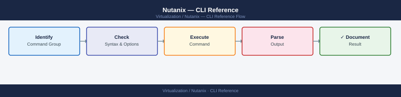

---
tags:
  - nutanix
  - operations
  - cli
  - ncli
  - acli
  - ncc
---
# Nutanix — CLI Reference

<div class="kb-summary">
Complete reference for Nutanix CLIs: ncli (cluster management), acli (AHV VM management), ncc (health checks), allssh (multi-CVM commands), and key diagnostic utilities (genesis, nodetool, curator_cli).

*Applies to: AOS 6.x · AHV*
</div>



---

## Before you begin

- **Access:** SSH to any CVM as `nutanix` user
- **Requires:** AOS 6.x cluster; `acli` commands only available on AHV clusters (not ESXi)

---

## CLI Access

| CLI | Where it runs | Purpose |
|---|---|---|
| `ncli` | Any CVM | Cluster and storage management |
| `acli` | Any CVM (AHV clusters) | VM lifecycle management |
| `ncc` | Any CVM | Health checks and diagnostics |
| `allssh` | Any CVM | Run a command on all CVMs in parallel |
| `genesis` | Any CVM | AOS service manager |
| `nodetool` | Any CVM | Cassandra ring management |
| `curator_cli` | Any CVM | Curator (background jobs) management |

```bash
# SSH to a CVM
ssh nutanix@<cvm-ip>
# Default password (change immediately): nutanix/4u
```

---

## ncli — Cluster Management

### Cluster

```bash
ncli cluster info                          # cluster name, VIP, version, RF
ncli cluster edit-params new-name=<name>  # rename cluster
ncli cluster edit-params external-ip-address=<vip>  # set/change VIP
ncli cluster edit-params dns-server-ip-address-list=<dns1>,<dns2>
ncli cluster edit-params ntp-server-ip-address-list=<ntp1>,<ntp2>
ncli cluster get-domain-fault-tolerance-status type=node  # resilience check
ncli cluster get-usage-stats               # storage efficiency stats
```

### Hosts (Nodes)

```bash
ncli host list                             # all nodes, IPs, status
ncli host get id=<host-id>                 # specific node details
ncli host enter-maintenance-mode id=<id>  # enter maintenance mode
ncli host exit-maintenance-mode id=<id>   # exit maintenance mode
```

### Disks

```bash
ncli disk list                             # all disks, size, tier, status
ncli disk get id=<disk-id>                 # specific disk details
ncli disk list | grep -v NORMAL           # only non-healthy disks
```

### Storage Pools and Containers

```bash
ncli sp list                               # storage pools
ncli ctr list                              # containers (datastores)
ncli ctr get name=<container-name>         # specific container details
ncli ctr edit name=<name> compression-enabled=true  # enable compression
ncli ctr create name=<name> sp-name=default-storage-pool \
  compression-enabled=true replication-factor=2      # create container
```

### Virtual Disks (vDisks)

```bash
ncli vdisk list                            # all vDisks
ncli vdisk list container-name=<name>     # vDisks in a container
ncli vdisk get name=<vdisk-name>           # specific vDisk info
```

### Alerts

```bash
ncli alert list                            # all active alerts
ncli alert list severity=critical          # critical alerts only
ncli alert list resolved=false             # unresolved alerts
ncli alert acknowledge id=<alert-id>       # acknowledge an alert
ncli alert resolve id=<alert-id>           # resolve an alert
```

### Users and Authentication

```bash
ncli user list                             # local users
ncli user change-password username=admin \
  current-password=<old> new-password=<new>  # change password
ncli authconfig get-directory-services    # AD/LDAP config status
```

### Protection Domains (Legacy Backup)

```bash
ncli pd list                               # protection domains
ncli pd get name=<pd-name>                 # PD details and schedule
ncli pd activate name=<pd-name>            # activate PD replication
ncli pd snapshot name=<pd-name>            # take manual snapshot
```

---

## acli — AHV VM Management

`acli` manages VMs on AHV hypervisor clusters. Not available on ESXi clusters.

### VM Lifecycle

```bash
acli vm.list                               # list all VMs (name, state, IPs)
acli vm.get <vm-name>                      # detailed VM config
acli vm.on <vm-name>                       # power on
acli vm.off <vm-name>                      # power off (graceful)
acli vm.reset <vm-name>                    # force reset (hard reboot)
acli vm.pause <vm-name>                    # pause (freeze) VM
acli vm.resume <vm-name>                   # resume paused VM
acli vm.clone <vm-name> clone_vm_name=<new-name>  # clone a VM
acli vm.delete <vm-name>                   # delete VM (confirm prompt)
```

### VM Configuration

```bash
# Create a VM
acli vm.create <vm-name> \
  num_vcpus=4 \
  num_cores_per_vcpu=1 \
  memory=8G

# Add a disk (create new)
acli vm.disk_create <vm-name> \
  create_size=50G \
  container=VMs

# Add a disk (clone from image)
acli vm.disk_create <vm-name> \
  clone_from_image=<image-name>

# Add a NIC
acli vm.nic_create <vm-name> network=<network-name>

# List VM NICs
acli vm.nic_list <vm-name>

# Update VM CPU/RAM (VM must be off)
acli vm.update <vm-name> num_vcpus=8 memory=16G
```

### VM Migration

```bash
# Live migrate a VM to a specific host
acli vm.migrate <vm-name> host=<host-name>

# List hosts available for migration
acli host.list
```

### Snapshots

```bash
# Create a snapshot
acli vm.snapshot_create <vm-name> snapshot_name=<snap-name>

# List snapshots
acli vm.snapshot_list <vm-name>

# Revert to snapshot
acli vm.snapshot_revert <vm-name> snapshot_name=<snap-name>

# Delete snapshot
acli vm.snapshot_delete <vm-name> snapshot_name=<snap-name>
```

### Networks and Images

```bash
# List virtual networks
acli net.list

# Create a VLAN-backed network
acli net.create <network-name> vlan=<vlan-id>

# List uploaded images (ISOs / disk images)
acli image.list

# Upload an image from URL
acli image.create <image-name> source_url=http://<server>/image.iso image_type=ISO_IMAGE
```

### Host Management (AHV)

```bash
acli host.list                             # all AHV hosts, state, resources
acli host.get <host-name>                  # host details
acli host.enter_maintenance_mode <host-name>  # enter maintenance (VMs migrated)
acli host.exit_maintenance_mode <host-name>   # exit maintenance
```

---

## ncc — Nutanix Cluster Check

```bash
# Run all health checks
ncc --health_checks run_all

# Run only critical checks
ncc --health_checks run_all --include_category=critical

# Run a specific check
ncc --health_checks <check_name>

# List all available checks
ncc --health_checks list

# Common useful checks:
ncc --health_checks cluster_services_status_check
ncc --health_checks ntp_synchronization_check
ncc --health_checks dns_server_check
ncc --health_checks disk_usage_check
ncc --health_checks cvm_memory_check
ncc --health_checks hypervisor_ntp_check

# View last NCC run results
ncli ncc get-ncc-result
```

---

## allssh — Multi-CVM Commands

`allssh` runs a command on every CVM in the cluster in parallel.

```bash
allssh "genesis status"                    # AOS service status on all CVMs
allssh "ntp -q"                            # NTP status across all CVMs
allssh "nodetool status"                   # Cassandra ring on all CVMs
allssh "df -h /"                           # CVM disk usage across all nodes
allssh "free -m"                           # CVM memory usage
allssh "date"                              # time sync check (all should match within 1s)
allssh "ping -c 1 -W 1 <external-ip>"      # network reachability from all CVMs
```

---

## genesis — AOS Service Manager

```bash
genesis status                             # list all AOS services and state
genesis restart                            # restart all AOS services on this CVM
                                           # ⚠ use with caution — CVM I/O disrupted briefly
```

---

## nodetool — Cassandra Ring Management

```bash
nodetool status                            # ring node status (UN = Up/Normal)
nodetool ring                              # token distribution
nodetool compactionstats                   # compaction queue
nodetool info                              # node-specific metadata stats
```

**Status codes:** `UN` = Up/Normal (healthy), `DN` = Down, `?N` = Unknown — investigate any non-UN nodes.

---

## curator_cli — Background Jobs

Curator manages tiering, deduplication, erasure coding, and rebalancing.

```bash
curator_cli get_last_successful_scans      # list recent Curator scan runs
curator_cli display_curator_tasks          # active Curator tasks
curator_cli get_scan_info --scan_id=<id>   # details of a specific scan
```

---

## Useful Diagnostics

```bash
# Check AOS log for errors (last 50 lines)
tail -50 /home/nutanix/data/logs/stargate.ERROR 2>/dev/null

# Check CVM kernel messages
dmesg | grep -i "error\|fail\|warn" | tail -20

# Check disk health via smartctl
sudo smartctl -a /dev/sda

# List CVMs that can't be reached
allssh "echo OK" 2>&1 | grep -v "OK"

# Check Zeus (ZooKeeper) cluster config
zeus_config_printer | head -50
```

---


---

## Verify

- `ncli cluster info` returns cluster status `STARTED` with no degraded components
- `acli vm.list` lists VMs without error — AHV API is responding
- `ncc --health_checks run_all` completes with no failures on a healthy cluster
- `genesis status` on any CVM shows all services as `UP`


---

## See also

- [Nutanix — Procedures](procedures/)
- [Nutanix — Scripts](scripts/)
- [Nutanix — Health Checks](health-checks/)
