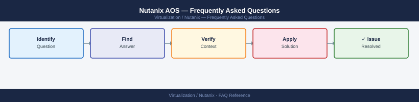

---
tags:
  - nutanix
  - faq
  - operations
---
# Nutanix AOS — Frequently Asked Questions

<div class="kb-summary">
Common questions about Nutanix AOS operations, configuration, and troubleshooting. For step-by-step procedures, see the <a href="index.md">Operations</a> section.
</div>



```d2
direction: right

hub: "Nutanix AHV\nOperations" {shape: hexagon}
general: "General" {shape: rectangle}
configuration: "Configuration" {shape: rectangle}
operations: "Operations" {shape: rectangle}
troubleshooting: "Troubleshooting" {shape: rectangle}
backup_and_recovery: "Backup and Recovery" {shape: rectangle}

hub -> general
hub -> configuration
hub -> operations
hub -> troubleshooting
hub -> backup_and_recovery
```

## General

**Q: What AOS version is recommended for new Nutanix deployments?**
A: AOS 6.8.x LTS is the current recommendation. Check via Prism Central → Settings → Cluster Details or `ncli cluster version` on a CVM. Always check the Nutanix compatibility matrix before upgrading.

**Q: How do I check the current Nutanix AOS version?**
A: `ncli cluster version`

## Configuration

**Q: What is the default data resiliency factor and when should it change?**
A: Replication Factor 2 (RF2) is the default — tolerates one node failure. Use RF3 for mission-critical workloads or clusters with fewer than 5 nodes where RF2 provides inadequate protection.

**Q: How do I enable Nutanix Flow microsegmentation?**
A: Flow is enabled per cluster in Prism Central → Settings → Flow → Enable. Requires AOS 5.17+ and PC 5.17+. Create Security Policies under Policies → Security Policies. Flow uses VM categories for policy targeting.

## Operations

**Q: How do I perform a rolling upgrade of AOS without downtime?**
A: Use Life Cycle Manager (LCM): Prism Central → LCM → Inventory → Update. LCM upgrades one node at a time, migrating VMs before patching each node. Verify cluster health before each node upgrade.

**Q: What is the correct procedure to add a new node to a Nutanix cluster?**
A: Rack and cable the node. From Prism Element → Settings → Expand Cluster → enter the node serial or IP. Nutanix Foundation handles the remaining discovery and join process. Cluster rebalances data automatically.

## Troubleshooting

**Q: Prism shows 'Cluster health critical — node is down'. What does it mean?**
A: A node has left the cluster. If a CVM is down: SSH to another CVM and check `cluster status`. If a hypervisor is down: check iDRAC/IPMI. Nutanix automatically re-replicates data to surviving nodes for RF2 clusters.

**Q: VM performance is degraded on Nutanix — where do I start?**
A: Check Prism → Analysis → Performance for the VM. Review storage controller (CVM) CPU and memory. Check for noisy-neighbour VMs using the same storage tier. Verify SSD tier has not been fully consumed with `ncli cluster get-storage-pool`.

## Backup and Recovery

**Q: How often should I back up Nutanix Prism configuration?**
A: Enable automated Prism Central backup: PC → Settings → Backup. Daily backup to an external server. For Prism Element, export configuration weekly. Test restore to a lab cluster quarterly.

**Q: Can I restore a single VM from a Nutanix snapshot without restoring the whole cluster?**
A: Yes — Prism Element → VM → Snapshots → Restore. This restores only that VM. For application-consistent recovery across multiple VMs, use Nutanix Protection Domains or a third-party backup tool (Veeam, Commvault).

## See Also

- [Nutanix AOS Operations](index.md)
- [Nutanix AOS Troubleshooting](../../troubleshooting/index.md)
